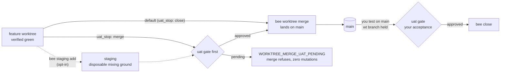

# bee

<!-- BEE:BACKLOG-BADGES:START -->
    
<!-- BEE:BACKLOG-BADGES:END -->

**bee** is a lightweight, *validate-first* agentic-development plugin suite for **Claude Code** and **Codex**. It turns "vibe-coding with an AI" into a staged, gated workflow where the agent proves each step before taking the next, records what it learns, and gets less wrong over time.

It is distilled from seven upstream systems (khuym, claudekit, gsd-core, gstack, repository-harness, superpowers, compound-engineering) — bee keeps only the pieces that hold up in daily practice for a solo developer and throws away the rest.

> Docs are in English to match the codebase. Ask if you'd like a Vietnamese companion (`README.vi.md`).

---

## Using bee

### Get set up

From a bee source checkout, point the onboarder at the project you want bee to work on:

```bash
cargo build --release --manifest-path packages/bee-rs/Cargo.toml
packages/bee-rs/target/release/bee onboard --repo-root /path/to/your-project --json --apply
```

That one run installs the whole frame into your project: `.bee/` (the vendored engine, its craft guides, and your project's workflow state), the lifecycle hooks, and the bee skills rendered into `.claude/skills/` (Claude Code) and `.agents/skills/` (Codex). Re-running it later refreshes everything in place without touching your state. Then open your coding agent inside that project and describe what you want to build, fix, or explore. (No checkout handy? The one-line network installers under [Install](#install) end in the same place.)

### What a session feels like

You talk about the work; bee handles its own machinery. Describe what you want in plain words — you don't need a spec, a ticket, or any bee vocabulary. If the request has gray areas, bee interviews you first, one focused question at a time, and writes each answer down as a locked decision. It then shapes the work — the plan, the size, the reality check — and brings the shape back as a single plain-language question: *is this the right thing, and may I start editing files?* You answer gates and decision questions; the agent runs every bee command itself, so you never copy commands around or manage state by hand.

```text
You:  Add CSV export to the report screen.
bee:  One thing to lock first: should the export include archived
      rows, or exactly what the current filters show?
You:  Just what the filters show.
bee:  Locked. Shape: one slice — export button, endpoint, tests;
      no schema changes. May I start editing files?
You:  Yes.
bee:  ▸ endpoint  ✓   ▸ button  ✓   ▸ tests  ✓
      Done — verified green in its worktree. Say the word and I'll
      land it on main, or ask for an independent review first.
```

Ceremony scales with the work: a typo fix takes one merged question and a light touch, while an auth change gets the full interview and a slower, prove-everything path. And if a session runs long, bee pauses cleanly at a saved handoff point — the next session surfaces it and waits for you rather than resuming on its own.

### What bee does between your answers

Once you approve the shape, bee cuts the work into small self-contained cells, dispatches workers to execute them inside the feature's own git worktree — your main checkout stays clean the whole time — and refuses to call any step done until its verification command actually passes. As behavior settles, bee writes it down as your project's memory under `docs/`: what each area does, what was decided and why, and what was learned along the way. Nothing you agreed on evaporates when the session ends.

### How work lands

A feature closes when everything is implemented and verified green inside its worktree. Landing is yours to call: when you say so, the agent runs `bee worktree merge` from the main checkout — it merges the worktree branch into main and re-runs your project's verify command against the merged tree. Independent multi-agent review is a separate pass that runs only when you ask for it ("review this feature"), and its findings gate the merge only then.

### Where things live

| Where | What it is |
|---|---|
| `.bee/` | The vendored engine, its craft guides, and your project's workflow state — managed by bee, driven through the agent, never hand-edited |
| `.claude/skills/bee-*` · `.agents/skills/bee-*` | The rendered skills your agent loads — managed, refreshed by each onboard run |
| `docs/specs/` · `docs/knowledge/` | **Your** project's memory: what each area does, in plain language, written and kept current by bee |
| `docs/history/<feature>/` · `docs/backlog.md` | Per-feature decisions, plans, and reports; the live backlog |
| `<repo>--wt--<feature>/` (branch `wt/<feature>`) | Sibling worktrees holding in-flight features until you land them |

### Fewer approvals, when you're ready

Gates default to human approval, every time. Once you trust bee in a repo, opt-in gate bypass runs the pipeline with fewer stops — it has levels, from auto-approving only low-risk work up to stopping for nothing at all. `bee-hive`'s "Gates" section owns the levels; details in [The three gates](#the-three-gates).

---

## Why bee exists (the idea in plain words)

Letting an AI write code freely is fast until it isn't. The usual failure modes:

- It **starts coding before the goal is clear**, then you discover halfway that it built the wrong thing.
- It says "done" when it **hasn't actually checked** — "tests pass" with no test named, "should work" as evidence.
- It **forgets**: a rule you agreed three sessions ago is gone, so it re-asks or re-breaks it.
- On a big task it **loses the thread** two-thirds of the way through the context window.

bee's answer is four ideas working together:

1. **Gates** — the human approves at three irreversible moments: what to build · how it will be built *and* whether the agent may start editing real files, which are approved together · whether to merge. Between gates the agent runs on its own; at a gate it stops.
2. **Cells** — work is cut into small, self-contained task units, each with its own acceptance criteria and a real verify command. A cell **cannot be closed until its verification passes** — this is enforced by code, not by the agent's good intentions.
3. **Lanes** — ceremony scales with risk. A typo fix is one cell and a light touch; an auth change gets mandatory proof and a slower path. Memory never scales down: even a one-line fix that changes behavior updates the spec.
4. **Compounding** — finished work becomes durable knowledge: specs that survive a rewrite, a decision log, and "critical patterns" the next session reads first.

The result is meant to be *trustworthy, not ceremonial*: every "done" is backed by recorded evidence, and every gate is something you can restate in your own words before you approve it.

---

## The core concepts in one minute

| Concept | What it is | Why it matters |
|---|---|---|
| **Gate** | One of three human approval points (decisions → shape+execution → merge) | You stay in control at the moments that are expensive to undo |
| **Cell** | A small JSON task unit: what to do, files, acceptance criteria, verify command, trace | The atom of work; can't be "capped" (closed) without proof it passed |
| **Lane** | The size/risk class of the work: `tiny`, `small`, `standard`, `high-risk`, `spike` | Decides how much process the work gets — no epic ceremony for a typo |
| **Spec** | A tech-agnostic, BA-grade description of an *area* (a screen, API, job, process) in `docs/specs/` | The system's meaning, understandable without the code and rebuildable on any stack |
| **Decision** | An append-only log entry (`D<n>`) recording a locked choice + its rationale | Nothing agreed evaporates when the session closes |
| **Handoff** | A saved pause point written at ~65% context | Long work resumes cleanly next session — and never auto-resumes |

---

## The metaphor

A hive is a staged, self-regulating system — each bee role maps to a workflow stage:

| Hive role | bee skill | Flow | What it does |
|---|---|---|---|
| The hive itself | `bee-hive` | Both | Route the workflow: session start, the next skill, gates, onboarding, and the gate-bypass level — load first in every session |
| Pathfinder bees | `bee-wayfinding` | Discovery | Chart a fog-state idea from an open question to a locked decision — the spine of the Discovery flow; research, spike, and grilling resolve its tickets |
| Scout bees | `bee-shaping` | Main | Shape fuzzy intent into locked, buildable decisions — one front door for interviewing (Explore), unattended triage (Qualify), decision locking (Lock), and the reviewable implement plan (Brief) |
| Waggle dance | `bee-planning` | Main | Shape approved-scope work into an executable plan: classify the lane, research just enough, draft the smallest honest shape, gate it, prepare current-slice cells |
| The swarm | `bee-swarming` | Main | Run approved cells to done — orchestrate bounded workers over gate-approved cells, or execute exactly one assigned cell inside a dispatched worker |
| Inspector bees | `bee-reviewing` | Main | The multi-agent review gate — severity findings, artifact verification, user acceptance — over an immutable scope the user explicitly asked to review |
| Honey | `bee-capturing` | Main | Capture what settles into durable records — area specs (Scribe), decisions and learnings (Compound) — the moment it settles |
| Forager bees | `bee-researching` | Both | Evidence-labeled research into unfamiliar, ambiguous, or version-sensitive territory |
| Undertaker bees | `bee-grooming` | — | Hunt and kill tech debt in the current project — dead code, stale docs, TODO/stubs, duplication, drifted specs |
| The keeper's cockpit | `bee-herding` | — | The autonomous cockpit's three roles — bootstrap, dispatch, merge — that start safe backlog work in fresh worktrees and land finished ones |

Gate-bypass autopilot lives inside `bee-hive` ("Gates"). The maintainer guides for building bee's own skills and running its self-improvement loop moved out of the product into [docs/handbook/writing-skills.md](docs/handbook/writing-skills.md) and [docs/handbook/evolving.md](docs/handbook/evolving.md).

---

## The workflow, explained simply

You describe what you want. bee routes it by size and risk, then walks it through the chain below. **Bold = you decide; everything else the agent does on its own.**

bee routes every request into one of two flows. A nameable outcome lands in the **Main flow** — the chain below. Fog, or an effort too big to name in one sitting, lands in the **Discovery flow** first: `bee-wayfinding` charts it down to a locked decision, then hands off into the chain below.

```
        bee-hive               reads your request, picks the lane, routes
           │
        bee-shaping            asks the sharp questions (Explore), writes
                                down the decisions (Lock)
           ▼
   ▶ GATE 1  "Are these the right decisions?"        ← you approve
           │
        bee-planning           shapes the work: the plan, the approach,
                                the reality check (SMALLER PATH) + review wave
        bee-shaping (Brief)    writes a human-readable implement plan
                                (standard: on-demand; high-risk: always)
           ▼
   ▶ GATE 2  "Is this the right thing, and may I start editing real files?"
             ← you approve (shape + execution together, most critical)
           │
        bee-planning (prep)    cuts the work into cells for the current slice
           ▼
        bee-swarming           spawns bounded workers; each worker
                                (Execute) runs one cell: implement →
                                verify → CAP
           │
        bee-capturing          Scribe: updates the area specs (the durable
                                meaning); Compound: stores learnings +
                                decisions for next time
           ▼
         done — verified, unreviewed; the change set joins review candidates
```

```
┌────────────────────────────────────────────────────────────────────────┐
│ Independent review is a SEPARATE, user-invoked step (decision          │
│ 565e68d0) — never an automatic stage of the chain above. Ask for it    │
│ any time, over any scope you name ("review this feature", "review     │
│ today's work", "review the diff from X to Y"):                        │
│                                                                        │
│        bee-reviewing         multi-agent review over that immutable   │
│                               scope: P1/P2/P3 findings, artifact      │
│                               verification, UAT                       │
│           ▼                                                          │
│   ▶ GATE 3  "P1 issues block merge; otherwise, merge?"  ← you approve │
│           │                                                          │
│        bee-shaping (Brief)   writes the walkthrough (what shipped +  │
│                               how to test)                           │
│                                                                        │
│ A merge/ship/release request while work sits unreviewed reports the   │
│ count and risk level, then asks before ever spending a reviewer token │
│ (never a silent dispatch).                                            │
└────────────────────────────────────────────────────────────────────────┘
```

Each gate is a single plain-language question with the machine detail linked, not dumped. You must be able to **restate what you're approving in your own words** — a gate you can't restate is worse than no gate.

Which artifacts get written scales with the work: `tiny`/`spike` write no `plan.md` at all — the cell is the micro-plan; `small` defaults to a logged scoping synthesis, with `plan.md` opt-in only when a durable multi-slice doc is genuinely needed; `standard`/`high-risk` produce `CONTEXT.md` + `plan.md` as a matter of course. Separate `discovery.md` / `approach.md` / `implement-plan.md` files appear only for deeper research (L2+) or `high-risk` work (decision 0009). No more four documents restating the same "current state".

---

## What is a cell?

A **cell** is bee's unit of work — one honeycomb cell of the hive. It's a single JSON file in `.bee/cells/` that a "cold" worker (an agent with zero session history) can pick up and execute correctly, then close only with proof.

Think of it as a self-contained work ticket that is *executable* and *machine-checkable*.

```jsonc
{
  "id": "auth-3",
  "feature": "auth",
  "title": "Wire session middleware into the API router",
  "lane": "standard",                      // tiny | small | standard | high-risk | spike
  "status": "open",                        // open → claimed → capped | blocked | dropped
  "deps": ["auth-1", "auth-2"],            // this cell is "ready" only when these are capped
  "decisions": ["D2", "D4"],               // locked decisions it must honor (cited, never reinterpreted)
  "files": ["src/api/router.ts", "src/auth/middleware.ts"],  // everything it may write
  "read_first": ["src/api/router.ts"],     // what it must read before touching anything
  "action": "Mount the session middleware from auth-2 onto all /api/* routes (per D2). Preserve the public response envelope (per D4).",
  "must_haves": {                          // the contract — what "done" actually means
    "truths":       ["Unauthenticated /api/* requests return 401"],   // observable behavior
    "artifacts":    [{ "path": "src/auth/middleware.ts", "substantive": "exports authGuard, no TODO stubs" }],
    "key_links":    ["router.ts imports and mounts authGuard"],       // wired, not just present
    "prohibitions": ["No change to the public response envelope"]     // what must NOT change
  },
  "verify": "npm test -- auth",            // a REAL command that runs in this repo today
  "trace": { "worker": null, "outcome": null, "files_changed": [], "behavior_change": false,
             "verification_evidence": null /* ...filled in when the work is done... */ }
}
```

The rules that make a cell trustworthy:

- **Capping requires proof, not an assertion.** `bee cells cap` **refuses** to close a cell unless a passing `verify` result is recorded. For `small`/`standard`/`high-risk` it also requires the verify's recorded output (or evidence) and a non-empty list of changed files — "verify_passed: true" with no output and no files is rejected.
- **Behavior changes need a "before".** If a cell changes observable behavior (`behavior_change: true`), capping also refuses without a *characterization of the prior behavior* — `red_failure_evidence` such as a `git show` of the old state, or a pre-change check that failed. This blocks "it works now" being accepted as proof that behavior actually changed, and it's captured at cap time (one command away) rather than backfilled later (decision 0009).
- **Ready = all deps capped.** `bee cells ready` lists claimable cells. Only the orchestrator assigns them; workers never self-select.
- **Evidence lives in one place.** The cell's `trace` is the single source of verification evidence. Reports link to it; they never duplicate it.
- **Lane scales strictness.** A `tiny` cell may skip `must_haves` and record a one-line trace; a `high-risk` cell needs full `must_haves`, spike evidence, and a detailed trace.
- **One commit per cell**, with the cell id in the message.

`bee status` and every downstream skill read the cell trace, so "what happened" is always machine-readable, never buried in chat.

---

## The three gates

Gates are **human** approvals, and two of them are enforced by code — the agent physically cannot proceed past Gate 2's execution component without it being recorded.

| Gate | Asked after | What you're really deciding | If you get it wrong |
|---|---|---|---|
| **Gate 1** | exploring | Are these the decisions I meant? | Everything downstream builds on them — cheap to fix now, costly later |
| **Gate 2** | planning shape + the reality check | Is this the right thing, at the right size, and may the agent start editing real files (this slice only)? | The most irreversible step — this is where code starts changing |
| **Gate 3** | a user-invoked review session only — never automatic (decision 565e68d0) | Does this go into the main branch? | P1 findings ship broken code to users |

Gate 2 used to be two separate approvals ("Is this the right thing" then "may I start editing") — validation-diet merged them into one call (`bee state gate --merge`) that flips `approved_gates.shape` and `approved_gates.execution` together; there is no standalone validating skill or `validating` phase left to earn a gate of its own. That merge is why bee has three gates rather than four, and why the review gate — numbered 4 back when the execution approval stood alone — is numbered 3 today.

Enforcement, not etiquette: until Gate 2's execution component is approved, `bee cells claim` throws and the write-guard hook **denies source edits** (while keeping `.bee/`, `docs/`, `plans/`, and `AGENTS.md` writable). Gate 3 never auto-merges past an open P1.

### Gate bypass (opt-in autopilot)

If you trust bee in a given repo and want speed, turn on **gate bypass** — `bee-hive`'s "Gates" section owns the toggle. It is a **level**, not a switch (`off` / `normal` / `full` / `total`), and the level decides how far it reaches.

**The safety floor is real at `normal` — and you can deliberately lift it.** Earlier wording here called the floor "absolute and not configurable", which was wrong: `full` and `total` exist precisely to remove it, and saying otherwise made a safety promise the code does not keep.

The level-by-level table (what each of `off`/`normal`/`full`/`total` auto-approves and still stops for) lives in one place — `skills/bee-hive/references/gates-and-delegation.md` ("Gate bypass mode") — read it there rather than a second copy here.

- At **`normal`** the floor holds: high-risk/hard-gate work (auth, authorization, data loss, security, an external provider, validation removal, a database migration), Gate 3 UAT, P1 findings, and secret reads all still stop for you.
- **`full`** lifts the high-risk floor. **`total`** lifts everything — no human checkpoint remains anywhere, including UAT, P1 findings, and reading `.env`/keys/credentials.
- Raising to `full`/`total` is a deliberate act you take; bee never raises it for you, and the active level is printed loudly in the session preamble and `bee_status`.

Bypass is **not** the same as headless mode (headless still stops at every gate). It's off by default, persists per-repo, and is surfaced loudly in the session preamble and `bee_status` with a level-specific banner (e.g. `⚡ GATE BYPASS: NORMAL`) so it's never silently in effect.

---

## How review works

Cell closure is *not* proof the feature works, and it is not the same thing as independent review. Verification (cap-requires-proof, above) is mandatory for every cell; `bee-reviewing` is a separate, **user-invoked** quality gate over an immutable scope you choose — a feature, a named batch, a commit range — never spawned automatically when a cell, slice, or feature finishes (decision 565e68d0). A completed, verified change can sit `unreviewed` indefinitely without blocking further work; ask for review ("review this feature", "review today's work", "review the diff from X to Y") whenever you want the panel to run. It runs in five parts:

1. **Multi-agent specialist review.** Independent reviewers run in parallel, each with an *isolated* context (the diff + `CONTEXT.md` + `plan.md` only — never session history, so they can't be led):
   - always-on: **code-quality** (correctness, types), **architecture** (boundaries, coupling), **security** (auth, secrets, injection), **test-coverage** (missing cases, weak assertions). Precedent arrives via `plan.md` (planning's learnings search); the orchestrator dedupes and corroborates findings itself after all reviewers return.
   - conditional (spawned only when the diff matches): **performance**, **api-contract**, **data-migration**, **reliability**.
2. **Severity + synthesis.** Every finding is **P1** (security / data loss / breaking change — blocks merge), **P2** (real perf/architecture/reliability/test gap), or **P3** (cleanup, docs, future debt). Uncertain → P2. When independent reviewers corroborate a finding, it's promoted one level. Each finding is written in a fixed shape: plain-language summary → what the code does today → why it matters → concrete failure scenario → file/line evidence → smallest credible fix.
3. **Verification-evidence gate.** For every capped `behavior_change` cell, the recorded evidence must name what was tested, what changed, the before-state, and the verification run. Vague evidence ("covered by existing tests", no test named) is itself a **P1** — the work goes back. (The cap helper now blocks the worst case at source, so this is a backstop.)
4. **Artifact verification.** For everything `CONTEXT.md` and `plan.md` promised, check three levels: **EXISTS** → **SUBSTANTIVE** (not a stub/TODO/fake path) → **WIRED** (imported and used on the real path). All three = OK; substantive-but-not-wired = P2; missing or exists-only = P1.
5. **Human UAT.** For each SEE/CALL/RUN decision in `CONTEXT.md`, you confirm it actually works (Pass / Fail / Skip). A fail spawns a P1 fix cell and re-runs that item; a skip needs a recorded reason. UAT failures are never logged as passes.

Then **Gate 3**: P1 > 0 blocks merge (fix cells run through swarming, review re-runs on the fix, repeat until zero or explicit override); P1 = 0 → "Approve merge?". P2/P3 findings are filed to the backlog as non-blocking follow-ups — they never hold up the current work.

---

## UAT — your acceptance stop before work lands

Two different things in bee carry the name "UAT" — keep them apart:

1. **The `uat` gate** (this section) — a standing acceptance stop at merge time (or close time). It exists in every feature's life, whether or not a review ever runs.
2. **Review-session UAT** — step 5 of [How review works](#how-review-works): confirming each SEE/CALL/RUN decision inside a review session *you invoked*. A different mechanism; it only exists when you ask for a review.

### What the `uat` gate is

A feature can be implemented, verified green, even independently reviewed — and still not be *accepted by you*. The `uat` gate is that last word, for every `standard` or `high-risk` feature (`tiny`, `small`, and docs lanes are exempt; a missing or unreadable lane classification fails **closed** and is treated as `standard`). Where the door sits is configurable, and the **default is the close placement**: `bee worktree merge` lands the feature on main so you can test the real product there, the `wt/<feature>` branch is held around for convenience, and `bee close` is what stops until you accept. Under `uat_stop: "merge"` the door moves earlier instead: merge itself refuses with `WORKTREE_MERGE_UAT_PENDING` (a zero-mutation refusal — nothing is touched) until the gate is approved.

Staging is **opt-in** (`staging_before_merge: true`): when enabled, `bee staging add` mixes the feature's worktree into a disposable staging checkout — the ground between a feature worktree and main — so you can try the product without touching either.



### Approving it — and why bypass never covers it

When you give the word, the agent records it: `bee gate --name uat --approved true`. There is **no automation path**: `--actor auto` is refused outright, and **gate bypass never covers `uat` at any level — including `total`**. The escape hatches are explicit and scoped instead:

- `--skip-uat` on one `bee worktree merge` call — skips it for *that merge only*;
- a logged `uat-deferral` decision at `bee close` (when the door sits at close, below);
- repo-wide opt-out via config (`uat_stop: "off"`).

### Configuration

All keys live in `.bee/config.json` (full reference + sample: [docs/config-reference.md](docs/config-reference.md)):

| Key | Values | Effect |
|---|---|---|
| `uat_stop` | `"merge"` | `bee worktree merge` enforces the gate for standard/high-risk features before anything lands |
| | `"close"` (default — absent means this) | The merge lands first — the product is testable on main — and the door moves to `bee close`. While `uat` is pending: the lane carries a `waiting_on` mark `uat: <feature>`, and the worktree is **held** (`--cleanup` / `worktree_cleanup_on_merge: true` are ignored, reported as `WORKTREE_MERGE_CLEANUP_SUPPRESSED_UAT_PENDING`) |
| | `"off"` | No uat stop anywhere |
| | anything else | Refuses `WORKTREE_MERGE_UAT_CONFIG_INVALID` — never guesses |
| `uat_before_merge` | `true` / `false` | Back-compat alias, read **only when `uat_stop` is absent**: `true` → `"merge"`, `false` → `"off"` |
| `staging_before_merge` | `true` / `false` (default — absent means off) | Staging is **opt-in**: absent or `false` makes `bee staging add` / `bee staging rebuild` refuse `STAGING_DISABLED` — the repo runs worktree → merge to main → uat at close, with no staging step. Set `true` to enable the mixing ground. **Independent of the `uat` gate**: opting in or out of staging never changes uat, and vice versa |

---

## Lanes: ceremony scales with risk

Every planning pass counts mechanical **risk flags** (auth · authorization · data model · audit/security · external systems · public contracts · cross-platform · changes behavior an existing test asserts (a covered contract must change) · the change requires weakening, deleting, or replacing existing proof · multi-domain) and picks the smallest honest lane. **Lane file caps count product files only** — production source, tests, and runtime config the behavior change itself must touch; never counted are `.bee/**`, `docs/**`, plans/briefs/reports, or generated projections/manifests:

| Lane | When | What it gets |
|---|---|---|
| `tiny` | 0–1 flags, ≤2 product files, one direct task | one cell — the cell is the micro-plan, no `plan.md` — one-line trace, self-review + done-report (no auto reviewer) |
| `small` | 0–1 flags, ≤3 product files, no gray areas | logged scoping synthesis + a cell or two; plan.md is opt-in, only when a durable multi-slice doc is genuinely needed; self-checks only (no auto reviewer) |
| `standard` | 2–3 flags, or story-sized behavior | full cells + must_haves; a review session runs only if you ask for one |
| `high-risk` | 4+ flags, or any hard-gate flag | opt-in-by-change-class spikes (migration/security/external-side-effect/no-precedent), strict trace, slower merged Gate 2; a review session runs only if you ask for one |
| `spike` | one yes/no question decides if the plan is real | a disposable experiment under `.bee/spikes/`, answers then discards |

The rule that never bends: **lanes scale ceremony, never memory.** Even a `tiny` cell that changed behavior obliges a spec sync, and a settled decision is logged the moment it settles — in every lane.

A capped `behavior_change` cell also creates **scribing debt** until its meaning reaches `docs/knowledge/` (with a bundle) or, absent one, `docs/specs/`: `bee_status`, the session preamble, and the swarming chain-nudge all surface the count so settled behavior is captured mid-flight, not only when someone remembers (decision 0011).

---

## Model tiers — keep the strong model scarce

Not every step needs your most capable (most expensive) model. The costly loops — try, read, fix, repeat — should run on a cheap model; the strong model should touch only the decision points. bee makes this a per-repo setting. You configure only the two **cheaper** tiers — the **ceiling is always the model you run the session on** (decision 0015), so it needs no config:

```json
"models": {
  "claude": { "extraction": "haiku", "generation": "sonnet" },
  "codex":  { "extraction": null,    "generation": null }
}
```

- **ceiling** — the strongest model = **your session model** (no entry). Kept *scarce*: planning, integration, review; a ceiling cell just inherits the session model. Touch it on every dispatch and the cost saving evaporates.
- **generation** — the mid worker that runs the loops (implementation, tests) — where the bulk of work goes.
- **extraction** — cheapest capable (retrieval, mechanical edits).
- `null` = the runtime can't select a per-agent model (Codex today) → the tier is enforced as a read budget + output cap in the worker prompt. Set real ids (e.g. `"generation": "gpt-5"`) if your runtime supports switching.

The **orchestrator judges each cell's tier when it dispatches** (decision 0016) — mechanical → extraction, normal → generation, integration/architecture/high-risk → ceiling — not a label fixed at planning. It records the choice (`bee cells tier`), then `modelForTier` resolves it: `generation`/`extraction` to the configured alias, `ceiling` to "inherit the session model". `bee status` and the preamble **warn when too many cells sit on the ceiling tier** (the cost lever erodes when the strongest model touches most dispatches).

The orchestrator pattern keeps the strongest model scarce:

- **Fan-out delegation** (default): run the session on your strong model; it orchestrates all work and dispatches gather-altitude steps (multi-file reads, document rendering, trace mining) down-tier to cheaper workers, collecting digests instead of verbatim output. The Delegation contract (in gates-and-delegation.md) specifies which steps delegate and what a digest must carry. `bee-swarming`'s default.

**To change the worker models**, edit `.bee/config.json` `models.claude.generation` / `extraction`; the ceiling changes by running the session on a different model. Every field + a full sample to copy: **[docs/config-reference.md](docs/config-reference.md)**.

### Model pairs: the full slot set and its five shapes

The two-slot example above is the minimal form. The full slot set under `models.<runtime>` is **`extraction` · `generation` · `review` · `advisor`** (the orchestrator is always the session model and is never configured; `review: null` falls back to `generation`, which otherwise defaults to opus). Each slot takes one of five shapes:

| Shape | Example | Meaning |
|---|---|---|
| plain string | `"haiku"` | that model, on the session's own runtime |
| model + effort | `{ "model": "sonnet", "effort": "medium" }` | effort applies only where the runtime supports per-agent selection |
| CLI executor | `{ "kind": "cli", "command": "codex exec … -" }` | an **external** CLI runs this slot; the prompt is piped via stdin. **Gather/review/advisor only** — cell execution against a cli-shaped slot is refused |
| herding pane | `{ "kind": "herding", "agent": "agy-flash", "fallback": "default" }` | every purpose of this slot routes through `bee herding run` as a live pane agent (see [Herding](#herding--the-autonomous-cockpit-and-external-agents)); optional `fallback: "default"` re-dispatches a failed run through the runtime's own default path — absent, a failure stays loud and the pane is kept as forensics |
| `null` | `null` | the runtime can't switch models — the tier is enforced as a prompt budget instead |

Ready-made pairs to copy — mixing a cheap implementer with an adversarial reviewer from a *different* vendor — live in **[docs/model-presets.md](docs/model-presets.md)**: `all-claude` (default), `all-claude-tuned`, `gpt-adversarial-review` (Codex reviews read-only), `codex-implements`, `antigravity-review` (Gemini/agy), `opencode-review`, `budget`. A runnable external-executor sample sits in `.bee/config-sample-cli-executors.json`. Two constraints never bend: the `review` slot must be read-only, and every `[DONE]` from an external executor is re-verified and judge-checked by the orchestrator — no spot-check exception.

---

## Herding — the autonomous cockpit and external agents

`bee-herding` is the cockpit that runs several coding agents in parallel worktrees, driven by `herdr` (the pane/terminal manager). Its one principle: **starting** work in an isolated worktree runs unattended; **landing** work on main stays a human gesture, every time.

### The roles

| Role | Who runs it | What it does |
|---|---|---|
| **bootstrap** | you, once | Builds the full pane layout (including an idle merge pane) and starts only the dispatch loop |
| **dispatch** | a cold loop, on a fixed interval | Each iteration is fresh, no memory: picks the highest-impact safe backlog candidate, starts a working agent in a fresh worktree — never lands anything. Armed **only** by an owner-created enable-marker file (`touch` to arm, `rm` to disarm — a human gesture, never automated) |
| **merge** | you, single-shot | Finds a bee-finished worktree, merges it behind the configured verify command, cleans up, stops. A red verify stops cold — no retry |
| **wave** | the orchestrator | Briefs several *already-running* workers at once and waits on all of them together |
| **run** | the orchestrator | Starts **one** bee-ignorant external agent (agy, codex, opencode, …) in a fresh pane and hands it a job through the file mailbox — see below |

### How `bee herding run` hands a job to an external agent

The agent being spawned knows nothing about bee. Everything travels through a file mailbox, `.bee/mailbox/<job-id>/`, and every completion signal is a **file appearing**, never a pane screen:

```mermaid
sequenceDiagram
    participant B as bee herding run
    participant P as pane (herdr)
    participant A as external agent
    participant M as mailbox .bee/mailbox/&lt;job-id&gt;/
    B->>P: split pane, agent start (retries while the shell boots)
    B->>B: wait until the agent reports ready
    B->>M: write brief-1.txt (the full job)
    B->>A: one-line pointer: "read brief-1.txt"
    Note over B,A: delivered when the worker's own ack file appears<br/>(or the result file, for an ultra-fast round) — never on lifecycle<br/>state alone; a blocked pane or a stalled send fails fast (pane echo is never trusted)
    A->>M: works, then writes result-1.json
    B->>B: zero-token native poll: result file, log.txt mtime, agent status
    B->>P: valid result closes the pane; failure/timeout keeps it open as forensics
```

The wait is bounded two ways: `--idle-timeout` ends it when the heartbeat goes stale, `--ceiling` caps it absolutely. Every run appends a `dispatch.jsonl` row and a wave-ledger row, so occupancy counts these workers too.

### Configuration

All under `"herding"` in `.bee/config.json`:

```json
"herding": {
  "agent_command": "claude-sonnet",
  "control_command": [
    "claude", "-p", "{PROMPT}", "--model", "sonnet",
    "--max-turns", "{MAX_TURNS}", "--allowedTools", "{ALLOWED_TOOLS}"
  ],
  "agents": {
    "claude-sonnet": ["claude", "--model", "sonnet", "--permission-mode", "bypassPermissions"],
    "agy-flash": ["agy", "--dangerously-skip-permissions"]
  }
}
```

- **`agents`** — the herd registry: a name → argv map. A named entry is referenced in three spellings: a model slot's `"agent"` field, `bee herding run --agent <name>`, or `agent_command` as a plain string. An unknown name refuses **typed**, listing the registry keys — never a silent fallback.
- **`agent_command`** — the default working-agent spawn: an argv array (token 0 is the herdr agent kind) or a plain string naming an `agents` entry. Absent, the default is `["claude", "--model", "sonnet", "--permission-mode", "bypassPermissions"]`.
- **`control_command`** — how the cold dispatch/merge loop invokes its control agent; `{PROMPT}` / `{MODEL}` / `{MAX_TURNS}` / `{ALLOWED_TOOLS}` are substituted per token and run verbatim — never shell-joined or re-split.

Since **v2.16.0**, any model slot can point at a herd name — `{ "kind": "herding", "agent": "agy-flash", "fallback": "default" }` routes *every* purpose dispatched against that slot (cell, gather, reviewer, advisor) through `bee herding run`, with the declared degradation described in [Model pairs](#model-pairs-the-full-slot-set-and-its-five-shapes).

### Safety rails

- **Four-slot cap**, enforced on the wave ledger crossed with `herdr`'s live pane list; when the live list can't be read, occupancy degrades to a timer and dispatch **refuses to start anything** that iteration rather than guess.
- **Enable marker** arms dispatch; a **stop marker** halts control loops at the next iteration boundary (it does not kill already-running workers). Both are owner-created files.
- Working agents run fully open **but confined to their own worktree and branch**; control panes get a narrow enumerated command surface.
- Loops are bounded: consecutive-failure ceiling, iteration cap, per-invocation turn ceiling.

Skill: `skills/bee-herding/SKILL.md`. Deep dive: `docs/knowledge/areas/bee-herding/overview.md`.

---

## How a session flows (end to end)

bee has two layers that always work together:

1. **Runtime layer** (per machine) — the 9 `bee-*` skills the agent loads, plus (Claude Code) 9 lifecycle hooks.
2. **Repo layer** (per project) — the `AGENTS.md` BEE block, `.bee/` state, and the vendored `bee` binary that *mechanically* enforces the workflow for any agent, on any runtime.

```
you                         agent                              on disk
─────────────────────────── ────────────────────────────────── ─────────────────────────
open a session          →   hook prints the bee preamble       (reads .bee/state.json)
                            (phase, gates, critical patterns,
                            pending HANDOFF, bypass warning)
"add feature X"         →   bee-hive routes by scope + risk
                            bee-shaping locks decisions        docs/history/X/CONTEXT.md
you approve GATE 1      →
                            bee-planning shapes the work       plan.md (standard/high-risk; small opt-in;
                                                                tiny/spike none — the cell is the micro-plan)
                            bee-shaping renders the brief      implement-plan.md (standard: on-demand;
                                                                high-risk: always)
                            bee-planning proves feasibility    reality gate, spikes, cells
                            (reality check + review wave)
you approve GATE 2      →   ← before this, source writes are DENIED by the write-guard
                            bee-swarming spawns workers;
                            each worker (Execute):             .bee/cells/<id>.json capped
                            implement → verify → cap              (verify output + before-state
                            (refuses without proof +              recorded in the trace)
                               a recorded before-state)
                            bee-capturing syncs area specs     docs/knowledge/ (bundle) else docs/specs/<area>.md
                            and stores learnings (Compound)    decisions, critical-patterns,
                                                                review candidate recorded
feature closes          ←   done — verified, unreviewed
                            (independent review is separate and user-invoked, below)

"review feature X"      →   bee-reviewing: P1/P2/P3 + UAT      docs/history/X/reports/
                            over the scope you named
you approve GATE 3      →   (P1 findings block merge)
                            bee-shaping writes walkthrough     docs/history/X/walkthrough.md
```

If a session runs long, bee writes `.bee/HANDOFF.json` at ~65% context and pauses; the next session surfaces the handoff and **waits** — it never auto-resumes.

---

## Install

Requirement: **nothing but the installer** on x86_64 Linux and Windows — the one-liner downloads the release binary for your platform, verifies its SHA-256 against the release `SHA256SUMS`, and copies it in. A **Rust toolchain** (`cargo`) is needed only on a platform with no published binary, or with `--build-from-source` (supersedes decision 1f4262ca, which kept every host compiling its own). Node.js is not required to run bee. One command installs everything — the per-project skills (`.claude/skills/` for Claude Code, `.agents/skills/` for Codex), `CLAUDE.md`, the `AGENTS.md` BEE block, the `.bee/` runtime + vendored helpers, and the runtime hook wiring for both Claude Code and Codex.

### Brownfield — existing project (copy, paste, done)

macOS / Linux / WSL / Git Bash — run from inside the project:

```bash
cd /path/to/your-project
curl -fsSL https://raw.githubusercontent.com/thanhsmind/beehive/main/scripts/install.sh | bash -s -- -y
```

Windows PowerShell:

```powershell
cd C:\path\to\your-project
iwr -useb https://raw.githubusercontent.com/thanhsmind/beehive/main/scripts/install.ps1 -OutFile install-bee.ps1
.\install-bee.ps1 -Yes
```

Safe on existing repos: content outside the managed `BEE:START/END` markers in `AGENTS.md`/`CLAUDE.md` is preserved byte-for-byte, `.bee/` state (`state.json`, `decisions.jsonl`, `cells/`) is never overwritten, the `.claude/settings.json` hook merge keeps a `.bak`, and re-running is idempotent (`up_to_date`). Want to see the plan first? Add `--dry-run` / `-DryRun` — it writes nothing.

### Greenfield — brand-new project

Point the installer at a directory that doesn't exist yet (it creates it and offers `git init`):

```bash
curl -fsSL https://raw.githubusercontent.com/thanhsmind/beehive/main/scripts/install.sh | bash -s -- -d ~/projects/my-new-app -y
```

```powershell
iwr -useb https://raw.githubusercontent.com/thanhsmind/beehive/main/scripts/install.ps1 -OutFile install-bee.ps1
.\install-bee.ps1 -Directory C:\projects\my-new-app -Yes
```

### Verify / update

```bash
.bee/bin/bee status --json     # expect onboarding.installed: true
```

**Update to the latest bee:** re-run the same install command (or `bee onboard --apply`) — drift detection refreshes `AGENTS.md`, `CLAUDE.md`, helpers, hooks, and both skill trees in place; your state and everything outside the managed markers stay untouched.

Useful flags: `--global-skills`/`-GlobalSkills` (also install the legacy global copies under `~/.claude/skills` + `~/.codex/skills`), `--no-claude-md`/`-NoClaudeMd`, `--no-hooks`/`-NoHooks`, `--source <local-checkout>`/`-Source`. Full options, the Claude Code plugin route (`/plugin marketplace add thanhsmind/beehive` + `/plugin install bee@bee`), manual installs, uninstall: [INSTALL.md](INSTALL.md).

---

## For LLM Agents

If you are an AI/LLM agent (Claude Code, Codex, Cursor, Aider, …) setting bee up or working in a bee repo, read **[LLM.md](LLM.md)** first — it is a short, binding front door: the non-negotiable laws (route through `bee-hive` before touching source, gates, evidence-before-cap, read the spec before the code), the correct install/onboard bootstrap, and a compliance checklist. On any conflict it defers to [AGENTS.md](AGENTS.md), the full operating law that onboarding installs into every repo.

> **Fetch these files with `curl`, not a summarizing web fetch** — the flags and exact commands are load-bearing and must not be paraphrased away:
>
> ```bash
> curl -fsSL https://raw.githubusercontent.com/thanhsmind/beehive/main/LLM.md
> curl -fsSL https://raw.githubusercontent.com/thanhsmind/beehive/main/INSTALL.md
> ```

One-liner install (the agent should `cd` into the target repo first, then run):

```bash
curl -fsSL https://raw.githubusercontent.com/thanhsmind/beehive/main/scripts/install.sh | bash -s -- -y
```

---

## Usage examples

bee is driven conversationally — you talk, the skills and helpers do the bookkeeping. In an onboarded repo:

| You say | What happens |
|---|---|
| "Onboard this repository for bee" | `bee-hive` runs `bee onboard` (plan first, asks before `--apply`) |
| "Add CSV export to the report screen" | routed through the full chain, gated at 1–4 |
| "Fix the typo in the footer" | `tiny` lane: one cell, one worker, no epic ceremony |
| "Research: what's the best way to do X here?" | `bee-researching` writes an evidence-labeled brief (every claim tagged Local/Upstream/Docs/Inference, reuse-first) |
| "Chốt: we'll always soft-delete users" / "ship it" | settlement signal → `bee-capturing` captures it into the spec + decision log *same turn* |
| "Review this branch" | `bee-reviewing`: multi-agent review, P1/P2/P3 findings, UAT |
| "Turn on gate bypass" | `bee-hive` ("Gates") flips the bypass level → autopilot for low-risk gates (safety floor stays at `normal`) |
| "Clean up tech debt" / "audit the hive" | `bee-grooming` hunts drift, dead work, stale reservations |
| "What did we decide about auth?" | reads the decision log (`bee decisions search --text auth`) |

Poke the state directly from any terminal — the same commands the agents use:

```bash
.bee/bin/bee status --json            # where am I? phase, gates, cells, bypass, next action
.bee/bin/bee cells list               # all cells; `ready` = open cells with deps capped
.bee/bin/bee decisions active         # decisions currently in force

# verify the enforcement is armed (expected to refuse before Gate 2's execution approval):
.bee/bin/bee cells claim --id anything --worker w1
# → error: gate "execution" is not approved   ✔
```

---

## Under the hood

Everything is one statically-linked Rust binary — **no runtime dependencies at all**, atomic writes, Windows-safe paths. Helpers exit non-zero with a one-line `{error}` JSON on `--json`; hooks never break a session (fail-open, crash-logged to `.bee/logs/hooks.jsonl`).

### Vendored CLI — `<repo>/.bee/bin/bee[.exe]` (source: `packages/bee-rs/`)

Copied into every onboarded repo, so enforcement works even for agents that ignore instructions. `bee <group> <verb>` is the sole shipped CLI. `bee --help` shows the porcelain surface — 16 flow verbs, opening with `bee orient` (the session-start context packet: where am I, what is locked, what is next); `bee --help --all` lists the full plumbing registry. The core groups:

- **`status`** — one-shot situational scout: onboarding health, phase/mode/feature, gate states, **gate-bypass state**, cell counts, **scribing debt** (uncaptured behavior changes), **model-tier map**, reservations, recent decisions, staleness warnings, recommended next action. First command of every session.
- **`cells`** — the cell lifecycle: `list` / `ready` / `show` / `add` / `claim` (throws unless Gate 2's execution component is approved + deps capped) / `verify` / `cap` (refuses without recorded proof; `behavior_change` cells also require a before-state) / `block` / `drop`.
- **`reservations`** — file-level conflict prevention between parallel workers: `reserve` / `release` / `list` / `sweep` (release expired TTLs). On overlap → `{ok:false, conflicts}`; the caller must return `[BLOCKED]`.
- **`decisions`** — append-only decision log (rejects secrets and injection patterns): `log` / `supersede` / `redact` / `active` / `search`.
- plus **`state`**, **`backlog`**, **`capture`**, **`reviews`**, **`feedback`** — see `.bee/bin/bee --help --all --json` for the full manifest (`--help --json` alone prints just the porcelain flow verbs).

### Onboarding — `bee onboard`

```bash
bee onboard --repo-root <path> [--apply] [--json] [--repo-hooks] [--plugin-source] [--runtime claude|codex|both] [--no-claude-md] [--claude-md] [--global-skills] [--force-downgrade]
```

Without `--apply` it only reports the plan. With `--apply` it installs/refreshes the AGENTS.md BEE block, `.bee/` runtime files, and the vendored helpers — **never** overwriting your `state.json`, `decisions.jsonl`, or `cells/`. Re-run after pulling a new bee version; it detects drift via managed hashes in `.bee/onboarding.json`.

Every `--apply` now updates helpers and skills together: by default it syncs the bee skill set into the host repo's own managed roots (`<repo>/.claude/skills/bee-*` for Claude Code, `<repo>/.agents/skills/bee-*` for Codex) from this repo's `skills/` tree in the same run, so helpers and installed skills can no longer drift apart. These trees are committed to the host repo, never gitignored. `--global-skills` additionally syncs the legacy global `~/.claude/skills/bee-*` root; without the flag the global root is never read, written, or deleted. Downgrades are refused by default — if the source tree is older than the repo's vendored helpers or a target's installed skills, apply refuses with zero mutations (`blocked_downgrade`); an unidentifiable source refuses too (`blocked_no_source`), and only `blocked_downgrade` is escapable, via `--force-downgrade`, and only when every version resolves numeric.

### Hooks — `packages/bee/hooks/` (both runtimes; the plugin route loads them automatically)

Self-arming (silent unless the repo has `.bee/onboarding.json`); per-repo kill switch in `.bee/config.json → hooks.<name>`.

| Hook | Fires on | Does |
|---|---|---|
| `bee hook session-init` | session start/resume/compact | prints the bee preamble (phase, gates, handoff, critical patterns, bypass warning) |
| `bee hook prompt-context` | each user prompt | short reminder of phase/next action, deduped |
| `bee hook write-guard` | before Edit/Write/Bash/Read/… | denies source writes pre-Gate-3, unreserved conflicting writes while swarming, and secret-file reads |
| `bee hook state-sync` | after task tools / stop | refreshes cell counts + last activity into `state.json` |
| `bee hook chain-nudge` | subagent stop | nudges the orchestrator to collect worker status / synthesize reviews |
| `bee hook session-close` | session stop | warns about claimed-uncapped cells, missing HANDOFF, or unlogged decisions |

The six core hooks are tabled above; `bee hook model-guard`, `bee hook tools-logger` and `bee hook codex-subagent-audit` complete the 9-hook set. Both runtimes are wired from the same shared catalog — `.codex/hooks.json` (8 lifecycle events) for Codex, `packages/bee/hooks/claude-hooks.json` (7) for Claude Code. Whether an installed Codex CLI actually executes its hooks is unverified, so the *helpers* remain the enforcement floor regardless of hook state, and the AGENTS.md block covers bootstrap either way. Parity matrix: [docs/06-runtime-integration.md](docs/06-runtime-integration.md).

### Runtime files — `<repo>/.bee/`

| File | Holds |
|---|---|
| `onboarding.json` | installed bee version + managed-file hashes (drift detection) |
| `state.json` | phase, mode, feature, the four gate approvals, workers, next action |
| `config.json` | per-repo hook/guard toggles, lanes, capabilities, **`gate_bypass`**, **`models`** (runtime-keyed tier→model map) |
| `HANDOFF.json` | pause context at ~65% budget — surfaced next session, never auto-resumed |
| `cells/<id>.json` | one cell each: acceptance criteria, verify command, full trace |
| `decisions.jsonl` / `backlog.jsonl` | append-only decision events / friction & grooming items |
| `reservations.json` | active file reservations (TTL-bounded) |
| `logs/hooks.jsonl` | hook crash/audit log |

---

## Documents

| Doc | Read when |
|---|---|
| [config-reference.md](docs/config-reference.md) | You want to configure `.bee/config.json` — models/ceiling, commands, bypass, uat/staging (with a sample to copy) |
| [model-presets.md](docs/model-presets.md) | Copy-paste model pairs: all-Claude, Codex-reviews, Codex-implements, Gemini/agy, opencode, budget |
| [00-vision.md](docs/00-vision.md) | You want the principles and non-goals |
| [01-distillation.md](docs/01-distillation.md) | What bee took from each upstream framework, and what it rejected |
| [02-architecture.md](docs/02-architecture.md) | Plugin layout, dual-runtime support, runtime files, cell schema, state model |
| [03-workflow.md](docs/03-workflow.md) | The full stage-by-stage workflow contract: artifacts, gates, modes, lanes |
| [04-skills-spec.md](docs/04-skills-spec.md) | You are about to write a SKILL.md — per-skill specifications |
| [06-runtime-integration.md](docs/06-runtime-integration.md) | Hook automation on both runtimes + the Codex parity matrix |
| [07-contracts.md](docs/07-contracts.md) | You are implementing or extending v0.1 — lib API, CLI surface, hook behaviors |
| [decisions/](docs/decisions/) | Why bee is shaped the way it is — one record per load-bearing choice (0001–0025) |

---

## Status

**v2.6.3** (versioned by git tag; the Rust workspace's `Cargo.toml` version is decoupled from release numbering). Core built and green on the Rust CLI: the skills, hook automation on all three runtimes, onboarding, and the full `cargo test` suite — exercised end to end (onboard → gate-locked claim → verify-gated cap → hook denials).

2.6.3 is a doctrine release — the handbook catches up with the 2.6.2 guards, and the vendored block gains two sections every host project now receives. The skill references state the docs-lane solo condition the guard already enforces, so an agent reading the handbook and an agent hitting the guard hear the same rule. The BEE block adds Token efficiency (no re-reading freshly written files, no certain-outcome re-runs, no unasked echoes or recaps, batched edits — with prove-then-say-so explicitly winning on contact) and the cross-runtime work discipline (rg/fd over grep/find, done-means-done, act-don't-ask, a-question-is-a-question) moves from CLAUDE.md into AGENTS.md where every runtime reads it.

2.6.2 finishes what 2.6.1 started: several agents on one checkout no longer take each other's work or dirty each other's ground. `cells claim-next` gains the liveness check the default pipeline never had — a lane-bound session can no longer steal cells from a feature another live session is working, proven by a real eight-process race that fails on the pre-fix code. A blocked `start-feature` now names the remedy the caller can take alone — start the work as a lane — and when the pipeline is held by a live peer it says plainly that closing that peer's feature is not this caller's call. And docs-lane joins tiny under one symmetric rule: the main checkout is yours alone or not at all — solo behavior byte-identical, a live peer routes docs into a worktree like any feature, with AGENTS.md, its source block, and the knowledge bundle stating the same sentence.

2.6.1 is a bug-fix release: two sessions running at once no longer deadlock each other. Four fixes, all found by auditing one reported symptom — a `tiny` fix in main left uncommitted bookkeeping, and the sibling session's merge refused. `bee worktree merge` now auto-commits every root bee itself writes, `docs/decisions/` and `docs/knowledge/` included, instead of refusing its own output; the refusal and its commit message name the roots actually swept rather than a stale shorter list. A `tiny` fix may stay in the main checkout only while no other session is live — the condition AGENTS.md and the knowledge bundle both already stated, now enforced, self-excluding and fail-open. The concurrent-worker git guard's unresolved-count refusal names the path-scoped `git commit -- <paths>` escape its sibling arm already offered. And an expired path reservation is taken over instead of blocking the path it no longer holds, with `bee orient` sweeping expired leases the way it already swept expired claims.

Since 2.5.1, bee says when it is waiting on YOU. A run carries a persisted `waiting_on` mark — a gate, or the question the agent just asked — so `run_state` reads `awaiting-approval` for any wait, not only a formal gate, and it survives a restart. The mark ends three ways so it can never become a stale lie: the `UserPromptSubmit` hook clears it the moment you reply, the agent can clear it explicitly, and a mark whose owning session has gone quiet expires — but only when the session's heartbeat is stale too, never on age alone. It works before any feature exists, which is exactly when the first questions get asked. Five surfaces name what is being waited on: `bee status --json`, the status text, `bee orient` (as a blocker), the session preamble, and the post-compaction capsule. Set and clear it with `bee state waiting-on set|clear`.

Since 2.4.9, every run is traceable. A gate is a record, not a boolean: it carries `state` (`pending`/`approved`/`rejected`), who approved it, when, why, and under which bypass level — so "waiting on a human" is a state that survives a restart instead of being indistinguishable from "never asked". Starting a feature seeds every gate as `pending`, the workflow record carries a `run_state`, and `bee status --json` exposes both. `gate_bypass` now scopes whether a run *stops*, never whether its record *exists*. Every file-touching request earns a brief and an approval moment at every lane, docs included. Deferred capture, scribing, review, and promote work became claimable records in one queue (`bee deferred-queue`), with claim exclusivity proven by a multi-process race test, so a parallel agent can drain what a run put down.

Recent additions, each gated by a decision record:

- **Scribing — the dedicated BA** (0002; today `bee-capturing`'s "Scribe" section) — keeps `docs/specs/` at BA grade so any area can be understood without the code and rebuilt on another stack.
- **The research scout** (0005; today `bee-researching`) — anti-reinvention research: evidence-labeled briefs, reuse-first recommendations.
- **The beekeeper's brief** (0008; today `bee-shaping`'s "Brief" section) — one human-readable implement plan per feature, plus the post-ship walkthrough.
- **Artifact scaling + cap-time before-state** (0009) — planning stops fanning out four overlapping documents for small work; capping a behavior change now requires a recorded "before".
- **Gate bypass** (0010; today `bee-hive`'s "Gates" section) — opt-in autopilot with LEVELS: normal keeps the safety floor (high-risk/hard-gate, Gate 3 UAT, P1 and secrets still stop); full lifts the high-risk floor; total lifts everything and leaves no human checkpoint.
- **Capture-mode spine / scribing debt** (0011) — behavior_change cells capped since the last spec sync are counted as *scribing debt* and surfaced in `bee_status`, the preamble, and the swarming nudge, so settled behavior reaches `docs/specs/` mid-flight instead of only when a human remembers.
- **Runtime-keyed model tiers + scarcity signal** (0012) — a per-repo `models` map (claude/codex → extraction/generation/ceiling) with a `modelForTier` resolver; cells carry a `tier`, swarming resolves tier → model, and `bee_status`/preamble warn when the ceiling share runs high — keeping the strongest model scarce.
- **Grooming is project-first** (0014) — the hygiene pass hunts the *current project's* debt in plain language; `.bee/`, `.claude/`, `.codex/` and bee's own plumbing are out of scope (a harness bug becomes a one-line upstream note, not a project kill), and the entropy score is demoted to a short hive-housekeeping side-note. Also fixes two real bugs it caught: `capCell` now honors a cell's declared `behavior_change` even when the CLI flag is omitted, and the write-guard no longer misreads `2>&1` as a file write. (Note: this parenthetical is superseded by skill-sync above — `onboard --apply` now syncs `skills/*` into the host repo's own `.claude/skills/bee-*` and `.agents/skills/bee-*` by default, committed to the repo; downgrades refused by default. `--global-skills` extends the sync to the legacy global `~/.claude/skills` root (and, via the install scripts, `~/.codex/skills`); without it neither global root is touched.)

**Known debt before 1.0** (recorded per skill in `docs/decisions/skills/*-creation-log.md`): the newer skills and the two most recent decisions have not yet been dogfooded/pressure-tested per bee's own Iron Law; the gate-bypass safety floor in particular wants RED-baseline testing on a real high-risk feature.

Try it: onboard a repo, scout with `bee_status`, then ask the agent for a tiny fix and watch it route.