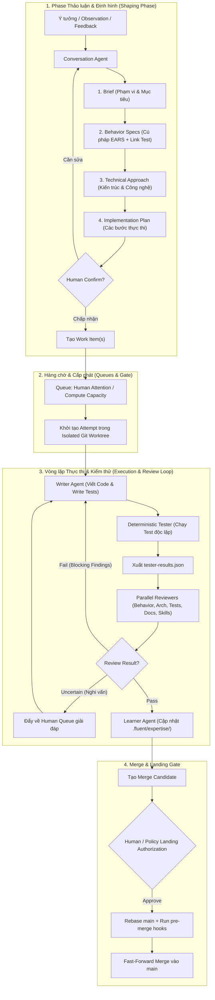
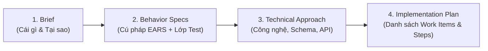
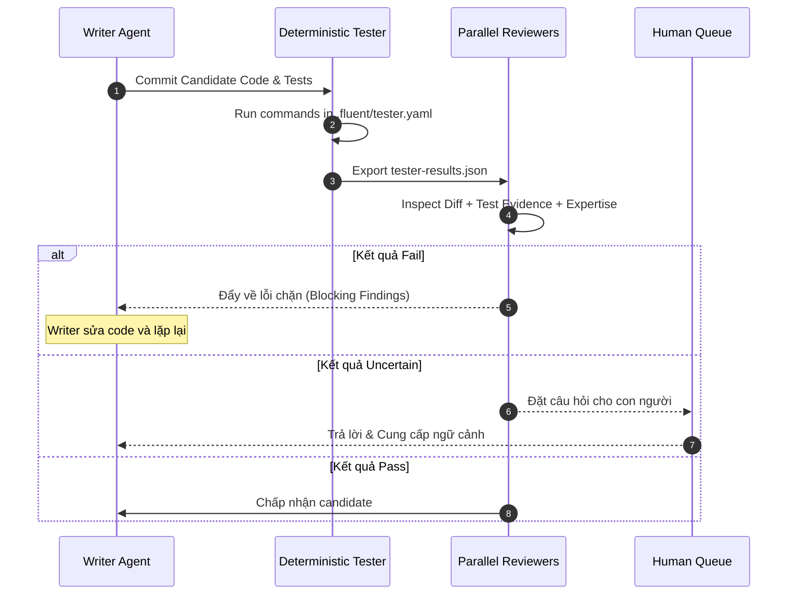
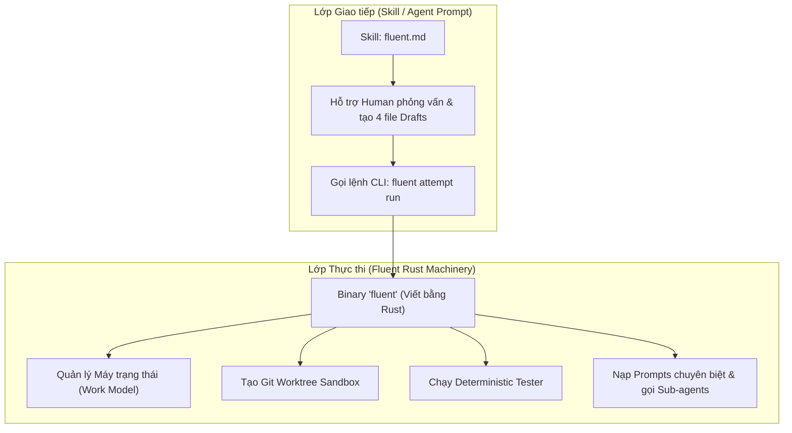

Listed directory fluent
Viewed AGENTS.md:1-157
Viewed README.md:1-148

Hệ thống **Fluent** đặt ra một khung ràng buộc khắt khe (constraint-driven software factory framework) lên các AI Agent. Thay vì để AI Agent tự do sửa code thẳng trên nhánh chính (`main`) hay tự "tuyên bố" code đã đúng, Fluent buộc AI Agent phải tuân theo các **vòng đời (lifecycles)**, **vùng phân tách (isolation)** và **cơ chế kiểm duyệt độc lập (independent validation)**.

Dưới đây là chi tiết luồng ràng buộc (Constraint Flow) mà Fluent tác động lên AI Agent cùng sơ đồ trực quan.

---

## 1. Sơ đồ Tổng quan Luồng Ràng buộc (Overall Constraint Flow)

Sơ đồ bên dưới thể hiện toàn bộ quy trình mà một yêu cầu đi qua, từ lúc thảo luận đến khi code được chấp nhận và land vào nhánh chính:

---

## 2. Chi tiết 5 Cấp độ Ràng buộc của Fluent lên AI Agent

### 1️⃣ Ràng buộc Phân tách Vai trò (Separation of Roles)
Fluent không dùng 1 Agent làm tất cả, mà chia nhỏ thành các vai trò với thẩm quyền riêng biệt:
- **Conversation Agent**: Chỉ tương tác thảo luận, tạo tài liệu định hình (`Brief`, `Behavior`, `Approach`, `Plan`). **Không được sửa code sản phẩm trực tiếp trên main**.
- **Writer Agent**: Nhận tài liệu đã duyệt, chỉ viết code và unit test trong một **Git Worktree isolated** riêng biệt.
- **Tester Runner**: Không phải là AI Agent mà là một chương trình chạy lệnh test khách quan (`deterministic runner`). Writer Agent **không được tự báo "Pass"** nếu Tester chưa chạy xong.
- **Reviewer Agents (Behavior, Arch, Tests, Docs, Skills)**: Chạy song song, đánh giá mã dựa trên bằng chứng (`tester-results.json` và code diff). Không bị ảnh hưởng bởi logic của Writer.
- **Learner Agent**: Trích xuất bài học kinh nghiệm ghi vào `.fluent/expertise/` sau khi pass review.

---

### 2️⃣ Ràng buộc Định hình 4 Tầng (4-Layer Shaping Framework)
Trước khi 1 dòng code sản phẩm nào được viết, AI Agent bị ép buộc phải cùng người dùng hoàn thiện 4 tầng ngữ cảnh (Chi tiết tại [README.md](file:///home/thanhsmind/projects/AI/fluent/README.md#how-you-tell-fluent-what-to-build)):

- **Behavior Specs (EARS)**: AI Agent buộc phải viết yêu cầu theo cú pháp EARS (*WHEN... THE SYSTEM SHALL...*) và bắt buộc đi kèm tham chiếu `Test:` hoặc lý do `Untestable:`.

---

### 3️⃣ Ràng buộc Vòng lặp Đánh giá Khách quan (Evidence-Based Review Loop)

AI Agent (Writer) bị đóng khung trong vòng lặp sửa đổi đến khi đạt chất lượng tối đa:

---

### 4️⃣ Ràng buộc Nhánh & Lịch sử Git (Strict Git & Commit Policy)
Được quy định cụ thể tại [AGENTS.md](file:///home/thanhsmind/projects/AI/fluent/AGENTS.md):
- **Không sửa trực tiếp trên `main`**: Mọi công việc thực thi phải làm trên Worktree độc lập.
- **Linear History**: Không bao giờ tạo Merge Commit (`git merge --ff-only` sau khi `git rebase main`).
- **Chuẩn Commit Message khắt khe**:
  - Tiêu đề dùng động từ chủ động (imperative mood), viết hoa chữ cái đầu, dưới 50 ký tự, không có dấu chấm cuối.
  - Thân commit giải thích *Cái gì* và *Tại sao* thay đổi (không giải thích *Như thế nào*).
  - Nghiêm cấm chèn các trailer như `Co-Authored-By`, không dẫn chiếu Run ID hay thống kê số dòng/số file.

---

### 5️⃣ Ràng buộc Động từ Chủ động (Active Verb Forms Policy)
AI Agent khi viết docstrings, comments, tài liệu hay commit message buộc phải dùng động từ nguyên thể/chủ động thay vì danh từ hóa (Nominalization):
- ❌ *Tránh*: `"User authentication handling"`
- ✅ *Ưu tiên*: `"Authenticate users"`
- ❌ *Tránh*: `"functions for extracting audio"`
- ✅ *Ưu tiên*: `"functions to extract audio"`

---

## Tổng kết

Nhờ luồng ràng buộc này, Fluent biến AI Agent từ một công cụ sinh code tự do thành một **mắt xích trong dây chuyền sản xuất phần mềm có kỷ luật**, nơi mỗi bước đều được kiểm soát bởi:
1. **Sự phê duyệt của con người** ở khâu định hình (Shaping).
2. **Môi trường thực thi cô lập** ở khâu code (Isolated Worktree).
3. **Bằng chứng kiểm thử khách quan & Đánh giá đa góc nhìn song song** ở khâu Review.

Searched for "expertise"
Viewed fluent.md:1-100
Listed directory prompts
Listed directory references

Vấn đề **"AI hay quên"** (Degradation / Context Loss trong LLM) là một trong những điểm yếu lớn nhất của các coding agent hiện nay khi làm việc trên các dự án phần mềm dài hạn. 

Dưới đây là câu trả lời chi tiết về lý do Fluent giải quyết được vấn đề này và tại sao các file Skill của Fluent lại nói rất ít về flow.

---

## 1. Fluent giải quyết vấn đề "AI hay quên" như thế nào?

Khi làm việc trong một phiên chat dài, LLM sẽ gặp 3 hiện tượng:
1. **Context Drift / Degradation**: Quên mất các quy tắc, tiêu chuẩn kiến trúc ban đầu khi đoạn chat kéo dài.
2. **Context Loss giữa các Session**: Khi tắt chat hoặc mở session mới, AI mất sạch bộ nhớ cũ.
3. **Ảo giác tiến độ (Hallucination)**: AI không nhớ chính xác mình đã sửa file nào, test đã chạy chưa.

Để triệt tiêu các vấn đề này, Fluent áp dụng 4 cơ chế cốt lõi:

### 1️⃣ Durable File-Based State (Lưu trữ trạng thái bền vững trên Ổ đĩa)
Fluent **không tin tưởng bộ nhớ context của LLM**. Mọi trạng thái và kết quả đều được ghi trực tiếp thành các file Markdown/JSON bền vững trên ổ đĩa trong thư mục `.fluent/`:
- **Ý tưởng / Báo lỗi**: Đưa vào `.fluent/observations/`.
- **Ngữ cảnh định hình**: Lưu trong `.fluent/drafts/<draft-id>/` (`brief.md`, `behaviors.diff.md`, `approach.md`, `plan.md`).
- **Tiến độ thực thi**: Writer Agent ghi nhận từng bước hoàn thành vào file `progress.md` nằm trong workspace.

👉 **Tác dụng**: Dù bạn tắt AI, chuyển máy hay bắt đầu một session hoàn toàn mới, Agent chỉ cần đọc lại các file `.md` trên ổ đĩa là khôi phục 100% ngữ cảnh chính xác mà không bị mất tin nhắn.

---

### 2️⃣ Stateless Sub-Agents (Kiến trúc Agent ngắn hạn, ngữ cảnh sạch)
Fluent không dùng 1 phiên chat dài 100 tin nhắn để vừa thiết kế, vừa viết code, vừa review. 

Khi thực thi (`fluent attempt run`), bộ máy Fluent sẽ khởi tạo các **Sub-Agent ngắn hạn (Ephemeral Agents)** riêng biệt cho từng nhiệm vụ:
- **Writer Agent**: Chỉ nhận đúng File code liên quan + `brief` + `behaviors` + `approach` + `plan`.
- **Reviewer Agents**: Chỉ nhận đúng Git diff + kết quả test + tiêu chí review.

👉 **Tác dụng**: Mỗi Sub-Agent luôn hoạt động trong một Context Window **sạch và nhỏ gọn**, triệt tiêu hoàn toàn rác hội thoại (Context Bloat) – nguyên nhân chính khiến AI bị ngáo hay quên.

---

### 3️⃣ Project Expertise Engine (`.fluent/expertise/` - Bộ nhớ dài hạn)
Sau khi một tính năng hoàn thành và pass toàn bộ Reviewer, **Learner Agent** sẽ phân tích bài học, quy ước kiến trúc, pattern testing hoặc các bẫy (gotchas) vừa phát hiện và lưu vào `.fluent/expertise/` (được commit vào Git).

👉 **Tác dụng**: Trong các task tiếp theo (dù là nhiều tuần sau), Fluent sẽ tự động nạp các file trong `.fluent/expertise/` vào Prompt của Writer/Reviewer. AI **không bao giờ quên convention của dự án** vì bài học đã trở thành một phần của repo.

---

### 4️⃣ Independent Evidence Records (Bằng chứng độc lập)
AI không cần "nhớ" xem lần trước test có pass hay không. Kết quả được ghi nhận bằng file cứng:
- `tester-results.json`: Do bộ chạy test độc lập (Deterministic Tester) tạo ra.
- **Review Reports**: Ghi nhận rõ ràng các lỗi chặn (`blocking findings`).

Vòng lặp sửa mã ở lượt tiếp theo chỉ cần đọc đúng các file báo cáo lỗi này để khắc phục.

---

## 2. Tại sao các Skill của Fluent lại ít nói về Flow?

Nhận xét của bạn rất chính xác: Trong file skill [fluent.md](file:///home/thanhsmind/projects/AI/fluent/skills/fluent.full/fluent.md), bạn sẽ thấy phần mô tả flow thực thi rất ngắn gọn. Lý do nằm ở **Sự phân tách trách nhiệm (Separation of Concerns)** giữa **Prompt Skill** và **Core Engine (Rust)**:

1. **Skill chỉ là Lớp Giao tiếp (Conversational Interface)**:
   - Skill (`fluent.md`) được thiết kế cực kỳ mỏng nhẹ (Lean Prompt) nhằm **tiết kiệm không gian Context Window** cho LLM khi phỏng vấn người dùng.
   - Nhiệm vụ duy nhất của Skill là hướng dẫn Conversation Agent phỏng vấn bạn để chốt 4 file định hình (`brief`, `behaviors`, `approach`, `plan`), sau đó chuyển giao công việc cho công cụ CLI thông qua lệnh `fluent attempt run`.

2. **Core Engine (Rust Binary) mới là nơi quản lý Flow**:
   - Toàn bộ luồng thực thi phức tạp (từ tạo Git Worktree, chạy Tester, gọi các Reviewer song song, quản lý vòng lặp sửa lỗi, đến chạy Learner và Land code) được lập trình cứng trong **mã nguồn Rust** của Fluent (xem tại thư mục [src/](file:///home/thanhsmind/projects/AI/fluent/src/)).
   - Rust Engine tự động inject các prompt chuyên biệt cho từng sub-agent từ thư mục [prompts/](file:///home/thanhsmind/projects/AI/fluent/prompts) (như `write-user.md`, `review-user.md`, `learner-user.md`).

### Tóm lại:
- **Để AI không quên**: Fluent ghi toàn bộ trạng thái xuống file đĩa (`.fluent/`), chia nhỏ nhiệm vụ cho các Sub-agent với context sạch, và tích lũy tri thức vào `.fluent/expertise/`.
- **Skill ít nói về Flow**: Vì Flow thực thi được quản lý hoàn toàn bởi **Engine mã nguồn Rust (`fluent` CLI)** chứ không phó mặc cho prompt của Skill.

Viewed SKILL.md:19-48
Listed directory skills
Viewed SKILL.md:1-29
Viewed SKILL.md:1-28
Viewed SKILL.md:1-30
Viewed SKILL.md:1-35
Viewed SKILL.md:1-29

Trong dự án Fluent, hệ thống **Skill** được chia thành **3 nhóm chính**:
1. **Interactive Workflow Skill & 4 Tham chiếu Định hình (Shaping Stages)**: Dành cho phiên thảo luận giữa Human và Conversation Agent.
2. **Reviewer Skills (Đánh giá chuyên biệt)**: Dành cho các Sub-Agent đánh giá chất lượng tự động ở vòng lặp thực thi.
3. **Bootstrapping Shim Skill**: Skill mỏng dùng để khởi tạo và kích hoạt hệ thống.

Dưới đây là chi tiết từng skill trong codebase của Fluent:

---

## Nhóm 1: Interactive Workflow Skill (`fluent` / `fluent.full`)

Skill chính điều hành toàn bộ quy trình tương tác là [fluent.md](file:///home/thanhsmind/projects/AI/fluent/skills/fluent.full/fluent.md). Nhóm này quy định 4 giai đoạn định hình (Shaping Stages), mỗi giai đoạn đi kèm 1 tài liệu tham chiếu chi tiết trong `skills/fluent.full/references/`:

### 1️⃣ `capture-brief` ([capture-brief.md](file:///home/thanhsmind/projects/AI/fluent/skills/fluent.full/references/capture-brief.md))
- **Mục đích**: Phỏng vấn người dùng để định hình **lát cắt công việc (slice)** cần xây dựng.
- **Nhiệm vụ**: 
  - Làm rõ mục tiêu, phạm vi (`in-scope` và `out-of-scope`), lý do làm (Goal & Value).
  - Liệt kê các giả định (assumptions) và rủi ro/điểm chưa biết (unknowns).
  - Không lựa chọn giải pháp kỹ thuật ở bước này.
- **Đầu ra**: File `brief.md` nằm trong `.fluent/drafts/<draft-id>/`.

### 2️⃣ `define-behaviors` ([define-behaviors.md](file:///home/thanhsmind/projects/AI/fluent/skills/fluent.full/references/define-behaviors.md))
- **Mục đích**: Chuyển đổi `Brief` thành các phát biểu hành vi hệ thống chính xác.
- **Nhiệm vụ**:
  - Viết theo **cú pháp EARS** (*WHEN <điều kiện>, THE SYSTEM SHALL <hành vi>*).
  - Mọi phát biểu hành vi **bắt buộc** phải gắn với một tham chiếu `Test:` (file/tên test) hoặc nêu rõ lý do `Untestable:`.
- **Đầu ra**: File `behaviors.diff.md` thể hiện các hành vi thêm/sửa/xóa so với hiện tại.

### 3️⃣ `design-approach` ([design-approach.md](file:///home/thanhsmind/projects/AI/fluent/skills/fluent.full/references/design-approach.md))
- **Mục đích**: Quyết định phương án kỹ thuật và kiến trúc trước khi giao cho Agent viết code.
- **Nhiệm vụ**:
  - Chốt cấu trúc mô-đun, giao diện API, giao thức, thư viện, cơ sở dữ liệu và tích hợp.
  - Giải trình lý do lựa chọn và các phương án đánh đổi (tradeoffs).
- **Đầu ra**: File `approach.md`.

### 4️⃣ `plan-execution` ([plan-execution.md](file:///home/thanhsmind/projects/AI/fluent/skills/fluent.full/references/plan-execution.md))
- **Mục đích**: Chuyển đổi thiết kế thành các bước thực thi mà Agent có thể triển khai độc lập.
- **Nhiệm vụ**:
  - Chia nhỏ công việc thành một hoặc nhiều **Work Items** độc lập (có thể chạy song song).
  - Sắp xếp thứ tự các bước thực thi, chỉ rõ tiêu chí nghiệm thu của từng bước.
  - Gọi CLI `fluent work-item create` để đóng gói ngữ cảnh.
- **Đầu ra**: File `plan.md` và khởi tạo Work Item trong hệ thống.

---

## Nhóm 2: 5 Reviewer Skills (Đánh giá chất lượng tự động)

Khi chạy lệnh `fluent attempt run`, Fluent kích hoạt 5 Sub-Agent chuyên biệt chạy 5 Reviewer Skills song song để đánh giá code diff và bằng chứng test (`tester-results.json`):

### 1️⃣ `review-behaviors` ([SKILL.md](file:///home/thanhsmind/projects/AI/fluent/skills/review-behaviors/SKILL.md))
- **Nhiệm vụ**: 
  - Kiểm tra xem code candidate có thực sự đáp ứng đúng các hành vi đã định nghĩa trong `behaviors.diff.md` hay không.
  - Đảm bảo các phát biểu hành vi đúng cú pháp EARS và có test chạy pass tương ứng.
  - Bắt các lỗi bỏ sót trường hợp thất bại (failure paths) hoặc mâu thuẫn hành vi.

### 2️⃣ `review-architecture` ([SKILL.md](file:///home/thanhsmind/projects/AI/fluent/skills/review-architecture/SKILL.md))
- **Nhiệm vụ**: 
  - Đánh giá chất lượng cấu trúc mã nguồn trên toàn bộ codebase (ranh giới mô-đun, độ phụ thuộc, tính đóng gói).
  - Kiểm tra xem code có tuân thủ đúng định hướng kỹ thuật trong `approach.md` hay không.
  - Phát hiện các anti-patterns (God objects, phụ thuộc vòng - circular dependencies, coupling không cần thiết).

### 3️⃣ `review-tests` ([SKILL.md](file:///home/thanhsmind/projects/AI/fluent/skills/review-tests/SKILL.md))
- **Nhiệm vụ**: 
  - Đánh giá độ tin cậy và bao phủ của bộ test (test coverage, edge cases, error paths).
  - Phát hiện các bài test rác (flaky tests, test pass giả lập không kiểm tra logic thật, test bị dính chặt vào implementation chi tiết).
  - Kiểm tra và thách thức các trường hợp khai báo `Untestable:`.

### 4️⃣ `review-documentation` ([SKILL.md](file:///home/thanhsmind/projects/AI/fluent/skills/review-documentation/SKILL.md))
- **Nhiệm vụ**: 
  - Đánh giá tính chính xác và chất lượng của tài liệu ở mọi cấp độ: function docstrings, header comments, module README, tài liệu kiến trúc và tài liệu người dùng.
  - Kiểm tra tính đồng nhất của thuật ngữ (vocabulary drift).
  - **Kiểm tra chuẩn Commit Message**: Đảm bảo các commit tuân thủ quy tắc commit message khắt khe trong [AGENTS.md](file:///home/thanhsmind/projects/AI/fluent/AGENTS.md) (thể chủ động, <50 ký tự, không có trailer rác).

### 5️⃣ `review-skills` ([SKILL.md](file:///home/thanhsmind/projects/AI/fluent/skills/review-skills/SKILL.md))
- **Nhiệm vụ**: 
  - Dùng khi dự án phát triển thêm các **Agent Skill mới**.
  - Kiểm tra tính hợp lệ của frontmatter YAML, khả năng phát hiện skill (discoverability), hướng dẫn từng bước, các file tài nguyên hỗ trợ và sự chồng chéo giữa các skill anh em.

---

## Nhóm 3: Bootstrapping Shim Skill (`fluent`)

- **Vị trí**: [skills/fluent/SKILL.md](file:///home/thanhsmind/projects/AI/fluent/skills/fluent/SKILL.md)
- **Mục đích**: Là skill mỏng (Shim skill) được nạp mặc định khi người dùng cài đặt Fluent lần đầu qua `npx skills add mrinalwadhwa/fluent`.
- **Nhiệm vụ**: 
  1. Kiểm tra xem binary `fluent` đã được cài đặt trên máy người dùng hay chưa (nếu chưa sẽ hướng dẫn cài qua `curl`).
  2. Thực thi lệnh `fluent skills add` để giải nén toàn bộ bộ Skill đầy đủ (`fluent.full` và các Reviewer skills).
  3. Chuyển quyền điều khiển sang `fluent.full` để bắt đầu quy trình làm việc.

---

## Bảng tổng hợp nhanh các Skill trong Fluent

| Tên Skill | Loại | Vai trò chính | File / Thư mục chính |
| :--- | :--- | :--- | :--- |
| **`fluent`** | Shim | Cài đặt & Kích hoạt hệ thống | [skills/fluent/SKILL.md](file:///home/thanhsmind/projects/AI/fluent/skills/fluent/SKILL.md) |
| **`fluent.full`** | Interactive | Đội ngũ Thảo luận & Định hình 4 tầng với Human | [skills/fluent.full/fluent.md](file:///home/thanhsmind/projects/AI/fluent/skills/fluent.full/fluent.md) |
| **`review-behaviors`** | Reviewer | Đánh giá tính đúng đắn của hành vi & cú pháp EARS | [review-behaviors/SKILL.md](file:///home/thanhsmind/projects/AI/fluent/skills/review-behaviors/SKILL.md) |
| **`review-architecture`** | Reviewer | Đánh giá cấu trúc code, module boundary & anti-patterns | [review-architecture/SKILL.md](file:///home/thanhsmind/projects/AI/fluent/skills/review-architecture/SKILL.md) |
| **`review-tests`** | Reviewer | Đánh giá chất lượng test suite, coverage & test rác | [review-tests/SKILL.md](file:///home/thanhsmind/projects/AI/fluent/skills/review-tests/SKILL.md) |
| **`review-documentation`**| Reviewer | Đánh giá tài liệu, docstrings & chuẩn Commit Message | [review-documentation/SKILL.md](file:///home/thanhsmind/projects/AI/fluent/skills/review-documentation/SKILL.md) |
| **`review-skills`** | Reviewer | Đánh giá và kiểm duyệt các Agent Skill mới | [review-skills/SKILL.md](file:///home/thanhsmind/projects/AI/fluent/skills/review-skills/SKILL.md) |