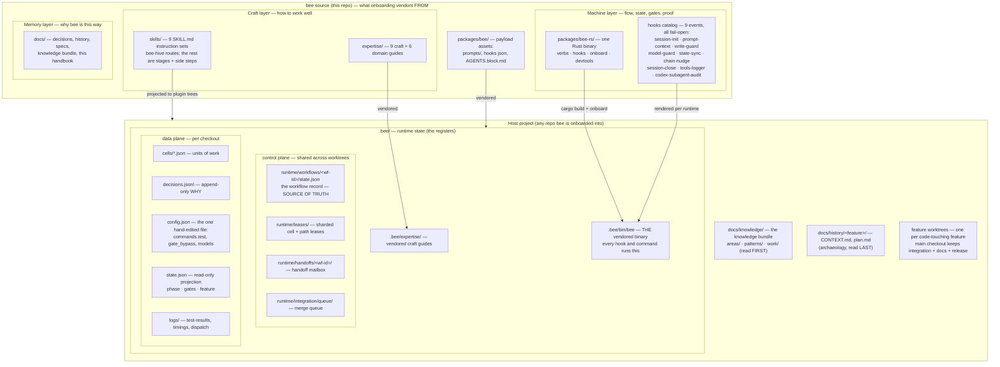
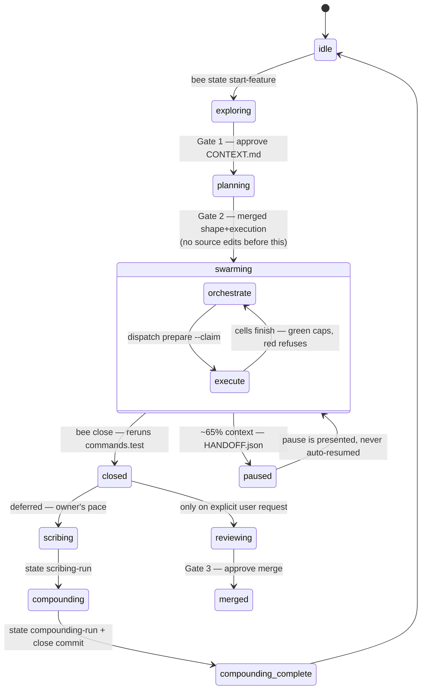
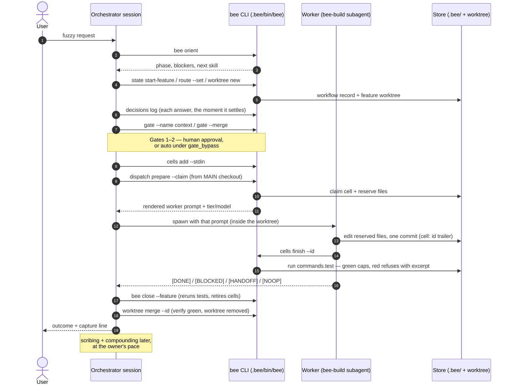
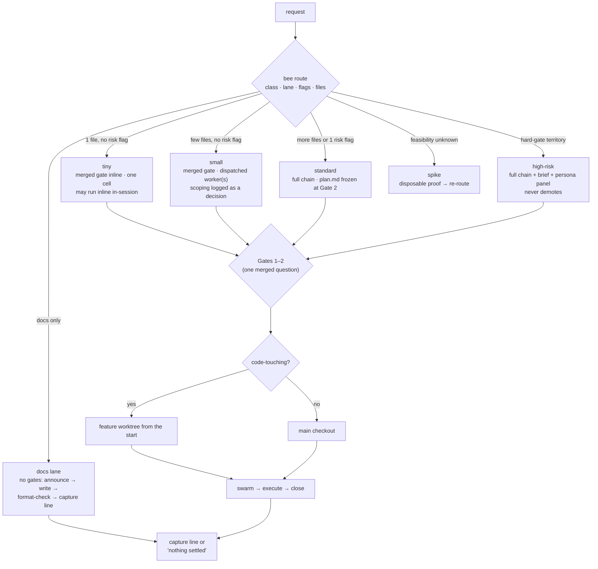
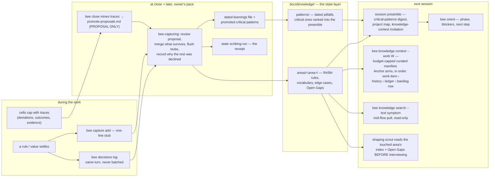
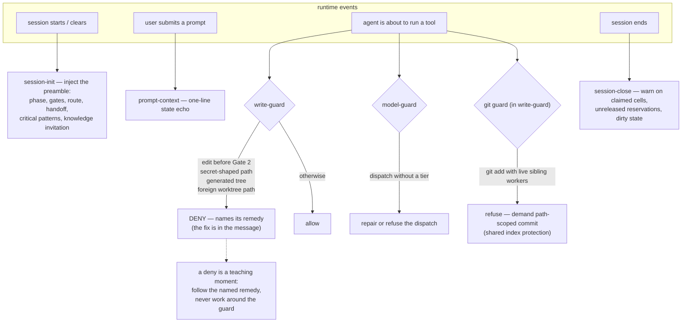

# bee harness — the whole picture, drawn

> One page of diagrams. Each diagram answers one question: what contains what,
> what each part means, and how a piece of work flows through the machine.
> Prose stays minimal — the [overview](overview.md) carries the doctrine, the
> [register](register.md) carries the state detail, and each
> [stage page](index.md) carries its stage. On any disagreement the source wins.

## 1. What contains what — the component map

Every part of bee sorts into one of three layers (Machine / Craft / Memory),
plus the runtime state the machine writes into a host project. Arrows here mean
"is part of / is vendored into", not data flow.

Meaning, in one line each:

| Part | Child of | Means |
|---|---|---|
| `bee` binary | Machine | The only door to state. Agents never hand-edit `.bee/*.json`. |
| hooks | Machine | Safety **net**, not authority: an unblocked write is still not an approved write. |
| skills | Craft | The instructions a session loads to run a stage. |
| expertise | Craft | Judgment that holds in any repo (tests, debugging, architecture…). |
| workflow record | control plane | Where a running feature's truth lives; `state.json` is only its projection. |
| leases / claims / holds | control plane | How parallel sessions coordinate — never around them. |
| knowledge bundle | Memory (host) | What the system *is* today. Read before code. |
| `docs/history/` | Memory (host) | How it got that way. Read last. |
| worktrees | host workspace | Isolation per code-touching feature; merge is the only road back. |

## 2. When does the flow run — the lifecycle

The machine's phases, the three gates, and the two deferred stages. Solid
arrows are the default chain; dashed arrows are on-demand or deferred.

Key readings:

- **Gate 1** and **Gate 2** are the default chain; **Gate 3 exists only inside a
  review session the user asked for.** A finished feature is truthfully
  *unreviewed* until then.
- Scribing + compounding are one skill (`bee-capturing`) and are **deferred,
  never dropped**: a green close records capture as pending and the reminder
  stands until it runs.
- `gate_bypass` (normal/full/total) can auto-approve Gates 1–2 by level — a
  human sets the level; the agent never approves a gate itself.

## 3. One feature, end to end — who talks to whom

The sequence for a small code-touching feature under `gate_bypass: normal`
(the gates auto-approve; with bypass off the same two points stop and wait
for the human).

## 4. How ceremony scales — lane routing

`bee route` classifies mechanically (risk-flag count + product-file count);
the lane decides how much workflow the work pays for. Memory never scales
down: every lane captures what settles.

Risk territory (auth, data loss, security, external providers, validation
removal) **parks at any confidence** on the unattended path — risk is a
property of the change, not of the assessor's certainty.

## 5. The memory loop — how knowledge compounds

Why the next session starts smarter: everything that settles is pushed into
the bundle, and the bundle is pushed back into the start of every session.

The backlog-row anchor arm (last in the chain) is what lets `knowledge
context` fire **during exploring** — before `CONTEXT.md` exists, the backlog
row is the earliest artifact that names the work.

## 6. The guard layer — what the hooks actually do

Hooks are rendered per runtime from one catalog and all call the same binary.
Every one is **fail-open**: a payload it cannot decide allows the operation
and says so out loud.

## Where to go next

- Stage detail: [index.md](index.md) → `stages/<id>.md`
- Every register drawn above: [register.md](register.md)
- Doctrine and vocabulary: [overview.md](overview.md)
