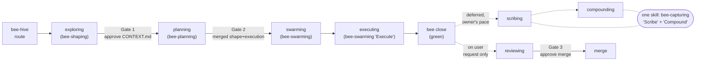

# bee harness — system overview

> This handbook turns the bee harness into a navigable reference. Read the
> [index](index.md) to route to a **stage**, read [register.md](register.md) for
> the shared **state** each stage reads and writes, and read
> [using-as-planner.md](using-as-planner.md) to use the handbook the way a code
> agent should: locate every place a change must touch *before* editing.
>
> Format follows the [Harness Handbook](https://github.com/Ruhan-Wang/Harness_Handbook)
> convention — `overview → index → register → stages/<id>` — mapped onto bee's
> own architecture: the **chain is the set of stages**, and the `.bee/` runtime
> files are the **state registers**.
>
> **Currency.** This handbook is a *derived* layer. It describes the tree as it
> stands after the R6 Node cutover and the harness refocus: one native Rust
> binary, a porcelain/plumbing front door, a craft `expertise/` layer, and
> test-simple proof. On any disagreement the source wins and the handbook is
> stale — say so, then fix it.

## What bee is

bee is a **workflow harness** for AI coding agents. It is not an application with
users and features of its own — it is the operating discipline a coding agent runs
*inside* when it works on a host project. Its job is to keep the agent pointed in
the right direction and assemble just-right context, so it always knows where it
is and what to do next: turn a fuzzy request into locked decisions, scale ceremony
to real risk, gate the irreversible steps behind human approval, and keep a durable
memory of what settled so the next session starts smarter.

### The three layers

Everything below sorts into one of three layers, and which layer a rule lives in
is the first question any change to bee must answer:

| Layer | Lives in | Owns |
|---|---|---|
| **Machine** | the CLI + the hooks | flow, state, gates, proof, context assembly. It *teaches at the point of contact*: every flow verb and every refusal names the next action in plain language. |
| **Craft** | `skills/` + `expertise/` | how to do the work well — interviewing, shaping, decomposing, testing, reviewing, capturing. Universal wording, portable to any repo. |
| **Memory** | `docs/` | why bee is the way it is — decisions, history, specs, this handbook. |

The load-bearing consequence: **a rule the machine enforces is deleted from
prose.** Prose keeps the intent ("cap with proof; the CLI refuses otherwise and
tells you how to fix it"), never a restatement of the check. A skill that has to
sequence three CLI calls to express one intent is a missing verb, not a longer
skill.

### What bee ships

1. **Skills** (`skills/<name>/SKILL.md`) — nine of them, instruction content only.
   Each body stays lean and teaches judgment; depth lives exactly one level down
   in `references/`. `bee-hive` is the router; the rest are the chain stages and
   the on-demand side steps.
2. **Expertise** (`expertise/`) — the craft layer: 9 craft guides (thinking,
   planning, architecture, decisions, tests, review, documentation, knowledge,
   debugging) and 6 domain guides (data, apis, security, operations, performance,
   frontend), routed from `INDEX.md`. Vendored into a host as `.bee/expertise/`;
   skills reference the vendored path, never the source.
3. **One native CLI** (`packages/bee-rs/crates/bee`, Rust 2024) — every state read
   and mutation goes through this single binary, vendored into a host repo as
   `.bee/bin/bee` (`bee.exe` on Windows). State is *never* hand-edited. The same
   binary serves the hooks (`bee hook <name>`), onboarding (`bee onboard`), and
   the maintainer surface (`bee dev …`).
4. **Payload assets** (`packages/bee/`) — what onboarding vendors that is *not*
   code: `AGENTS.block.md`, `agents/*.tmpl`, `prompts/` (worker, gather, reviewer,
   advisor), `hooks/{hooks,claude-hooks}.json`, and `statusline/`. No `.mjs`
   is left here: the distribution planner that used to live beside them is
   `bee dev plugin-distribution` on the binary.
5. **Runtime state** (`.bee/`) — the [state registers](register.md): workflow
   records, phase, gates, feature, cells, decisions, leases, claims, lanes,
   intent anchors, backlog, handoff mailboxes.
6. **Hooks** — one catalog of record rendered per runtime (`hooks/hooks.json` for
   Codex's 8 events, `hooks/claude-hooks.json` for Claude Code's 7), every entry
   launching the same vendored binary as `bee hook <name>`. Nine names are
   invokable: `session-init`, `prompt-context`, `write-guard`, `model-guard`,
   `state-sync`, `chain-nudge`, `session-close`, `tools-logger`,
   `codex-subagent-audit`. Every one is **fail-open**: a payload it cannot decide
   allows the operation and says so out loud. The hook is a net, *not* the
   authority — an unblocked write is not an approved write.

## The core model

**One orchestrator, many I/O workers (the Delegation contract).** The session model
is the orchestrator — it decides. Mechanical gather/render/mine steps are dispatched
*down-tier* to worker subagents that read many files and return a compact digest, so
the orchestrator's scarce context window is spent on synthesis, gates, and human
conversation — never on raw file dumps. Deciding never delegates; gathering almost
always does.

**Lanes scale ceremony, never memory.** The same request can be a two-minute `tiny`
fix or a full `high-risk` feature. bee classifies the lane mechanically (risk-flag
count + product-file count) and runs the *least* workflow that honestly protects the
work. What never scales down is memory: a rule, behavior, or value that just settled
is captured the moment it settles, in every lane.

**Gates are the human checkpoints.** They fence the irreversible transitions —
Gate 2 approves shape and execution together in one call (`bee gate --merge`),
folding the old standalone execution gate into it. They are never self-approved — except
when the opt-in `gate_bypass` switch is deliberately set by the human (levels:
`normal` / `full` / `total`). Bypass changes whether a run **stops**, never whether
its brief and approval record **exist**: an auto-approved gate is written with
`actor: auto`, the level in force, and the reason it did not stop.

**Knowledge over history.** The state layer an agent reads *first* is the knowledge
bundle (`docs/knowledge/`) when the repo has one, or `docs/specs/` otherwise.
`docs/history/` is archaeology, read last. In bee's own repo `docs/specs/` is now a
**read-only compatibility surface** — the live area concepts are in the bundle, and
a fence refuses new prose in the old location.

**Orient, don't re-derive.** `bee orient` is the one command a session or worker
runs to know where it is: phase, gates, decisions in force, ready cells, blockers,
and exactly one recommended next step. It supersedes the "read these five files in
this order" paragraphs — the packet *is* the context assembly.

**Workflow-first, multisession-native.** The source of truth for a running workflow
is its own record (`.bee/runtime/workflows/<wf-id>/state.json`); legacy
`.bee/state.json` is a read-only projection. State splits into a **control plane**
shared across worktrees (workflow records, sharded leases, handoff mailboxes,
cross-worktree holds) and a **data plane** isolated per worktree. Sessions
coordinate through leases, claims, and holds — never around them. Active workers
are *derived* (live-heartbeat sessions joined with cell claims), never stored.

**Worktree-first.** Code-touching feature work lives in its own feature worktree
from the moment the lane is routed (`bee worktree new --feature <slug>`); the main
checkout takes only integration, docs-lane, and release work. Landing is
`bee worktree merge`, which re-runs `commands.test` against the staged merge — the last
net before a semantic conflict reaches main.

**Proof is one declared test path (test-simple).** A project declares how it is
tested exactly once, in `.bee/config.json` `commands.test`. `bee test` runs it and
writes one normalized record, `.bee/logs/test-results.json`. `bee cells finish`
runs that suite at every cap: green caps, red refuses and carries the failing
excerpt — and that red becomes the next work. There are no per-cell proof tiers,
no `change_class × lane` matrix, no red-first evidence flags; coverage judgment
survives as craft in `.bee/expertise/tests.md`, enforced by review, not by a cap
door. Close, merge, and CI all re-run that same command — `commands.verify` is retired.

**Capture is deferred, never dropped.** A green `bee close` records capture as
*pending* and names what remains; Scribe and Compound run when the owner chooses,
often batching several closed features into one session. The reminder stands until
they run.

## Architecture at a glance

```
skills/                     the workflow, one SKILL.md per skill (instructions only)
  bee-hive/                 router + gate keeper + onboarding + gate bypass → stages/hive.md
  bee-shaping/              fuzzy request → locked CONTEXT.md; Explore, Qualify,
                            Lock, and Brief in one front door   → stages/exploring.md
  bee-planning/             route + research + shape + cells    → stages/planning.md
  bee-swarming/             orchestrate bounded workers, plus the
                            "Execute" one-cell worker contract  → stages/swarming.md, stages/executing.md
  bee-reviewing/            on-demand independent review gate    → stages/reviewing.md
  bee-capturing/            sync durable knowledge (Scribe) and
                            learnings + decisions (Compound)    → stages/scribing.md, stages/compounding.md
  bee-researching/          evidence-labeled research scout
  bee-grooming/             hunt tech debt
  bee-herding/              autonomous cockpit (bootstrap / dispatch / merge)
  (maintainer guides for developing bee itself live in
   docs/handbook/writing-skills.md and docs/handbook/evolving.md)

expertise/                  the craft layer, vendored to .bee/expertise/
  INDEX.md                  routes two questions: how is work done · what is being built
  thinking · planning · architecture · decisions · tests · review ·
  documentation · knowledge · debugging          (craft)
  data · apis · security · operations · performance · frontend   (domain)

packages/bee-rs/            THE runtime — one Rust binary, no second implementation
  crates/bee/src/main.rs    collect argv → router::try_native → exit
  crates/bee/src/router.rs  the front door: flow-verb aliases, the `internal`
                            namespace, the probe chain, the refusal taxonomy
  crates/bee/src/verbs/     one module per command group        → register.md
  crates/bee/src/hooks/     the guard layer — 9 invokable as `bee hook <name>`
  crates/bee/src/onboard/   the installer (`bee onboard`)
  crates/bee/src/devtools/  `bee dev …` — release manifest, skill trees, prompts

packages/bee/               vendored payload ASSETS only (no runtime code)
  AGENTS.block.md · agents/*.tmpl · prompts/ · hooks/{hooks,claude-hooks}.json
  statusline/

.bee/
  bin/bee[.exe]             the single CLI, vendored binary                → register.md
  expertise/                vendored craft + domain guides
  runtime/workflows/<wf-id>/state.json  workflow record — SOURCE OF TRUTH  → register.md
  runtime/leases/           sharded cell/path leases (control plane)       → register.md
  runtime/handoffs/<wf-id>/ per-workflow handoff mailbox                   → register.md
  state.json                read-only projection: phase · gates · feature   → register.md
                            · run_state · waiting_on
  deferred-queue.jsonl      claimable capture/scribe/review/promote work    → register.md
  config.json               commands · hook toggles · gate_bypass · models → register.md
  cells/<feature>-<n>.json  one unit of executable work                    → register.md
  decisions.jsonl           append-only decision log                       → register.md
  intent/ · lanes/ · claims/ · sessions/ · locks/ · reviews/               → register.md
  logs/test-results.json    the one test record `cells finish` reads       → register.md

docs/
  knowledge/               the state layer (read FIRST) — areas/ patterns/ work/
  specs/                   read-only compatibility surface (fenced)
  history/<feature>/       CONTEXT.md · plan.md · reports/ (archaeology)
  decisions/              numbered decision records + skill creation logs
  handbook/                ← you are here
```

## The chain (stages)



The same picture at full depth — components, lifecycle, sequence, lanes,
memory loop, guards — is drawn in
[architecture-map.md](architecture-map.md).

Stage names are the machine's phases; skill names are what you invoke. Capture
is the one place they differ most: **`bee-capturing` runs both** stage 5
(scribing) and stage 6 (compounding) — no `bee-scribing`, no `bee-compounding`.

- **Gate 1** — "Decisions locked. Approve CONTEXT.md before planning?"
- **Gate 2** — approves shape and execution together (`bee gate --merge`, folding
  the old standalone execution gate into this one call) *(no source edits before this)*
- **Gate 3** — merge approval, and it lives **only** inside a review session the user
  explicitly asked for. It is never an automatic end-of-chain step.

Every lane merges the old shape and execution approvals into one question. The docs
lane stops at Gate 1 only — a short brief and a one-line approval — and has no Gate 2,
no cells, and no execution gate. See each stage page for its lane behavior.

A gate is a record, not a boolean. Approving one writes `state` (`pending`, `approved`
or `rejected`), `actor` (`user` or `auto`), a timestamp, a reason, and the
`bypass_level` in force. Starting a feature seeds every gate as `pending`, so
"nobody has asked yet" and "asked, still waiting" are finally distinguishable — and the
wait survives a restart. `gate_bypass` decides whether a run **stops** at a gate; it
never decides whether that gate's brief and approval record **exist**. An auto-approved
gate is as readable after the fact as one you answered yourself.

## How to read this handbook

1. Start at [index.md](index.md) — pick the stage your change concerns.
2. Read that `stages/<id>.md` — what the stage does, what it reads and writes, its
   gate, and its hard rules.
3. Cross-reference [register.md](register.md) for any `.bee/` file the stage touches.
4. Then read the **real source** (`skills/<name>/SKILL.md`,
   `packages/bee-rs/crates/bee/src/`), and only then emit an edit plan — see
   [using-as-planner.md](using-as-planner.md).
