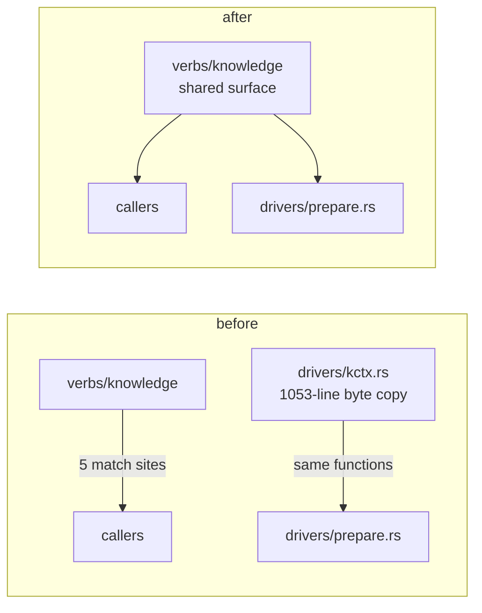

# Grooming — 2026-08-11 proposal round

First recorded audit (no prior entropy entry to trend against).

## Hive housekeeping (side-note)

**Entropy: capped 100 — action required**, but one term dominates and one sweep collapses it:
~62–68 actionable backlog rows older than 30 days with no outcome (×2 each), most citing
Node-era files deleted by the Rust migration. Other terms: unapplied area truth (9 promote
proposals + 9 capture stubs pending, ~8 areas ×5), broken tool ×8 (`bee config get/set`
declared in the registry but never ported off Node), everything else zero — no orphaned or
unverified cells, no stale decision citations, no expired reservations.

Two harness-health lines (routed upstream, never project debt):
- `bee config get/set` not built into the binary — registry declares it, handler missing.
- `HANDOFF.json` written 2026-08-05 points at cells `wr-2..wr-5` that are finished and
  archived — a dead handoff that still blocks `state start-feature` (forced three
  `--as-lane` workarounds in one session).

---

## Candidates (ranked by pain × impact)

### 1. Fold the 1,053-line knowledge byte-copy back into one module — **strong** · small

**Files:** `packages/bee-rs/crates/bee/src/verbs/drivers/kctx.rs` (dies),
`verbs/knowledge/{anchor,context,promote}.rs`, `verbs/drivers/{mod,prepare}.rs`

**Problem:** `kctx.rs` is a self-declared byte-for-byte copy of the knowledge module
(`drivers/mod.rs:194-217`: *"R6 debt: promote these to a shared module and delete this
copy"*). Every new `Anchor` arm is now written twice — proven three times over
(commits `1b2a8253`, `4e841a7d`, `6dda58db`: each touched `anchor.rs`, `context.rs`
**and** `kctx.rs` with identical text). The file opens with
`#![allow(dead_code, clippy::all)]`, so drift between the copies is invisible to the linter.

**Proposed kill:** promote the shared surface, point `drivers/prepare.rs:277-295,359-372`
at it, delete `kctx.rs`. Deletion test: complexity does **not** reappear at call sites —
they already name the same functions. The repo's own comment agrees this is the fix.

**Pain:** every Anchor change costs double edits + parity suite. **Impact:** one source of
truth, linter sees everything, next arm is one edit. **Risk lane:** small (parity tests
already exist and become the proof).

### 2. Sweep-close the pre-migration backlog findings — **strong** · tiny

**Files:** `.bee/backlog.jsonl` (via CLI only)

**Problem:** ~62–68 actionable rows from 2026-07-08..11 with no outcome; the oldest ten all
target Node-era artifacts (`backlog.mjs`, `bee_feedback.mjs`, `test_lib.mjs`) that the Rust
migration deleted. They dominate the entropy score and poison future triage.

**Proposed kill:** one sweep cell — re-check each old row against the Rust tree; close
obsolete ones with a recorded reason ("target deleted in Rust migration"), keep the still-true
few. Entropy drops from capped-100 to healthy band in one move.

### 3. README refresh — **strong** · tiny

**Files:** `README.md`, `packages/bee-rs/Cargo.toml`

**Problem:** README says **v0.1.15** (`README.md:531`) — repo is at 2.4.2 (last release
commit `d491b0e8`); decision range says 0001–0016 (`README.md:525`) — 0025 exist; a stray
"Grep Tool / Claude.md" appendix (`README.md:548-561`) is disconnected local pollution.
`Cargo.toml:6` still `version = "0.1.0"` — align or record why it diverges.

**Proposed kill:** one doc-sync cell fixing all four; doc follows code.

### 4. Regen-guard silent degrade gets a diagnostic — **worth exploring** · tiny

**Files:** `packages/bee-rs/crates/bee/src/verbs/cells/schedule.rs:68`

**Problem:** `derive_regen_guards().unwrap_or_default()` — if derivation errors, every cell's
regen roots silently come back empty; the feature degrades with no signal in the report.

**Proposed fix:** keep fail-open, add a `guards_unavailable` field so the degrade is visible.

### 5. `island_feature_scope` duplicate — **worth exploring** · tiny

**Files:** `verbs/cells/read.rs:100`, `verbs/status_full/cells.rs:160`

**Problem:** same function twice from one commit, diverged in grant resolution; the copy's
own comment admits mirroring. Also double-resolves per archive listing
(`status_full/cells.rs:227` + `:168`).

**Proposed kill:** one shared helper; second call site passes the resolved scope down.

### 6. Micro-cleanup batch — **worth exploring** · tiny

Three one-liners, one cell: dead inner re-check `handlers_close.rs:384-388` (guard at
`:165-171` already refused); `handlers_write.rs:1035` carries the literal
`"NEEDS_REVISION"` as data where `Option<()>` says the same; `timings.rs:67` comment points
at a refusal that lives in `router.rs:269-287`.

### Recorded, no action — adapter-count rule

`set_gate.rs:483-508` reaches around `write_through_projection` to reap workflow records;
deletion test says the behavior earns its keep, and the contract gap becomes real only when a
**second** caller needs the same reach-around. One adapter = hypothetical seam. On file, not
proposed.

### Routed elsewhere

Area-truth debt (9 unapplied promote proposals, 9 pending capture stubs) belongs to
bee-capturing's flush, not a kill cell. Superseded-decision citations: audited clean.
TODO/stub debris: zero real hits.

---

## Top recommendation

**#1 — fold `kctx.rs` back into one module.** The repo already wrote the verdict on itself;
three commits paid the double-edit tax; the deletion test is clean and the parity suite is
the ready-made proof. Everything else on this list is cheaper but buys less.
