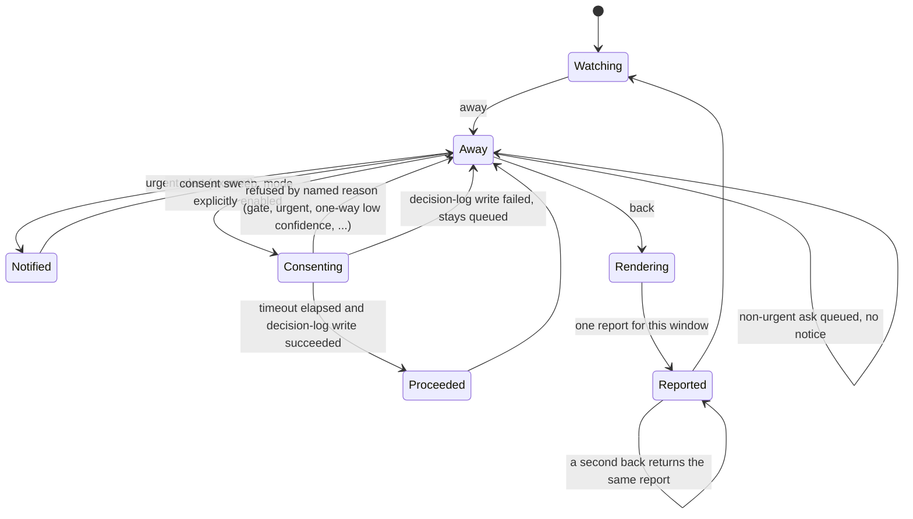

# Bee Herding — presence, the wake report, and how autonomy is earned

**Presence is a mark, not a permission.** The human says *away* when they stop
watching and *back* when they return. That mark has **exactly two effects**
(9f5cd250), and naming them exhaustively is the whole safety argument:

1. It sets the **report window** — the current window opens on *away* and
   closes on *back*, which becomes the last closed window.
2. It stamps non-urgent asks **queued**, so they fire no notification while the
   human is away.

Nothing else moves. Gates do not open. Bypass levels do not change. Permission
posture does not shift. A presence flag that quietly widened what the machine
may do would be permission control hiding in a convenience switch, and that is
the thing this design refuses.

The **urgent class is exempt** from the quiet queue. Danger still wakes you.

## Exactly one report per window

**`back` is the only door that renders a wake report**, and it renders one per
window. A second *back* on the same window returns the report already stored;
it can never add a second one. Two reports for one absence would force the
human to reconcile them, which is the opposite of the job.

The report is bounded on both sides: **four headings**, at most **six content
lines**, a floor of nine lines and a ceiling of ten. The floor exists so the
report cannot degrade into a stub; the ceiling exists so it cannot become
something you skim.

The four sections are: what happened, what was decided, what needs you, and
next action.

Content is ordered by **impact-if-wrong, descending** (66c4c251):

| Rank | Content |
|---|---|
| 4 | urgent alerts |
| 3 | waiting on a gate |
| 2 | escalations |
| 1 | ordinary interventions |

Within a rank, a **one-way door sorts before a reversible one**. When more
content exists than the ceiling allows, the list ends on an explicit **"+N
more"**. Nothing is ever dropped silently — a report that quietly truncated
would be a report you could not trust.

*back* also sends **one** push notification, on the same best-effort channel the
urgent alert uses.

## Health counters are derived, banded, and honest about not knowing

The report carries a metrics line built from **seven derived counters**. Derived
is literal: nothing is accumulated or persisted as a counter. Each figure is
recomputed at report time from stores that already exist — the cell records,
the decision log, the mailbox, and the observation store. A persisted counter
would be a second truth to keep in sync.

Every counter reports three things: a **two-sided band** (both too-low and
too-high are findings), an explicit **sample count**, and one verdict from
`below-band`, `in-band`, `above-band`, or **`not-measurable`**.

`not-measurable` is **first class**. It never renders as `in-band`. A metric
with no data is not a healthy metric, and collapsing the two would let an empty
window read as a good one.

Two counters carry rules worth stating outright:

- **Blocked rate** takes its denominator as the **union** of cells claimed and
  cells blocked in the window. A cell swept into blocked has no claim stamp at
  all, so blocked-over-claimed can exceed one — a "rate" above 100% is a broken
  denominator, not a bad week.
- The **2x-estimate** counter is **skip-until-present** (ea02cb68). Cells carry
  no estimate field and bee adds none for this. The counter computes overrun
  only where an estimate already exists and otherwise reports the literal state
  *no estimate recorded* — never a zero, which would read as "nothing overran".

## Silence-is-consent fails closed

There is one narrow mode where the machine may proceed on silence (c706053e).
Its defaults are the safety:

- It is **off** unless a configuration record explicitly says enabled with a
  timeout of at least one second. Every other reading — missing, malformed,
  partial, ambiguous — is **off**. This is the deliberate opposite of the
  notification channel, which fails **open**: a failed notice may not silence
  the observer, and a failed switch may not grant it consent.
- Eligibility is refused **by named reason**, never by a bare no. The refusal
  names which one applies: a gate, an urgent item, an escalation, an unknown
  kind, a one-way door held at low confidence, an item that was never queued,
  or one already consented. A boolean would leave nobody able to say why the
  machine waited.
- **Gates always wait.** So does a one-way door at low confidence (a8f4b8ab).
  No timeout reaches either.
- Every auto-proceed is written to the decision log first. If that write fails,
  the item **stays queued** — it does not proceed. An unrecorded auto-proceed
  is indistinguishable from a machine acting on its own.
- Each auto-proceed is rendered **prominently** in the wake report. The metrics
  line is the reason the report floor moved from eight lines to nine.

This narrow mode was generalized by slp-human-up's **83baf03f** into a
delegated-decision tier: the supervisor may decide a matter on the
human's behalf only when all four hold — small scope, reversible,
proven observation, inside protocol — one decision per message with a
recorded rollback path; unclear still always escalates.

## Autonomy is earned, and the human still flips the switch

Widening this mode is not automatic and never self-granted. The bar is a clean
run — **zero human-reversed one-way decisions across forty to sixty tasks** —
and even then the change is the human's gesture (66c4c251). The counters make
the case; they never cast the vote.

## Diagram

## Pointers

- Presence, report rendering, counters, and the consent sweep: `packages/bee-rs/crates/bee/src/verbs/supervisor.rs`.
- Verb surface: `bee supervisor away | back | presence | report | metrics | consent-sweep`.
- Stores: `.bee/supervisor/presence` and `.bee/supervisor/reports`, under the control root.
- Counter inputs: `.bee/cells/`, `.bee/decisions.jsonl`, the mailbox, and the observation store.
- Companion page: [The supervisor observer and its interventions](the-supervisor-observer-and-its-interventions.md).
