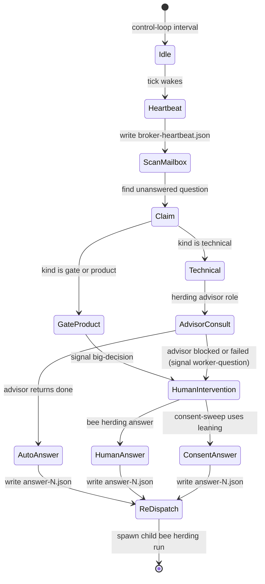

# Bee Herding — the mailbox broker, its tick, and how a worker question is routed

**The broker is code, not an LLM.** It runs as a role on bee's own herding control
loop (mailbox-broker D1, store `62b88465`, touches `322695d6`). It reads worker
questions from disk, routes each question, and starts the next round when an answer
arrives. It decides only routing. It never decides question content.

The broker reuses existing bee infrastructure. It uses the existing job mailbox and
supervisor intervention channels. It creates no second mailbox. Workers remain passive.
The supervisor remains an observer only.

## What is out

Three items are outside the broker boundary:

- **Native Agent workers are out** (mailbox-broker D6, store `969f077a`). A native
  Agent worker is controlled by the agent harness. It cannot be re-dispatched by
  external code. It returns `[BLOCKED]` when it cannot proceed.
- **Leader questions are out** (mailbox-broker D2, store `0c094609`). Only dispatched
  workers post questions through the mailbox. The leader session continues to ask the
  human directly in the main conversation.
- **Live pane injection is out** (mailbox-broker D3, store `caf5f716`). The broker
  never types text into an active worker pane. A worker asks by stopping, and it
  receives the answer in the brief of its next round.

## The question record and outcome

A dispatched worker that needs an answer stops and writes typed outcome `question`
(mailbox-broker D3, store `caf5f716`; worker-question contract, store `f58bfe89`).

The worker records its question in `result-N.json` inside its job mailbox:

- `status`: set to `"question"`.
- `question`: an object containing `text` (a non-empty string) and `kind` (one of
  `"technical"`, `"product"`, or `"gate"`).
- `proof`: optional for status `"question"`. It remains mandatory for `"done"` and
  `"blocked"`.
- `summary`: brief summary text.
- `files_changed`: list of files modified during the round.
- `options` and `leaning`: optional structured choices provided by the worker.

When a job starts, `job.json` records facts required for subsequent re-dispatch:
`agent`, `seat`, `cell_id`, `no_pane`, `inbox_session`, `leader_session`,
`question_of`, and `question_round`.

On the Pi runtime, the verdict tool accepts status `"question"` with the question
object (`tool-verdict.ts`, pi-question-drain contract, store `8e9a5eb0`). The Pi
result drain (`result-inbox.ts`) leaves the pending marker in place while the latest
result is a question. The leader receives the final result when subsequent rounds
finish.

## Atomic claim and routing table

Each broker tick claims at most one unanswered question round by atomic rename of
`claim-N.json` in the job mailbox directory (broker-tick contract, store `91608561`).
The pair of job ID and round forms the deduplication key. A second tick never routes
the same round twice.

The broker routes each claimed question according to its kind and advisor availability
(mailbox-broker D4, store `b9a3e488`; mailbox-broker D5, store `c88d31bb`, touches
`c706053e`, `9f5cd250`; mailbox-broker D6, store `969f077a`):

| `kind` | Advisor state | Routed to | Signal | Action |
|---|---|---|---|---|
| `gate` or `product` | Not called | Human | `big-decision` | Supervisor intervention to `leader_session` (never consent-swept). |
| `technical` | Herding advisor returns `done` | Worker | None | Write `answer-N.json` from advisor summary and report; spawn child job. |
| `technical` | Advisor blocked, failed, timed out, native, or unconfigured | Human | `worker-question` | Supervisor intervention to `leader_session`. |

When a question routes to the human while the human is away, the intervention is
queued in the presence queue and presented in the wake report (mailbox-broker D5).

Under opt-in consent-sweep rules, an intervention with signal `worker-question` can
proceed if consented. It writes `answer-N.json` using the worker's recorded `leaning`
and starts the next round. If the worker provided no leaning, it remains waiting.

## The human answer verb

The human answers an intervention with the CLI verb (broker-tick contract, store
`91608561`):

```bash
bee herding answer --job <job-id> --text <answer-text>
```

The command checks that the target job exists and that its latest result has status
`"question"`. It writes `answer-N.json` atomically in the job mailbox. It then
immediately starts the child job for the next round.

## Child job re-dispatch and round limits

An answered question starts a new child job via `bee herding run`. The child job
inherits execution facts from the parent `job.json`:

- `agent`, `cwd`, `seat`, `cell_id`, `no_pane`, and `inbox_session`.
- `--question-of <root-job-id>` links the child to the original root job.
- `--question-round <n>` sets the question iteration counter.
- The child job ID is formatted as `<root-job-id>-q<round>`.

The child brief carries four context elements:
1. The original task description.
2. The question text.
3. The answer text.
4. The list of files changed in the previous round.

The configuration key `broker.max_question_rounds` in `.bee/config.json` sets the
question limit (default is 2). When the next question round exceeds this limit,
the child job is spawned with `--no-question`. The brief then omits the question
option, forcing the worker to complete or return blocked.

When a re-dispatched job without an `inbox_session` reaches a terminal status (`done`
or `blocked`), the broker sends a `broker-notice` intervention to `leader_session`.
The notice informs the leader that the child run finished.

## Heartbeat and starting the broker

Every broker tick writes `.bee/supervisor/broker-heartbeat.json` containing the
current UTC timestamp (broker-tick contract, store `91608561`).

`bee herding run` reads this heartbeat file. If the timestamp is fresh within
90 seconds, the run envelope reports `"broker_running": true`. The envelope also
includes a `"next"` field: `"the broker owns the job and the final result arrives as a new job"`.

The broker runs as a control-loop role (broker-role contract, store `d3031edb`):

```bash
bee herding control-loop --role broker
```

`Role::Broker` is a code-only role. Its iteration command is `bee herding broker tick --json`.
It reads no prompt file, requires no LLM model, and executes no external command template.
Its default polling interval is 30 seconds.

## Diagram



## Pointers

- Broker tick, routing table, answer verb, and re-dispatch: `packages/bee-rs/crates/bee/src/herding/broker.rs`.
- Run verb, question outcome, and envelope reporting: `packages/bee-rs/crates/bee/src/herding/run.rs`.
- Mailbox result parsing and `MailboxStatus::Question`: `packages/bee-rs/crates/bee/src/herding/mailbox.rs`.
- Control-loop broker role and iteration argv: `packages/bee-rs/crates/bee/src/herding/control_loop.rs`.
- Pi verdict tool question status: `.pi/extensions/bee-guard/tool-verdict.ts`.
- Pi result drain question skip: `.pi/extensions/bee-guard/result-inbox.ts`.
