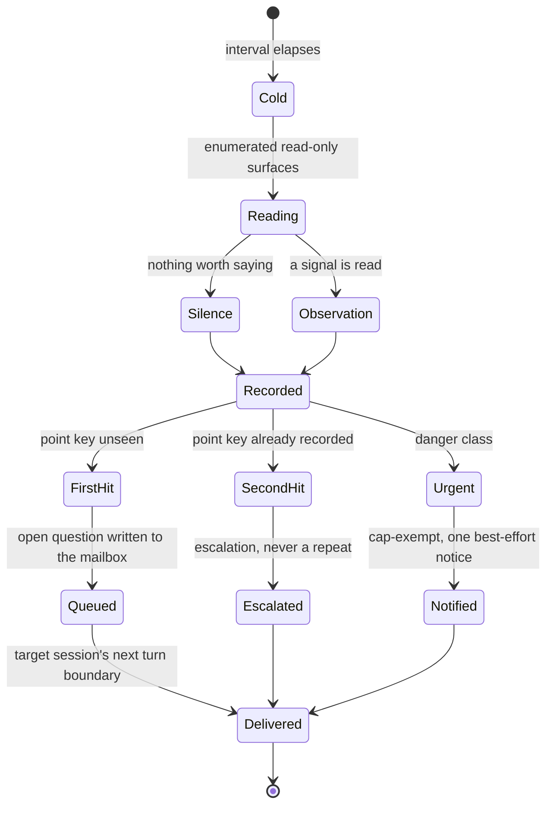

# Bee Herding — the supervisor observer, its tick, and how an intervention reaches a session

**The supervisor watches; it never acts.** It is a role of the same control loop
that carries dispatch and merge, and it is the only one of the three that may
not change the work. It writes no product code, dispatches no cell, merges
nothing, and approves nothing. Every locked rule the cockpit already holds —
the human merge, the owner interlock, the permission split, the gates — stands
untouched beside it (787a9eb0). The observer is added weight on the reading
side of the scale only.

The word *supervisor* here means **observer**, not router. A supervisor asks
open questions and writes reports. Anything that hands out work is a different
role, and that second meaning is rejected in this area (CONTEXT Terms).

**This is the per-repo supervisor.** slp-human-up (2f4bf3b1) added a second,
cross-project supervisor at the waggledance layer; **b590e508** settled that
the two coexist rather than one replacing the other — "a near eye inside each
repo and a far eye across the fleet, both cold ticks, neither replacing the
other." Everything below describes the near eye only.

## One tick, one record

A supervisor tick wakes **cold** — no memory of the previous tick — on the
loop's interval, the default being fifteen minutes (322695d6). Coldness is the
point: an observer that accumulated context would drift into an opinion about
the work rather than a reading of it.

Its tool surface is **enumerated read and query only**. That enumeration is the
boundary, not the prompt: giving the supervisor role a write tool in
configuration changes nothing, because the allowed set is built from the
enumeration regardless of what config asks for.

What it reads are the surfaces bee already keeps (da7cb49b): pane transcripts
and the screen classifier, activity records, waiting-on marks, the session
registry's liveness, the wave ledger and occupancy, cells with their budgets,
and decisions with their triggers. No new poller was built for this. The
day-one signals it looks for are a **struggling loop**, a **big decision**, and
a **danger operation**; two more join them where the inputs exist — work
running past twice its recorded estimate, measured by the harness and never
self-reported, and two consecutive submissions that differ only inside the same
region (a8f4b8ab).

A tick writes **exactly one** record. Reviewing everything and choosing to say
nothing is a legal, logged outcome — a *silence* record, not an absence of one.
An observer whose quiet ticks left no trace could not be told from an observer
that never ran.

## Four stores, one root

The supervisor keeps four append-only, event-sourced stores: **observations**,
**interventions**, **presence**, and **reports**.

Every one of them resolves against the **control root**, never the current
directory. A session working inside a linked worktree writes into the same
store as the main checkout. One supervisor watching a cockpit of parallel
worktrees would otherwise fragment into one blind observer per worktree.

## An intervention is a record, not an interruption

When a tick decides to speak, it writes an **intervention**: one open question
of at most two sentences, addressed to one target session. The question asserts
no fault, suggests no answer, and points in no direction.

The record is the mechanism. It is **never** injected into a running turn.
The target session picks it up at its **next turn boundary**, where the prompt
hook appends any pending questions and stamps them delivered (c80debd7). A
persistent record is the only thing that survives between two cold ticks, and a
turn boundary is the only moment a session can be handed something without
being interrupted mid-thought.

**The same point is never made twice.** Each intervention carries a *point key*
and a frequency cap over it. The first record on a point is the question. A
second hit on that same point does not repeat the question — it **escalates**.
There is no third state where the observer nags.

Ordinary interventions reach the human only through reports. They do not
notify.

## The advisor-nudge record

A second record kind, `advisor-nudge`, fires when a poor-work signal
(struggling-loop, budget overrun, same-region resubmits) supports it
(3cfd9980). It **recommends only** — the supervisor still decides nothing and
acts on nothing (787a9eb0 holds): it never summons the advisor itself. The
struggling session's own lead reads the nudge at its next turn boundary and
either runs the consult or records a reasoned decline, using an existing lead
power that is read-only and reversible.

The nudge is a **response debt**, enforced the same way as the judge-debt and
dissent-debt doors: an unanswered nudge targeting a cell refuses that cell's
cap, and refuses a close attempt, with the remedy printed (9e5eda5b). Silence
on the same point twice escalates into the human's report rather than
repeating. The consent sweep never auto-proceeds an unanswered nudge — an
unknown intervention kind falls through to no action, the safe direction.

## The urgent class

One class breaks that quiet: a **danger-class** alert. It is exempt from the
frequency cap and it notifies **immediately**, once, on a best-effort channel.
Best-effort is exact — the notification **fails open**. If the channel is
missing or broken the alert is still recorded and the flow continues; a
supervisor that could be silenced by a dead notifier would be worse than none.
The notification itself can also be switched off by configuration, and turning
it off suppresses the notification, never the record.

## What it may not do

- It never writes product code, dispatches a cell, merges, or approves.
- It never injects into a live turn.
- It never repeats a point it has already made.
- It never turns a quiet tick into no record at all.

## Diagram



## External trigger (cross-repo callers)

**This is the per-repo store's own supervisor; `.bee/supervisor/` still anchors
at the control root, never cross-repo (see "Four stores, one root" above).**
A cross-repo caller — waggledance's own fleet-wide supervisor is the
motivating case — never reads or writes that store directly. What it CAN do
is trigger one cold tick of this repo's own observer from outside, and that
trigger already exists: it needs no new verb.

**The primitive:**

```
bee herding control-loop --role supervisor --once --main-root <path-to-repo>
```

Run from anywhere — the caller's own process, not a pane inside the target
repo — this spawns exactly one tick against the named repo's own store, the
same way any other cross-repo write in this ecosystem works: by spawning the
target repo's own bee CLI at its root, never by reaching into its `.bee/`
directly (the pattern `docs/discovery/slp-human-up/tickets/004-waggledance-supervisor-feasibility.md`
already established for `bee decisions log` / `bee backlog pbi add`).

- **No pane required.** `--role supervisor` needs neither `tmux` nor
  `herdr`: the loop's own spawn path (`run_iteration_with_ceiling`) calls
  `Command::new(argv[0]).spawn()` directly — a plain subprocess, exactly
  `claude -p "<prompt>" --model <supervisor-model> --max-turns N
  --allowedTools <SUPERVISOR_ALLOWED_TOOLS>`.
- **Exit code contract.** `0` on a completed OR gracefully-timed-out tick
  (`--once` is `LoopOutcome::NormalStop`); `1` only if the spawn itself
  fails (the `claude` binary is missing, or the process cannot start/wait).
  A supervisor tick never fails the caller's script by finding something
  worth flagging — that outcome is a normal `0` exit with an observation
  record on disk, not a nonzero exit.
- **Safe to call repeatedly, even concurrently with a repo's own interval
  loop.** Every store this tick touches is append-only, and the point-key
  frequency cap (see "The same point is never made twice" above) absorbs a
  duplicate tick as redundant model spend, never as a correctness bug or a
  duplicate delivery. No lock file guards concurrent invocation, and none
  was added — there is no real failure mode to guard against.
- **No verb surface change.** This is the existing `--once`/`--main-root`
  shape (322695d6); `bee supervisor`'s 10 verbs are untouched, so a caller
  already built against that surface (waggledance's own PBI
  `sup-20260831-b2e1`) needs no changes on this side either.

## Pointers

- Role arm and the enumerated tool surface: `packages/bee-rs/crates/bee/src/herding/control_loop.rs` (`Role`, `allowed_tools_for`).
- Stores, records, and every verb: `packages/bee-rs/crates/bee/src/verbs/supervisor.rs`.
- Verb surface: `bee supervisor record | list | pending | mark-delivered`, driven by `bee herding control-loop --role supervisor --interval 900`.
- External trigger: `bee herding control-loop --role supervisor --once --main-root <path>` (see "External trigger (cross-repo callers)" above).
- Store root: `.bee/supervisor/` under the control root.
- Observer prompt: `skills/bee-herding/references/supervisor-prompt.md`.
- Delivery point: the `UserPromptSubmit` hook.
- Companion page: [Presence, wake reports, and earned autonomy](presence-wake-reports-and-earned-autonomy.md).
