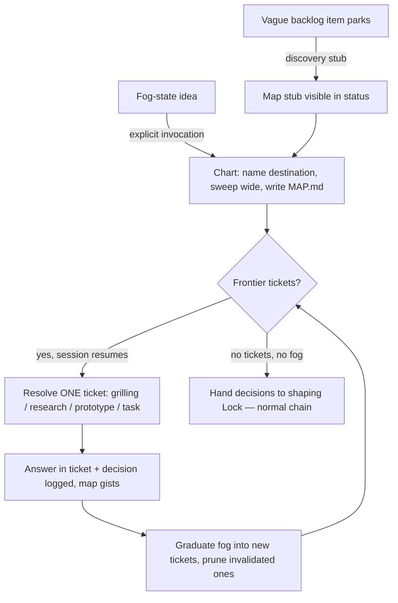

# Discovery Wayfinding (charting fog-state ideas before shaping)

Before this area existed, a request whose outcome the user could not yet
name had no home: shaping assumes a nameable ask, so fog either got a
premature interview or sank silently. This area gives fog a durable,
visible place — a discovery map — and a loop that resolves one decision
at a time until shaping can take over.

## The store

An effort lives at `docs/discovery/<effort>/` as plain markdown — no
runtime state store. `MAP.md` is an index with five sections:
Destination, Notes, Decisions so far, Not yet specified (the fog), Out
of scope. The map only gists and links; a decision's single source is
the decision log. Tickets live one file each under `tickets/` with
frontmatter keys `type`, `status`, `claimed-by`, `blocked-by` and a
body of `## Question` then `## Answer` on close.

## Ticket lifecycle and the frontier

A ticket is one of four types: grilling (conversation with the human,
the default), research (agent-alone), prototype (a cheap mock the human
reacts to), task (manual work that unblocks a decision). A ticket is
**frontier** when its status is open, no one claims it, and every
ticket named in `blocked-by` is closed — an unknown `blocked-by` id
fails closed (not frontier). Claim and block lines are convention-only:
no CLI guard enforces them. One with-user ticket resolves per session;
research tickets fan out. The destination is named before any ticket
exists; it fixes scope.

## The stub — fog never sinks

`bee discovery stub --effort <slug> --from <text>` creates a minimal
map: Destination reads "(unknown — charting session needed)", the
`--from` text lands under Notes, the remaining sections are empty. It
refuses, writing nothing, when the effort directory already exists.
Shaping's headless triage calls it when an item parks for vagueness
(not for risk), so a parked fog becomes a visible map instead of a
buried note.

## Surfacing — resume is un-missable

`bee discovery list` reports each effort's name, destination line, and
open/frontier counts; an unreadable map yields a visible
"unreadable <path> — remedy: fix or delete" line, never a crash. The
same scan feeds three surfaces: the status JSON (`open_maps` field) and
its text section, the session preamble (rendered in-process by the
session hook, not via the status command), and orient. When no
discovery directory exists, no section appears anywhere.

Orient's rule is deterministic: when at least one map has frontier
tickets AND the pipeline is idle (no open or claimed cells, no pending
handoff, terminal phase), the recommended next step becomes the
wayfinding skill with the map named; while work is active the map
degrades to a report-only blocker line and the recommendation is left
alone. A pending handoff always wins over the wayfinding override.

## Resolution craft

How a ticket is worked has its own rules (wayfinding-craft wayfc-1,
2026-08-17): the interview craft mirrors shaping's — one question per
turn, options carried with trade-offs, the user's words quoted back
before a decision is drawn. A pure fact question never burns an
interview turn: it dispatches as a fact lookup and the answer returns
to the ticket, keeping the human conversation for judgment calls only.
Spike-type tickets carry their own rules — time-boxed, one yes/no
proof, thrown away after the answer is recorded — and the craft text
cross-points to shaping's gray-area probes so the two interview layers
stay one discipline.

## Hand-off to shaping

Wayfinding decides; it never builds. Each resolved ticket's answer is
recorded in the ticket file and logged as a decision; the map links the
decision id. When no tickets and no fog remain, each buildable feature
falls out of the map into shaping's Lock, which consumes the map's
settled decisions into the feature's context record, citing them —
never re-asking. Shaping's own entry gained the mirror rule: a request
with no nameable outcome routes to wayfinding before any interview.
Wayfinding adds no gate of its own; the human checkpoints are the
destination-naming conversation and shaping's existing Gate 1.

## Flow

## Open Gaps

- No staleness nudge for an idle map yet (deferred: triggers-based
  reminder).
- Orient recommends only on resume; brand-new fog still enters via
  explicit invocation or shaping's entry check.
- Ticket claim/block conventions are unguarded; a malformed ticket file
  simply drops out of the frontier count.

## Pointers

- `packages/bee-rs/crates/bee/src/verbs/discovery.rs` — scan, frontier
  derivation, stub creation, list/stub verbs.
- `packages/bee-rs/crates/bee/src/verbs/status_full/{build,render}.rs`,
  `packages/bee-rs/crates/bee/src/hooks/session_preamble/budget.rs` —
  the three surfacing sites.
- `packages/bee-rs/crates/bee/src/verbs/status_full/orient.rs` —
  `pipeline_idle_for_wayfinding`, `first_frontier_effort`.
- `skills/bee-wayfinding/SKILL.md` ("Interview craft"),
  `skills/bee-wayfinding/references/wayfinding-reference.md`
  ("Interview craft", "Spike rules") — the resolution-craft text;
  cross-points to `skills/bee-shaping/references/gray-area-probes.md`.
- `skills/bee-wayfinding/` — the flow's skill; templates in
  `references/wayfinding-reference.md`.
- `skills/bee-shaping/SKILL.md` — entry check, park-to-stub, Lock
  consumption.
