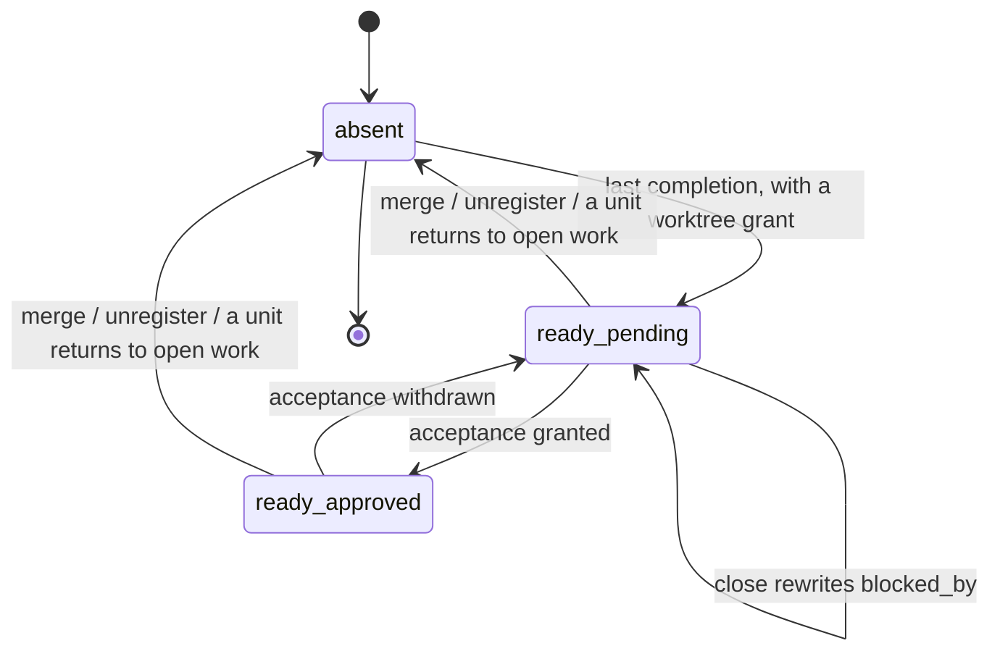

# Workflow State — merge-readiness, the stored fact that a feature is waiting for its merge

A board that shows "Ready to merge" is asking a question bee could always
answer and never wrote down. To answer it a reader had to join three separate
stores: every unit of work of the feature, the worktree grants, and the
feature's own gates. That join is expensive for a dashboard and impossible for
a plain file reader — so the answer is now stored at the one moment it becomes
true, and removed at every moment it stops being true.

Nothing here is a new authority. Merge-readiness is a statement *about* the
work, written by the verbs that already change the work. It grants nothing,
blocks nothing, and no door in bee asks it for permission.

## Entry Points & Triggers

- **The completion of a unit of work** is the only trigger that can set the
  fact. It fires after the unit's claim is released, so the completing unit
  itself already counts as complete.
- **A feature close** rewrites the blocking-doors list, on the real run and on
  the rehearsal alike — both report the same truth.
- **The uat gate** flips the acceptance field when it is approved, and flips it
  back when the approval is withdrawn.
- **A worktree merge and a worktree unregister** each remove the fact.
- **Any return of a unit to open work** — reopening it, giving up its claim, or
  a judge verdict that sends it back for rework — removes the fact.
- **Readers** trigger on their own and never write: the status projection
  carries the object verbatim on the feature's row.

Every one of these writes is fail-open. It runs beside the verb's own work and
may never change that verb's result, its output, or its exit code.

## Data Dictionary

| Element | Meaning |
|---|---|
| merge-readiness | The claim that a feature has nothing left to do inside its own checkout: every unit of work is complete, a worktree is open for it, and the only remaining step is the human's decision to merge. |
| the merge-readiness fact | The optional `merge_ready` object holding that claim. One per feature, written in place, absent when the claim is not true. |
| the feature's record | Where the fact lives: the feature's own pipeline record when the feature has one, and the default record when the feature is unlaned and the default record names it. A feature with neither is simply never stamped. |
| last completion | The completion that leaves no unit of the feature open, claimed, or blocked, with at least one complete. It is the single moment merge-readiness becomes true. |
| worktree grant | The recorded, granted worktree for this feature. Without one there is nothing to merge from, so there is no readiness to claim. |
| blocking door | A close requirement the feature has not met yet — named on the fact so a reader can say *why* a ready-looking feature is not actually mergeable. |

The fields of the fact:

| Field | Meaning |
|---|---|
| `since` | The instant the feature became ready — the time of the last completion. It answers "how long has this been sitting waiting for me". It is never refreshed by a correction; only a fresh readiness after a reopen restarts it. |
| `branch` | The branch the merge would take. It is the worktree's own current branch when that can be read, and the feature's conventional worktree branch name otherwise. |
| `worktree_id` | The identity of the granted worktree — the checkout a person opens to look at the work before merging it. |
| `uat` | Human acceptance, in two values: `pending` (nobody has accepted the work yet) and `approved` (the acceptance gate is granted). It mirrors the gate; it never replaces it. |
| `blocked_by` | The names of the close doors still blocking, other than acceptance, in the order the close reports them. Empty means a clean close. Acceptance is deliberately left out because the `uat` field already carries it. |

## Behaviors & Operations

**B1 — One moment sets the fact.** A completion checks three things about the
feature it belongs to: no unit is open, claimed, or blocked; at least one unit
is complete; and a worktree grant exists. All three true, and the completion
writes the fact with `since` set to its own time, `branch` and `worktree_id`
from the grant, `uat` mirroring the acceptance gate as it stands right then,
and `blocked_by` empty. Any one of the three false, and nothing is written
(decision cfccdde4).

A feature with zero units of work never becomes ready this way. There is no
last completion, so the trigger never fires — a docs-only feature that never
authored a unit simply has no fact, and that is the intended answer, not a
gap.

When the fact already exists, a subsequent completion refreshes only the branch and
the worktree identity. The waiting clock, the acceptance value, and the
blocking list are left exactly as they were: the feature did not become ready
again, it was already ready.

**B2 — A close rewrites the blocking list.** Every close of the feature —
rehearsal or real — writes `blocked_by` with the name of each door still
blocking, acceptance excluded, in the close's own order. A clean close writes
an empty list. The write happens as soon as the doors are known, before the
close decides whether to refuse, so a *blocked* close still records why it was
blocked. That is the whole value of the field: a reader learns "ready except
for these two things" without running anything (decision e069ef73).
The write sits on every exit of the close, never only on the success path: a
close can stop at several different doors, and a refusal arm that skipped the
write would leave the previous answer standing — a green-looking list for a
close that never happened (merge-ready-fact cell mrf-2, pattern
`pattern-20260823-a-best-effort-write-sits-on-every-exit-outside-the-locks`).

**B3 — The acceptance gate flips one field.** Granting the acceptance gate
sets `uat` to `approved`; withdrawing it sets `uat` back to `pending`. The
gate remains the authority — the field is its shadow, kept in step so a reader
does not have to open the gate record too.

**B4 — Merging or retiring the worktree removes the fact.** A merge means the
work is no longer waiting to be merged. An unregister means the checkout the
fact points at is gone. Either way the object is deleted rather than left
behind to describe a state that ended.

**B5 — Any return to open work removes the fact.** Reopening a unit, giving up
its claim, or a judge verdict that sends a completed unit back for rework each
delete the fact immediately, because each one makes "every unit is complete"
false. Nothing repairs it in place. When the feature finishes again, the new
last completion sets a whole new fact with a fresh `since` — the waiting clock
starts from the moment the feature actually became ready again, not from the
first time it once was.

## Lifecycle

## Business Rules

- **R1 — The fact is set at exactly one moment and by exactly one condition.**
  Zero open, claimed, or blocked units; at least one complete; a worktree
  grant present. No other event may create it, and no partial match may
  (decision cfccdde4).
- **R2 — Every writer that can falsify the fact also owns correcting it.**
  There is no sweeper, no staleness window, and no time-to-live. A fact that
  survives is a fact whose inputs did not change (decision e069ef73).
- **R3 — bee never reads its own fact.** The acceptance gate keeps its own
  checks; the merge door keeps its own preconditions. The fact is additive:
  removing it would change no decision bee makes. A stored projection that
  fed back into bee's own doors would become a second source of truth that can
  disagree with the first (decision f2c16247).
- **R4 — Readers get it verbatim.** The status projection carries the object
  exactly as stored on the feature's row, and adds nothing to it. There is no
  second, derived spelling of merge-readiness for a reader to prefer
  (decision f2c16247).
- **R5 — Writing the fact never affects the verb that wrote it.** Every write
  is best-effort. A record that cannot be resolved, read, or written leaves
  the fact untouched and the verb's own result, output, and exit code exactly
  as they would have been.
- **R6 — `since` measures waiting, not activity.** It is stamped once per
  readiness and refreshed only by a *new* readiness after the feature stopped
  being ready. A correction to the blocking list or the acceptance value never
  restarts the clock.
- **R7 — Acceptance is carried in one place only.** `uat` holds it;
  `blocked_by` excludes it. A reader that wants "is this actually mergeable"
  reads both fields, and never sees acceptance counted twice.

## Where readers find it

- On the feature's own pipeline record, under `merge_ready`.
- On the default record, for a feature that has no pipeline record of its own
  and is the default record's own feature.
- On the feature's row in the machine-readable status output, copied verbatim.

A reader that finds no `merge_ready` key learns exactly one thing: this
feature is not waiting for a merge right now. It learns nothing about why, and
should not infer it.

## Edge Cases Settled

- **A unit is completed while a sibling is still open.** Nothing is written.
  Readiness is a statement about the whole feature, so one finished unit out
  of five says nothing.
- **A unit is completed and no worktree is granted.** Nothing is written.
  There is no checkout to merge from, so there is no readiness to record.
- **The feature has zero units of work.** It never becomes ready. The trigger
  is a completion, and no completion ever happens.
- **The record is missing or damaged.** The write is skipped in silence and
  the verb that was running finishes exactly as it would have. Corrupting a
  completion, a close, or a merge to keep a convenience field honest is the
  worse failure.
- **A close is refused.** The blocking list is still written first, so a
  reader sees the refusal's reasons without running the close.
- **A rehearsal close.** It writes the same list as a real close, because it
  computes the same doors. The list is a description, not an action.
- **Acceptance was granted before the feature finished.** The completion that
  sets the fact reads the gate as it stands and writes `approved` straight
  away — it never forces a pass through `pending`.
- **A feature becomes ready, is reopened, and becomes ready again.** The
  second fact is a new one: fresh `since`, empty blocking list, acceptance
  read fresh. The first fact left no trace.

## Open Gaps

- Nothing detects a fact whose worktree quietly disappeared outside the
  registered path. The unregister verb removes the fact; a checkout deleted by
  hand leaves it pointing at a directory that is gone (merge-ready-fact,
  2026-08-22).
- The fact is written by the verbs of one checkout at a time. Two features
  finishing at the same instant contend only on their own records, so nothing
  is lost — but no test yet pins that behavior across simultaneous features.
- No reader outside bee is contracted to the shape. The board that asked for
  the fact reads it as a file, so a future field rename is a compatibility
  question that has no owner recorded yet.

## Pointers (implementation)

- Helper — every write goes through one module:
  `packages/bee-rs/crates/bee/src/verbs/workflow_store/merge_ready.rs`, with
  `set_after_cap`, `clear`, `set_uat`, and `set_blocked_by`. All four resolve
  the target record through the shared mutation seam in
  `verbs/state_group/ledger.rs` (`resolve_mutation_target`,
  `write_through_projection`) so projections rebuild, and all four are
  fail-open by construction.
- The five calling verbs:
  - `bee cells cap` / `bee cells finish` — `cap_cell_from_flags` in
    `verbs/cells/handlers_close.rs`, in the slot after the claim release
    (B1, decision cfccdde4).
  - `bee cells reopen` / `bee cells unclaim` / `bee cells judge-record`
    (NEEDS_REVISION) — `run_reopen` and `unclaim_cell` in
    `verbs/cells/handlers_close.rs`, plus the rework path in
    `verbs/cells/handlers_meta.rs` (B5).
  - `bee close` — the doors vector in `verbs/drivers/close.rs`, written before
    any refusal arm returns (B2).
  - `bee gate --name uat` — `run_gate_body` in
    `verbs/state_group/set_gate.rs`, after the gate write (B3).
  - `bee worktree merge` / `bee worktree unregister` —
    `close_the_lane_on_merge` in `verbs/worktree/phases.rs` and
    `run_unregister` in `verbs/worktree/registry.rs` (B4).
- Reader — `build_lane_rows` in `verbs/status_full/topology.rs` copies the
  object onto each lane row (R4). The worktree lookup the setter uses is
  `find_granted_worktree_for_feature` in the same module.
- Cells: `.bee/cells/mrf-1.json` (helper plus the completion and reopen
  paths), `.bee/cells/mrf-2.json` (close, gate, merge, unregister, status).
