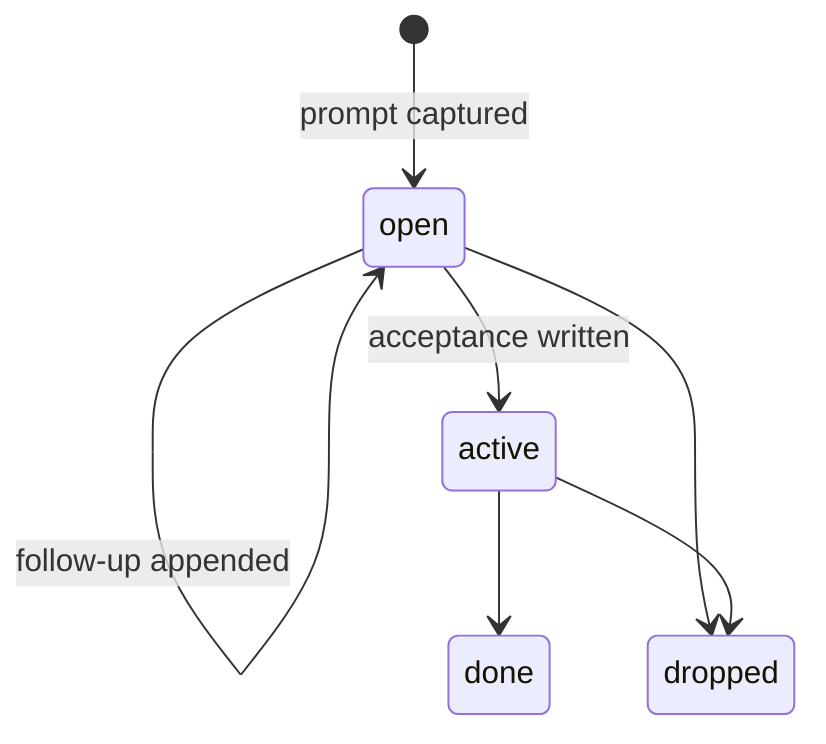

# Workflow State — the prompt work record and its acceptance

The session record already says what an agent is *doing* (the activity
record). This concept owns the sibling object that says what the human
*asked for*: the work record — the user's own prompt, kept verbatim, so a
board or a sibling session can show the ask in the human's words instead
of the agent's paraphrase.

## Behaviors & Operations

**B1 — The prompt is captured verbatim, titled by its first line.** The
session record carries a `work` object beside `activity`. It holds the
user's prompt as typed, with the first line as the title. A follow-up
prompt while the record stays open is appended to the same record, never
a second record. Before storage the text is path-scrubbed and
secret-redacted.

**B2 — Only the secret half of the scanners reads a prompt.** Of the two
scanner families that watch recorded text, only the secret patterns run
over a prompt. The injection patterns describe ordinary English a user
types every day; running them over prompts would flag normal asks.
A secret in the *user's* prompt is redacted — bee must store whatever
the user typed. A secret in the *agent's own acceptance sentence* is a
refusal — the agent writing a credential into a record is a bug to
report, not a value to scrub.

**B3 — The agent's half is a show/set verb.** `bee work show` reads the
open record; `bee work set` writes the agent's side, including the
acceptance. An acceptance IS the promotion to a card — there is no
separate promote verb. The status vocabulary is a closed set of four,
chosen to match the board columns that already exist rather than
inventing a new column:

**B4 — The herded-mailbox sink is read-modify-write.** For a pane whose
activity lands in a herded job's mailbox record, the writer must read
the record, modify it, and write it back: the activity map is rebuilt on
every event, and a blind rebuild would erase the work object riding the
same record.

## Business Rules

- R1 — The stored prompt is the user's words. Scrubbing removes paths
  and secrets; nothing else is rewritten, summarized, or corrected.
- R2 — Redaction on the prompt, refusal on the acceptance (the two D5
  landings in B2). Same scanner, opposite remedy, because the author
  differs.

## Open Gaps

- The command registry has no generator any more: the registry contract
  test still names a generator script that is not in the tree, so a new
  command's registry entry is declared by hand off the real argument
  parsing. (Observed while declaring the work verb.)
- The board rendering of a promoted card is a later slice; the skill
  line telling an agent WHEN to upgrade a stub belongs with that slice.

## Pointers (implementation)

- `packages/bee-rs/crates/bee/src/hooks/activity.rs` — the hook that
  writes the work object beside the activity record.
- `packages/bee-rs/crates/bee/src/verbs/work.rs` — `bee work show|set`.
- `packages/bee-rs/crates/bee/src/generated/registry_payload.json` —
  the hand-declared registry entry.
