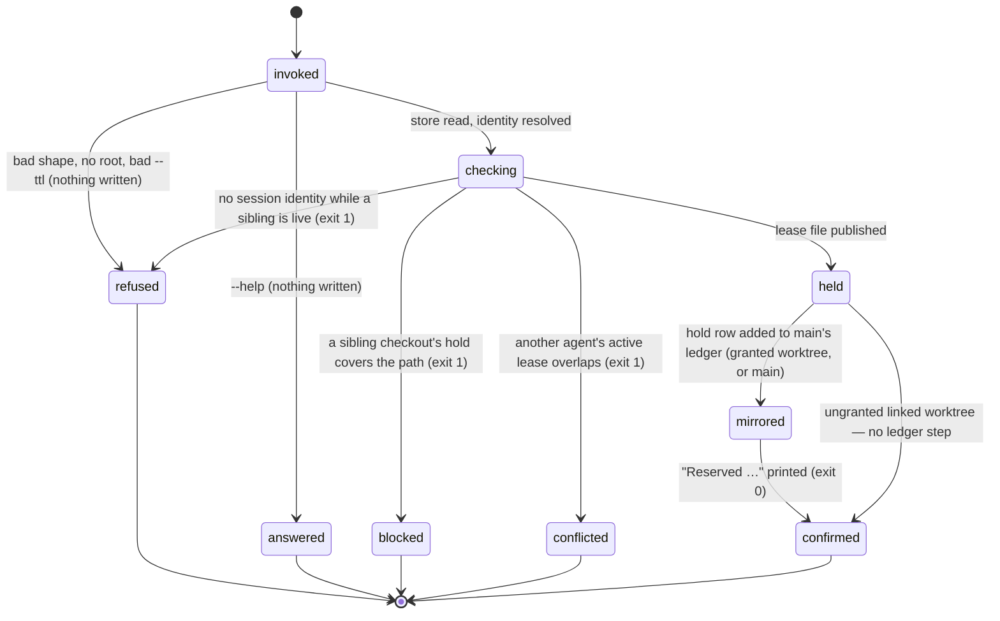

# Reservations and holds

## Summary

A reservation is one agent's claim on one path. Before a worker writes into a file during a swarm, it reserves that path with `bee reservations reserve`; from then until the reservation is released, swept, or expires, another agent's write into the same path is denied by the write guard and another agent's reserve of the same path is refused with the holder named. Four verbs make the whole surface — `reserve`, `release`, `list`, `sweep` — and two kinds split the meaning: a `lease` (the default) is a worker's write-time claim and is a hard conflict; an `intent` is a planning-time declaration of scope that only warns, unless the write lands on exactly the declared path. The truth on disk is one small JSON file per reserved path under `.bee/runtime/leases/paths/`; `.bee/reservations.json` is a display projection and nothing more. A reservation made from a granted worktree is also mirrored as a *hold* in the main checkout's shared ledger, so a sibling checkout sees it. The etiquette on top of the mechanism is short: reserve before write-heavy swarm work, and treat a conflict as stop-and-report — never write through it.

## The simple case

A dispatched worker is about to edit two files for its cell. It reserves each one under its own nickname:

```
bee reservations reserve --agent mel --cell auth-3 --path src/auth/token.rs
```

bee answers `Reserved "src/auth/token.rs" for mel (cell auth-3, ttl 3600s).` and exits 0. A lease file now exists, stamped with the agent, the cell, the acting session, the acquisition time, and an expiry one hour out. The worker writes, proves, and caps the cell — and the cap releases everything it holds for that cell without being asked.

If a sibling worker already holds that path, the same command answers instead:

```
Reservation CONFLICT — return [BLOCKED] to the orchestrator:
- ana holds "src/auth/token.rs" (cell auth-2)
```

exit 1, nothing written. The worker reports `[BLOCKED]`; the orchestrator re-triages. That is the whole protocol — the conflict text names the response it expects.

In practice the first reserve is often already done: `bee cells claim`, `bee cells claim-next`, and `bee dispatch prepare --claim` reserve the claimed cell's declared `files` through this same door, under the same `(agent, cell)` key the cap releases by. Reserving by hand is for paths the cell did not declare.

## The interaction, event by event

One `bee reservations reserve` invocation:



### Invoke

`--agent`, `--cell`, and `--path` are required; `--ttl`, `--session`, `--kind`, and `--json` are optional, and any other flag refuses. The store root is resolved worktree-natively: these four verbs are among the few that carry the granted-worktree split themselves, so they know three roots at once — the *work root* the command was typed in, the *control root* where the lease files live, and the *main root* where the shared holds ledger lives ([worktrees](../foundations/worktrees.md)). `--ttl` is validated first, before anything is read: a value that is not a finite positive number fails with `--ttl must be a positive integer (seconds).` and exit 1.

Then identity. The reservation identity is `--agent`, a free string — by convention the worker's nickname, the same name that goes in `BEE_AGENT_NAME` on the worker's write-heavy shell commands. The *session* identity is separate and is resolved in order: `--session`, then `BEE_SESSION_ID`, then `CLAUDE_CODE_SESSION_ID`, then adoption of the single live session if there is exactly one. A reservation that ends up with a session is visible to the write guard's cross-session hold check; one without is intra-swarm only.

### Ends at once

- `--help` prints the registry entry — description, every flag with its type — and exits 0.
- An unknown verb refuses by name and lists the four: `bee reservations` takes: reserve, release, list, sweep.
- An unknown flag, a missing required flag, or a boolean given a non-boolean value refuses with the shape wording and no timing line. Inside a hooked session the CLI-shape guard usually gets there first, denying the Bash call before the binary runs, with the missing field named.
- A bad `--ttl`, as above.

None of these read or write the store.

### First side effect

The lease file. Its name is `sha256("path:" + <canonical path>)` under `<control root>/.bee/runtime/leases/paths/`, and it is published exclusively: the complete record is written to a temp file beside the target and then hard-linked into place, so the name never exists without its contents and exactly one racer wins.

Before that write, three checks run, in order, and each can end the invocation with exit 1 and nothing written:

1. **Foreign hold.** If the invocation has a hold topology (an ordinary checkout, or a granted worktree), the main checkout's ledger is read and any active hold on an overlapping path whose holder is not this cell's owner refuses: `bee cross-worktree hold: "<path>" is held by checkout "<id>" (feature <f>, cell <c>), expires <when>. Wait for the hold to expire or coordinate with that checkout — a cross-worktree hold is a hard block.`
2. **Session required.** If no session identity could be resolved and another live session exists, the reserve refuses with code `SESSION_REQUIRED` rather than writing an anonymous lease.
3. **Overlap.** Active leases held by a *different* agent whose path overlaps, filtered to hard conflicts, produce the `Reservation CONFLICT` answer above.

> Technical note: paths compare after normalizing — backslashes to `/`, one leading `./` stripped, trailing slashes stripped. Two paths overlap when they are equal, when one is a directory prefix of the other, or when either is a `dir/*` glob covering the other. A bare `*` overlaps everything.

Losing the exclusive publish is treated the same as a pre-checked conflict, with one exception: if the file that won is itself already expired, it is removed and the publish is retried exactly once. A lease whose contents cannot be parsed is reported, never deleted.

### While running

With a topology, the foreign-hold check, the lease publish, and the ledger mirror are one section under the main checkout's `cross-worktree-holds` lock, so two checkouts cannot interleave. Inside an *ungranted* linked worktree the whole cross-worktree section is skipped — that worktree's store root already *is* main's, so mirroring would duplicate what the store already carries — and no lock is taken at all.

The mirrored hold row carries the path, the holder, the feature, the session, the cell, a TTL, and `mirrored_at`. The holder is the granted worktree that owns the *cell*, not the checkout that typed the command; bee's control plane runs from main, so stamping "main" on a row only that worktree can satisfy would make the worktree's own writes deny.

### Finish

Without `--json`, one line on **stdout** — `Reserved "<path>" for <agent> (cell <id>, ttl <n>s).` — then the timing line `[bee] reservations reserve <N>ms` on stderr. With `--json`, the payload `{"ok": true, "reservation": {…}}` on stdout. A conflict or a foreign hold prints its text on the same stream with exit 1; only argument errors go to stderr. (The stream choice for the success line differs from the rest of bee — see "Edge cases".)

## The other three verbs

**`bee reservations list`** reads every path lease under the control root and renders one line each — `<agent> | cell <id> | <path> | reserved <when> | active/expired by TTL` — followed, when the main ledger has active hold rows, by a `cross_worktree:` block listing holder, cell, path, mirror time, and expiry. `--active-only` drops TTL-expired rows. `--json` gives `{"reservations": […], "cross_worktree": […]}`. An empty store prints `No reservations.`

**`bee reservations release --agent <a> [--cell <c>]`** deletes the lease files that agent holds (restricted to one cell when `--cell` is given) and marks the matching ledger rows released. It answers `Released N reservation(s).`, adding ` and M cross-worktree hold(s)` when the ledger was touched. Which ledger rows are reachable is derived from the *live* leases the release just matched — plus, when `--cell` is given, that cell id on its own. That extra scoping exists because a cell whose leases are already gone leaves ledger rows no agent-wide release can reach.

**`bee reservations sweep`** removes every TTL-expired lease and marks every expired, unreleased ledger row released: `Swept N expired reservation(s) and M expired cross-worktree hold(s).` The lease half is per-file and lock-free; the ledger half takes the shared lock. Sweep always targets the main checkout's ledger, so running it from a worktree prunes exactly what running it from main would.

## Renewal

A reservation does not need re-issuing while its session is alive. On tool use, the state-sync hook stamps the session heartbeat — throttled to once every 60 seconds — and in the same beat pushes `expires_at` forward on every path lease whose `session_id` matches, and `mirrored_at` forward on every active ledger row that session owns. A lease that was swept between the listing and the renewal is skipped, not recreated. When the session stops beating, the leases stop moving and expire an hour after the last beat. See [session](../foundations/session.md) for the heartbeat itself.

## Modifiers

| Modifier | Set at invocation | Can it differ mid-flow? |
| --- | --- | --- |
| `--json` | Payload on stdout instead of the text line — including conflicts, which carry `ok:false` plus `conflicts` or `code`. Argument errors become `{"error": …}`. | No — one invocation, one mode. |
| Gate-bypass level | No effect. Reserving, releasing, listing, and sweeping are never gated. | No effect. |
| Store phase | No effect on the four verbs — they work at idle and in every phase. The phase does decide enforcement: the write guard only consults reservations while the phase is `swarming` ([guards](../foundations/guards.md)). The cross-session and cross-worktree hold checks are phase-independent. | The guard reads the phase per write, so a phase change mid-flow changes enforcement at once. |
| Where it runs | Main checkout: leases and ledger both local. Granted worktree: leases under the control root, ledger in main, holds mirrored under the worktree's git-verified id. Ungranted linked worktree: the cross-worktree half is skipped entirely — no lock, no ledger read, no mirror row. `sweep` and `list` always read main's ledger wherever they run. | The topology is resolved per invocation. |
| Who runs it | `--agent` is whoever the caller says it is; nothing checks it against the running worker. A worker reserves for itself; the orchestrator reserves on a worker's behalf through `dispatch prepare --claim`; the state-sync hook renews but never creates or releases. | — |

## Cancel and interrupt

Columns: before and after the lease file is published (the first side effect).

| Event | Before the publish | After the publish |
| --- | --- | --- |
| The process killed mid-command | Nothing is held; the temp file beside the target is the only trace and is ignored by every listing. A killed holder of the shared lock is taken over on the store's stale rules. | The lease stands and the confirmation may never print. If the kill fell between the lease and the mirror, the lease exists with no ledger row: the path is protected inside this checkout but invisible to siblings until the next reserve. |
| The session turning elsewhere (compaction, handoff, turn end) | Nothing held. | The reservation outlives the turn and keeps being renewed by the heartbeat. The compaction check counts held, expired, and unbound reservations so the capsule can say what is still owned. |
| A clean completion from outside (gate approved, question answered, new message) | No effect. | No effect — reservations are not gate-bound. |
| The store unavailable (lock busy, corrupt JSON, hook binary missing) | The shared lock busy after its bounded retries fails the command with the lock's own busy message and nothing written. A corrupt holds ledger warns once and reads as empty *for these verbs*; the write guard takes the opposite posture and denies. A corrupt lease file is skipped by listings and never guessed at. | An already-published lease is unaffected by later corruption around it. |
| The session going away (heartbeat expiry, lease expiry, `session release`) | No lease to lose. | Renewal stops. The lease survives until its TTL passes, then any `sweep`, any `bee orient`, or a new reserve on the same exact path takes it over. Nothing releases a dead session's reservations at the moment it dies. |
| A sibling changing the target | The sibling's lease or hold is exactly what turns this invocation into a conflict — named holder, exit 1. | A sibling cannot delete this agent's lease: release is scoped by agent. It can win a same-path race only while this lease is expired. |
| The channel changing (piped, `--json`, Codex, run from a hook) | Same behavior; the CLI-shape guard may deny a malformed invocation one layer earlier. On Codex the same verbs run; only the guard's ability to block differs. | Same. |

After any interrupt the state is exactly what the lease files say. There is no half-held path.

## Interactions with other systems

**Gates and approval.** None. No gate guards reservations in either direction, and no bypass level changes them.

**The store and history.** The lease files under `runtime/leases/paths/` are the truth; `.bee/reservations.json` is a sorted display projection rebuilt only by `bee state rebuild-projections` — deleting it loses nothing, and reserve/release/sweep never update it. The shared ledger `runtime/cross-worktree-holds.json` lives in the main checkout only. Released rows are marked, never removed, so the ledger is its own history. See [the store](../foundations/store.md).

**Worktrees and containment.** Three topologies, described above: ordinary checkout, granted worktree (mirrors under its git-verified id), ungranted linked worktree (skips the mirror). [worktrees](../foundations/worktrees.md) owns the geography.

**Claims, holds, and reservations.** Claiming a cell reserves its declared `files` automatically, and a conflict there rolls back both the reservations this call made and the claim itself. `bee cells finish` releases by `(agent, cell)` at cap time and reports the released paths; a release failure is reported with the exact `bee reservations release` command to run, never as a rollback of the cap. `bee state start-feature` refuses when the lane's declared paths overlap another session's active reservations. See [execution](../lifecycle/execution.md) and [cells](../lifecycle/cells.md).

**Sibling sessions.** Reservations are the file-level half of multi-session etiquette: reserve before write-heavy swarm work, prefix write-heavy shell commands with `BEE_AGENT_NAME=<name>`, and on a conflict take disjoint work and report it. The guard enforces the mechanism; the etiquette is what keeps sessions from meeting there. See [sessions](sessions.md).

**What the human sees.** Nothing at reserve time. `bee status` raises one staleness line — `N reservation(s) expired but never released — run bee reservations sweep.` — and `bee orient` silently sweeps expired leases before it reports, so an abandoned worker's paths do not read as held forever.

**Configuration.** `guards.exclusive_paths` extends (never replaces) the built-in exclusive list — lockfiles, migrations, `.bee/onboarding.json` — which decides whether a cross-worktree hold hard-blocks or only warns. `guards.write_policy: "shared-disjoint"` goes further and demands an exact-path lease before any write, refusing a glob. Per-hook toggles can turn the write guard off entirely, which leaves the verbs working and nothing enforcing them.

**Output modes and exit codes.** 0 on success, 1 on a conflict, a foreign hold, `SESSION_REQUIRED`, or an argument error. The guard's own denies are exit 2 and belong to [guards](../foundations/guards.md).

## Edge cases

- The success and conflict lines print on **stdout**, not stderr — a deviation from the contract in [invocation](../foundations/invocation.md), which every other group follows. Only argument errors use stderr here.
- A conflict is a served answer, not a refusal: it prints a timing line and a full JSON payload, and exits 1.
- `--kind intent` overlapping a broader path only warns at write time; the moment the intent's path equals the write target it is a hard conflict like any lease. Intent is for declaring a planning-time scope, not for taking one.
- Reserving a path this same agent already holds for this same cell is not an error at claim time — a re-claim after an expired claim finds its own lease and treats it as held. A same-agent lease for a *different* cell is a real conflict; only that cell's cap releases it.
- A non-positive `--ttl` would mean "never expires" in the lease record, but the CLI gate refuses it first, so the never-expiring lease is unreachable from the command line. It can still be read: a lease with no `expires_at` never expires and never sweeps.
- Release counts only the files it actually removed; releasing an agent that holds nothing answers `Released 0 reservation(s).` and exits 0.
- A release with `--cell` clears that cell's ledger rows for every session, which is how rows orphaned by a capped cell get cleared at all.
- The write guard's fail-closed check for a corrupt reservation store reads `.bee/reservations.json` — the projection — while every conflict decision reads the lease files. A corrupt projection therefore blocks session-aware writes even though it is not the truth, and a normal store where the projection was never rebuilt reads as fine.
- `bee orient` sweeps expired leases; it does not sweep expired ledger rows. Only `bee reservations sweep` does both.

## Open questions and verification

- **Suspected bug:** the `SESSION_REQUIRED` refusal tells the agent to "pass `--session-id`", and the `shared-disjoint` write-policy refusal spells out `bee reservations reserve … --session-id <id>`. `bee reservations reserve` has no `--session-id` flag; it takes `--session`. `--session-id` is the *claim* door's spelling. Following either remedy literally produces a shape refusal. Filed for [bug-triage.md](../bug-triage.md).
- **Variance, possibly a defect:** these four verbs print their human line on stdout while the rest of bee prints it on stderr. Confirmed live for `reservations list`. Whether this is deliberate (the group predates the contract) was not determined.
- The lease record's `holder` field and the ledger's holder attribution were read from code and its comments; the granted-worktree behavior was not exercised, because it needs two checkouts and a live cell.
- Whether anything releases a crashed session's reservations before their TTL passes: nothing found beyond expiry plus a sweep. `bee recovery scan` was not read for this document.
- `.bee/reservations.json` is written only by `bee state rebuild-projections`. No caller was found that rebuilds it after a reserve or a release, so the projection is normally absent or stale in a live repo. Whether the write guard's corrupt-projection check was meant to read the leases instead is a product call.
- Confirmed by running the binary in this repository, read-only: `reservations list`, `list --active-only`, `list --json`, `list --bogus` (the unknown-flag refusal), the unknown-verb refusal, `reserve --help`, the stream split above, and a live CLI-shape guard deny on a `reservations release` missing `--agent`. The mutating verbs were read from code and their tests, not run.

Verified against beehive commit `6b0ae488`.
