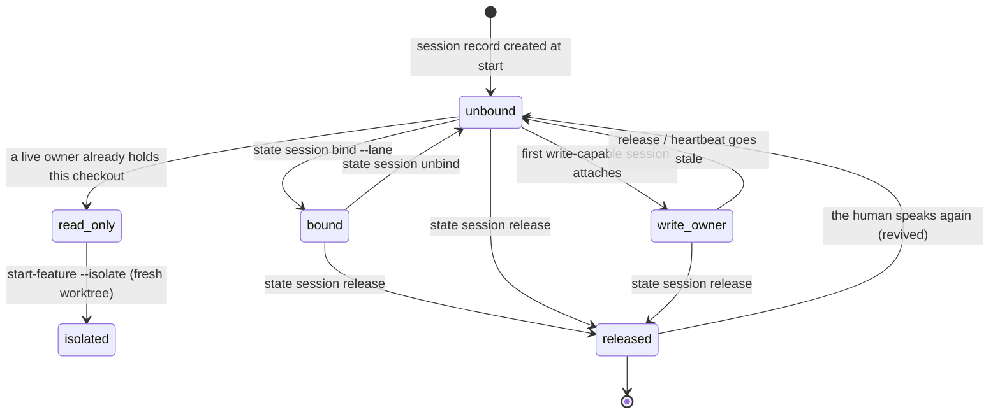

# Sessions as coordination

## Summary

A session is an identity other sessions can see. [The session](../foundations/session.md) describes the harness around one agent — the preamble, the heartbeat, the stop nudges. This document describes the other half: the verbs the agent runs to place its session in the shared world, and the rules that world runs by. Four of them act on the session record itself — `bee state session bind` and `unbind` attach the session to a lane so every pipeline read and write resolves to that lane instead of the default `state.json`; `bee state session list` shows every session with its bound lane, its heartbeat, and a derived liveness signal; `bee state session release` marks the session closed on purpose so it stops holding the checkout. Two more act on the *work* the session is doing — `bee work show` reads the record the activity hook opened from the human's own prompt, and `bee work set` says what "done" means for it and moves it along. Under all of it sits one rule that decides who may write at all: in the default `isolated` write policy, one checkout has one write-capable session, and the second one is told to isolate rather than made to wait.

## The simple case

Two sessions are live in one repository. The first started work on a feature and bound itself:

```
bee state session bind --session-id 5a27aa09-… --lane sample-role-description
```

bee answers `Session "5a27aa09-…" bound to lane "sample-role-description".` From here every state read and write from that session lands on `.bee/lanes/sample-role-description.json` — its phase, its gates, its plan — and not on the shared default record.

The second session runs `bee state session list` and sees the whole board:

```
5a27aa09-… -> lane "sample-role-description" | started 2026-08-26T03:05:21.362Z | heartbeat 2026-08-26T04:10:52.757Z | signal -
a2bd3764-… (unbound) | started 2026-08-26T03:35:26.268Z | heartbeat 2026-08-26T04:16:00.387Z | signal live
```

It also says what it is doing, so the first session and any dashboard can read it:

```
bee work set --acceptance "The board names what every live session is working on" --status active
```

When it stops for good, it hands the checkout back at once instead of leaving the next session to wait out fifteen minutes of stale heartbeat:

```
bee state session release
```

`Session "a2bd3764-…" released — marked closed until the user returns.` The record stays on disk. The next human prompt in that session revives it.

## The interaction, event by event

The states one session passes through, from the coordination layer's point of view:



### Invoke

All four `state session` verbs and both `work` verbs match an exact argv shape; an unknown flag falls through to the generic refusal ([invocation](../foundations/invocation.md)). The store root is resolved first, and the resolution itself can end the call: inside a *granted* worktree these verbs refuse outright, because they read the shared control plane.

```
bee state session list: refused inside a granted feature worktree — this command reads the shared control plane (sessions, claims, workers, workflows, handoff), which lives in the main checkout. FIX: run it from <main root>.
```

An ungranted linked worktree is not that case: its store *is* main's, so the verbs serve normally. See [worktrees](../foundations/worktrees.md).

`bind` and `unbind` require `--session-id` and validate it as a plain id (no path separators). `bind` also requires `--lane`, and checks that `.bee/lanes/<feature>.json` exists **before** taking any lock:

```
session bind: refused — lane "x" does not exist (no .bee/lanes/x.json). FIX: start it first ("state start-feature --feature x --as-lane"), then retry.
```

`release` resolves its target differently: `--session-id`, then `BEE_SESSION_ID`, then `CLAUDE_CODE_SESSION_ID`. It never guesses a session from the sessions directory, even when exactly one is live — a release names its own session or none.

`work show` and `work set` resolve a *sink* rather than a session: an explicit `--session` wins; then a herded pane (`BEE_HERDING_WORKER` plus `BEE_HERDING_JOB_ID`) addresses its job mailbox at `.bee/mailbox/<job>/activity.json`; then `CLAUDE_CODE_SESSION_ID`. With none of the three the call refuses and names the fix.

### Ends at once

The paths that write nothing:

- `state session list` and `state lanes` are pure reads.
- `work show` with no record on the sink is an empty result, not an error: `no work record for session <id> — a prompt opens one`, exit 0.
- `state session release` against an id with no record is a typed no-op: `Session "<id>" has no record — nothing to release.`, payload `{"released": false, "reason": "no_session_record"}`, exit 0.
- `bind` or `unbind` against an id with no record refuses by name (`… has no record to bind to lane "<f>".`), after taking the lock and before writing.
- `work set` with neither `--acceptance` nor `--status` refuses; so does an empty acceptance, a `--status` outside `open|active|done|dropped`, and a sink whose record has no `work` object yet ("a prompt opens one, so there is nothing to upgrade yet").
- An acceptance that matches a secret pattern is **refused, not redacted**: `--acceptance matches a secret pattern and was NOT stored. An acceptance is your own sentence — describe the outcome without the credential.` The human's prompt is treated the opposite way — the hook stores it as `[redacted]` — because bee stores what it is given but the agent's own sentence can be rewritten.

### First side effect

One atomic rewrite of one JSON file:

- `bind` sets `lane` on `.bee/sessions/<id>.json`; `unbind` omits the key entirely, restoring the unbound shape rather than writing an empty string.
- `release` sets `status: "closed"`, `closed_at`, and `released: true` on the same file.
- `work set` merges `acceptance` and/or `status` plus `updated_at` into the record's `work` object.

The three `state session` writers hold the `sessions` store lock through a bounded acquire — 15 attempts, 20 ms apart, never an unbounded wait. A failure to acquire is a named refusal that says nothing was written ("could not acquire the sessions lock after 15 bounded attempts — never waited unboundedly"). `work set` on the session sink takes the same lock with a *single* attempt and re-reads inside it, so a concurrent heartbeat is never lost; busy is `the sessions store is locked by another writer and nothing was written. FIX: run it again.` On the mailbox sink there is one writer by construction, and the atomic rename is the whole story.

### While running

`work set` carries two extra, fail-open effects after the record lands, both belonging to the [human mailbox](../memory/mailbox.md): a status of `done` or `dropped` ends the run and composes its one letter from the entries caps appended along the way, and *every* `work set` first sweeps for earlier runs that died without ever reaching their own end and files their letters. Neither can turn the caller's ask into a refusal; a mailbox that cannot be written warns and returns.

Nothing else streams. Every verb here is one read and at most one write.

### Finish

The text rendering goes to stdout and the timing line `[bee] <cmd> <N>ms` to stderr; `--json` replaces the text with the payload. `session list` prints one line per record; `bind`, `unbind`, and `release` print one confirmation; `work show` and `work set` print the same two-line rendering — `work "<title>" — <status>, <N> turn(s)` and the acceptance, or the reminder that `bee work set --acceptance` promotes it.

The `signal` field in `session list` is worth its own paragraph, because it is **derived at read time and never stored** — a stored signal would be a stale claim about the present. One `now` is taken for the whole listing so every row is judged against the same instant:

| Signal | Meaning |
| --- | --- |
| `live` | The activity hook stamped `activity.at` within the last 90 seconds. |
| `no_signal` | No `activity` object at all, or its stamp is 90 seconds old or older, or it will not parse (bee's own hook writes ISO-8601, so an unreadable stamp is a damaged record, never a live one). |
| `-` (JSON `null`) | The session is `dead` or `closed`. There is nothing left to be live about, so no signal is claimed — status decides before activity, even fresh activity. |

> Technical note: the 90-second window is not the heartbeat's 900 seconds and is read independently of it. The heartbeat answers "is this session's process still around"; the signal answers "did the agent do anything just now".

## Modifiers

| Modifier | Set at invocation | Can it differ mid-flow? |
| --- | --- | --- |
| `--json` | Payload on stdout instead of the text rendering: the full session record for `bind`/`unbind`, `{id, released, closed_at}` for `release`, the array of records (each with its derived `signal`) for `list`, `{target, work}` for both `work` verbs. Errors as `{"error": …}`. | No — one invocation, one mode. |
| Gate-bypass level | No effect. Binding, listing, releasing, and the work record are never gated. | No effect. |
| Store phase | No effect on these verbs. It does decide one guard beside them: the isolated-mode ownership deny is skipped in the `swarming` phase, where a worker writing under the orchestrator's claim is the intended shape. | The phase can change under a long-lived session; the guard reads it per write. |
| Where it runs | Main checkout or an ungranted linked worktree: normal service against the control-plane store. A granted worktree: every verb here refuses and names the main checkout. | The store root is fixed per invocation. |
| Who runs it | Orchestrator and worker use the same verbs. A dispatched worker is not a session — it lives inside one, and `work set` from it addresses its parent's record. A herded pane is not a bee session either: it has no `.bee/sessions/<id>.json`, and `work set` there writes the job mailbox instead. | The sink is decided per invocation. |

## Cancel and interrupt

Columns: before and after the single record write.

| Event | Before the write | After the write |
| --- | --- | --- |
| The process killed mid-command | Nothing recorded. The `sessions` lock has a stale timeout, so a killed holder does not wedge siblings ([the store](../foundations/store.md)). | The write is atomic — the record is either wholly old or wholly new. The confirmation may never print. |
| The session turning elsewhere (compaction, handoff, turn end) | The binding, the release, or the acceptance simply never happened; nothing is owed. | All of it survives — that is the point. A binding outlives compaction; the work record's `text` keeps the conversation tail so the ask survives a summary. A compacted session never adopts a handoff. |
| A clean completion from outside (gate approved, question answered, new message) | No effect on these verbs. | A human prompt is the one event that undoes a release: `UserPromptSubmit` clears `status`, `closed_at`, and `released`, and stamps `revived_at`. It also appends to the open work record and increments its turn count. |
| The store unavailable (lock contention, corrupt JSON, hook binary missing) | A busy `sessions` lock is a named refusal that says nothing was written. A corrupt session record reads as absent, so `bind`/`unbind` answer "has no record"; a corrupt *lane* record is fail-closed — the lane guard denies rather than guessing back to the default pipeline. A corrupt *workspace* record denies too. | Unaffected. A record damaged after the fact reads as absent on the next pass, and no verb here repairs it. |
| The session going away (heartbeat expiry, lease expiry, `session release`) | — | A stale heartbeat (900 s) makes the session invisible to `active_workers`, to `claim-next`'s live-peer checks, and to the ownership guard; its claims become sweepable. `release` reaches the ownership guard *immediately*, because a `closed` or `dead` owner is read as not live. The record itself is never deleted by anything. |
| A sibling changing the target | A sibling can bind the same lane — nothing forbids two sessions on one lane; `state lanes` lists both under `bound_sessions`. A sibling can also delete or corrupt the lane record, turning the next resolution into a lane-guard deny. | A sibling releasing or rebinding the same session id is possible but pathological: last writer wins under the lock. |
| The channel changing (piped, `--json`, Codex, run from a hook) | Same behavior everywhere. Codex has no `SessionEnd`, so a Codex session's closure rides staleness unless it releases on purpose — which makes `state session release` more load-bearing there, not less. | Same. |

## Interactions with other systems

**Gates and approval.** Binding decides *which* record's gates apply: a bound session's phase and gates come from its lane, an unbound one's from the default `state.json`. `bee state route --set` refuses to write the default record while lane records are live and this session is unbound — "bind this session to its lane, or pass `--no-lane` to write the default record on purpose". Two lane-only fields, `plan_rev` and `conflict_review`, refuse outright when resolution lands on the default record. Nothing here is itself gated; see [gates](../foundations/gates.md).

**The store and history.** One file per session under `.bee/sessions/<id>.json`, created at session start and never removed by any verb — a repository accumulates them. The activity hook adds `activity` and `work` to the same file plus a `<id>.activity.jsonl` sidecar of the last 50 state transitions (session enumerators filter on `.json`, so the sidecar stays invisible to them). Lane records live at `.bee/lanes/<feature>.json`, workspace records at `.bee/runtime/workspaces/<id>.json`. See [the store](../foundations/store.md).

**Worktrees and containment.** Sessions, claims, and workspaces are control-plane: the record is written into the *control* root, which for a linked worktree is the main checkout. The verbs that read that plane refuse inside a granted worktree and name the path to run from. Isolation, when it fires, produces a whole new feature worktree and says what that costs. See [worktrees](../foundations/worktrees.md).

**Claims, holds, and reservations.** The binding is what makes cross-session claiming fair. `bee cells claim-next` sweeps expired claims, then prefers the acting session's own bound lane (or the default pipeline when unbound) — but only when that pipeline's execution gate is approved — and otherwise falls back to *other* pipelines whose own execution gate is approved, ordered by backlog rank then lane creation. Two liveness rules keep sessions off each other's work: a lane bound to another live session is never a fallback candidate, and the default pipeline is never a fallback while another live *unbound* session exists, because an unbound live session is by definition working it. Cells whose files intersect another session's active reservation are skipped; the acting session's own reservations never exclude a cell. Reservation and hold mechanics are [reservations](reservations.md).

**Sibling sessions.** Everything a sibling knows about this one it reads here: the record, its bound lane, its heartbeat, its derived signal, its waiting-on mark, and the claim joined to it. `bee status` renders `workers` as exactly that derived join — live-heartbeat sessions joined with their current cell claim — never a hand-mutated list.

**What the human sees.** Not these commands. The human sees the effect: a `bee status` board and any dashboard reading the same records that can say "working", "waiting on you", or "no signal" per session rather than guessing from a terminal pane; and, on an unattended run, one mailbox letter per run because `work set` marked the run's end.

**Configuration.** One key decides the write policy: `guards.write_policy`, with `isolated` the default and the reading for anything unrecognized, plus `shared-disjoint` and `observe`. `guards.auto_isolate` turns the second-session refusal into an automatic fresh worktree. See [configuration](../cross-cutting/configuration.md).

**Output modes and exit codes.** The standard contract: 0 on success and on both typed no-ops, 1 on a refusal; `--json` puts payloads and `{"error": …}` on stdout. See [invocation](../foundations/invocation.md).

## The write policy: one write-capable session per checkout

`guards.write_policy` has three settings and one of them is the default.

**`isolated` (default, and the reading of any unrecognized value).** A checkout is a *workspace* with at most one write owner. The first session to attach becomes the owner; a second live session attaches read-only and its source writes are denied:

```
bee write-policy: workspace "main" is write-owned by session "<owner>" — a second write-capable session defaults to isolation, never a shared write into the same checkout. FIX: coordinate with that session, wait for its heartbeat to go stale, or start your own feature with `bee state start-feature --isolate` (or set guards.auto_isolate to true in .bee/config.json) to work in a fresh worktree instead.
```

The refusal at `state start-feature` is the same rule met earlier, and it is worded once at length and afterwards short: a marker under `.bee/runtime/notices/isolate/` records that this session has already been told, so the first refusal explains the policy and later ones only name the owner and the fix.

Owner liveness is what releases the workspace. A `closed` or `dead` owner never holds it; otherwise the owner's heartbeat decides, at the usual 900 seconds. That is exactly why `bee state session release` exists — it converts a fifteen-minute wait into an immediate handover.

With `--isolate` or `guards.auto_isolate: true`, the refusal becomes an action: bee creates a fresh feature worktree, attaches this session as its first uncontested owner, and discloses the cost — `[bee cost] Isolated worktree created — a FULL working-tree copy at <path> (disk cost scales with repo size).` — then tells the agent to open its next session there.

**`shared-disjoint`.** Two sessions may write the same checkout, but only over paths each has leased exactly. A broad or glob reservation never satisfies it; the refusal names every path missing an exact-path lease and the `bee reservations reserve` command that fixes it.

**`observe`.** Measure, never enforce. Every write proceeds.

> Technical note: the isolated-mode write deny fires only when the resolving record source is the **default** pipeline and the phase is not `swarming`. A session bound to a lane resolves to `lane`, and never meets this guard at all — the lane binding is itself the isolation claim. Whether that exemption is intended in full is an open question below.

## Multi-session etiquette

Three rules ride on top of the mechanics. They are how the agent is expected to behave; the CLI makes each one the path of least resistance.

**Pick up cross-session work with `bee cells claim-next`, never by browsing.** Browsing open cells picks by what looks interesting; `claim-next` picks by the ordering above and takes the claim in the same breath, under an `O_EXCL` claim file, so two sessions cannot both think they own a cell. It also refuses honestly rather than guessing: `NO_APPROVED_WORK` when nothing is claimable, `CLAIMED` when the race was lost, `LANE_INVALID` / `LANE_MISSING` / `LANE_CORRUPT` when the acting session's binding is broken.

**A hold or reservation deny means pick other work and report it — never write through it, never wait it out in silence.** The deny names the holder and the remedy. Reporting the conflict is what lets the orchestrator re-plan; silently waiting looks identical to being stuck.

**File overlap with an in-flight cell or a live worktree is triage data, not a question for the human.** Take the disjoint items first, split scope to the disjoint files when the split is natural, and defer the overlapped remainder with a recorded reason. The human is asked only when the deferred set is the entire ask.

## Edge cases

- Nothing forbids two sessions binding the same lane. `state lanes` lists both ids under that lane's `bound_sessions`, and the pair coordinate through claims and reservations like anyone else.
- A binding to a lane that later disappears never falls back. Every resolution seam refuses by name and offers the same three exits: start the lane, unbind the session, or target the default record explicitly.
- `unbind` removes the key rather than blanking it, so an unbound record is byte-identical in shape to one that was never bound.
- A session record is created once, with `create_new` semantics: a second start of the same id is not a second record. `started_at` never moves; a comeback is stamped `revived_at`.
- `release` does not release write ownership in the workspace record. It works because the ownership check reads the *session's* status, not the workspace's owner field. The workspace record still names the released session as owner.
- The work record's title is the first line of the first prompt, capped at 200 characters with an ellipsis; the text keeps the newest 8000 characters, dropping the oldest. A record the agent has moved off `open` is finished, and the next prompt opens a fresh one.
- A herded pane gets no session record, no activity sidecar, and no waiting-on mark. `work show` and `work set` in one address `.bee/mailbox/<job>/activity.json`. The pane's *job* is not the *run*: the mailbox letter is composed per session span, so one unattended night of many jobs still reads as one letter per run.
- The `sessionId` a `--with-companion` worktree records in `.bee/companion-session.json` belongs to the companion tool, not to bee. It never appears in `state session list`.
- Every session record ever created stays on disk. No verb prunes them, so `state session list` on an old repository is long, and most rows read `signal -`.

## Open questions and verification

- **Registry drift.** `state.session.bind`'s registry description still says "Does not verify the lane record exists — a binding to a missing/invalid lane is a typed refusal at resolution time, not at bind time." The code does verify, before the lock, and refuses with `lane_missing_refusal`. The behavior is the better one; the description is stale. Worth a [bug-triage](../bug-triage.md) entry against the registry text rather than the code.
- **Two liveness readings of the same owner.** The write guard treats a `closed` or `dead` owner session as not live; `apply_write_policy`'s own `is_owner_live` (the `state start-feature` path) checks only the heartbeat and ignores `status`. A session released seconds ago is therefore open to a sibling's *writes* but can still block that sibling's `start-feature`. Read from code, not probed; looks like an oversight rather than a design.
- **The `swarming` and lane-bound exemptions.** The isolated-mode deny is skipped entirely when the record source is a lane, and when the phase is `swarming`. Both are plausible on purpose (a lane binding is an isolation claim; a swarm's workers write under one orchestrator), but no comment or decision naming the second exemption was found.
- **Streams.** `state session list`, `work show`, and `work set` print their human text on **stdout**, verified live in this repository — the standard split [invocation](../foundations/invocation.md) owns.
- Confirmed by running the binary in this repository, read-only: `bee state session list` (including the `live` / `no_signal` / `-` spread quoted above), `bee state lanes`, `bee work show`, `bee work set` with no flags (exit 1), and `bee work set --status bogus`.
- Read from code but not exercised: `bind` / `unbind` / `release` against a live record, the granted-worktree refusal, the isolated-mode deny and its one-time notice marker, the `--isolate` worktree creation, `shared-disjoint`, and the mailbox letter filed at a terminal `work set --status`.

Verified against beehive commit `6b0ae488`.
