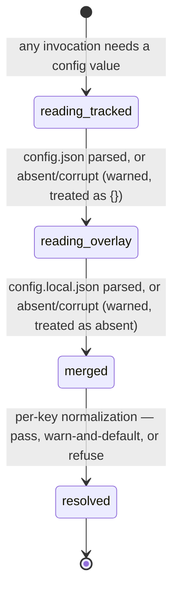

# Configuration

## Summary

Configuration is the one corner of `.bee/` that belongs to human hands. Two files hold it: `.bee/config.json`, tracked in git and shared by everyone who clones the host repo, and `.bee/config.local.json`, gitignored and private to one machine. Every read merges them fresh — overlay over tracked, objects merged recursively, arrays replaced whole, overlay wins — and every read is total: a missing file, a corrupt file, or a file whose top level is not an object all read as "nothing configured here", with a warning on stderr and the defaults standing. There is no cache and no reload step: each command run and each hook event re-reads both files from disk, so an edit takes effect on the very next invocation. Config decides which hooks run, whether gates can self-approve, which model each role dispatches on, how three guards behave, where the UAT stop sits, whether staging exists, and what the project's one test command is. The four verbs that were meant to edit it — `bee config get/set/unset/validate` — are declared in the registry but **not built into this binary**; today the agent edits the JSON by hand, which is exactly why config is the one part of the store the direct-edit guard leaves alone.

## The simple case

The agent needs to know whether the idle intake gate is on. It reads the file:

```
Read .bee/config.json
```

There is no command for it. `bee config get --key guards.idle_gate` is in the registry and in `bee --help --all`, but running it answers:

> bee: not built into this binary: `bee config get` is declared in the command registry, the config verbs were never ported off Node. Nothing ran and nothing changed. FIX: read and edit `.bee/config.json` directly — it is plain JSON; `bee status --json` shows the derived gate_bypass_level

So the agent reads the file, edits it with the ordinary Write or Edit tool — allowed in every phase, because `.bee/` is on every write-guard allow-list and config is not in the direct-edit deny table — and the next `bee` invocation sees the new value. For a derived value rather than a raw one, `bee status --json` is the read surface: it carries `gate_bypass`, `gate_bypass_level`, `ship_visibility`, `models`, and `commands` already resolved.

A machine-local override goes in `.bee/config.local.json` instead. That file is gitignored by onboarding, so "turn this hook off on my laptop" never becomes a commit that turns it off for the whole team.

## The interaction, event by event

One config read, as every command and every hook performs it:



### Invoke

Nothing is parsed from argv. The store root is resolved the usual way (up to the nearest `.bee/onboarding.json` or `.git`), and the two config paths are that root's `.bee/config.json` and `.bee/config.local.json`.

### Ends at once

A config read never ends the invocation. It has no failure exit of its own: every branch produces a value.

- Both files absent: the merged config is `{}` and every key falls to its default. This is a legitimate state, not an error.
- A file that will not parse: one stderr warning — `bee: could not parse JSON at <path> — <reason>. Using fallback; fix the file.` — and that file reads as absent. The other file is still read. A corrupt `config.json` therefore does not disable the overlay, and vice versa.
- A file whose top level is a JSON array, string, or number: read as absent, silently. Only an object contributes.

### First side effect

There is none. Reading config writes nothing, takes no lock, and touches no timestamp. Config is also the only store surface bee never edits: `bee onboard` seeds `.bee/config.json` create-if-missing and `.bee/config-sample.json` beside it, and after that every change comes from a human or an agent editing the file by hand. No verb, no hook, and no driver writes a config key.

### While running

The merge, then per-key normalization.

The merge law, applied by `merge_config_overlay`:

- **Overlay wins.** Where both files carry the same key, `config.local.json`'s value is the answer.
- **Objects merge recursively.** `{"hooks": {"write-guard": false}}` in the overlay turns off exactly that one hook; the tracked file's other five `hooks` entries survive.
- **Arrays replace wholesale.** An overlay array is the whole value — there is no element-wise merge and no append. Setting `herding.tmux.busy_markers` locally replaces the default list entirely, and an empty array means "never match".
- **Scalars replace.** Last file wins.
- **A present key with a `null` value still wins the merge.** For most keys `null` then reads as "unset" — that is deliberate for `close_commit_bookkeeping`, whose comment records the reason: a tool that only knows JSON `null` and never "delete the key" must land on the same default as an absent key.

One key is removed after the merge and never reaches a reader: a top-level `advisor` is stripped, because the advisor role is configured under `models.<runtime>.advisor` and a stray top-level spelling would silently do nothing.

Then each consumer normalizes its own key, in one of three postures:

- **Pass or default, silently.** `hooks.<name>`, `guards.*`, `worktree_first`, `cells_archive_on_close`.
- **Warn and default.** `ship_visibility` (an unrecognized value prints `config: unrecognized ship_visibility "<v>" in .bee/config.json — normalized to "off". Allowed: off, draft-pr.`), `doc_viewer` (a half-set key prints one line and disables doc links), `capture_queue_threshold`, `product_root` (a non-string, or a path that is not a directory, warns and the bee root is used).
- **Refuse.** `uat_stop` / `uat_before_merge` (`WORKTREE_MERGE_UAT_CONFIG_INVALID`), `staging_before_merge` (`STAGING_CONFIG_INVALID`), `worktree_cleanup_on_merge`, and `close_commit_bookkeeping` — each of these refuses the whole command rather than guess, because guessing would either run a commit nobody asked for or skip a stop somebody asked for.

### Finish

The value is used and forgotten. The next invocation, one millisecond later, reads both files again.

## The keys an agent meets

| Key | Default when absent | What it changes | Bad value |
| --- | --- | --- | --- |
| `hooks.<name>` | enabled | `false` turns that one hook off. Names: `session-init`, `prompt-context`, `write-guard`, `model-guard`, `state-sync`, `chain-nudge`, `session-close`, `tools-logger`, `activity`, `codex-subagent-audit`. Only an explicit `false` disables; any other value, and any unknown name, reads as enabled. | reads as enabled |
| `gate_bypass` | `false` (off) | The bypass level `bee state gate` may self-approve at: `"total"`→total, `"full"`→full, `true`/`"on"`/`"normal"`→normal, anything else→off. [gates](../foundations/gates.md) owns what each level opens. | reads as off |
| `models.claude.<role>`, `models.codex.<role>` | seeded: claude `code`=sonnet, `read`=haiku, `extraction`=haiku, `generation`=sonnet; codex all `null` | Which model each dispatched role runs on, and therefore what `bee dispatch prepare` returns and what the model guard repairs a mismatched dispatch to. Slot shapes: a plain string, `{model, effort}`, `{kind:"cli", …}`, `{kind:"herding", …}`, or `null`. [workers](../delegation/workers.md) owns roles and repair. | an unconfigured role name falls through and warns; it never refuses |
| `guards.idle_gate` | `true` | `false` lets source writes through at `idle` and `compounding-complete` without routing work first. Named as the last-resort opt-out in the intake gate's own deny. | anything but `false` reads as on |
| `guards.auto_isolate` | `false` | `true` makes a second write-capable session create its own feature worktree instead of being refused by the write-policy guard. Same effect as passing `--isolate` per command. | anything but `true` reads as off |
| `guards.max_read_lines` | `800` | The line count past which a Read with no `offset`/`limit` is redirected toward a scoped read. A non-number, zero, or a negative reads as 800. | reads as 800 |
| `worktree_first` | on | The exact string `"off"` disables the write guard's refusal of main-checkout source writes for a code-touching feature. Only that exact string; every other value leaves the guard on. | reads as on |
| `staging_before_merge` | `false` | `true` turns the staging mixing ground on repo-wide. Left absent or `false`, `bee staging add` and `bee staging rebuild` refuse `STAGING_DISABLED` and the flow is worktree → uat gate → main. | non-boolean refuses `STAGING_CONFIG_INVALID` |
| `uat_stop` | `"close"` | Where the UAT gate stops the work: `"merge"` (`bee worktree merge` enforces it for standard and high-risk), `"close"` (the merge lands, `bee close` enforces it, and the worktree is held while `uat` is pending), `"off"` (no stop). | a string outside those three refuses `WORKTREE_MERGE_UAT_CONFIG_INVALID` |
| `uat_before_merge` | — | Back-compat alias, read only when `uat_stop` is absent: `true`→`"merge"`, `false`→`"off"`. With both keys absent the default is `"close"`, not this alias's shape. | non-boolean refuses `WORKTREE_MERGE_UAT_CONFIG_INVALID` |
| `close_commit_bookkeeping` | on (absent **and** `null` both read as on) | `false` stops `bee close` from making its bookkeeping commit. | a present, non-null, non-boolean value refuses `bee close` up front, naming the key, the value, and which of the two files carries it |
| `commands.test` | undeclared | The project's ONE declared test command — a string, or an array run in order. `bee test` runs it; CI runs it on every push. No local door runs it: a cap records its own proof line and `bee close` / `bee worktree merge` check that record. The sentinel string `"none"` declares "this project runs no tests" and is dropped from the list. | a non-object `commands` reads as `{}` |
| `commands.staging_build` | not configured | The build step `bee staging add` runs inside the staging worktree. Absent, the step is skipped with a line saying so. A non-zero exit surfaces with the command and the output tail. | — |
| `ship_visibility` | `"off"` | `"draft-pr"` adds one line to the session preamble — first cap opens a draft PR, every cap pushes. Nothing in the binary enforces it; it is an instruction to the agent and a field in `bee status --json`. | warns by name and normalizes to `"off"` |
| `doc_viewer` | unset, silently | `{base_url, project}` join as `<base_url>/p/<project>`, injected into the preamble and the compaction capsule so the agent can link a repo-relative doc path as a clickable URL instead of a bare path. bee joins the URL; it does not escape it. | a wrong shape, a missing field, or a field that is empty after trimming produces no URL plus one stderr line naming the key |

Others the agent will meet less often, all optional: `cells_archive_on_close` (default on — a green close retires capped cells into `.bee/cells/archive/`), `worktree_cleanup_on_merge` (default on — a merge that merged something removes the worktree, deletes the branch, drops the grant; a non-boolean refuses), `product_root` (where the product's docs live when they are not beside `.bee/`), `capture_queue_threshold` (`{count, days}`, default 5 and 7 — the pressure past which the capture-queue nudge escalates its wording, never a block), `retry.fallbackChains`, `herding.*`, and `dogfood_repos`. `.bee/config-sample.json`, seeded beside the real config by `bee onboard`, is the annotated reference for all of them: it carries a `_doc` block documenting every key, because JSON has no comments.

> Technical note: the sample is embedded into the binary at compile time from bee's own `.bee/config-sample.json`, so a released binary and its documentation cannot drift apart. Its `_doc` block still spells the `guards.idle_gate` opt-out as `bee config set --key guards.idle_gate --value false` — a command that is not built. Prefer the file edit.

## The two files

| | `.bee/config.json` | `.bee/config.local.json` |
| --- | --- | --- |
| In git | tracked | gitignored by onboarding |
| Seeded by `bee onboard` | yes, create-if-missing | no — created by hand when needed |
| Audience | everyone who clones the repo | one machine, one person |
| Merge position | base | overlay; wins every conflict |
| Typical contents | `commands.test`, `models`, `uat_stop`, `worktree_first` | a hook turned off for debugging, a local `gate_bypass`, a local `doc_viewer` |

The registry's description of the unbuilt `bee config set` records the intended rule for the split: `guards.*` and `hooks.*` keys were to be forced into the local overlay regardless of the `--local` flag, because a kill switch is a debugging act, not a team decision. With the verbs unbuilt, nothing enforces that — a hand edit puts `hooks.write-guard: false` in the tracked file just as easily, and it then ships to everyone.

## Modifiers

| Modifier | Set at invocation | Can it differ mid-flow? |
| --- | --- | --- |
| `--json` | No effect on reading config. It changes how the commands that *consume* config answer — `bee status --json` carries the resolved `gate_bypass_level`, `ship_visibility`, `models`, and `commands`. Config warnings always go to stderr, so `--json` stdout stays parseable. | No. |
| Gate-bypass level | No effect on the read. `gate_bypass` is itself a config key; the level it resolves to is an input to [gates](../foundations/gates.md), never to the config layer. No level lets an agent approve its own config change, because config changes are not gated at all. | The level is re-read per invocation, so an edit mid-flow changes the next command's answer. |
| Store phase | No effect. Config reads and config edits are legal in every phase: `.bee/` is on both the gated-phase and the idle-intake allow-lists, and config is absent from the direct-edit guard's deny table. | No. |
| Where it runs | The config that answers is the one at the resolved store root. In an ungranted feature worktree the control plane reads the main checkout's store, so main's config governs the control plane while the worktree's own `.bee/config.json` — a copy carried by the branch — governs anything resolved locally. See [worktrees](../foundations/worktrees.md). | Yes: two checkouts can hold different tracked config on different branches. |
| Who runs it | No difference in mechanism. Hooks and verbs call the same merge. A dispatched worker inherits the session's working directory, so it reads the same files. | — |

## Cancel and interrupt

A config read has no first side effect, so the usual two-column split collapses: there is only "during the read", and the read is a few milliseconds of file I/O. The rows below ask the standard questions anyway, because the answers are what make config safe to edit at any moment.

| Event | Behavior |
| --- | --- |
| The process killed mid-command | Nothing to undo — the read wrote nothing. A half-written config *file* is a different matter: it is an ordinary editor write, and until it is valid JSON every reader treats it as absent and warns. That is a silent, repo-wide return to defaults, not a refusal. |
| The session turning elsewhere (compaction, handoff, turn end) | No effect. Config is not session state; nothing about it is carried across a handoff. A compacted session re-reads it like any other. |
| A clean completion from outside (gate approved, question answered, new message) | No effect. |
| The store unavailable (corrupt JSON, hook binary missing) | Each file fails open independently: warn once, read as absent, keep the other file. A missing hook binary means no hook reads config at all and the action passes with `bee: hook binary missing (.bee/bin/bee)` — visible, never silent. No lock is involved, so lock contention cannot reach a config read. |
| The session going away (heartbeat, lease expiry, release) | No effect. Config holds no lease and no session-scoped value. |
| A sibling changing the target | A sibling editing `config.json` mid-flow changes the *next* invocation in every live session, with no notification and no store event. Two sessions editing the same config file race like any two editors on one file — there is no lock and no merge. This is the one store surface with no concurrency protection at all. |
| The channel changing (piped, `--json`, Codex, from a hook) | Same merge everywhere. Codex reads the same two files; only `models.codex` versus `models.claude` differs. Warnings ride stderr in every channel. |

## Interactions with other systems

**Gates and approval.** `gate_bypass` is the input that decides whether `bee state gate --actor auto --bypass-level <level>` is served or refused. Editing it is itself ungated — the switch that lets the agent skip the human's approval is protected only by the fact that a human has to want it. `bee-hive` records the bypass level as an opt-in the human sets, and the session preamble prints a banner at every level above off.

**The store and history.** Config lives inside `.bee/` but is not CLI-owned: [the store](../foundations/store.md)'s two rules — CLI-only writes, total reads — apply only the second one here. The tracked file's history is git; the overlay has none by design.

**Worktrees and containment.** A feature worktree carries its branch's copy of `config.json`, so a config change made in a worktree lands in main through `bee worktree merge` like any other tracked file. The overlay does not travel: each machine and each checkout keeps its own.

**Claims, holds, and reservations.** None. No lock, no lease, no reservation guards a config file. A config edit is not reserved work, and a reservation on `.bee/config.json` would be unusual enough to be worth a second look.

**Sibling sessions.** Every live session in the checkout is affected by the next read after an edit. Turning a hook off is repo-wide and immediate; there is no per-session config.

**What the human sees.** The preamble's bypass banner, its ship-visibility line, and the doc-viewer prefix all come from config, so a config edit changes what every future session is told. Warnings (`ship_visibility`, `doc_viewer`, `product_root`, corrupt JSON) land on stderr where the agent sees them, not in the human's transcript.

**Configuration.** This document is the one that owns it. Every other document names its keys and links here.

**Output modes and exit codes.** The read itself has no exit code. The four `bee config` verbs exit 1 with `kind: "command_unavailable"` and the FIX quoted above; `bee config --help` still prints all four entries, each stamped `NOT BUILT INTO THIS BINARY`, and exits 0 with the usual timing line.

## Edge cases

- **The seeded config lists six hooks; ten names are dispatchable.** `bee onboard` writes `session-init`, `prompt-context`, `write-guard`, `state-sync`, `chain-nudge`, `session-close`. The model guard, the tools logger, the activity hook, and the Codex subagent audit run without a key, because the predicate is "enabled unless the value is exactly `false`". To disable one of those, the key has to be added first.
- **Two hooks read no toggle at all.** `codex-subagent-audit` never checks `hooks.codex-subagent-audit`; the key is inert. `prompt-context`, `model-guard`, `session-close`, and `session-init` each check their own key with a private copy of the predicate rather than the shared one — same answer, four spellings.
- **The session-start path reads config through a second, fail-open reader.** `session-init` and the compaction capsule use their own reader so the preamble still renders when the ordinary path would have failed. It shares the same merge function on purpose — a second copy of the merge would be a second answer to "which value wins" — but it differs in two small ways: it does not strip the top-level `advisor` key, and an overlay that parses to an empty object short-circuits the merge instead of running it. Neither difference changes a value.
- **A corrupt `config.json` is a quiet, repo-wide reset.** Every guard returns to its default (all safe-side: hooks on, intake gate on, bypass off), but `commands.test` also vanishes, so `bee test` reports "No commands.test declared — nothing ran" and exits as if the project had never declared one. The only signal is one stderr warning per invocation.
- **`worktree_first` is checked against the exact string `"off"`.** `false`, `"false"`, `"OFF"`, and `0` all leave the guard on. The deny text names the exact spelling for that reason.
- **`ship_visibility` is advice, not machinery.** Nothing in the binary opens a draft PR. The value only reaches a preamble line and a status field.
- **`bee status --json` is the only derived-config read surface.** There is no `bee config show`, and `bee doctor` never reads config — it checks the runtime installation. To see what a key resolves to, read the file and apply the merge law, or read the matching field on `bee status --json`.
- **The command tree still advertises `bee config`.** It appears in `bee --help --all` and in the registry payload with full parameter schemas, so an agent reading the help can reasonably try it and get a refusal. The refusal names the remedy, which is the file.

## Open questions and verification

- **The config verbs are declared and not built.** All four (`get`, `set`, `unset`, `validate`) answer `bee: not built into this binary … the config verbs were never ported off Node`, exit 1. The write guard's own intake-gate deny text carries a comment acknowledging this and deliberately names the file instead of the command. The `_doc` block in `.bee/config-sample.json` still names `bee config set`. Whether the verbs are meant to be built or the registry entries retired is a product call; filed in [bug-triage.md](../bug-triage.md).
- **Nothing enforces the local-only rule for `guards.*` and `hooks.*`.** The intended behavior lives only in the unbuilt `config set`'s registry description. A hand edit can commit a disabled write guard to the tracked file, and no command or hook warns about it.
- Whether `bee config validate`'s described checks (a `kind:"cli"` slot missing its command, a cli slot with no prompt transport, an unsafe auto-approve flag in a cli command) run anywhere else — at dispatch time, say — was not determined. Read-only attempts to run the verb confirmed only the refusal.
- The merge law was read from `state.rs:134-157` and exercised through its unit tests, not raced by hand against two live files.
- Confirmed by running the binary in this repository: all four config verbs' refusals with and without `--json`, `bee config --help`'s four stamped entries, and `bee status --json`'s `gate_bypass`, `gate_bypass_level`, and `ship_visibility` fields.
- The per-key refusal codes (`WORKTREE_MERGE_UAT_CONFIG_INVALID`, `STAGING_DISABLED`, `STAGING_CONFIG_INVALID`) were read from source and their tests; they were not reproduced by hand, since each needs a merge or a staging setup.

Verified against beehive commit `6b0ae488`.
