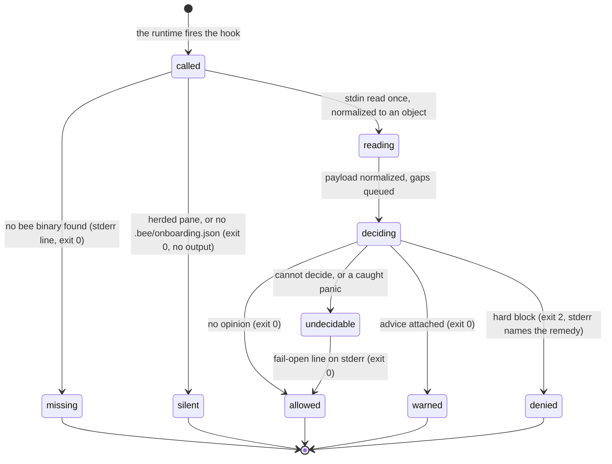

# Failure

## Summary

Everything bee does around the agent can break: a hook can meet a payload it cannot parse, a store file can be half-written, the binary the runtime calls can be missing entirely, and a handler can panic outright. bee answers all of it with three postures and one rule that ties them together. **Fail open** is the default: a checkpoint that cannot decide exits 0, says so on stderr, and lets the action through, because a guard bug that froze every tool call would be worse than a guard that missed one write. **Fail closed** is the exception, reserved for coordination state: a holds or reservation store that is present but unreadable denies rather than reading as empty, because guessing there costs a sibling's work. **Refuse** is the binary's own posture: an argv shape it cannot serve gets a named refusal, never silence. The rule underneath: **the hooks are a safety net, never the authority** — a guard's silence is never permission, so an unblocked write is not an approved write. This document is the failure story as one piece; [guards](../foundations/guards.md) owns the deny catalog, [the store](../foundations/store.md) owns corrupt reads and the lock, [invocation](../foundations/invocation.md) owns exit codes.

## The simple case

A hook meets a payload it does not understand — a Stop event carrying an array where an object belongs. Nothing blocks. The tool call proceeds, and one line appears on stderr:

> bee: hook write-guard could not decide this payload — allowing the operation (fail-open).          The guard did NOT run on it.

The agent reads that as what it is: this write was *not* checked, so the workflow's own rules are the only thing standing behind it. The event is also recorded — one JSON line in `.bee/logs/hooks.jsonl` naming the hook, the gap, and the time — so a later reader can see the hole even if nobody saw the stderr line.

The mirror case: the agent edits a source file while the reservation store is present but corrupt. Here bee does not shrug:

> bee hold guard: the reservation store (.bee/reservations.json) is present but unreadable/corrupt — failing closed for a session-aware write rather than silently treating it as empty. FIX: inspect/restore the reservation store, then retry.

Two failures, two opposite answers, one principle: fail toward the answer whose mistake is cheapest to fix.

## The interaction, event by event

One hook evaluation, from the harness's call to its exit code:

### Invoke

The runtime does not call the binary directly — it calls a shell wrapper that looks for one. The wrapper tries the project directory's `.bee/bin/bee`, then the plugin root's, then the `.bee/bin/bee` beside the repository's git common directory (so a linked worktree still finds the main checkout's binary). If none of them is executable it prints `bee: hook binary missing (.bee/bin/bee)` on stderr and exits 0. A host with no bee installed therefore runs with no guards at all — visibly, once per hook event, never silently.

Inside the binary, three things happen before any hook logic:

- **The herded-worker check.** A pane opened by `bee herding run` carries `BEE_HERDING_WORKER`; under it every hook name exits 0 silently *before stdin is read*, with exactly one hole — `activity`, the hook that can never deny and never prints. A herded worker is deliberately guardless ([herding](../delegation/herding.md)).
- **stdin, read once.** The bytes are read whole, then normalized to a plain JSON object before any field is touched. Junk bytes, `null`, `[]`, embedded NULs, a `cwd` that is an object instead of a string, a two-megabyte blob: each becomes `{}` or a defaulted field, plus a queued *coverage gap* naming what arrived (`stdin is not parseable JSON — normalized to {}`, `top-level array payload — normalized to {}`).
- **The install probe.** Without `.bee/onboarding.json` at the resolved root, the hook decides nothing and exits 0 in silence. "Not installed here" is a normal state, not a failure.

### Ends at once

The missing binary, the herded pane, the uninstalled root, and an unknown hook name. The last one is the single place in this document where a hook exits non-zero on its own account: `bee hook not-a-real-hook` prints `bee hook: unknown hook "not-a-real-hook"` and fails. That is a wiring error, not a payload the guard has an opinion about, so it is answered like any other unknown command — refused by name.

### First side effect

There is none in the ordinary case. Hooks read the store to decide and write nothing but their own logs; a deny leaves the repository exactly as it was. The writes that do happen are bookkeeping: crash and coverage-gap lines in `.bee/logs/hooks.jsonl`, the dispatch audit line the model guard appends, and the projections the state-sync hook rebuilds when the lock is free. Every one of them is best-effort — a log append that fails is swallowed, because logging must never change a decision or an exit code.

### While running

The evaluation itself, and the two ways it can go wrong:

- **A path the hook cannot decide.** The hook returns *undecidable* without having printed anything, and the dispatcher resolves it the only way a hook may: exit 0 plus the fail-open line naming the hook.
- **A panic.** The write guard — the one hook whose ordinary answer can block a tool call — wraps its whole evaluation so that a panic becomes *undecidable* rather than a crash: "a native panic is never a verdict." Elsewhere the discipline is Result-shaped: an inner failure is caught, written to `.bee/logs/hooks.jsonl` as a crash line, and the hook carries on with the part that still works — a failed heartbeat touch does not cancel the reminder, a failed adoption does not cancel the preamble.

### Finish

One of four exits. `0` with no output (no opinion, or deliberately silent). `0` with output (context injected, a warning attached, a repair announced, or the fail-open line). `2` with stderr (a deny, carrying its `FIX:`). Non-zero without a deny (an unknown hook name; a wiring fault). The store is unchanged in all four, apart from the logs.

## The postures, in one table

| Situation | Posture | What the agent sees |
| --- | --- | --- |
| Hostile, empty, or huge hook stdin | Fail open, normalized | The action proceeds; a coverage-gap line is logged. Never a stack trace, never a lost turn. |
| A hook cannot decide the payload | Fail open, loud | The fail-open line on stderr naming the hook; the guard did not run. |
| A hook panics internally | Fail open, logged | For the write guard, the same fail-open line; elsewhere, a crash line in `.bee/logs/hooks.jsonl` naming the handler that crashed — never the wrapper that caught it. |
| The hook binary is missing | Fail open, loud | `bee: hook binary missing (.bee/bin/bee)`, exit 0, once per hook event. |
| No `.bee/onboarding.json` at the root | Silent exit 0 | Nothing. bee is not installed here, so it decides nothing here. |
| A herded worker pane | Silent exit 0 | Nothing, for every hook but `activity`. |
| Ordinary store JSON corrupt | Fail open, warned | `bee: could not parse JSON at <path> — invalid JSON at line L column C. Using fallback; fix the file.` The read returns defaults ([the store](../foundations/store.md)). |
| One corrupt line in a JSONL log | Skip, warned | `… line N — invalid JSON. Skipping that line; fix the file.` The rest of the file is read normally. |
| Coordination state corrupt | Fail closed | A deny that says it is failing closed "rather than silently treating it as empty", naming the file to restore: reservations, the holds ledger, the workspace record, the lane record, the staging record. |
| The live-worker count unresolvable | Fail closed, deliberately | The concurrent-worker git guard assumes "more than one" and refuses tree-sweeping git verbs. The inverted case: guessing wrong here loses another worker's commit. |
| An unknown workflow phase | Refuse | Writes are refused entirely until a valid phase is restored. |
| An argv shape the binary cannot serve | Refuse | One of the five fixed refusals with a `FIX:` clause ([invocation](../foundations/invocation.md)). |

## The crash contract

Three promises, and they hold together:

1. **A crash never blocks the action.** The harness must never be stopped by a checkpoint, including a crashing one.
2. **A crash never flips a decision.** An internal failure produces a fail-open, never a new allow and never a new deny. The decision the hook *would* have made is not replaced by a different one — it is replaced by no decision at all, announced.
3. **A crash is always visible.** One line in `.bee/logs/hooks.jsonl` — `{ts, hook, source, error}` — naming the handler that actually crashed, plus the stderr line when the dispatcher resolved it. Coverage gaps take the same file with `event: "coverage-gap"`, a `gap` name, and a `detail` clipped to 300 characters.

The one exception to the visibility rule is deliberate: log writing itself is silent on failure. If the log cannot be appended, the decision still stands and the exit code does not move.

> Technical note: `.bee/logs/hooks.jsonl` is the crash record for the *hooks* only. The CLI has no equivalent wrapper — `main` dispatches and returns; a panic inside a verb would surface as a Rust panic message and an exit code outside the documented 0/1/2/3 set. No such panic is known; see "Open questions".

## When the harness itself misbehaves

The agent's protocol, in order:

1. **Never read silence as permission.** A guard that did not fire proves nothing. The written workflow — gates, phases, reservations — is the authority; the hooks only catch what the agent forgets. Treating coverage as the protocol turns every gap in the guard into a gap in the workflow.
2. **Read the loud line and say it out loud.** A fail-open line, a missing-binary line, or a crash line is a red line: it is reported to the human, never silenced, never composited away.
3. **Check the wiring before blaming the rule.** `bee doctor` verifies that the hook handlers are wired for the runtime and that the installed binary is not stale; its verdict exits 1 when blocked ([status and doctor](../observability/status.md)). `.bee/logs/hooks.jsonl` is the second read — crash and coverage-gap lines in one place.
4. **Follow a fail-closed deny; restore what it names.** The deny names the file. Inspect it, restore it through the CLI, retry. A fail-closed deny is never worked around, and never waited out in silence.
5. **Never switch a hook off to get past it.** Per-hook toggles (`hooks.<name>: false`) and the named opt-outs (`guards.idle_gate`, `worktree_first`) exist in configuration, and they belong to the human ([configuration](configuration.md)). An agent that disables its own guard has answered its own gate.
6. **Recover work, do not re-derive it.** A session that died mid-flow leaves its records behind; `bee recovery scan` reads what the crashed session left rather than reconstructing it from memory ([recovery](../maintenance/recovery.md)).

## Modifiers

| Modifier | Set at invocation | Can it differ mid-flow? |
| --- | --- | --- |
| `--json` | Not applicable to hooks — they speak into the tool-call channel. For the binary, corrupt-JSON warnings go to stderr precisely so a `--json` consumer's stdout stays clean. | No. |
| Gate-bypass level | No effect on any posture. Bypass changes what `bee state gate` self-approves; it never patches a hook and never converts a deny into an allow ([gates](../foundations/gates.md)). | No. |
| Store phase | An unrecognized phase is itself a failure mode: writes are refused rather than allowed. A known phase selects which write rule governs. | Per evaluation. |
| Where it runs | Root resolution is fail-open: an unresolvable grant, a corrupt grants registry, or a non-git root all degrade to "decide nothing" rather than to a refusal. Containment is per physical worktree ([worktrees](../foundations/worktrees.md)). | Per evaluation. |
| Who runs it | A herded worker pane silences every hook but `activity`. A dispatched worker inside an ordinary session is guarded exactly like its parent. | — |

## Cancel and interrupt

Columns: before and after the hook's decision reaches the host (its exit).

| Event | Before the exit | After the exit |
| --- | --- | --- |
| The process killed mid-command | The runtime sees a killed hook, not a deny; the tool call's fate is the runtime's to decide. Nothing in the store changed — hooks write only logs. | The decision already landed; a killed logger loses a log line and nothing else. |
| The session turning elsewhere (compaction, handoff, turn end) | A hook evaluation is atomic from the session's point of view; there is no mid-evaluation for a compaction to land in. | The compact capsule declares disk state authoritative over recollection, which is the recovery path for anything the crash blurred ([session](../foundations/session.md)). |
| A clean completion from outside (gate approved, question answered, new message) | No effect — the decision in flight reads the store as it was. | Changes what the *next* evaluation sees. A gate approved after a deny does not retroactively allow the denied write; retry it. |
| The store unavailable (lock contention, corrupt JSON, the hook binary missing) | The whole subject of this document: lock busy → hooks skip the beat silently; corrupt ordinary JSON → warn and fall back; corrupt coordination state → deny; binary missing → the stderr line and exit 0. | Same rules on every later read; nothing is cached across evaluations. |
| The session going away (heartbeat expiry, lease expiry, `session release`) | A dead session's records go stale rather than corrupt: leases expire, marks reap once the heartbeat is stale too. Staleness is a normal state, not a failure. | Same. A stale lock is broken by the next taker instead of wedging the checkout. |
| A sibling changing the target | The failure-shaped answer is a deny naming the sibling. That is triage data, not a malfunction: take disjoint work, report the conflict, never write through it. | Same. |
| The channel changing (piped, `--json`, Codex, run from a hook) | On Codex, advisory events (`PreCompact`, `SubagentStop`, `Stop`) can never block: they emit a JSON `systemMessage` or stay silent, and `decision: "block"` is forbidden there by test. Hard denies ride only the events Codex does gate — so on that runtime, coverage is smaller and the fail-open frame is wider. | Same. |

## Interactions with other systems

**Gates and approval.** A failed guard never approves anything, and an approval never suppresses a guard. The pairing is deliberate: gates are recorded state, guards are a net over forgetfulness.

**The store and history.** Reads are total by design — corrupt or missing means warn and fall back — so the store can always be read and only ever mis-written. The exception list is the coordination files ([the store](../foundations/store.md)).

**Worktrees and containment.** Containment failures fail closed (a path that cannot be canonically contained is denied); grant-resolution failures fail open (an unreadable grants registry degrades to ordinary resolution).

**Claims, holds, and reservations.** The whole fail-closed set. Their unreadability is the one class of corruption bee refuses to guess through.

**Sibling sessions.** The postures exist because sessions run concurrently: fail-open protects the session in front of you, fail-closed protects the one you cannot see.

**What the human sees.** Every loud failure is meant to reach them: the missing-binary line, the fail-open line, a fail-closed deny, a privacy marker ([privacy](privacy.md)). Under an unattended run there is no human in the loop, so the escalation path is the letter to the human ([the mailbox](../memory/mailbox.md)).

**Configuration.** Per-hook toggles and the named guard opt-outs are the sanctioned way to turn a posture off, and they are the human's switch. A corrupt `config.json` or `config.local.json` reads as absent — warned, then merged from whatever survives ([configuration](configuration.md)).

**Output modes and exit codes.** Deny `2`; undecidable, silent, and missing-binary `0`; an unknown hook name non-zero; the binary's own refusals `1`. Nothing in the failure path invents a new code.

## Edge cases

- The fail-open message contains a run of ten spaces mid-sentence, inherited from the string it was ported from. Cosmetic, but it is the line an agent is most likely to quote.
- `BEE_HOOK_NO_DELEGATE` turns every undecidable arm into a loud **exit 42** instead of a fail-open. It exists so a test can prove a hook ran natively rather than passing vacuously; in a host repo it should never be set. An exit 42 from a hook means the environment carries a test tripwire, not that bee broke.
- The install probe deliberately keys on `.bee/onboarding.json` and nothing else. The file it used to name was deleted at the Node cutover; had it been left alone, every hook on earth would have answered "not installed" and switched itself off silently.
- A hook that is short-circuited by the herded-worker marker never reads stdin at all — so the payload cannot even be logged as a gap. Silence there is by design, not a lost record.
- A guard deny's own remedy can be denied one layer deeper; the composition is real and documented under [guards](../foundations/guards.md).
- Corrupt-JSON warnings raised during a write-guard evaluation are flushed to stderr *before* whatever the evaluation itself wrote, so the reason for a strange verdict precedes the verdict.
- Two hooks can crash on the same payload and produce two log lines; nothing deduplicates them. A repeating crash shows as a growing `hooks.jsonl`, which is the intended signal.

## Open questions and verification

- **Suspected gap:** the write guard wraps its evaluation in a panic catcher ("a native panic is never a verdict"); the model guard — the other hook that can exit 2 and block a tool call — has no equivalent wrapper, relying on Result-shaped error handling instead. Whether a panic is reachable there was not determined; if it is, a blocking hook could exit non-zero-non-2 and be reported to the agent as a hook failure rather than as a fail-open. Worth a triage entry.
- **Suspected gap:** `main` has no top-level panic handler, so a panic inside a verb would print a Rust panic message and exit outside the documented code set. No reachable instance was found; not probed.
- The fail-open stderr line's stray whitespace is quoted verbatim from source and was not confirmed against a live hook run.
- The claim that `bee doctor` is the right first read for a misbehaving harness rests on its wiring and binary-freshness rows read from code; a live blocked-doctor run was not performed for this document.
- The hostile-input matrix (7 adversarial rows plus a 2 MB payload across all ten hooks), the unknown-hook refusal, the no-root silent success, and the exit-2-on-stderr shape of write-guard and model-guard denies are all pinned by `packages/bee-rs/crates/bee/tests/hook_contracts.rs` and were read, not re-run, for this document.
- Whether any host runtime treats a hook's stderr line as user-visible output (rather than transcript-only) was not examined; the postures assume the agent sees it.

Verified against beehive commit `6b0ae488`.
