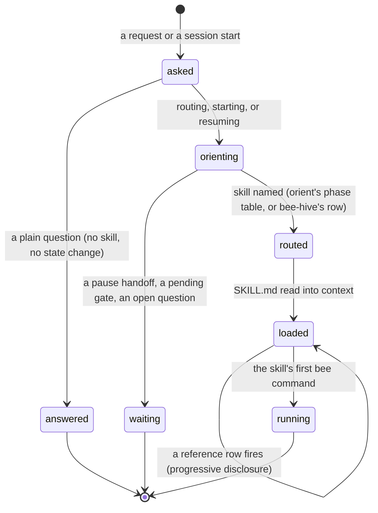

# The skills layer

## Summary

The commands and hooks described everywhere else in this set are the *product*: they hold state, they refuse, they deny. The skills are the *instructions* that tell the agent which of those commands to run, in what order, and what to say to the human between them. Twelve of them ship with bee, each a `SKILL.md` with a frontmatter `name` and `description` that decide when it gets loaded, a short body, and a `references/` directory the body pulls in only when a specific situation fires. One of them, `bee-hive`, is the router: it names the two flows, maps a situation to the next skill, and states how gates are presented. `bee orient` gives the same answer from the store's side — a `skill:` line naming what to load next. Nothing enforces any of it. The store has no "current skill" field, no command asks which skill is loaded, and no hook checks. The skills say what should happen; the binary and the guards decide what can. This document describes that layer and the seam between the two; the prose of any individual skill is not restated here.

## The simple case

The human asks for a feature. The agent runs `bee orient`, whose last two lines read:

```
skill: bee-shaping
next: interview the gray areas and lock them into docs/history/<feature>/CONTEXT.md
```

The agent loads `bee-shaping`, follows it — interview, then `bee decisions log` for each agreement, then the shape gate presented to the human — and when that skill's work is done, `bee orient` names the next one. The chain for ordinary feature work is short and fixed: shape → plan → swarm → capture. `bee-hive` is loaded when the situation is not one of those, or when the session is starting and does not yet know where it stands.

A plain question — "what does `bee close` check?" — loads no skill at all. The session preamble already carries the state, and a question is answered, not routed.

## The interaction, event by event

One routing decision, from a request to a skill's first command:



### Invoke

Two doors open a skill. The runtime can match a request against the frontmatter `description` — every bee skill's description is written as a trigger list, naming the situations and the phrases (including non-English ones, in `bee-wayfinding` and `bee-researching`) that should fire it. Or the agent loads one by name because `bee orient`, `bee-hive`'s routing table, or another skill's hand-off said to.

### Ends at once

The cases that need no skill: a plain question, a lookup the preamble already answered, and a `pause` handoff (which is presented to the human and waited on, never auto-resumed). Loading a skill costs context, so the discipline is to route once, not to load defensively.

### First side effect

The skills themselves write nothing. The first side effect is the first `bee` command the loaded skill tells the agent to run — `bee decisions log`, `bee route`, `bee cells claim-next` — and that command's own document owns what it changes. Between the skill's text and the store there is always a CLI invocation; there is no skill-shaped write path.

### While running

Progressive disclosure. `bee-hive`'s body is about 120 lines and ends in a table of five reference files with a "when to load" condition each: the default routing reference, the gates-and-delegation reference when a gate is about to be presented, the scout reference when deciding how much to read, the onboarding reference *only* when onboarding is actually in question, the go-mode reference for `/go` runs. Every quoted heading in the body resolves in one of those files. The other skills follow the same shape at their own size.

### Finish

A skill ends by naming the next one, or by closing the work. What survives is what went into the store: decisions, cells, caps, captures. The skill's text is context, and context is lost at compaction — which is exactly why the boundary rules are duplicated into `AGENTS.md`, which is loaded again at every session start.

## The three layers

| Layer | Loaded when | What it can do |
| --- | --- | --- |
| `AGENTS.md` (the BEE operating block) | Always, at context load, in every session | States the boundaries that hold in every mode: the gate rule, CLI-only state writes, the worktree rule, proof at close, the dispatch door, reservations, capture at close, the communication contract. It is instructions, not enforcement, but it is the layer that survives every route. |
| The twelve skills | On demand — a description match, or a name from `orient` / `bee-hive` | Sequence the commands, hold the craft, carry the wording for gates and questions. Also instructions. |
| The CLI and the hooks | Every invocation, every guarded tool call | The only layer that changes state or stops an action. Refuses, denies, repairs, records. |

The seam matters: a skill can tell the agent to do something the binary will refuse, and the binary wins. A skill can also fail to tell the agent something and the guards will still catch it — but the reverse is the trap the whole design warns about, because a guard's silence is never permission ([failure](failure.md)).

## The catalog

Which skill drives which command family. Command groups are named as the registry names them.

| Skill | Drives | Command families |
| --- | --- | --- |
| `bee-hive` | Routing, gates, onboarding, go mode | `orient`, `status`, `gate` / `state gate`, `onboard`, `close`, plus the pointers into every other family |
| `bee-shaping` | Fuzzy intent → locked decisions; backlog triage; the implement-plan brief | `intent set` / `shape`, `decisions log`, `route` / `state route`, `backlog add`/`propose`, `discovery stub`, `state waiting-on` |
| `bee-planning` | Lane, plan, cells prepared, the execution gate | `route` / `state route`, `state set`, `cells add`, `cells list`, `state plan-conflicts`, `worktree new`, `gate --merge` |
| `bee-swarming` | Cells run to done — orchestrator and worker roles | `cells claim-next`/`claim`/`show`/`ready`/`unclaim`/`escalate`/`schedule`/`judge`, `reservations reserve`/`release`, `cells finish` / `finish`, `dispatch prepare`/`wave`, `state handoff` |
| `bee-capturing` | Everything that settles becomes a record | `capture add`/`list`/`flush`, `decisions log`/`supersede`, `knowledge check`/`index`, `state scribing-run`, `state compounding-run`, `triggers add`, `close` |
| `bee-reviewing` | The independent review pass, on explicit request only | `reviews create`/`record`/`status`/`candidate add`, `worktree merge`, `backlog add` for findings |
| `bee-herding` | The unattended cockpit: bootstrap, dispatch, merge | `herding enable`/`status`/`classify-lane`/`interlock`/`pane`/`agent-start`/`result`/`wave`/`occupancy`/`record-worker`/`control-loop`/`run`, `worktree *`, `backlog pbi` |
| `bee-wayfinding` | Fog → a map of decision tickets | `discovery list`/`stub`, `decisions log`, `route`, `reservations reserve` |
| `bee-evolving` | bee's own gated self-improvement loop, in the bee repo only | `feedback collect`/`digest`/`rank` |
| `bee-grooming` | Project debt hunting, plus bee's entropy side-note | `cells list`, `decisions active`, `knowledge check`, `status`, `backlog add` |
| `bee-researching` | Evidence-labeled research into unfamiliar territory | `decisions log`; otherwise capability-driven (documentation search, upstream reading), not command-driven |
| `bee-writing-skills` | Building and pressure-testing skills themselves | None — it declares no dependencies and drives no command family |

Two of the twelve — `bee-researching` and `bee-writing-skills` — barely touch the CLI at all. They are craft, not pipeline, which is why the catalog is not a partition of the command tree.

## Where the skills and the product agree

Some skill rules have teeth in the binary; the rest are honor-system. The difference is worth knowing before relying on either.

| Rule the skills state | Enforced by the product? |
| --- | --- |
| Every dispatch goes through `bee dispatch prepare` | Yes — the model guard denies a bare dispatch and repairs a mismatched one ([guards](../foundations/guards.md)). |
| Never approve a gate yourself | Yes — `bee state gate --actor auto` without a bypass level refuses, and the UAT gate is never bypassed at any level ([gates](../foundations/gates.md)). |
| Never edit source before the merged gate | Yes — the gate guard denies the write. |
| Never build on a red base | Yes at the cap — a `red` proof result refuses ([execution](../lifecycle/execution.md)). |
| Code-touching work lives in its feature worktree | Yes — the worktree-first guard denies the write in main. |
| Reserve files before write-heavy swarm work | Yes during `swarming` — a conflicting path denies. |
| Close carries a capture line or an explicit "nothing settled" | Partly — `bee close`'s capture-queue door is report-only; the scribing-debt door blocks. |
| Load the skill `orient` names | No. Nothing records or checks which skill is loaded. |
| One commit per cell, with the cell id as a trailer | No — a convention, not a check. |
| Route by lane, keep narration under five lines | No — instructions only. |

## Modifiers

| Modifier | Effect on the skills layer | Can it differ mid-flow? |
| --- | --- | --- |
| `--json` | Not applicable to the skills themselves. It matters *inside* them: most skill steps read `--json` payloads (`bee orient --json`, `bee cells ready --json`) rather than parsing human text. | Per command. |
| Gate-bypass level | Changes which gate presentations a skill actually stops at; `bee-hive` states that the level table lives in one reference and nowhere else, and that setting a level never approves a gate. Headless is not bypass — a headless run still stops at every gate. | Config is re-read per invocation. |
| Store phase | Drives `orient`'s recommendation: `exploring`→`bee-shaping`, `planning`→`bee-planning`, `swarming`→`bee-swarming`, `scribing`/`compounding`→`bee-capturing`, everything else→`bee-hive`, with one override — a fully idle pipeline plus an open discovery map recommends `bee-wayfinding` ([orient](../lifecycle/orient.md)). | Yes, at each orient. |
| Where it runs | The skills assume the worktree rule and say so; a session in the main checkout is routed to open a worktree before execution work. `bee-evolving` refuses to run outside the bee repo at all. | Yes. |
| Who runs it | A dispatched worker gets the executing half of `bee-swarming` and nothing else — its whole world is the one cell in its prompt. The orchestrator holds the deciding half. | — |

## Cancel and interrupt

Columns: before and after the skill's first command (the first side effect that can exist at all).

| Event | Before the first command | After |
| --- | --- | --- |
| The process killed mid-command | A skill load is a read; nothing to clean. | The command's own document owns its half-done state; the skill layer keeps nothing. |
| The session turning elsewhere (compaction, handoff, turn end) | Loading is lost — the skill must be re-read after compaction. The routing answer is cheap to re-derive from `bee orient`. | The store is authoritative over recollection; the compact capsule says so in its first line. Records made by the skill's commands survive; the skill's own reasoning does not. |
| A clean completion from outside (gate approved, question answered, new message) | The human's message clears the waiting mark; the agent re-routes on the new information. | A gate approved mid-flow is what most skills are waiting for; they read it back through `bee orient` / `bee status`, never from memory. |
| The store unavailable (lock contention, corrupt JSON, the hook binary missing) | `orient` still answers — reads are total and fall back to defaults — so routing survives a damaged store. Each skill declares a `bee-cli` dependency with a `missing_effect` of `unavailable`, `degraded`, or `blocked`, which is its own statement of what to do when the binary is not there. | Same. |
| The session going away (heartbeat expiry, lease expiry, `session release`) | No effect — skills hold no lease. | A `planned-next` handoff carries the claim; the adopting session re-routes from scratch and loads the skill again. |
| A sibling changing the target | Not visible at this layer; the command the skill runs is what meets the conflict, and the answer is the deny or refusal that names the sibling. | Same — triage data, then keep working. |
| The channel changing (piped, `--json`, Codex, run from a hook) | Skills are installed per runtime by onboarding, so the same twelve exist on Claude and Codex with different projections; `bee-herding` additionally branches on its transport (`herdr` or tmux). The OpenCode plugin is out of scope. | Same. |

## Interactions with other systems

**Gates and approval.** The skills own the *wording* of a gate — plain-language layer plus the fixed question, report linked, never pasted — and `bee state gate` owns the record. `bee-hive` names exactly three gates plus the later `uat` stop, and states that gates belong to the human in every mode, headless included.

**The store and history.** The skills read the store through `orient`, `status`, and `--json` payloads, and write it only through verbs. `docs/knowledge/` is the state layer they read before code; `docs/history/<feature>/CONTEXT.md` holds the locked decisions they cite and never reinterpret.

**Worktrees and containment.** `bee-planning` creates the feature's worktree in the same step that routes a code-touching lane; `bee-swarming` executes inside it; `bee-reviewing` and `bee-herding` reach `bee worktree merge` ([worktrees](../foundations/worktrees.md)).

**Claims, holds, and reservations.** Entirely `bee-swarming`'s vocabulary, plus `bee-wayfinding`'s one use of `reservations reserve` when a map is being edited by more than one session.

**Sibling sessions.** The skills state the etiquette — claim through `cells claim-next`, never browse for open cells; on a deny, take disjoint work and report — and the coordination guards enforce it.

**What the human sees.** This is the layer that decides that: one line of state, narration under five lines, exactly one next action, work language with no bee mechanics, and a progress tick per visible step. None of it is checked by the product; all of it is what the human actually experiences.

**Configuration.** `gate_bypass` is the one config key the skills route around explicitly. Which skills are installed, and where, is onboarding's business ([onboarding](../maintenance/onboarding.md)); `bee doctor` reports the wiring.

**Output modes and exit codes.** Unchanged — the skills consume the standard contract ([invocation](../foundations/invocation.md)) and are not part of it.

## Edge cases

- Twelve skills exist, and `bee orient`'s phase table names only five of them plus the `bee-hive` default and the `bee-wayfinding` override. The other six are reached by description match or by a `bee-hive` table row, never by phase.
- `bee-reviewing` is deliberately not reachable from a phase: review is user-invoked, and a finished cell, slice, or feature is never a trigger by itself. "Merge", "ship", and "release" are not triggers either — the response there is to report coverage and ask one question.
- `bee-hive` calls `bee orient` a routing-only ritual: run it when starting, resuming, or routing, and not for a plain question. Running it more often is waste, not error.
- A skill's `metadata.dependencies` block declares what it needs (`bee-cli`, `node`, `herdr`, `tmux`, a documentation-search capability) and what its absence costs. Nothing in the binary reads that block; it is a statement the skill makes to whoever loads it.
- `bee-evolving` runs only inside the bee repository and never in a host repo, so a host-repo agent has one skill it can never legitimately load.
- The skills are installed by onboarding, which reports skipped skills with a reason rather than failing; a host whose `bee-hive` was skipped has a bee with no router.

## Open questions and verification

- **Suspected staleness:** `bee-evolving` declares a `nodejs-runtime` dependency and its steps call `node .bee/bin/bee.mjs feedback rank`, but the interpreted runtime was retired — `.bee/bin/bee` is the compiled binary and no `.mjs` remains — while the registry does carry native `feedback collect|digest|count|rank`. If that skill were loaded today the command would fail. Worth a triage entry; not probed, because the skill runs only in the bee repo and only on explicit human invocation.
- The `missing_effect` values (`unavailable`, `degraded`, `blocked`) were found only in skill frontmatter and in the handbook; no code reads them. Whether any runtime acts on them was not determined.
- How a runtime decides to surface a skill from its `description` (exact matching behavior, ranking, whether more than one can fire) is the harness's business, not bee's, and was not investigated.
- The command families in the catalog were derived by reading each `SKILL.md` and its references for `bee …` invocations; a family a skill uses only inside a reference file may be under-represented.
- `bee orient`'s phase-to-skill table was read from source (five rows plus the default and the discovery override) and matches what [orient](../lifecycle/orient.md) records; it was not exercised across every phase.
- Nothing in this document was confirmed by running a skill end to end; skills are instructions, and their observable effects are the commands described in the other documents.

Verified against beehive commit `6b0ae488`.
