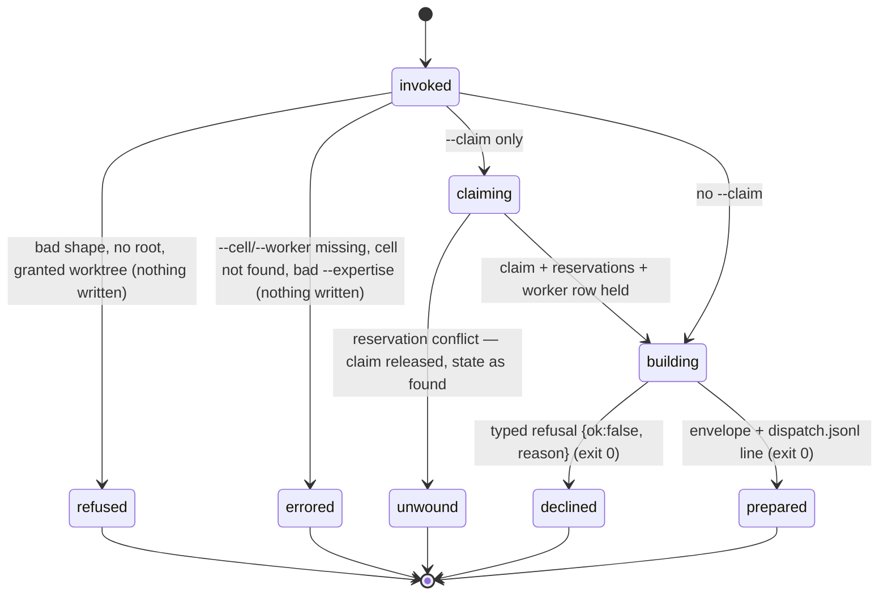

# The dispatch door: prepare and wave

## Summary

Every subagent an agent spawns goes through one door. `bee dispatch prepare` takes a runtime and a purpose, resolves which model that purpose should run on, renders the worker's prompt from a vendored template, and hands back the exact tool to call and the exact payload to call it with — plus a `dispatch_id` and an `economics` record that says which model channel the dispatch actually took. The agent runs what it was handed and nothing else: it never picks a `subagent_type`, a `model` parameter, or a `[bee-tier: …]` marker itself. Those are what prepare *returns*, and the [model guard](workers.md) refuses or repairs anything that arrives without them. `bee dispatch wave` is the same door in bulk: it claims, reserves and prepares every cell of the current schedule wave in one call, one payload per cell, so an orchestrator with eight ready cells makes one round trip instead of eight.

The door is announced to every session. The preamble's **Dispatch door** section prints the command line and the roles this host configures, and the compaction hook re-injects the same two lines afterward, so an agent that lost its context still knows where dispatches come from.

## The simple case

The agent needs a read-only search across many files. It runs the door first:

```
bee dispatch prepare --runtime claude --kind gather --json
```

bee prints an envelope:

```json
{
  "tool": "Agent",
  "payload": {
    "subagent_type": "bee-gather",
    "prompt": "[bee-tier: generation]\nGather: locate and digest the requested paths/facts…",
    "description": "gather (sonnet)",
    "model": "sonnet"
  },
  "dispatch_id": "…",
  "economics": {
    "logical_tier": "generation",
    "requested_model": "sonnet",
    "effective_model": "sonnet",
    "effective_model_status": "pinned",
    "channel": "claude-agent",
    "enforcement": "model-param",
    "tier_source": "default"
  }
}
```

That envelope is a host with **no `read` key**: the gather's `[read,
generation]` walk finds nothing at `read` and lands on `generation`,
byte-identical to what the door returned before the read slot existed. A host
that configures `read` gets that slot's model instead, and the marker and
`logical_tier` both read `read`.

The agent then makes exactly that call: the Agent tool, with that payload, its own task text filled into the prompt's `Paths:` line. The model guard sees a dispatch that already names its role and its agent, has no opinion to act on, and logs it.

For a cell, the door does more. `--claim` turns "cell chosen" into "worker prompt in hand" in one verb:

```
bee dispatch prepare --runtime claude --kind cell --cell lrl-2 --worker exec-lrl-2 --claim --json
```

bee claims `lrl-2` for `exec-lrl-2`, reserves every path in the cell's `files`, registers the worker row, renders the worker prompt with the cell's JSON inlined, and returns the same envelope with `claimed: true`, `reserved: [paths]`, and `worker_registered: true` added.

## The interaction, event by event

One `bee dispatch prepare` invocation:



### Invoke

`--runtime` (`claude` or `codex`) and `--kind` (`cell`, `gather`, `reviewer`, `advisor`) are both required and both enum-checked; anything else refuses at the shape layer ([invocation](../foundations/invocation.md)). Flags accepted beyond those two: `--role`, `--cell`, `--worker`, `--purpose`, `--force-ownership`, `--claim`, `--session-id`, `--expertise`, `--json`.

The store root resolves as usual, with one refusal of its own: run from inside a **granted worktree**, prepare refuses by name — `bee dispatch prepare: refused inside a granted feature worktree — this command reads the shared control plane (sessions, claims, workers, workflows, handoff), which lives in the main checkout. FIX: run it from <main>.` A dispatch is always prepared from the main checkout; the envelope then *tells* the worker where to work (see "worktrees and containment" below).

Before anything is built, bee byte-compares the prompt template it has compiled in against the one on disk (`.bee/bin/prompts/` or `packages/bee/prompts/`). A mismatch stops the command rather than rendering a worker prompt from stale bytes.

### Ends at once

Two different kinds of "no" come out of this door, and they carry different exit codes.

**Errors (exit 1, human message on stderr, `{"error": …}` on stdout under `--json`).** These are malformed calls:

- `dispatch prepare: --cell is required when --kind cell.`
- `dispatch prepare: --worker is required when --kind cell.`
- `dispatch prepare: cell "<id>" not found.`
- `dispatch prepare: --claim is only valid with --kind cell (got --kind gather) — claiming and reserving are cell-execution moves; gather/reviewer/advisor dispatches never own a cell.`
- `malformed --expertise line (want '<path> :: <purpose> :: <read-to>'): <line>`

**Typed refusals (exit 0, a JSON object on stdout).** These are legitimate resolutions that end in "no", and they are returned as data so a caller can branch on `reason`:

| `reason` | When | What the `fix` says |
| --- | --- | --- |
| `claim_ownership` | `--kind cell` over a cell that is not `claimed`, or is claimed by someone else | names the actual status and owner; `--force-ownership` overrides, audited |
| `role_not_configured` | `--role <name>` naming a role `models.<runtime>` does not carry | lists the roles this runtime can resolve, and how to add one |
| `tier_not_configured` | a pre-role cell record whose recorded `tier` nothing configures | `set models.<runtime>.<tier> in .bee/config.json` |
| `cli_tier_gather_only` | a cli-shaped slot resolved for `--kind cell` | declare `{for:"gather"}`; cell execution through a cli tier stays refused |
| `advisor_not_configured` | `--kind advisor` (or `--role advisor`) with no advisor slot | `set models.<runtime>.advisor` — the advisor never falls back |
| `native_unavailable` | a codex native slot with no fallback command | carries the classification as `detail` |
| `kind_slot_unmapped` | a `--kind` with no slot mapping — unreachable today | names the code arm to add |

That an ordinary refusal exits **0** is worth knowing before scripting around this door: `ok` in the payload, not the exit code, is what says whether a dispatch was produced.

### First side effect

Without `--claim`: the append of one line to `.bee/logs/dispatch.jsonl`, tagged `source: "prepare"`, carrying the `dispatch_id`, kind, cell, runtime, the economics fields, and any `ownership_override`. Nothing else is written; the append is fail-open, so a log failure never costs the agent its payload.

> Technical note: the whole envelope is built **twice**. The first pass is a dry run with the log append switched off; only the second pass records. That is why a prepare that ends in an error leaves no line behind and a served one leaves exactly one.

With `--claim`, the first side effect moves much earlier and is much larger. In order: the claim (the same exclusive-create door `bee cells claim` uses, refusals passed through unchanged), then one reservation per path in the cell's `files`, **in declaration order**, then the worker row that registers `<nickname>` against the cell. Only then is the payload built.

### While running

`--claim` is the only shape with a real middle, and it is written to be undoable. A reservation conflict on the third of five files stops there and unwinds in reverse — reservations released first, then the claim — so the refusal can truthfully say the repository is back as it was found:

```
dispatch prepare --claim: reservation conflict on cell "lrl-2" — nothing dispatched; the claim was unwound and state restored as found:
- exec-other holds "src/auth/limit.rs" (cell lrl-9)
```

If the unwind itself fails, the message says `UNWIND FAILED (<why>) — restore by hand:` and spells out the two commands to run. The worker row is registered only after every reservation stands, and a failure to register it never unwinds anything — it rides back as `worker_registered: false` plus `registration_error`, named loudly in the payload the agent is about to use.

### Finish

The envelope on stdout, pretty-printed, and the timing line `[bee] dispatch prepare <N>ms` on stderr. Exit 0. `--json` changes nothing about a successful run — prepare always prints JSON — it changes only where an *error* lands.

The envelope's keys: `tool`, `payload`, `dispatch_id`, `economics`, plus `worktree_root` and `control_root` when the cell's feature has a granted worktree, `transport`/`fallback_reason` on the codex native paths, `ownership_override` when `--force-ownership` was used, and `claimed`/`reserved`/`worker_registered` when the cell was claimed.

## What the door decides

**The kinds.** `cell` is the only execution purpose: it requires `--cell` and `--worker`, loads the cell record for prompt context, and checks the requesting worker against the cell's own claim. `gather` is the read-only default, and with no `--role` it asks for the read job: an ordered walk of `[read, generation]` that takes the first name the host configures. `extraction` is deliberately absent from that tail — it was the cheapest slot of the tier era and never the gather slot, so a host that configures `extraction` and `generation` but no `read` keeps its gathers on `generation` rather than sliding down to the cheap reader. The name that *won* the walk is the name the dispatch travels under: `[bee-tier: <winner>]` and `economics.logical_tier` both read `read` on a host that configures it and `generation` on one that does not, while the agent is pinned by the kind, so a role-less gather is `bee-gather` either way. `reviewer` resolves the review role, falling through to generation when review is unconfigured. `advisor` resolves the advisor slot alone — one name, no fall-through, so an unconfigured advisor refuses rather than quietly running on something else.

**Roles are an open set.** A role is any name `models.<runtime>` carries; bee holds no fixed list, and a host can configure `test` or `design` and reach it. `--role <name>` names the slot outright — the kind's default is not consulted, and neither is the cell's own recorded role. That is how a read-shaped gather reaches the cheap reader: `--kind gather --role extraction` resolves the extraction slot and returns the `bee-extract` worker. A name nothing configures refuses by name rather than resolving onto something else.

**A cell declares its own job.** With no `--role`, a `--kind cell` dispatch reads the cell's recorded `role` and resolves an ordered list headed by it: `[<the cell's role>, "code", "generation"]`, or `["read", "extraction", "generation"]` for a read-shaped cell. The walk takes the first name the host configures, so a host that never heard of `code` still lands on the `generation` model it has had for years. `economics.tier_source` records who chose: `flag`, `cell`, or `default`.

**Escalation is a flag, not a role.** A cell marked escalated resolves to the session model: the payload carries no `model` parameter, the marker reads `[bee-tier: ceiling]`, and `economics.channel` is `session-model`. A cell cannot escalate itself by *declaring* `role: "ceiling"` — that reads as a role nothing configures and falls through — because the escalation ration counts the flag, not the word.

**The transport follows the slot.** A model slot on claude builds an `Agent` call; on codex a `spawn_agent` call whose message opens with the marker. A cli-shaped slot builds a `Bash` call — the configured command, the prompt on stdin. A herding slot builds a `Bash` call running `.bee/bin/bee herding run --task-file - --json`, with `transport_ready` and `transport_reason` probed and reported ([herding](herding.md)).

## Wave

`bee dispatch wave --runtime claude [--feature <f>] [--limit <n>] [--session-id <s>] [--json]` prepares the current schedule wave — the same first placed wave `bee cells schedule` reads — in one call. Each cell runs the identical claim + reserve + build path, under an auto-derived nickname `w-<cell id>`, so a payload in `wave` is byte-identical to what the single-cell command would have emitted.

The result is three arrays, always present even when empty: `wave` (one envelope per prepared cell), `skipped` (`{id, reason, detail}`), and `economics` (one entry per prepared cell, with its `id` folded in).

One cell's refusal never aborts the rest. The skip reasons: `already_claimed`, `reservation_conflict`, `claim_refused`, `prepare_failed`, `unwind_failed`, `unsupported`. A skipped cell that had already been claimed by this call is unwound — reservations, claim, worker row — before it lands in `skipped`; `unwind_failed` is checked first and reported first, because a leaked claim matters more than the conflict that caused it.

Because wave **mutates** the shared control plane, it scopes to exactly one feature: an explicit `--feature`, else the calling session's bound lane, else the default record's own feature. Nothing resolving is a refusal, never a grab across every feature:

```
dispatch wave: refused — no feature resolved (no --feature given, the calling session has no bound lane, and the default record names none). FIX: pass --feature <name> naming the pipeline to dispatch.
```

`--limit <n>` caps how many of the wave's cells are actually claimed; the rest are left untouched and not reported. A non-positive or non-integer value refuses: `dispatch wave: --limit must be a positive integer.`

## Modifiers

| Modifier | Set at invocation | Can it differ mid-flow? |
| --- | --- | --- |
| `--json` | Almost nothing. Both doors always print pretty JSON on stdout; the flag moves only an *error* from a stderr line to `{"error": …}` on stdout. The registry says as much — "flag kept for surface consistency". | No — one invocation, one mode. |
| Gate-bypass level | No effect on prepare itself. It reaches `--claim` and `wave` indirectly: the claim door reads the lane's execution gate, and a bypass-approved Gate 2 claims identically to a human-approved one ([gates](../foundations/gates.md)). | Config is re-read per invocation. |
| Store phase | Preparing is never gated — a `gather` payload can be built at idle. Claiming is: `--claim` and `wave` inherit the claim door's refusal before Gate 2, and reservations are hard-enforced only in `swarming` ([guards](../foundations/guards.md)). | Per invocation. |
| Where it runs | Main checkout only. A granted worktree refuses by name. The envelope carries `worktree_root`/`control_root` when the cell's feature has a worktree, and the worker prompt gains a Location block telling the worker to self-check its working directory. | Per invocation. |
| Who runs it | The orchestrator's door. A dispatched worker has no business preparing a second dispatch, and the claim-ownership check makes a cell dispatch by a non-owner refuse. Hooks never call it; they only *name* it in their FIX lines. | — |

## Cancel and interrupt

Columns: before and after the first side effect — the `dispatch.jsonl` append for a plain prepare, the claim for `--claim` and `wave`.

| Event | Before the first side effect | After the first side effect |
| --- | --- | --- |
| The process killed mid-command | Nothing recorded. The dry-run pass writes nothing, so a kill during the build costs only the run. | Plain prepare: a log line may exist for a payload the agent never received — harmless, and the dispatch simply never happened. `--claim`/`wave`: the claim, its reservations and its worker row **stand** with no payload delivered. The lease (3600 s) and the sweep are the recovery path; `bee cells unclaim` and `bee reservations release` are the deliberate one. |
| The session turning elsewhere (compaction, handoff, turn end) | An invocation is atomic from the session's point of view. | Same — but a claim taken and never dispatched is exactly the state a `pause` handoff must name, or the next session finds a cell claimed by a worker that never ran. |
| A clean completion from outside (gate approved, question answered, new message) | No effect. A gate approved between two invocations changes what the *next* claim sees. | No effect. |
| The store unavailable (lock contention, corrupt JSON, hook binary missing) | Root resolution or the config read fails first; a corrupt `.bee/config.json` reads as absent, so models fall back to defaults and the resolution proceeds. Corrupt coordination state (reservations, holds) fails closed and the claim refuses. | The unwind runs against the same stores; if it cannot, the refusal says `UNWIND FAILED` and names the two commands to run by hand. |
| The session going away (heartbeat expiry, lease expiry, `session release`) | No effect — preparing holds no lease. | The claim's lease is what expires; a dead session's claim is sweepable once TTL and heartbeat both lapse ([execution](../lifecycle/execution.md)). The reservations and the worker row outlive it until swept. |
| A sibling changing the target | The claim's exclusive create is the arbiter: the loser is refused with the owner named. In `wave` that is one `already_claimed` skip and the loop continues. | A sibling reserving a path first turns into the conflict refusal and the unwind; a sibling that caps the cell underneath makes the prepared payload stale — the worker's own ownership validation catches it. |
| The channel changing (piped, `--json`, Codex, run from a hook) | `--runtime codex` changes the payload shape, not the door: `spawn_agent` with the marker opening the message. A codex host carrying a live native-transport probe record is a shape this binary does not serve. | Same. |

## Interactions with other systems

**Gates and approval.** Prepare itself asks for no approval. `--claim` and `wave` inherit the claim door's execution-gate refusal in full, which is the only gate in this area.

**The store and history.** `.bee/logs/dispatch.jsonl` is the record: one `source: "prepare"` line per served dispatch, then one line per dispatch the [model guard](workers.md) sees. Both write the same `logical_tier`/`requested_model`/`effective_model`/`effective_model_status`/`channel`/`enforcement` fields, deliberately, so the file reads as one schema.

**Worktrees and containment.** The door runs in main and refuses in a granted worktree. When the cell's feature has one, the envelope carries `worktree_root` and `control_root` and the worker prompt carries a Location block instructing the worker to stop with `[BLOCKED]` if its working directory is not inside the worktree — because a subagent inherits the spawning session's working directory and cannot fix that itself ([worktrees](../foundations/worktrees.md)).

**Claims, holds, and reservations.** `--claim` is the shared claim door plus the shared reserve door, never a second copy. A cross-worktree hold surfaces here as a conflict line naming the holding checkout. Everything reserved is released at cap by `bee cells finish` ([reservations](../coordination/reservations.md)).

**Sibling sessions.** Two orchestrators can prepare at once; the claim's exclusive create decides who owns a cell. `wave`'s one-feature scope exists so a second session's pipeline is never swept into the first's batch.

**What the human sees.** Nothing directly. The preamble's Dispatch door section is written for the agent; the human sees per-cell progress ticks and, when the guard repairs a dispatch, a `systemMessage` naming the fix.

**Configuration.** `models.<runtime>` is the whole authority: which roles exist, which model each resolves to, whether a slot is a model, a cli command, a herding pane, or off. `retry.fallbackChains` optionally attaches a `fallback_chain` beside a payload's model — published as advice for the caller, never a loop bee runs. `herding.transport` decides which environment variables the reachability probe reads.

**Output modes and exit codes.** 0 for a served payload *and* for a typed refusal; 1 for a malformed call, a missing cell, a reservation conflict, or an unresolvable wave feature. Standard streams otherwise ([invocation](../foundations/invocation.md)).

## Edge cases

- `--session-id` without `--claim` is documented as ignored, and this binary declines that argv shape rather than serving it — so passing it produces a shape refusal, not a silent ignore.
- `--purpose` is folded into the label as `<kind>: <purpose>` on every transport, and is ignored for `--kind cell`, whose label is always `<cell id>: <cell title>`. Omitted, the label is the bare kind — which reads as a column of `gather` rows in the agent list, and is exactly why the flag exists.
- A cli-exec payload carries `{command, stdin}` and no label field at all. There is nowhere on an external executor call to put a subject; the limit is recorded, not overlooked.
- `--force-ownership` never transfers the claim. It appends an audited `ownership_override` entry whose own note says the actual claim owner was *not* transferred — an advisory bypass, and the payload says so.
- A cell whose title is blank falls back to the bare kind as the label rather than emitting a dangling `id: `.
- The prompt-skew check compares the compiled-in template against the on-disk one. In a repo that ships no prompts, there is nothing to compare and the compiled bytes are used.
- `wave` truncates to `--limit` *after* computing the wave, so the cells left out are the tail of the schedule order, not an arbitrary subset.
- `bee dispatch prepare --help` prints the registry entry, which is unusually long — the full resolution rules live in the flag descriptions.

## Open questions and verification

- **Exit code 0 on a refusal.** Every typed refusal (`claim_ownership`, `role_not_configured`, `cli_tier_gather_only`, `advisor_not_configured`, `native_unavailable`) is emitted as a payload with exit code 0, while a malformed call exits 1. Whether that split is intended (a refusal is data the caller branches on) or is a hazard for shell callers is a product question; noted for [bug-triage.md](../bug-triage.md).
- **Inherited-delegation shapes.** Several argv and store shapes make the verb decline rather than answer: `--session-id` without `--claim`, a non-boolean `--claim` spelling, a codex host with a live native-transport probe record, and a prompt-template skew. With the Node runtime retired these now fall through to the router's generic `bee: unsupported argument shape` refusal — the same family [invocation](../foundations/invocation.md) flags. Not probed live; the wording an agent actually sees for each was not confirmed.
- Whether a granted worktree's `dispatch wave` produces the same named refusal as `prepare` was read from the shared root-resolution path, not observed.
- The codex native transport (`native_model_override`, `reasoning_effort`, the probe record) was read but not exercised; no codex host was available.
- `fallback_chain` was read as a published contract and its consumers were not traced — nothing in bee executes a chain step.
- Confirmed by running the binary read-only in this repository: `bee dispatch prepare --help` and `bee dispatch wave --help`, including the full flag set and the timing line. No mutating dispatch call was made, so every envelope and refusal text above is quoted from source and its tests rather than observed.

Verified against beehive commit `6b0ae488`.
