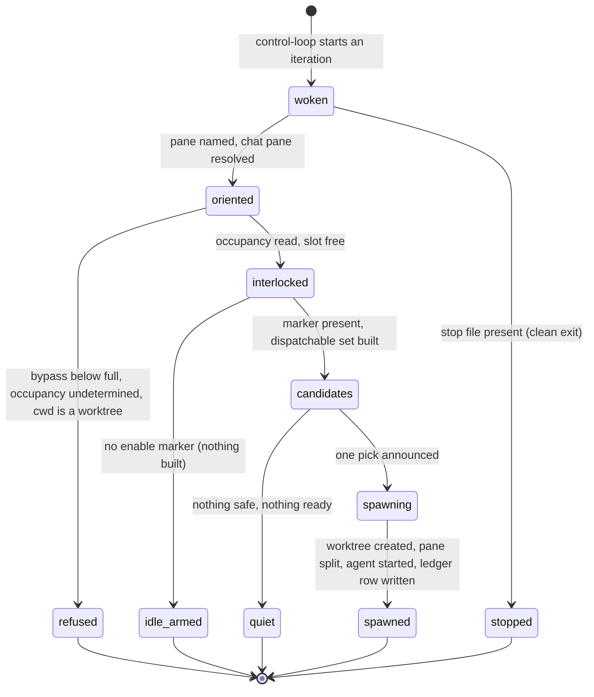

# The unattended cockpit: bootstrap, dispatch, merge

## Summary

Herding is the layer that runs bee without a human in the chair. A *cockpit* — a set of terminal panes, one per role plus one per working agent — is built once by the human, and from then on a cold **dispatch** loop wakes on a fixed interval, picks one safe backlog item, creates a feature worktree for it, and starts an independent coding agent inside it. Nothing about that loop can land anything: **merge** is a separate single-shot gesture the owner runs by hand, in the main checkout, with a person present. Everything the roles do is spelled through one command group, `bee herding …` — the enable interlock, the lane classifier, the pane vocabulary, the occupancy ledger, and the loop driver itself — so a cold control agent that has no memory of the previous iteration can still read every fact it needs off disk. Two switches gate the whole thing: the human's `gate_bypass` level must be `full` or `total`, and the human must have created the *enable marker* by hand. Without either, dispatch refuses every cycle and says so. This document owns the three roles and the `bee herding` verb group; the in-session subagent path is [dispatch](dispatch.md), and the geography the roles act on is [worktrees](../foundations/worktrees.md).

## The simple case

The human opens a terminal in the main checkout and invokes the bootstrap role. It resolves the main root from the shared `.git` directory, checks that main is clean, checks that `gate_bypass_level` is `full` or `total`, checks that no pane already carries the label `dispatch`, and runs the one-shot script. The script builds a cockpit tab (chat pane, dispatch pane, merge pane) and a runtime tab (one empty pane), then starts exactly one loop:

```
bee herding control-loop --role dispatch --main-root <main-root>
```

The merge pane is built and left idle on purpose. Now the human arms the loop:

```
touch <main-root>/.bee/tmp/bee-herding.enable
```

Every 60 seconds a fresh headless control agent runs one dispatch iteration: it names its own pane, re-reads the bypass level, finds the chat pane by geometry, reads how many worker slots are occupied, checks the enable marker, builds the set of backlog items that are ready and unstarted, classifies each one for lane safety, announces its pick into the chat pane, creates the worktree, splits a pane, starts the working agent in it, and records the spawn in the wave ledger. Then it exits. It never speaks to that worker again.

When work is finished, the human runs the merge role once. It reads bee's own record for worktrees that are finished, runs `bee worktree merge --id <grant-key> --cleanup` for each, closes the worker's pane, and stops. A red result stops that worktree cold and writes a durable marker so no later run retries it.

The human stops the loop with `touch <main-root>/.bee/tmp/bee-herding.stop`, which halts the controller at the next iteration boundary — and leaves every running worker alive.

## The interaction, event by event

One dispatch iteration — the cold control-loop cycle that is the cockpit's whole engine:



### Invoke

`bee herding control-loop --role dispatch|merge` parses its flags — `--main-root`, `--interval` (default 60 s), `--timeout` (default 900 s), `--max-iterations` (default cap 10 000, never unbounded), `--max-consecutive-failures` (default 20), `--turn-ceiling` (default 50), `--once` — and refuses a value-taking flag with no value rather than spin. It resolves the role's opening prompt from `skills/bee-herding/references/<role>-prompt.md` under the main root, and builds the control agent's argv: with no `herding.control_command` in config the default is `claude -p "<prompt>" --model sonnet --max-turns <ceiling> --allowedTools <surface>`; with the key present, each token is substituted in place. There is no shell anywhere on that path — never a join-then-split, never `eval`.

The other verbs of the group parse a flat argv of their own. The `herding` namespace is probed before the ordinary verb tree, so it can never collide with another command.

### Ends at once

The refusals and short answers, none of which start work:

- **The stop file.** `<main-root>/.bee/tmp/bee-herding.stop` is checked both before and after every iteration; present, the loop exits clean.
- **The enable interlock.** `bee herding interlock` prints `{enabled, marker, main_root, reason}` and exits **0** when the marker is present, **3** when it is absent, and **1** when the main root cannot be resolved at all. Exit 3 is the cockpit's one extra exit code and is not a failure — it is "armed: no", the loop's ordinary resting answer. The disabled reason names the exact gesture: `touch <marker>`.
- **The bypass level.** The dispatch role reads `bee status --json` every iteration and builds nothing when `gate_bypass_level` is not exactly `full` or `total`. The level is a human-owned posture; a role that finds it too low announces the refusal and ends — it never raises it.
- **Occupancy undetermined.** `bee herding occupancy --json` answers `{count, source}` where `source` is `live` (the wave ledger crossed against the transport's own live pane list) or `fallback` (a degraded one-hour timer). A `fallback` answer, or a failed call, is a refusal to dispatch that iteration — not a count. Four occupied slots is the cap.
- **Lane safety.** `bee herding classify-lane <PBI-ID>` always exits 0 and always prints `{pbi, lane, hard_gate_flags[], lane_safe, reason}`. It fails **closed**: no id, an unreadable backlog fold, no matching record, empty title-and-acceptance text, or an out-of-enum status all come back `high-risk` / `lane_safe: false` with the reason naming why. One hard-gate flag — auth, authorization, data model or data loss, audit or security, external systems, weakening or deleting existing proof — classifies high-risk on its own; four flags of any kind do the same; two or three give `standard`; zero or one gives `small`, the safer of the two lanes it cannot tell apart from backlog text.
- **`--dry-run`** on the dispatch role reports the whole decision and changes nothing: no rename, no chat line sent, no worktree, no pane, no agent.

> Technical note: `classify-lane` matches an English keyword list against the item's title and acceptance text, and it reads the backlog row rather than the work. A record whose danger is not spelled in one of those words returns `lane_safe: true`. The role protocol treats that verdict as "no keyword hit", never as "safe", and requires the control agent's own independent reading of the record as a second key. Either key alone refuses; only agreement dispatches.

### First side effect

For a dispatch iteration, the first thing that changes outside the pane is `bee worktree new --feature <slug>`: the worktree directory, the branch, and the grant in the main store all appear together. Before that point the iteration has only read state and possibly typed lines into the chat pane. After it, three more writes follow in order — the pane split, `bee herding agent-start` in that pane, and one `bee herding record-worker` row appended to the wave ledger.

For the merge role, the first side effect is `bee worktree merge` reaching its `git merge` step; every check before that is zero-mutation, so a refusal leaves main byte-untouched.

### While running

The controller is a headless invocation under a wall-clock ceiling. When the ceiling expires the process is terminated by pid and hard-killed after a 30-second grace window, and the iteration counts as failed. Consecutive failures back off with a cap of 600 seconds and give up — non-zero exit — at the failure ceiling. A sibling reading state mid-iteration sees ordinary bee state: a new grant, a new cell-free worktree, a new ledger row.

The recording step is what closes the loop. A spawn that is never recorded with `record-worker` is invisible to the next iteration's occupancy read, which is how the four-slot cap gets walked past silently; the protocol makes that failure loud and ends the iteration without a second spawn.

### Finish

The iteration exits and the loop sleeps for its interval. The pane keeps whatever the role typed into it; the label the role gave its own pane outlives the process that set it, which is how the next cold iteration recognises itself. The loop exits clean at the iteration ceiling, on `--once`, or on the stop file; it exits non-zero only at the consecutive-failure ceiling.

## Modifiers

| Modifier | Set at invocation | Can it differ mid-flow? |
| --- | --- | --- |
| `--json` | `occupancy`, `status`, `wave`, `record-worker` and `run` take it and print the payload on stdout. `interlock` and `classify-lane` always print JSON on stdout, with no flag — their callers are scripts and cold roles. The pane verbs always print one envelope: `{"ok":true,"transport":…,"result":{…}}` and exit 0, or `{"ok":false,…,"error":{"code","message"}}` and exit 1. | No — one invocation, one mode. |
| Gate-bypass level | The precondition for the whole cockpit: bootstrap refuses to build below `full`, and dispatch refuses to pick up work below `full` on every iteration. `full` or `total` is required because an auto-created worktree inherits the repo's level and an unattended agent must not inherit `normal`'s latitude for hard-gate work. The UAT gate is still never bypassed ([gates](../foundations/gates.md)). | Yes — read live each iteration, so lowering it mid-night stops the next cycle. |
| Store phase | Not read by the loop. Dispatch reads a *worktree's* phase to judge whether it is finished (`compounding-complete`, zero open or claimed cells, clean tree, `HEAD` on `wt/<slug>`), and merge uses the same four conditions. | The phase belongs to each worktree, not to the cockpit. |
| Where it runs | Main checkout only. Both control roles refuse when the working directory resolves inside a linked worktree, because `bee worktree new` and `bee worktree merge` both refuse there. The bootstrap script requires `--main-root` and roots every pane it creates at it. | No — a control pane's directory is fixed when it is created. |
| Who runs it | Three actors, three acts. The human bootstraps once, arms and disarms the marker by hand, and runs merge. The dispatch controller only starts work. The merge controller only retires it. A working agent runs the ordinary bee chain inside its own worktree and never reads the cockpit's files. | No — the role boundary is the safety property. |

## Cancel and interrupt

Columns: before and after the spawn (`bee worktree new` onward), the iteration's first side effect.

| Event | Before the spawn | After the spawn |
| --- | --- | --- |
| The process killed mid-command | Nothing changed; the next iteration starts cold and re-reads everything. | A half-built spawn is what the anomaly scan is for: an unlabelled pane whose foreground directory is a worktree, or a grant with no ledger row, is reported once into the chat pane and left alone. A killed *merge* can leave `MERGE_HEAD` on main; the merge role aborts it and ends without merging anything. |
| The session turning elsewhere (compaction, handoff, turn end) | Not applicable — every iteration is a fresh headless invocation with no memory. Carrying anything over from a previous iteration is forbidden; only bee state, git, and the panes persist. | The working agent's own session owns its handoffs; the cockpit never reads them. |
| A clean completion from outside (a gate approved, a question answered, a new message) | The human arming the marker, or raising the bypass level, is exactly this: the next iteration reads the new answer with no restart. | Approving a worktree's UAT gate is what lets a later merge gesture land it. |
| The store unavailable (lock contention, corrupt JSON, the hook binary missing) | `interlock` with an unresolvable main root reports `enabled:false` and exits 1 rather than assuming permission. `classify-lane` with an unreadable backlog fold answers high-risk and unsafe. A missing or unparseable config reads as the herdr transport and the built-in default commands. | The ledger is append-only; a torn row is skipped by the read side. |
| The session going away (heartbeat, lease, `session release`) | The loop has no bee session of its own and holds no claims. | A worker whose session dies leaves an unfinished worktree; dispatch reports it once as an anomaly and never reclaims it, and merge treats it as not finished. |
| A sibling changing the target | Two dispatch loops on one backlog is the case bootstrap refuses by name — a pane already labelled `dispatch` blocks a second cockpit. The overlap check skips a candidate whose scope touches in-flight reservations or claimed cells. | A worktree merged underneath is simply gone from the grant list at the next read; a red-stop marker keeps a failed merge from being retried by anyone. |
| The channel changing (piped, `--json`, a different runtime, run from a hook) | `herding.transport` selects `herdr` or `tmux` for the whole cockpit — one config key, never sniffed from the environment; an illegal value refuses and names both legal spellings. The pane verbs print the same envelope shape on either. | Same. |

## Interactions with other systems

**Gates and approval.** The cockpit runs on the recorded bypass exception, and only at `full` or `total`. It never self-approves anything: the merge role reports `WORKTREE_MERGE_UAT_PENDING` as a clean stop and never passes `--skip-uat` on its own. See [gates](../foundations/gates.md).

**The store and history.** Three durable files are the cockpit's own: the enable marker and the stop file under `.bee/tmp/`, and the append-only wave ledger `.bee/wave-ledger.jsonl` (one row per spawn or wave, folded by `wave_id` so a later resolved row supersedes an earlier unresolved one without rewriting bytes). A red-stop marker `.bee/tmp/bee-herding.red.<slug>` records "this merge attempt failed its safety check and waits on a human". Nothing else in the store is cockpit-specific.

**Worktrees and containment.** The whole design rests on it: dispatch starts work only in a fresh feature worktree, so the worst an errant iteration does is write into a throwaway copy. Merge is the only path to main, from main. See [worktrees](../foundations/worktrees.md) and [close](../lifecycle/close.md).

**Claims, holds, and reservations.** The cockpit takes none. It reads reservations and claimed cells to avoid ranking a candidate that overlaps in-flight work, and defers that candidate with one line rather than spawning into a known collision.

**Sibling sessions.** Each working agent is an ordinary bee session in its own worktree and coordinates through the store like any other. The controllers are not bee sessions at all; they hold no heartbeat and appear in no session list.

**What the human sees.** The chat pane, and one letter per run. Progress lines are prefixed `dispatch:` or `merge:`; silence is normal, and each anomaly is announced exactly once — deduplicated by reading the chat pane's own last 200 lines, because there is no state file for what was already said. Separately, the human mailbox files **one plain-language letter per run** — a run being a session's span, never a night and never a dispatched job. The mailbox is *armed* only when both signals hold: a non-empty `herding` block in the merged config, and the owner's enable marker present. Configuration alone says the checkout *can* run unattended; the marker says this run *is*. See [the human mailbox](../memory/mailbox.md).

**Configuration.** Everything under `herding` in `.bee/config.json`: `transport` (`herdr` or `tmux`, absent means `herdr`), `agent_command` (the working agent's spawn — an argv array whose token 0 is the agent kind, or a plain string naming an `agents` entry), `control_command` (the controller's invocation, with `{PROMPT}`, `{MODEL}`, `{MAX_TURNS}`, `{ALLOWED_TOOLS}` substituted per token), and `agents` (a name-to-argv registry; an unknown name refuses typed, listing every key). Absent keys give byte-identical built-in defaults. The control panes run an enumerated command surface; the working agents run fully open inside their worktree — a recorded, owner-owned accepted risk, because a narrowed working agent that hits a permission prompt with no terminal stalls forever.

**Output modes and exit codes.** Standard, with one addition: `bee herding interlock` uses exit **3** for "the owner has not armed the loop", distinct from 1 for "cannot decide". `classify-lane` and `herdr-pane-id` always exit 0 — the first because an unclassifiable record is an answer, the second because a bootstrap idempotency probe must never block a bootstrap over a response-shape mismatch. See [invocation](../foundations/invocation.md).

## Edge cases

- **What herding refuses, in one list.** Bootstrap refuses a dirty main, a bypass level below `full`, an existing `dispatch` pane label, and a stale stop file. Dispatch refuses to run outside main, refuses below `full`, refuses without the enable marker, refuses on an undetermined occupancy count, refuses a candidate either safety key doubts, and refuses to retry a spawn that went wrong. Merge refuses to retry a red result, refuses to self-approve UAT, refuses to clean main itself, and refuses to run any verify command — the recorded proof line plus CI is the net.
- **Stop stops the loop, not the workers.** Agents already running never read the stop file. Retiring them is a separate act: close their panes, or unset the enable marker so no new ones start.
- **Starting an agent steals the focus.** `pane split` and `tab-create` honour a do-not-focus request; `agent-start` has no such option and moves the workspace focus to the new agent. The dispatch role focuses the human's own tab back afterward, and a failure there is cosmetic.
- **`bee herding enable` and `disable` are not in the binary.** They refuse by name. The manual `touch`/`rm` of the marker is the only live way to arm and disarm; `bee herding status` reads the state back (marker plus transport reachability) without changing it.
- **A wave is not a role.** `bee herding wave` briefs several *already-running* panes at once and no role calls it; it has no interlock, no classifier, and no gate. It creates no panes and no worktrees, one unresolvable target stops the whole run before any brief is sent, and its `success` field is `false` even on a perfect run because no completion signal exists.
- **`bee herding run` is the single-worker twin.** It splits a pane, starts one bee-ignorant external agent, hands it a fully self-contained brief through a file mailbox at `.bee/mailbox/<job-id>/`, and polls natively — zero model tokens — for the result file, log activity, and agent status. A well-formed result closes the pane; a failure or timeout leaves it open as forensics.
- **A blocked pane is never typed into.** A pane showing a trust, permission, or auth dialog refuses a send; a human answers the dialog. That guard fails open when the screen cannot be read at all, and always refuses a screen that classifies as blocked.
- **Tail-stuck is named apart from an anomaly.** A worktree whose only failing condition is its phase — zero cells, clean tree, right branch — is reported as "tail-stuck (capture/close owed)" with its repair, and is treated as not finished by both roles.

## Open questions and verification

- **The letter's arming test and the marker's owner are the same file, read two ways.** The mailbox asks `herding::enable_marker_state` with the store root handed in explicitly; the interlock resolves the root through `git rev-parse --git-common-dir`. In a checkout where those two resolve differently — a granted worktree passing its own root — the mailbox could read "not armed" while dispatch reads "armed". Not probed; worth a verification item.
- The vocabulary this document needs is not yet in the [glossary](../glossary.md): *cockpit*, *control loop*, *control pane*, *working agent*, *enable marker*, *stop marker*, *transport*, *pane verb*, *wave ledger*, *occupancy*. They are used here as defined in-line and are proposed for the glossary rather than coined as synonyms for existing terms.
- Whether `bee herding status`'s non-JSON line is the only human-readable output of the group was read as yes; the other verbs print JSON or an envelope unconditionally. Not exercised against the binary.
- The four-slot cap is stated in the role protocol and the README, not in the `occupancy` verb — the verb reports a count and its source, and the *role* holds it against 4. A different cap would need the protocol changed, not a config key. No config key for it was found.
- The whole cockpit was read from code, the skill, and the recorded area; none of it has been exercised live for this description. A live run needs a running pane transport, real panes, and real agents. The area itself records that the supervised end-to-end acceptance cycle is owner-run and still outstanding, and that the Windows live run is a recorded gap.
- Exit code 3 on `interlock` is read from `herding.rs` (`ExitCode::from(3)` on the disabled branch) and matches the role protocol's reading; the 1-on-unresolvable-root branch was read from the same function but not run.

Verified against beehive commit `6b0ae488`.
