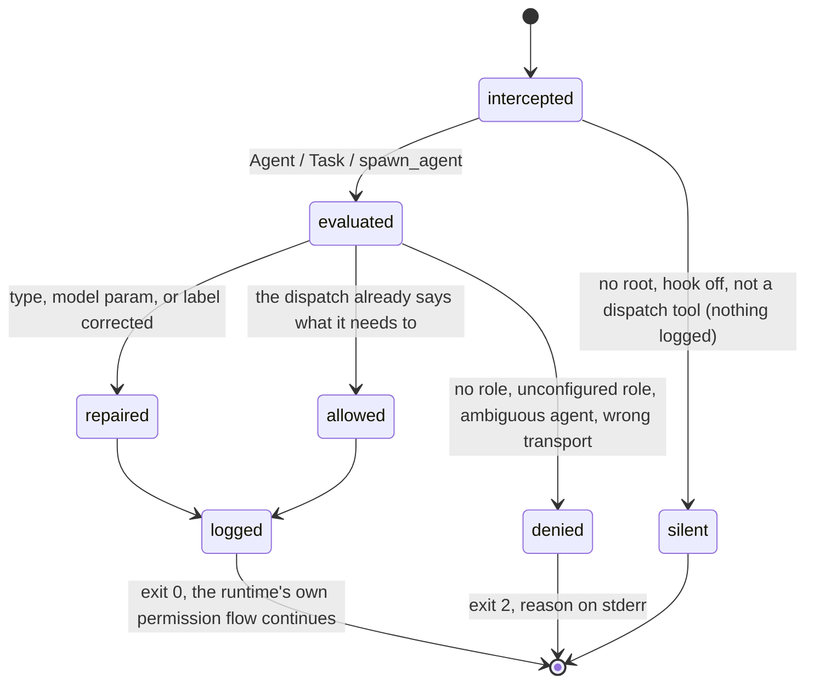

# The rendered agents and the model guard

## Summary

bee ships four subagent definitions and one hook that stands behind them. The definitions are files — `.claude/agents/bee-gather.md`, `bee-extract.md`, `bee-build.md`, `bee-review.md` — written into the host at onboarding, each pinning a model resolved from the role it serves and each carrying a contract the subagent reads as its own system prompt. The hook is the **model guard**, which sees every `Agent` and `Task` call (and `spawn_agent` on Codex) before it runs and answers one of four ways: *silent* when it has no opinion, *allow* with an audit line, *repair* when the dispatch names something configuration can correct, or *deny* with a reason and a FIX. The guard is why an agent never has to remember which subagent type goes with which model: naming a rendered bee agent *is* a role declaration, and a dispatch that declares nothing is refused rather than left to inherit the session's most expensive model. This document covers the agents and the guard's verdicts; [guards](../foundations/guards.md) holds the full deny catalog, [dispatch](dispatch.md) the door that produces conforming payloads, and [execution](../lifecycle/execution.md) the worker's own arc from claim to cap.

## The simple case

The agent runs `bee dispatch prepare`, gets back `{"tool": "Agent", "payload": {"subagent_type": "bee-gather", "prompt": "[bee-tier: generation]…", "model": "sonnet"}}`, and makes exactly that call. The guard reads it: the marker names a configured role, the subagent type is the rendered agent for that role, the model parameter equals what the role resolves to. Nothing to correct. The guard appends one line to `.bee/logs/dispatch.jsonl` and exits 0 without printing anything. The subagent starts, reads only what the prompt handed it, and returns a digest.

The failure case is just as short. The agent types an `Agent` call by hand with a prompt and nothing else:

> bee-model-guard: every Agent/Task dispatch needs an explicit role — a rendered bee agent type, a `model` param, or a `[bee-tier: <role>]` marker opening the prompt/description (decision 0023). A bare dispatch would silently inherit the most expensive session model.
> FIX: name one of bee's rendered agents in subagent_type (bee-gather = generation, bee-extract = extraction, bee-review = review) — that alone declares the role. Otherwise pass model: "sonnet" for the generation role, or open the prompt/description with [bee-tier: ceiling] (or any configured role: ceiling/code/extraction/generation/read/review).

The dispatch never runs. The remedy is the door: `bee dispatch prepare`.

## The four rendered agents

Each file is generated from a template at onboarding and kept current from then on. What the agent *is* comes from the file; what model it runs on comes from the host's configuration.

| Agent | Role(s) it declares | Tools | What it does |
| --- | --- | --- | --- |
| `bee-gather` | `generation` | Read, Grep, Glob | Open-ended multi-file hunts. Reads and reports, never writes. |
| `bee-extract` | `extraction` | Read, Grep, Glob | One already-scoped fact out of a known location. Never widens the search itself — that is bee-gather's job. |
| `bee-build` | `generation` | Read, Edit, Write, Grep, Glob, Bash | Executes exactly one already-claimed cell: reserve, write, commit, cap. The only one that writes. |
| `bee-review` | `review`, then `generation` | Read, Grep, Glob, Bash | Checks a claim read-only. May run tests, linters, `git diff`; never edits. |

Four contract clauses are common to all of them, and they are what makes a worker safe to dispatch cold:

- **No session history.** A worker sees nothing the dispatch prompt did not hand it. A cell that cannot be executed from that prompt alone failed cold-pickup review and comes back `[BLOCKED]` rather than guessed at.
- **Decide-altitude stays home.** Gates, decisions, privacy approvals and synthesis belong to the orchestrator and the human. A worker that is asked to judge reports what it found instead.
- **The read-only three take no reservations and register in no swarm registry.** That machinery is execution-only; bee-build is the one that reserves.
- **One final status token.** `[DONE]`, `[BLOCKED]`, `[HANDOFF]`, or `[NOOP]`, exactly one, with its result fields beside it.

### Which model a file pins

The `model:` line is resolved at onboarding from the agent's role list, walked against bee's baked-in seed (`extraction` → haiku, `generation` → sonnet, `review` → opus) overlaid by whatever `models.claude` carries. In a freshly onboarded host — whose seeded config names `code`, `read`, `extraction`, `generation` and no `review` — that gives bee-gather and bee-build sonnet, bee-extract haiku, and bee-review opus off the seed.

> Technical note: beehive's own checkout is a variant, not a contradiction. Its config configures the roles differently, so its rendered files read gather/build/review as opus and extract as sonnet. The role list is fixed; the model behind it is per host.

A role that resolves to something that is not a model name — a cli command, a herding pane, the inherited session model, or an explicit `null` — renders **no file at all**, and a stale copy is removed. So an agent type existing in the host is itself a fact about the configuration.

### The status tokens

The token is the worker's whole report protocol; the orchestrator branches on it.

- `[DONE]` — the cell is capped, one commit made, reservations released. The result carries the outcome, files, the proof line, a departure line, and the commit hash. The word is never the evidence: the orchestrator goal-checks it.
- `[BLOCKED]` — cannot continue safely. A reservation or hold conflict, a locked-decision conflict, an ambiguous cell, an architectural change, a package install. Carries the blocker, the diagnosis, and the specific parent action needed.
- `[HANDOFF]` — context ran out mid-cell; `.bee/HANDOFF.json` was written *before* the token. Carries progress, active reservations, and the resume point.
- `[NOOP]` — the assigned cell is missing, already capped, or otherwise unsafe to touch.

A routine `[DONE]` writes no report file — the cap trace and the token message are the record. `[BLOCKED]` and `[HANDOFF]` owe one.

## The interaction, event by event

One dispatch, from the agent's tool call to the guard's answer:

### Invoke

The guard fires on `PreToolUse` for `Agent|Task` (Claude) and on the `spawn_agent` matcher (Codex). It resolves the repository root from the hook payload, checks that bee is actually installed there, checks that `hooks.model-guard` is not `false` in the merged config, and reads `models` out of that config. A corrupt `config.json` warns and reads as absent, so the merge proceeds from whatever survives.

### Ends at once

The **silent** verdict: exit 0, no stdout, no stderr, and — this is the part that matters — **no log line**. The guard treats "no opinion" as an event that did not happen. It applies when there is no bee root, when bee is not installed, when the hook is toggled off, when the tool is not a dispatch tool, when the tool input is not an object, and on Codex when the spawn carries no message or an empty one.

### First side effect

The audit line: one JSON object appended to `.bee/logs/dispatch.jsonl` with `ts`, `tool`, `transport` (the verdict's own name — `marker`, `pinned-type`, `model-param`, `bare-denied`, `cli-tier-denied`, and so on), `model`, `tier`, `subagent_type`, a 120-character `description`, and the same six economics fields `dispatch prepare` writes. A deny adds a second line to the hooks log recording the deny and the tool-input keys.

A repaired dispatch is audited as the request that will actually run, not as the one that arrived — logging the field the guard just replaced would put a value in the trail that never reached the runtime.

The whole audit is fail-open: any filesystem failure is swallowed, because auditing must never be the reason a dispatch dies.

### While running

There is no middle. The guard is a single decision made against the payload in hand; it reads config and, for the label repair, at most one cell record.

### Finish

- **Deny** — exit 2, the reason on stderr. The tool call never runs.
- **Repair** — exit 0 with a JSON object on stdout: `hookSpecificOutput.updatedInput` carrying the *whole* rewritten input, `additionalContext` announcing the fix to the agent, and `systemMessage` announcing it to the human. No permission decision rides along: correcting a field is not approving the call, so the dispatch still faces the runtime's ordinary approval flow.
- **Allow** — exit 0, nothing printed, one audit line.

## The verdict ladder

The order is load-bearing; the first matching rule wins.

**Refuse.**

- *A marker naming a role nothing configures* — checked before everything else, because a wrong role is wrong whatever else the dispatch carries. The refusal names the role and says how to configure it: `[bee-tier: <name>] names a role nothing configures — models.claude in .bee/config.json carries no "<name>" entry, so the dispatch would silently inherit the session model while dispatch.jsonl recorded a role that selects no model.`
- *An ambiguous generic type* — a role served by more than one rendered agent, dispatched as `general-purpose`. `generation` is served by two (bee-gather reads, bee-build writes), and the guard will not guess which. The FIX names both with a clause each: `subagent_type "bee-gather" reads and reports (never writes); subagent_type "bee-build" executes a cell (reserves, writes, commits, caps)`.
- *A marker whose role resolves to no model, dispatched with a `model` parameter* — the marker would record one thing while the subagent ran on another.
- *A bare `model` parameter naming a model no configured role carries* — a param outside config selects an unaudited model and, on an up-dispatch, hides ceiling scarcity.
- *A role whose slot is a cli executor or a herding pane* — an in-family subagent cannot **be** an external process or a pane worker. The FIX names the door: `bee dispatch prepare --runtime claude --kind <kind> --json`, which returns the Bash call that transport actually needs.
- *A bare dispatch* — no marker, no model param, no rendered agent type.
- On Codex, *a spawn whose message does not open with the marker*. Anywhere but the start does not count, and a marker in any other field is ignored.

**Repair.**

- *A generic type on an unambiguous role* — `[bee-tier: extraction]` with `subagent_type: "general-purpose"` becomes `bee-extract`, because general-purpose carries no role identity and would run under the runtime default.
- *A model parameter disagreeing with the marker's role* — the param is rewritten to the role's configured model. Configuration is the authority; the model does not get a vote.
- *A label that does not say what the work is* — when the prompt carries a line `Assigned cell id: <id>` and the label field does not already contain that cell's title, the label is rewritten to `<id>: <title>`. This one runs on **every** dispatch, including a hand-typed one that never called `prepare`, and it composes with the repairs above so both land in one rewrite. Every resolution failure — no cell id, no cell record, an unreadable record, a blank title — passes the payload through untouched and silent. A label is not worth losing a dispatch over, so no branch here can deny.

**Allow.** A marker naming a resolvable role; a model param that matches its marker; a model param whose value is one a configured role carries; and — the quiet one that removes the single most common refusal — a dispatch that names a rendered bee agent and nothing else. Those files are generated *from* a role's configured model, so naming one is a role declaration in every sense that matters.

## Modifiers

| Modifier | Set at invocation | Can it differ mid-flow? |
| --- | --- | --- |
| `--json` | Not applicable. The guard speaks into the tool-call channel: stderr for a deny, a JSON object on stdout for a repair. The rendered agent files take no flags at all. | — |
| Gate-bypass level | No effect. No bypass level silences the guard or changes a verdict; role and model enforcement is orthogonal to gates. | — |
| Store phase | No effect on the verdict. The phase governs what the dispatched worker may then *write* ([guards](../foundations/guards.md)), never whether it may be dispatched. | — |
| Where it runs | The guard reads the root the hook payload names. A worker inherits the spawning session's working directory, which is why an execution worker dispatched from main for a worktree'd feature dies on the write guard — the guard does not catch that; the worker's own Location self-check does ([worktrees](../foundations/worktrees.md)). | — |
| Who runs it | The orchestrator dispatches; the guard intercepts. A worker dispatching a worker meets the same rules, and bee-gather, bee-extract and bee-review have no Agent tool at all — their tool lists cannot reach this hook. | — |

## Cancel and interrupt

The guard is an instantaneous decider, so the meaningful rows are about the dispatch it guards rather than about the hook.

| Event | Behavior |
| --- | --- |
| The process killed mid-command | The verdict is atomic with the tool call; there is no half-denied dispatch. A kill after the audit line leaves a logged dispatch that never ran. |
| The session turning elsewhere (compaction, handoff, turn end) | A dispatched worker keeps running or dies with its parent, depending on the runtime; bee holds no record of an in-flight subagent beyond the audit line. A worker that hits its own context limit writes `.bee/HANDOFF.json` and returns `[HANDOFF]`. |
| A clean completion from outside | Nothing external completes a dispatch. The worker's status token is the completion. |
| The store unavailable | Fail-open throughout: a corrupt config reads as absent, an unreadable cell record skips the label repair silently, a failed audit append is swallowed. A missing hook binary prints `bee: hook binary missing (.bee/bin/bee)` and lets the dispatch pass — visible, never silent. |
| The session going away | The guard holds no lease. A worker's *claim* does, and the sweep is what recovers it ([execution](../lifecycle/execution.md)). |
| A sibling changing the target | Not this hook's concern — a sibling claiming the cell underneath surfaces at the worker's own ownership validation, or at its first reservation. |
| The channel changing | On Codex the matcher is `spawn_agent`, the marker must open `message`, the label field is `task_name`, and no agent files are rendered at all — Codex has no per-agent model selection, so the role is enforced as a prompt budget instead. Codex's advisory events cannot block; where the runtime does not gate, the guard can only warn. |

## Interactions with other systems

**Gates and approval.** None. The guard enforces cost and identity, never approval; a repaired dispatch still faces the runtime's own permission flow.

**The store and history.** `.bee/logs/dispatch.jsonl` is the shared record with [dispatch](dispatch.md) — the prepare-time line and the guard-time line carry the same economics keys on purpose, so the file reads as one schema. The hooks log carries the denies.

**Worktrees and containment.** The rendered files live at `.claude/agents/` in the host and are onboarding-managed. A worker's containment is the write guard's business, not this hook's.

**Claims, holds, and reservations.** bee-build reserves before writing and reports `[BLOCKED]` on a conflict rather than writing through it. The other three take no reservations at all.

**Sibling sessions.** Two sessions dispatching at once do not interact here; each guard call is independent and the audit log is append-only.

**What the human sees.** A repair announces itself twice — `additionalContext` to the agent, `systemMessage` to the human — so a rewritten dispatch is never quiet. A deny is a refusal line and is never silenced.

**Configuration.** `hooks.model-guard: false` turns the guard off entirely. `models.<runtime>` decides which roles exist and what each resolves to; a slot object may carry a `description`, which only the preamble's door line prints — nothing that resolves, guards or dispatches ever reads it.

**Output modes and exit codes.** Deny = exit 2 with stderr text; repair = exit 0 with a JSON rewrite on stdout; allow = exit 0 silent with an audit line; no opinion = exit 0 silent with nothing at all.

## Edge cases

- The marker is read from `description` first, then `prompt`. A marker in the description wins even when it names nothing configured — reading past it would let a typo in the field the host displays pass unremarked.
- Marker matching is case-insensitive: `[BEE-TIER: Generation]` declares `generation`. The same predicate answers `dispatch prepare --role`, so one spelling cannot be admitted at one door and refused at the other.
- Marker parsing is strict about shape: anchored at the start, one whitespace-free token, closed by `]`. Prose that merely opens with the words is not a marker.
- The escalation word `ceiling` is exempt from the generic-type repair: an escalated dispatch runs on the session model and names no agent file.
- Membership for a bare `model` param is derived from what a *prepared* dispatch could publish, never from a hand-kept allowlist — including the runtime default model a herding slot's `fallback: "default"` publishes.
- When the host configures no models at all, the membership set is empty and a bare model param is allowed rather than denied: with nothing configured there is nothing to check it against.
- The preamble's role list prints at most six roles and then counts the rest; a role it clipped is still reachable by name, because a wrong guess refuses by name at both doors.
- `bee-review` declares two roles, so it renders even on a host that configures no `review` slot — the walk falls through to `generation`.

## Open questions and verification

- **A `Task` dispatch's `subagent_type` is not checked against what actually exists.** The guard repairs onto a rendered agent name and refuses an ambiguous one, but a dispatch naming an agent bee does not know falls to the bare-dispatch branch. What the *runtime* does with an unknown subagent type was not chased.
- Whether a repaired `updatedInput` is honored as a replacement (rather than merged) by every host version was treated as a risk in the code — the guard deliberately sends the whole input rather than a partial one — and was not observed live.
- The Codex path (`spawn_agent`, advisory events, no rendered agent files) was read from source only; no Codex host was available.
- The fresh-host model resolution for each of the four agent files was derived from the seed table and the seeded config, not observed against a freshly onboarded repository. beehive's own files were read directly and differ, as noted above.
- The interaction between the guard's deny and the host's own subagent-limit or concurrency behavior was not examined.
- All deny and repair texts above are quoted from source and its tests; the four agent contracts are quoted from the rendered files in this repository. No dispatch was made during this document's own work.

Verified against beehive commit `6b0ae488`.
