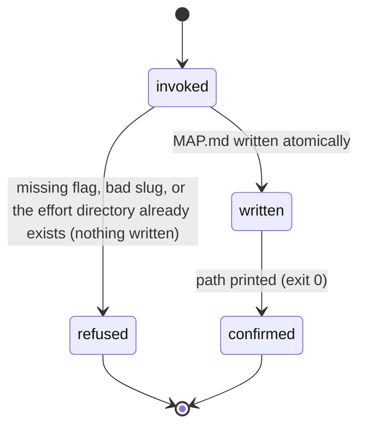
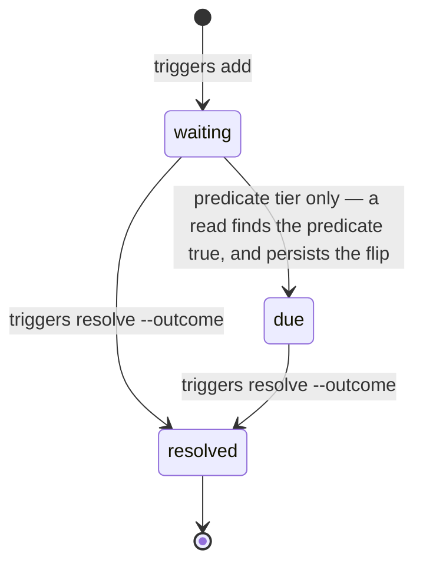

# Discovery maps, stubs, and triggers

## Summary

Some asks have no nameable outcome yet — "I feel our onboarding is wrong somewhere". Shaping cannot take those: it assumes a destination it can write into an acceptance line. The Discovery flow is the second door beside the Main flow: it carries a fog-state ask from an open question to a locked decision, and only then hands into shaping. Its durable artifact is a **discovery map** — plain markdown at `docs/discovery/<effort>/MAP.md` plus one file per open question under `tickets/`. bee contributes four verbs and no state store: `bee discovery stub` creates a map for an effort whose destination is still unknown; `bee discovery list` reports every map's destination line and its open and frontier ticket counts; `bee triggers add|list|resolve` is the neighbouring registry that keeps a *deferred* decision — "revisit when upstream lands" — from sinking into prose nobody re-reads. The map's content, its tickets, and the interview that resolves them belong to the `bee-wayfinding` skill; the CLI only ever scans what the skill wrote and makes it impossible to miss.

## The simple case

The human describes an itch. Nothing about it can be shaped yet, so the agent charts instead. Either the map is created by hand by the wayfinding skill, or — when a backlog item parks for vagueness during shaping's triage — bee creates the landing spot itself:

```
bee discovery stub --effort onboarding-flow --from "parked from route Qualify: too vague"
```

bee answers `Created discovery stub for "onboarding-flow" at docs/discovery/onboarding-flow/MAP.md.` The new map has five headings — Destination, Notes, Decisions so far, Not yet specified, Out of scope — with `(unknown — charting session needed)` under Destination and the `--from` text under Notes. Nothing else is created: no tickets, no store record, no git commit.

A charting session then names the destination and writes tickets by hand. From that point the map is visible everywhere. `bee discovery list` reports it:

```
- onboarding-flow: A locked spec for the new onboarding. (open 3, frontier 2)
```

The same scan feeds `bee status`, the session preamble, and `bee orient`. When the pipeline goes fully idle and a map still has frontier tickets, orient stops recommending anything else and says: resume this map with `bee-wayfinding`. That single override is the whole mechanical link between discovery and the rest of bee.

Separately, when a decision is *deferred* rather than settled, the condition gets its own record:

```
bee triggers add --decision c2a7bd4f --condition "revisit when upstream anomalyco/opencode#29638 lands"
```

`Registered manual trigger revisit-when-upstream-anomalyco-opencode-29__c2a7bd4f for decision c2a7bd4f.` It surfaces in every later `bee orient` until someone runs `bee triggers resolve` with an outcome.

## The interaction, event by event

One `bee discovery stub`:



A trigger's own arc, across many invocations:



### Invoke

Standard root resolution ([invocation](../foundations/invocation.md)). The two groups sit on different root doors, and the difference is deliberate:

- `discovery` takes the wide door. `docs/discovery/` is plain git-tracked content, meant to read the same from every session and every worktree, so an open map found in one session resumes in the next whichever ground it runs from.
- `triggers` runs worktree-native, then re-roots the trigger store itself onto the control root. A worker inside a feature worktree can register and resolve triggers directly, and every session sees one shared registry ([worktrees](../foundations/worktrees.md) owns the resolution).

`discovery stub` takes `--effort` and `--from`, both required. `--effort` must be a lowercase kebab-case slug: ascii letters and digits, single dashes, no leading or trailing dash. The slug becomes a directory name, so the charset also closes off path traversal by construction — `../escape` and `a/b` are not "sanitized", they are simply not accepted. `triggers add` takes `--decision` and `--condition`, plus the optional `--predicate`; `triggers resolve` takes `--id` and `--outcome`; `triggers list` takes only `--due` and `--json`, and any other token falls through to the generic shape refusal.

### Ends at once

None of these write anything:

- `--help` on any of the five prints the registry entry and exits 0 with the timing line.
- `bee discovery` alone answers `bee discovery is a command group, not a command. bee discovery takes: list, stub.`; an unknown verb names the verb and the same list. `bee triggers` behaves identically over `add, list, resolve`.
- An unknown flag refuses by name: `… names unknown flag --bogus`, with a FIX line pointing at `--help`.
- A missing `--effort`, `--from`, `--decision`, `--condition`, `--id`, or `--outcome` refuses with its own sentence — `bee discovery stub: --effort is required.` — not the generic shape refusal. A whitespace-only value counts as absent.
- A slug that is not kebab-case refuses and quotes what it got. Nothing is created — not even the `docs/discovery/` directory.
- An `--effort` whose directory already exists refuses, names the path, and says what to do instead: `pick a different --effort or resume the existing map`. Charting a new map and resuming an existing one are different operations, so the second one is never silently a no-op over the first. The existing MAP.md is byte-identical afterward.
- `--predicate` that is not `path-exists:<path>` or `path-missing:<path>` refuses and quotes the spec.
- `triggers resolve --id` containing a path separator or `..` refuses; an id naming no record answers `no trigger with id "<id>"`.
- `bee discovery list` never refuses on content. No `docs/discovery/` directory at all prints `No discovery maps.` and exits 0. Likewise `bee triggers list` with an empty registry prints `No triggers.`

### First side effect

For `discovery stub`: one atomic write of MAP.md. That is the entire side effect — no lock, no store record, no `tickets/` directory. **The tickets directory is not created by the stub**; the wayfinding skill authors `tickets/NNN-<slug>.md` by hand, and the scan treats a missing `tickets/` as zero tickets.

For `triggers add`: one atomic write of `.bee/triggers/<slug>__<short8>.json` at the control root. The slug is a 40-character kebab fold of the condition text (`"trigger"` when the condition carries no letters or digits at all); the short8 is the first eight characters of whatever `--decision` was passed. A name collision — two triggers off the same decision with near-identical condition text — appends `-2`, `-3`, so a second `add` never clobbers a different record.

For `triggers list` and for orient's trigger door, the first side effect is easy to miss: **reading evaluates**. A predicate-tier trigger still `waiting` has its predicate checked, and a true predicate flips it to `due` *and persists the flip*. A read of the trigger registry is therefore a write in the ordinary case where a watched path has landed. Manual-tier triggers never auto-fire at all.

### While running

Nothing streams. Each verb is one scan and at most one atomic write per file. `discovery list` walks the effort directories in alphabetical order, reading each MAP.md and then its `tickets/`; a ticket file that races away between listing and reading is skipped rather than fatal.

### Finish

Without `--json`, the human line goes to stderr followed by `[bee] <cmd> <N>ms`; with `--json` the payload goes to stdout — `{"efforts": [...], "unreadable": [...]}` for `discovery list`, `{"effort", "path"}` for `stub`, `{"triggers": [...], "unreadable": [...]}` for `triggers list`, and the full record for `add` and `resolve`. Exit 0 on success, 1 on any of the refusals above ([invocation](../foundations/invocation.md)).

## How the counts are derived

`bee discovery list` reports two numbers per effort, and only these two:

- **open** — every ticket whose `status:` reads `open`, blocked or not.
- **frontier** — the subset that is open, unclaimed (`claimed-by:` absent or empty), and whose every `blocked-by:` id resolves to a ticket whose status is `closed`. This is "what a session may take right now".

Ticket frontmatter is convention, not schema. Keys are read as bare `key: value` lines *anywhere* in the file — no YAML fence, no ordering, first occurrence wins — so the skill's ticket template can evolve without a parser rewrite. A ticket with no `status:` line at all counts as open, because a freshly written question is open by construction. An unknown `blocked-by:` id **fails closed**: the ticket stays out of the frontier rather than silently unblocking on a typo.

The destination is the first non-empty line under a `## Destination` heading, up to the next heading. A missing heading or an empty section is an empty string, rendered `(no destination yet)` — never a parse failure.

> Technical note: it is the first *line*, not the first paragraph. A destination written as a hard-wrapped paragraph is reported cut at the first newline. Every map in beehive's own `docs/discovery/` shows this: `bee discovery list` prints `bee answers "port feature X from repo Y" first-class: bee-researching` and stops mid-sentence, because that is where the source file wraps.

## Where a map surfaces

One scan, three sites, so a resume cannot be missed:

| Surface | What it shows |
| --- | --- |
| `bee status` | The `open_maps` field is always present in `--json` (empty arrays when no map exists). The text renderer prints one `### Open discovery map(s): <name> — <N> frontier ticket(s)` line per effort, and nothing at all when there is neither an effort nor an unreadable map. |
| The session preamble | The same lines, scanned in-process by the session hook rather than through `bee status` ([session](../foundations/session.md)). Empty means silent. |
| `bee orient` | The override below, plus a report-only blocker line while work is live. |

**Orient's wayfinding override** is the only mechanical hand-in discovery has, and it is deterministic rather than a model judgment ([orient](../lifecycle/orient.md)). When the pipeline is idle — no pending handoff, zero open and zero claimed cells anywhere, and the phase is one of the terminal phases — and the first map with a nonzero frontier exists, orient replaces its whole recommendation:

- `next.action`: `resume discovery map "<name>" (<N> frontier ticket(s)) — switch to bee-wayfinding.`
- `next.skill`: `bee-wayfinding`
- `next.command`: `bee discovery list --json`

While work is live the same map degrades to one report-only blocker line, `open discovery map <name> — <N> frontier`, and the phase-to-skill recommendation is left alone: a running feature is never interrupted by an old map. A pending handoff always wins, because the idleness test refuses on a handoff before it looks at maps at all.

There is deliberately **no verb that hands a finished map into shaping**. When no tickets and no fog remain, shaping's Lock reads the map's "Decisions so far" and their decision ids straight into `docs/history/<feature>/CONTEXT.md`, citing them instead of re-asking ([shaping](../lifecycle/shaping.md)). The link is a reading discipline, not a command.

## Triggers: a deferred decision that cannot sink

A trigger is one JSON record per deferred condition, carrying `id`, `decision`, `condition`, `tier`, `predicate`, `status`, timestamps, and — once resolved — `outcome`.

- **Tier is derived, never passed.** `--predicate` present makes it predicate-tier; absent makes it manual-tier.
- **Predicate-tier** triggers are auto-evaluated on every read and flip `waiting` → `due` when the path lands (or disappears, for `path-missing:`). A relative predicate path resolves against the control root — "has this file landed in the repo yet". An unrecognized spec in a hand-edited record never fires: fail closed on the predicate, fail open on the read.
- **Manual-tier** triggers never reach `due`. They surface as *awaiting confirmation* until a human's call closes them.
- `bee triggers resolve --id <id> --outcome "<text>"` writes the outcome and `status: resolved` **into the trigger record only**. It never logs a decision itself; the capture discipline owns whatever follow-up that outcome implies ([capture](../memory/capture.md), [decisions](../memory/decisions.md)).
- `bee triggers list --due` narrows the list to what wants attention: due predicate triggers plus manual triggers still waiting. Unreadable records are always shown, `--due` or not.
- `bee orient` folds both counts into one blocker line: `<N> trigger(s) due, <M> awaiting confirmation`.

The write-path law closes the loop from the other side: `bee decisions log` reads its own decision text, and text that reads as a deferral — `defer`/`defers`/`deferred`/`deferring`, `for now`, `revisit when`, `revisit if`, or the whole word `later` — but names no `--trigger` is refused, with the remedy spelled out: register the condition first, then retry with that trigger id. A `--trigger` that does not name a shape-valid registered record is refused too. No deferred condition is meant to exist outside the registry.

## Modifiers

| Modifier | Set at invocation | Can it differ mid-flow? |
| --- | --- | --- |
| `--json` | Payload on stdout instead of the human line on stderr; errors as `{"error": …}`. `triggers list` additionally takes `--due`. | No — one invocation, one mode. |
| Gate-bypass level | No effect. Discovery adds no gate of its own, and triggers are not gated in either direction. | No effect. |
| Store phase | No effect on the verbs themselves — all five run at idle, in a gated phase, and in a terminal phase alike. It changes what the agent may write **by hand**: `docs/discovery/` is inside the idle intake allow-list but outside the gated allow-list, so hand-authoring a MAP.md or a ticket during `exploring`/`planning` is denied ([guards](../foundations/guards.md)). Orient's override only ever fires in a terminal phase. | The phase can change under a charting session; the next hand write is judged by the phase at that moment. |
| Where it runs | `discovery` answers from the resolved store root, so `docs/discovery/` is the same content for every session resolving to that root — an open map found in one worktree resumes in another. `triggers` re-roots its store onto the control root, so one registry serves every worktree. | The root is resolved per invocation from the working directory. |
| Who runs it | No effect mechanically. By discipline the charting conversation is decide-altitude and stays with the orchestrator; research tickets fan out to gather-tier workers ([dispatch](../delegation/dispatch.md)). Shaping's headless triage is what calls `discovery stub` unattended. | — |

## Cancel and interrupt

Columns: before and after the first write (MAP.md, or the trigger record).

| Event | Before the write | After the write |
| --- | --- | --- |
| The process killed mid-command | Nothing exists; the map or trigger is simply not there. Re-run. | The write is atomic, so the file is whole or absent — never half a MAP.md. The confirmation may never print; `discovery list` or `triggers list` settles the truth. |
| The session turning elsewhere (compaction, handoff, turn end) | Fog that was never stubbed lives only in the conversation — the exact loss `discovery stub` exists to prevent. | Both artifacts are the point: they outlive the session, and the preamble re-surfaces the map to the next one. A pending handoff suppresses orient's wayfinding override until the human speaks. |
| A clean completion from outside (gate approved, question answered, new message) | No effect. | No effect on either store. A human's answer inside a charting session becomes a ticket answer and a logged decision, not a CLI event. |
| The store unavailable (corrupt file, write failure, hook binary missing) | A failed MAP.md write refuses with `could not write <path>`; a failed trigger write refuses with `could not write trigger record.` | Fail-open on read, both stores: an unreadable MAP.md becomes a visible `unreadable <path> — remedy: fix or delete` line and the other efforts still report; a corrupt or shape-invalid trigger file becomes `unreadable trigger <path> — remedy: delete the file`. Neither ever crashes the scan, and `orient`'s counts simply skip them. An unreadable *ticket* file is the quiet exception: it drops out of both counts with no line of its own. |
| The session going away (heartbeat, lease expiry, release) | Nothing held. | Nothing held. Neither maps nor triggers carry leases; both are pure content. The skill's own ticket claim is a file reservation, which does expire ([reservations](../coordination/reservations.md)). |
| A sibling changing the target | Two sessions stubbing the same slug: the second gets the typed already-exists refusal, and the first map is untouched. Two `triggers add` calls with the same slug and decision get distinct filenames. | Two sessions resolving the same trigger: last write wins, and the loser's outcome is gone with no warning. Two `discovery list` readers racing a predicate flip both write the same value. A sibling closing a ticket changes the frontier count under a session that already read it. |
| The channel changing (piped, `--json`, Codex, run from a hook) | Same behavior everywhere; `--json` moves the payload to stdout. The preamble's map lines are rendered in-process, so they appear even where no command was run. | Same. |

After any interrupt the truth is on disk in plain markdown and plain JSON: read the map, read the registry. Neither store needs repair.

## Interactions with other systems

**Gates and approval.** None of its own. Wayfinding adds no gate — its human checkpoint is the destination-naming conversation, and the settled decisions meet the human again at shaping's Gate 1 ([gates](../foundations/gates.md)).

**The store and history.** Deliberately split. Maps are *not* in the store: `docs/discovery/` is ordinary git-tracked markdown, versioned by the repo's own history. Triggers *are* in the store, one file per record under `.bee/triggers/`. A map only gists an answer and links its decision id; the decision log stays the single source ([decisions](../memory/decisions.md)).

**Worktrees and containment.** Both stores are shared on purpose: a map must resume from any ground, and a trigger registered by a worker must be visible from main. That also means `bee discovery stub` run inside a worktree writes to whichever `docs/discovery/` the root resolution picks, which is not always the directory the agent is standing in ([worktrees](../foundations/worktrees.md)).

**Claims, holds, and reservations.** The CLI holds nothing. The skill's convention is that claiming a ticket reserves its file and writes a display-only `claimed-by:` line. The scan knows only the line — it never consults the reservation store — so a ticket reserved without the line still counts as frontier, and a stale `claimed-by:` line keeps a ticket out of the frontier long after its reservation expired.

**Sibling sessions.** One map, many readers. The frontier count is the coordination surface, and it is advisory: nothing stops two sessions taking the same ticket except the reservation the skill asks for.

**What the human sees.** Never the verbs. The human sees the interview — one round of frontier questions at a time, options carried with trade-offs — and, on resume, one line of state naming the map and what is left to decide.

**Configuration.** None. No config key changes any of these five verbs; the per-hook toggles do not reach them.

**Output modes and exit codes.** The standard contract ([invocation](../foundations/invocation.md)): 0 on success, 1 on refusal; `--json` puts payloads and errors on stdout; the timing line trails every served run.

## Edge cases

- A `docs/discovery/<name>/` directory with no MAP.md inside is reported as *unreadable*, not skipped — an empty effort directory is a mistake worth seeing, not a state to hide.
- The status text renderer emits one `### Open discovery map(s): …` heading per effort, so three maps produce three headings rather than one heading with three rows.
- `discovery list` prints every effort, including maps at `open 0, frontier 0`. Finished maps stay on the list as history; only the *frontier* number decides whether orient offers a resume.
- The stub's Destination text is the literal string `(unknown — charting session needed)`, and `discovery list` reports it verbatim as the destination until a charting session replaces it.
- `--decision` on `triggers add` is never checked against the decision log. It is truncated to its first eight characters and stored as given, so `--decision P72` yields `decision: "P72"` and a long slug yields a short8 that is just the first eight characters of that slug. A trigger can name a decision that does not exist.
- That is load-bearing, because the intended order is chicken-and-egg: `decisions log` refuses deferral prose without a registered `--trigger`, so the trigger must be registered *before* the decision it defers exists. The unvalidated `--decision` is what lets that order work.
- `triggers resolve` on an already-resolved trigger succeeds again and overwrites the outcome. Resolution is not one-way in its guard, only in its intent.
- A resolved manual trigger disappears from `--due` but stays in the plain list, carrying its outcome as the record of what happened.
- The condition text drives the filename. Two triggers with the same first-40-character fold of their condition and the same decision short8 differ only by the `-2` suffix, which makes ids hard to tell apart by eye; `triggers list --json` is the reliable reader.
- `type:` is documented as a recognized ticket key, but the scan does not read it. The four-type vocabulary (grilling, research, prototype, task) is enforced by the skill alone.
- The `## Destination` heading must match exactly, trimmed. `## destination` or `## Destination (draft)` yields no destination at all.

## Open questions and verification

- The `type:` ticket key is named as recognized in `verbs/discovery.rs`'s own header comment, but `parse_ticket` reads only `status`, `claimed-by`, and `blocked-by`. Harmless today — nothing consumes `type` from the CLI side — but the comment and the code disagree; likely a stale comment rather than a missing feature.
- The frontier definition diverges between layers: `skills/bee-wayfinding/SKILL.md` defines the frontier as open, unblocked, and **unreserved**, backed by a file reservation with `claimed-by:` as display only; the CLI derives it from the `claimed-by:` line alone and never reads the reservation store. Either a session that reserves without writing the line is invisible to the count, or the skill's sentence is aspirational. Worth deciding which layer owns the word.
- A hand-written MAP.md or ticket is denied by the write guard during `exploring` and `planning`, because `docs/discovery/` is only in the intake allow-list. Charting during a live feature was read from the allow-list constants, not probed; whether wayfinding is ever meant to run mid-feature is an open product question.
- Whether `bee discovery stub` run from inside a linked worktree writes into that worktree's `docs/discovery/` or the main checkout's was read from the root-resolution doors and not probed with a real worktree.
- Concurrent predicate flips (two readers evaluating the same waiting trigger at once) were read as "both write the same value" from the atomic-write path; not probed.
- The exact `bee status` text section and the session preamble's rendering were read from the renderers and their unit tests, not captured from a live session.
- Confirmed by running the binary in this repo, read-only: `bee discovery list` and `--json` over seven real maps, `bee triggers list --json` over fourteen real records including resolved and waiting manual tiers, the group and unknown-verb refusals for both groups, the unknown-flag refusals, and `--help` for `discovery stub` and `triggers add`. The destination-truncation behavior above was observed in that live output.

Verified against beehive commit `6b0ae488`.
