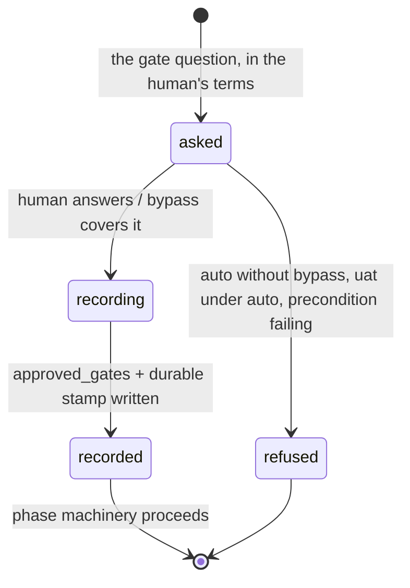

# Gates and phases

## Summary

A gate is the moment the human approves before the agent proceeds. Five are recorded — `context`, `shape`, `execution`, `review`, `uat` — but the flow presents three doors: Gate 1 (are these the decisions I meant), Gate 2 (the merged shape-plus-execution approval — the door to editing source), and Gate 3 (UAT — the door to main). Approvals are store records written by `bee state gate`, with the actor, time, reason, and bypass level stamped durably on the workflow record. Around the gates sit the *phases* — where a feature attempt stands — and the opt-in *gate bypass*, which lets the agent self-approve some gates at some levels with the self-approval recorded, never hidden. One rule outranks every level: **the UAT gate is never bypass-approved.** This document owns the gate verbs, the phase vocabulary, and the bypass ladder; what a phase physically blocks is [guards](guards.md).

## The simple case

Planning is done; the shape is drafted. The agent asks the human the Gate 2 question in plain words. The human says yes. The agent records it:

```
bee gate --merge --approved true
```

bee answers `Gates "shape" and "execution" set to true.` — the one call sets both halves of the merged gate. The phase moves on, the write guard opens the source tree, and cells become claimable. Approving a single gate is the same shape with `--name`: `bee gate --name uat --approved true`. Revoking is `--approved false`.

The actor defaults to `user`, which is the honest record for a human approval relayed by the agent. Nothing about a gate is a prompt or a dialog: the conversation is the interview, the store is the record.

## The interaction, event by event

One gate approval:



### Invoke

`bee state gate` (porcelain alias: `bee gate`) with `--name <gate>` or `--merge`, `--approved true|false`, optional `--lane`, `--actor user|auto`, `--bypass-level`, `--reason`. Combining `--merge` with `--name` refuses; an `--owner` flag is rejected outright.

### Ends at once

The refusals, all before anything is written:

- Self-approval without its paper trail: `gate: --actor auto requires both --bypass-level and --reason — an auto-approval must record the bypass level and the reason it did not stop (D2). FIX: pass --bypass-level <off|normal|full|total> and --reason "<text>".`
- UAT under auto, at any level: `gate: --name uat cannot be approved by --actor auto — the uat gate is never bypass-approved (uat-gate-before-merge D1). FIX: get the user's approval and record it with --actor user (the default).`
- Two fail-closed preconditions on approving `execution` (alone or merged): a high-risk lane needs a non-stale advisor reference, and the lane's plan-time conflict review must exist, match the current plan revision, and carry a verdict for every candidate. Either missing refuses the approval with the gap named.

### First side effect

The booleans land in `approved_gates` on the state and lane records, and — durably — each touched gate gets a stamp `{actor, at, reason, bypass_level}` on the live workflow record. A revocation of `execution` also stamps `gate_revoked_at.execution`, so "was approved, then withdrawn" is distinguishable from "never approved".

### While running / Finish

Instantaneous. The answer names what was set; when the workflow record is closed or absent, the answer says the stamp had nowhere durable to land. Exit 0; standard streams.

## The phases

Where a feature attempt stands, projected from the workflow record into the lane file and `state.json`:

- `idle` — no active work; the intake gate governs writes.
- `exploring`, `planning` — the gated phases: source writes outside the bookkeeping allow-list are denied until `execution` is approved.
- `swarming` — execution approved, cells running.
- `reviewing`, `scribing`, `compounding`, `grooming` — the after-phases; `reviewing` is the only phase where the `review` gate is even shown.
- `compounding-complete` — terminal like `idle`. Entering it is refused while scribing debt stands, unless waived loudly (`--waive-scribing-debt`) or excused by a logged capture-deferral decision.

`bee state start-feature` opens an attempt (default phase `exploring`); `bee state set --phase` is the generic mover, ownership-protected; `bee close` ends the attempt with the lane's phase written to `idle` as its terminal write. (`bee finish` is not a phase move at all — it caps a cell.) A legacy stored `validating` reads as `planning`; an unrecognized phase value is refused by the write guard rather than treated as anything.

## The three doors in practice

- **Gate 1 — the decisions.** Asked at the end of shaping, in the human's terms, one decision set. Recorded on the `context`/`shape` side of the ledger by the shaping flow.
- **Gate 2 — the merged shape+execution approval.** "Is this the right thing, at the right size, and may the agent start editing real files (this slice only)?" The most irreversible step: until it is approved, `bee cells claim` throws and the write guard denies source edits. Approved as one `--merge` call, never as two separate questions.
- **Gate 3 — UAT.** User-invoked testing at staging or the feature worktree; the door through to main. `bee worktree merge` refuses while it is pending (escapable only by explicit config or flag on the merge side — never by bypass).

The `review` gate exists for the user-invoked review flow and is not part of the automatic chain.

## Gate bypass

An opt-in config level (`gate_bypass` in `.bee/config.json`), normalized `"total"`→total, `"full"`→full, `true`/`"on"`/`"normal"`→normal, anything else→off:

| Level | Covers | Still stops for the human |
| --- | --- | --- |
| `off` | Nothing. | Everything. |
| `normal` | Gates 1–2 for `tiny`, `small`, `standard` lanes. | High-risk and hard-gated work, secret-file reads, Gate 3 UAT. |
| `full` | Gates 1–2 in every lane. | Secret-file reads, a review P1 finding, Gate 3 UAT. |
| `total` | Every stop the bypass machinery can cover. | UAT under `--actor auto` still refuses — see "Open questions". |

Bypass never patches a hook and never approves anything silently. It is enforced at exactly two points: the gate verb (which demands `--bypass-level` and `--reason` for `--actor auto`, and stamps them), and the Stop-hook *bypass net* — mid-`planning`, with the merged gate pending and the level covering the lane, a Stop is hard-blocked and the agent is told to approve the gate itself and continue. The preamble banners the level (one line at `normal`, two at `full`/`total`), and each banner names what still stops.

## Modifiers

| Modifier | Effect |
| --- | --- |
| `--json` | Standard contract on the gate verbs. |
| Gate-bypass level | The subject of this document; see the ladder above. Config is re-read per invocation. |
| Store phase | Decides which gates are even displayed (review only in `reviewing`; uat only after execution; none at idle) and which preconditions bind. |
| Where it runs | Gate state lives on the control plane; a granted worktree's session reads the same gates as main ([worktrees](worktrees.md)). |
| Who runs it | The verb is the agent's; the *approval* is the human's. `--actor auto` is the recorded exception, and only with level and reason. |

## Cancel and interrupt

Columns: before and after the approval is recorded.

| Event | Before recorded | After |
| --- | --- | --- |
| The process killed mid-command | Nothing recorded; ask again. | The stamp is atomic with the record write; it is simply there. |
| The session turning elsewhere | The pending gate survives in the store; the waiting-on mark (`kind: gate`) tells siblings and dashboards what is owed. A compacted session re-reads the pending gate from the capsule. | The approval survives every session event. |
| A clean completion from outside | The human's answer *is* the completion; the agent records it. | A later revocation (`--approved false`) is a new event, stamped. |
| The store unavailable | The verb's bounded lock wait, then a named refusal — [the store](store.md). | Same. |
| The session going away | The pending gate outlives the session; a dead session's `gate` mark expires with its heartbeat. | Approvals never expire. |
| A sibling changing the target | Gate state is lane-scoped; two features' gates never collide. Two sessions racing the same lane's gate serialize on the store lock. | Last write wins, both stamped. |
| The channel changing | No difference; the gate verbs are plain CLI. | Same. |

## Interactions with other systems

**Gates and approval.** Owned here.

**The store and history.** `approved_gates` is the projection; the workflow record's stamps are the history. Revocations stamp separately.

**Worktrees and containment.** Gate 2 opens source edits *in the feature worktree*; Gate 3 sits between the worktree and main ([worktrees](worktrees.md)).

**Claims, holds, and reservations.** `bee cells claim` refuses before Gate 2 — the claim machinery reads the gate, not the other way around.

**Sibling sessions.** All read the same gate state; the bypass net only ever fires in the session that is stopping.

**What the human sees.** The gate question in their own terms — never the mechanics; the preamble's gates line; the bypass banner; the `⚡` auto-approved progress mark when bypass covers a gate.

**Configuration.** `gate_bypass` (the ladder), `uat_stop` and merge-side UAT config on the merge path, `hooks.<name>` toggles for the net's host hook.

**Output modes and exit codes.** Standard — [invocation](invocation.md).

## Edge cases

- Approving a gate at idle, or for a lane whose workflow record is closed, records the boolean but has nowhere durable to stamp — the answer says so.
- `--merge --approved false` revokes both halves in one call, same as approval.
- The preconditions on `execution` are checked twice — once before the lock as a fast answer, once under it — so a race cannot slip an approval past a failing precondition.
- Recorded conflict verdicts never refuse an approval by content; only their absence or staleness does. The verdicts are named on the output for the human to see.
- The Stop-hook bypass net is the one place bee ever *blocks a stop*; its block message is the only output of that stop.

## Open questions and verification

- **Wording divergence, filed for triage:** the `total` banner promises "NO human checkpoint remains", but `--name uat --actor auto` refuses at every level — so under `total` the UAT stop still exists at the verb layer. One of the two (banner or verb) overstates. The safe reading, and this document's, is the verb's.
- Whether the `context` gate is ever set independently of the shaping flow's Gate 1 (it exists in the vocabulary but no verb path observed here sets it separately) was not determined.
- The advisor-reference staleness window on the high-risk precondition was not read; [the advisor protocol area] owns it and the number should be confirmed before verification.
- Gate verb behavior was read from code and its refusal texts quoted from source; not yet exercised against the binary in a scratch host (needs a lane fixture).

Verified against beehive commit `6b0ae488`.
