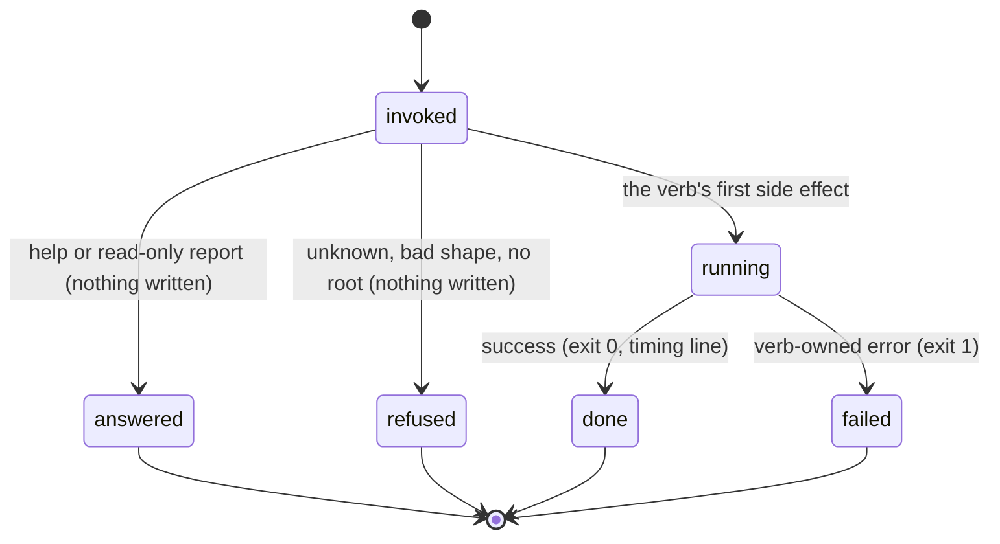

# The invocation model

## Summary

Every interaction with bee's binary follows one contract, and this document owns it: how an argv becomes an answer, what lands on which stream, what the exit code means, and what `--json` changes. The load-bearing promise, pinned by the front-door tests, is that **every argv shape gets an answer** — served, refused, or unknown — never silence and never a zero exit with no output. The command tree itself is data, not code: a hand-maintained registry payload embedded in the binary, which also renders every `--help`. Other documents link here instead of restating exit codes, refusal wording, the timing line, or the `--json` contract.

## The simple case

The agent runs a command:

```
bee capture count
```

bee resolves the store root, does the work, prints one human-readable line — `0 pending capture stub(s).` — on stderr, prints the timing line `[bee] capture count 0ms` after it, and exits 0. With `--json` the same command prints a pretty-printed JSON payload on stdout instead of the human line, and the timing line still goes to stderr. That is the whole shape of a successful invocation: answer, timing line, exit 0.

When the agent gets a command wrong, bee answers with a refusal that names what was wrong and a `FIX:` clause naming the way forward — the right `--help`, the right verb list, the closest spelling. Refusals exit 1.

## The interaction, event by event



### Invoke

The binary parses the raw argv itself — there is no argument-parsing framework, and each verb group accepts exact shapes only. Three things are settled before any verb runs:

- **Which command this is.** The argv is probed against the verb groups; a group that does not recognize the shape passes, and a shape nothing recognizes falls to the refusal logic, cross-checked against the registry so the refusal can say *why* (unknown command, unknown verb, unknown flag, unexpected positional, missing required argument).
- **The store root.** bee walks up from the working directory to the nearest `.bee/onboarding.json` or `.git`. With neither, every store-touching command answers `No bee repo root found (no .bee/onboarding.json or .git up the tree). Run bee-hive onboarding.` and exits 1. Inside a worktree, the root can resolve to the worktree's own store or redirect control-plane reads to the main checkout's — [worktrees](worktrees.md) owns that rule.
- **The output mode.** `--json` is read up front; even the no-root error honors it (`{"error": …}` on stdout).

### Ends at once

The paths that answer without doing work, none of which write anything:

- **Help.** Plain `bee --help` prints the porcelain flow surface (24 commands of 175); `--help --names` adds a one-line-per-command index; `--help --all` prints full text for everything; `bee <command> --help` prints one command's registry entry: description, every flag with its declared type. Help always renders from the registry payload, so what help says a flag does and what the dispatcher accepts come from the same data.
- **Refusals.** The wording is a contract with five fixed openings, and the variants observed at the front door:
  - `bee: unknown command (no command given)` — bare `bee`.
  - `bee: unknown command \`bee frobnicate\`. Closest spellings: bee route.` — a top-level typo, with suggestions.
  - `bee: unknown command \`bee capture bogus\` — \`bee capture\` has no \`bogus\` verb. \`bee capture\` takes: add, list, flush, count.` — a bad verb, with the verb list.
  - `bee: unexpected positional argument \`extra\` after \`bee capture add\`.` — a positional where only flags belong.
  - `bee: unsupported argument shape … names unknown flag --bogus.` — an unknown flag, named.
  - `bee: unsupported argument shape …. Its required arguments are all present, so what it refused is an optional flag, a flag value, or a target that does not exist.` — the catch-all, printed when the shape is declined for a reason the router cannot see. This is the vague one; commands whose semantic refusals fall through here mislead (see "Open questions").
  - `bee: missing required argument` and `bee: not built into this binary` — the remaining two fixed openings, for a flag the registry marks required and for a registry entry with no native implementation.
  - Every refusal carries a `FIX:` clause. Refusals exit 1.
- **No version flag.** `bee --version` is an unknown command. The installed version appears in the session preamble and in `bee status --json` (`onboarding.plugin_version`).

### First side effect

Owned by each verb, and each feature document names its own. The dispatcher's only write of its own is bookkeeping: the timings log entry at the end. Commands that mutate `state.json` take the store lock first; append-only logs (JSONL files) are written without it.

### While running

Nearly every bee command is fast — single-digit milliseconds — so "while running" is usually invisible. The exceptions with a real middle (the test runner, herding's control loop, waves) hold the store lock only around state writes, not for their whole run; a concurrent invocation blocked on the lock retries for about five seconds before giving up, and a lock left by a killed process goes stale and is broken rather than wedging the checkout — [the store](store.md) owns those numbers.

### Finish

- **Exit codes.** `0` success. `1` failure — refusals, verb-owned errors, and `doctor` when its verdict is blocked. `2` is a write-guard deny ([guards](guards.md)). `3` appears only in `herding`. A hook that cannot decide exits `0` with a stderr line — fail-open, so a broken harness never blocks the agent.
- **Streams.** Human messages on stderr; `--json` payloads on stdout. Errors under `--json` are `{"error": "<the same message>"}` on stdout, exit code unchanged.
- **The timing line.** Every served invocation prints `[bee] <cmd> <N>ms` to stderr and appends `{ts, cmd, ms, ok}` to `.bee/logs/timings.jsonl`. Shape refusals print no timing line; help does, and logs its command as `unknown` for the `--names` index form.

## Modifiers

| Modifier | Set at invocation | Can it differ mid-flow? |
| --- | --- | --- |
| `--json` | Payload on stdout, pretty-printed with two-space indent; errors as `{"error": …}`; human line suppressed. Nearly every command takes it (157 of 175). | No — one invocation, one mode. |
| Gate-bypass level | No effect on dispatch, streams, or exit codes. It changes only what `bee state gate` will self-approve — [gates](gates.md). | Config is re-read per invocation, so a level changed between commands takes effect on the next one. |
| Store phase | No effect on the answer contract. The phase changes what individual verbs allow (a claim before the execution gate refuses) and what the hooks deny around the binary — never the refusal wording or streams. | Per invocation. |
| Where it runs | Decides which store root answers, or the no-root error. A granted worktree redirects control-plane reads to the main checkout — [worktrees](worktrees.md). | Per invocation. |
| Who runs it | The binary does not know. But in a hooked session the CLI-shape guard checks the argv against the same registry *before* the binary runs, so a malformed invocation can be denied by the hook and never reach the front door — same registry, different voice ([guards](guards.md)). | — |

## Cancel and interrupt

Columns: before and after the verb's first side effect.

| Event | Before the first side effect | After the first side effect |
| --- | --- | --- |
| The process killed mid-command | Nothing written anywhere — not even the timings entry. | Verb-dependent; each feature document says what its half-done state looks like. The store lock left behind goes stale in 30 seconds and is broken by the next taker; a torn JSONL line is skipped fail-open by every later read. The timings entry is lost. |
| The session turning elsewhere mid-flow | An invocation is atomic from the session's point of view — there is no "mid-invocation" for compaction or a handoff to land in. | Same. |
| A clean completion from outside | No effect. A gate approved or a message arriving changes what the *next* invocation sees, never the one in flight. | Same. |
| The store unavailable | Lock contention: retry for ~5 s, then a verb-owned error. Corrupt JSON in a store file: warn and fall back to defaults for ordinary state; deny for coordination state (holds, reservations) — the fail-open/fail-closed split [guards](guards.md) owns. Missing hook binary: irrelevant to the binary itself; the runtime prints `bee: hook binary missing` and lets the action pass. | Same rules on every subsequent read. |
| The session going away | No effect — an invocation holds no lease of its own. Claims and reservations taken *by* verbs have TTLs owned by [the store](store.md). | Same. |
| A sibling changing the target | Detected at the verb's read: the refusal or error names the sibling (a claim held, a hold, a reservation). The dispatch layer itself never races — the store lock serializes state writes. | Same. |
| The channel changing | Piping stdout changes nothing (bee does not detect a TTY); `--json` is the explicit machine mode. The Codex runtime runs the same binary with the same contract; only hook events differ. | Same. |

## Interactions with other systems

**Gates and approval.** The binary refuses ungated things by its own rules; the *gates* stop the agent through verbs (`bee cells claim` throws before the execution gate) and hooks (denied writes), never by changing the invocation contract.

**The store and history.** Every invocation's trace is the timings log; state changes are the verbs' own records. Nothing about dispatch is kept beyond that.

**Worktrees and containment.** Root resolution is the whole interaction — see [worktrees](worktrees.md).

**Claims, holds, and reservations.** Not the dispatcher's concern; the store lock is the only lock this layer touches.

**Sibling sessions.** Two binaries can run at once from anywhere; the store lock and the append-only logs make that safe. The cross-process races are pinned by tests (`concurrency.rs`).

**What the human sees.** Nothing directly; the human meets the binary's output only when the agent quotes it. The wording contract exists so the agent's quote is stable.

**Configuration.** `--json` aside, dispatch reads no config. Per-hook toggles and `gate_bypass` act elsewhere. Config is merged fresh per invocation — [configuration](../cross-cutting/configuration.md).

**Output modes and exit codes.** Owned here. Summarized: stderr for humans, stdout for `--json`, `0/1` everywhere, `2` for a guard deny, `3` inside herding, fail-open `0` for undecidable hooks.

## Edge cases

- The registry is hand-maintained, and the tests hold it to the binary both ways: every registry example must run, and every served shape must be advertised. What the tests do not catch is a *wrong* declaration — `capture add` declares no required parameters, so the catch-all refusal claims "required arguments are all present" when `--outcome` is missing.
- `bee --help --json` prints the porcelain surface as JSON; `--names` and `--all` compose with it. Help output ends with a count line (`24 command(s) of 175`).
- Four porcelain names are pure aliases (`route`→`state route`, `shape`→`intent set`, `gate`→`state gate`, `finish`→`cells finish`): identical behavior and flags, different name in the timing line.
- An empty flag value is generally treated as absent, and flag values are trimmed with JavaScript's notion of whitespace — a compatibility inheritance from the retired Node implementation that surfaces only with exotic Unicode whitespace.
- The refusal suggester ranks close spellings only for top-level commands; verb-level typos get the verb list instead.

## Open questions and verification

- **Suspected gap:** there is no `--version`. Whether that is intended (the preamble and `status` carry the version) or an omission is a product call; filed in [bug-triage.md](../bug-triage.md).
- **Suspected bug (inherited delegation):** verbs that declined an argv shape so the retired Node binary could own the error text now fall through to the catch-all refusal, which can mislead (the capture group is the confirmed instance — see [the capture queue](../memory/capture.md)). The full set of affected verbs was not enumerated; each feature document should flag its own.
- The timing line logging `unknown` as the command for some help forms was observed once and not chased.
- Whether any command detects a TTY (colors, prompts) was not found in code and not probed; nothing suggests it.
- Confirmed by running the binary: bare `bee`, top-level typo with suggestion, bad verb with verb list, unknown flag, unexpected positional, `--version` unknown, no-root error with and without `--json`, help in all three widths, streams and exit codes as stated.

Verified against beehive commit `6b0ae488`.
