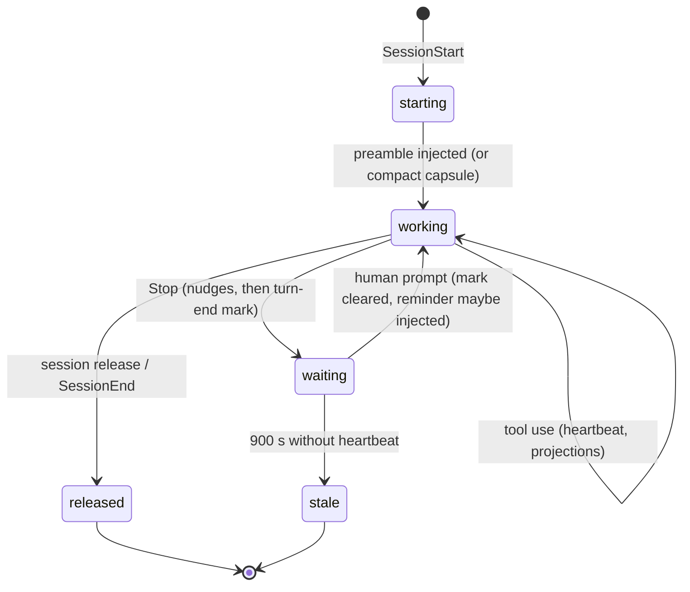

# The session

## Summary

A session is one run of the agent with bee's harness wrapped around it. The harness speaks at fixed moments: at start it injects the *preamble* (the store rendered as text, so the agent begins already knowing the phase, gates, and pending queues); on every user prompt it may add a one-to-three-line reminder; on every tool use it silently keeps the session's heartbeat and projections fresh; and at stop it nudges about unfinished business, then marks the session as waiting on the human. The session also has a lifecycle of its own in the store — bound, live, stale, released — and two ways to pass work across its own boundary: the *waiting-on mark* (this turn ended waiting on you) and the *handoff* (the next session picks this up). This document owns all of that; [gates](gates.md) owns what the approvals mean and [guards](guards.md) owns the denies.

## The simple case

The agent's session starts. Before the first word of conversation, the harness injects the preamble: the bee version, the phase and feature, the gates line, the standard commands, the dispatch door, the project map, and — only when they exist — the pending queues (capture stubs, scribing debt, promote proposals, open discovery maps), a critical-patterns digest, and the three most recent decisions. It ends with a fixed trailer telling the agent everything above is already read and never to hand bee commands to the human.

The agent works. Each tool call quietly stamps the heartbeat (at most once a minute) and renews its claims and leases. When the turn ends with nothing owed, the Stop hook marks the session "waiting on human — turn-end" with the last line of the answer as the subject. The human's next message clears the mark, and the cycle repeats. When the session ends for good, its record is marked closed and siblings stop counting it.

## The interaction, event by event

One session, from the harness's point of view:

### Starting

`SessionStart` fires with a source: `startup`, `clear`, `resume`, or `compact`. All but `compact` inject the full preamble; `compact` injects the *compact capsule* instead — a shorter block headed by a warning that **disk state overrides conversational recollection**, carrying the phase, the claimed cell, the pending gate, the next action, and a pointer to the critical patterns rather than the digest.

Two start-time decisions matter:

- **Handoff adoption.** If a `planned-next` handoff is present, only a genuinely fresh session (`startup` or `clear`) adopts its carried claim — and not the session that wrote it. `resume` and `compact` never adopt; the preamble then shows the handoff block with `Adoption not applied: <reason>`. A `pause` handoff is always presented and waited on.
- **What is shown at all.** Most preamble sections are conditional: gates are hidden entirely at idle; the `review` gate shows only in the reviewing phase; `uat` only once execution is approved; queues appear only when non-empty; a single stale worktree stays silent.

### Ending at once

A session that starts and does nothing still had effects: its preamble was built (and cached), its session record exists once anything touches the store. There is no cost to that; a record that never beats again goes stale in 900 seconds and is swept around, not cleaned up by anyone's hand.

### While working

Three quiet mechanisms ride every exchange:

- **The per-prompt reminder.** On each user prompt the harness may inject up to three lines — `bee: phase=…`, `next: …`, `gate pending: …` — but only when something changed since last time or thirty minutes passed. A second, louder nudge fires when work is active with no recorded intent anchor: it tells the agent the objective lives only in the conversation, which compaction compresses, and to write it down with `bee intent set` verbatim.
- **The heartbeat.** Every tool use, throttled to once per 60 seconds: stamp `last_heartbeat`, renew claim TTLs, path leases, and cross-worktree holds. A beat revives a record marked dead or closed — unless it was explicitly `released`, which sticks.
- **Projection upkeep.** The state-sync hook rebuilds cell counts and last-activity into `state.json`, taking the state lock with a single attempt and skipping silently when busy.

The human's prompt itself has a side effect: it clears any live waiting-on mark — sending anything at all counts as "the human is back".

### Stopping

The Stop hook runs a fixed sequence. First the bypass net: in mid-planning with a coverable pending gate it can hard-block the stop and tell the agent to approve the gate itself and continue — the one case where a stop is refused ([gates](gates.md)). Then the nudges, in order: the capture queue (with an OVERDUE wording once stale), then — at idle — a decision nudge, or — mid-phase with no handoff written — the warning:

> bee session-close warning: session is ending mid-phase (phase: 
) with no .bee/HANDOFF.json. You are about to leave the hive door open.

listing claimed-but-uncapped cells and active reservations, with the remedy: finish and cap, or write the handoff and release reservations, or file a capture stub and close cleanly. Last, the turn-end mark is set (never overwriting a live `gate` or `question` mark), with the answer's last non-empty line as its subject, clamped to 140 characters.

### Ending

`SessionEnd` marks the record closed, silently. `bee state session release` does the same on request, and its effect is immediate — the checkout's write-policy and worker counts let go without waiting out the 900 seconds. A released session that speaks again is re-engaged by the next user message; the release flag survives stray heartbeats in between.

## Waiting-on marks

The record that a turn ended waiting on the human. Three kinds, a closed vocabulary:

- `gate` and `question` — set by the agent with `bee state waiting-on set --kind <k> --subject "<what>"` before ending a turn that waits on an approval or an answer. An empty subject refuses.
- `turn-end` — set only by the Stop hook; the agent passing it is refused by the CLI's schema (`expected one of gate, question`).

A mark is cleared by any human prompt, by `bee state waiting-on clear`, or by the stale reap — and expiry is deliberately dual-condition: the mark must be old *and* its owning session's heartbeat independently stale. Age alone never expires a mark, so a long-running quiet session keeps its "waiting on you" signal. Marks are rendered into the preamble's gates line (`| waiting on human — <kind>: <subject>`) and into `bee status`, which is what lets a sibling session or a dashboard tell "waiting" from "idle".

## Handoffs

A handoff carries work across the session boundary, written with `bee state handoff write`:

- `--kind planned-next` is the clean-stop form and requires naming the writer session, the capped previous cell, and the already-claimed next cell. A fresh session adopts it with `bee state handoff adopt`, which moves the carried claim into the adopting session and clears the handoff in one step.
- `--kind pause` is the "stop here, human decides" form, with optional notes on what was done and what remains. It is always presented, never auto-resumed. A kindless record reads as pause.

Handoffs land in the workflow's mailbox when a workflow is live, else in the legacy `.bee/HANDOFF.json`. A handoff older than 7 days is flagged stale in `status`.

## Modifiers

| Modifier | Effect on the session machinery |
| --- | --- |
| `--json` | Not applicable — the hooks speak plain text into the conversation; the verbs (`waiting-on`, `handoff`, `session`) honor it normally. |
| Gate-bypass level | Changes the preamble banner (off: nothing; normal: one line; full/total: two) and arms the Stop-hook bypass net — [gates](gates.md). |
| Store phase | Decides most preamble sections' visibility, the reminder's content, and which stop nudge fires (idle: decisions; mid-phase: the hive-door warning). |
| Where it runs | The session record lives in the control-plane store — the main checkout's, unless the worktree is granted ([worktrees](worktrees.md)). |
| Who runs it | Dispatched workers are not sessions — they live inside one. The heartbeat, marks, and handoffs belong to the session; a worker's activity beats its parent's heart. |

## Cancel and interrupt

Columns: before and after the session's first store contact.

| Event | Before first store contact | After |
| --- | --- | --- |
| The process killed mid-command | No session record yet; nothing to clean. | The record freezes; 900 s later it reads stale, claims become sweepable, marks reap once the heartbeat is stale too. Nothing needs manual cleanup. |
| The session turning elsewhere (compaction) | — | PreCompact runs the close hook's compaction path; on restart the compact capsule renders, adoption is refused (`WRONG_SOURCE`), and the on-disk record — not the summarized conversation — is declared authoritative. |
| A clean completion from outside | The human's message clears any waiting-on mark and may trigger the reminder. | Same. |
| The store unavailable | Hooks are fail-open: a busy lock skips the beat, a broken store logs and lets the turn proceed. The one exception is the Stop-hook bypass net's hard block, which only fires on a readable store. | Same. |
| The session going away | — | `SessionEnd` closes the record silently; a kill skips even that and staleness covers it. |
| A sibling changing the target | Sibling sessions share the store but never each other's records; the only cross-talk is reading each other's marks and heartbeats. | Same. |
| The channel changing | Codex has no SessionEnd event, so closure there rides staleness; its advisory events never block. The preamble and capsule are the same text on both runtimes. | Same. |

## Interactions with other systems

**Gates and approval.** The session renders gates (preamble, reminder) and enforces one moment of them (the Stop-hook bypass net); the approvals themselves are [gates](gates.md).

**The store and history.** Everything here is store records: `sessions/<id>.json`, marks and handoffs on the workflow record, the inject cache. [The store](store.md) owns the mechanics.

**Worktrees and containment.** One session per checkout counts as the write-capable one in isolated mode; the session record always lives in the control-plane store.

**Claims, holds, and reservations.** Kept alive by this session's heartbeat; orphaned by its death; adopted across the boundary only through a `planned-next` handoff.

**Sibling sessions.** See each other exactly through what this document describes: records, heartbeats, marks.

**What the human sees.** The preamble and nudges are *for the agent*; the human sees their effect — an agent that opens already oriented, warns before leaving a mess, and always leaves a "waiting on you" flag when it stops for them.

**Configuration.** `gate_bypass` (banner, net), `doc_viewer` (doc-links section), the standard commands block, and per-hook toggles that can switch any of these voices off — [configuration](../cross-cutting/configuration.md).

**Output modes and exit codes.** Hook output is injected text; hook failures are exit 0 with a stderr line. The verbs follow the standard contract — [invocation](invocation.md).

## Edge cases

- Two starts of the same session id: the record is rewritten, not duplicated; `revived_at` marks a comeback.
- A `planned-next` handoff whose writer is the very session starting up is refused adoption (`SAME_SESSION_STARTUP`) — a session cannot hand work to itself.
- The reminder's thirty-minute clock and change-hash are independent: a phase flip re-injects immediately; a static phase re-injects at most twice an hour.
- The turn-end mark's subject is the answer's last line — so a turn ending in a question shows that question to a dashboard even if the agent forgot to set a `question` mark. It never overwrites an explicit mark.
- The preamble is budgeted: knowledge context is clamped by lane (tiny 8000 … high-risk 30000 characters), decisions to three, each clamped. A giant store still yields a bounded preamble.
- Ceiling-model scarcity and reclaimable-worktree sections appear only past thresholds (40% with ≥3 cells; more than one stale worktree), so their presence is itself information.

## Open questions and verification

- The preamble section order and every visibility condition were read from the renderer and its budget module, not diffed against a live injection; the beehive repo's own preamble (seen at this session's start) matches the order and conditions described.
- The PreCompact path delegates to a legacy implementation ("delegates wholesale to the Node path" in the code); given Node's retirement elsewhere, what actually runs on PreCompact today deserves a live probe. Filed as an open verification item.
- The interplay of the legacy `.bee/HANDOFF.json` and workflow-mailbox handoffs (which one `status` and the preamble prefer when both exist) was not determined.
- The turn-end mark was exercised live in this repo (the schema refusal for `--kind turn-end` is quoted from a real run); the `gate`/`question` paths were read from code only.

Verified against beehive commit `6b0ae488`.
