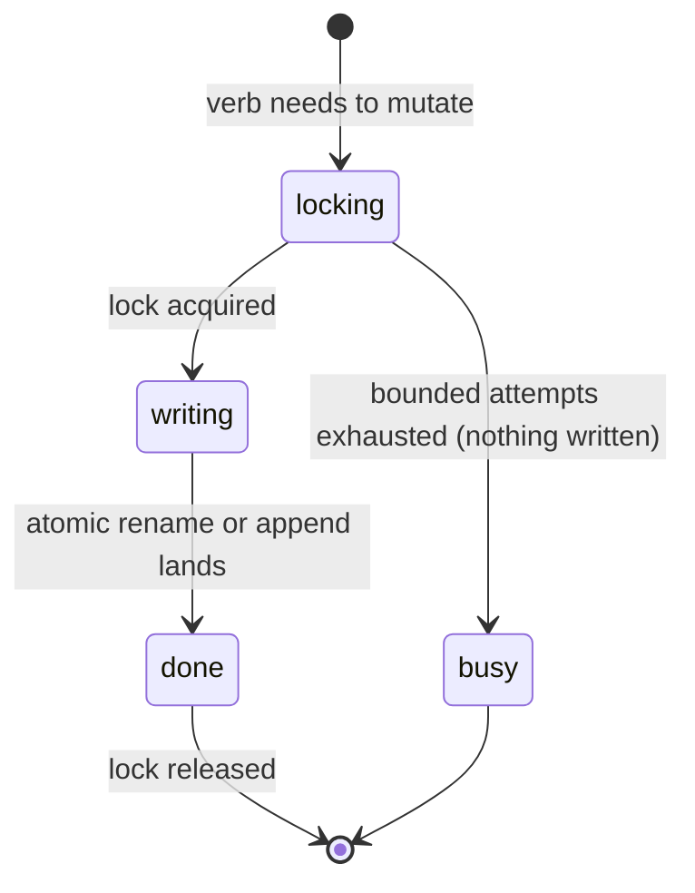

# The store

## Summary

The store is everything bee remembers: the `.bee/` directory at the store root. It holds the workflow's current position (`state.json`, lane files, workflow records), the work items (cells, claims, reservations, leases), the memory layers (decisions, the capture queue, the backlog, the human mailbox), the coordination surfaces (sessions, locks, holds, grants), and the logs. Two rules govern all of it. First: **the CLI is the only writer** — a hand edit to a CLI-owned file is denied by the direct-edit guard in every phase, and the deny names the verb to use instead. Second: **reads are total** — a corrupt or missing file warns and falls back to defaults instead of crashing, so the store can always be read, only ever mis-written. This document owns the lock, the write disciplines, the corrupt-read rules, and the session records; the layout table below says who writes what.

## The simple case

A verb needs to change state — say `bee state set` moving the phase. It takes the named store lock for that area, rewrites the file atomically (write to a temp sibling, then rename), releases the lock, and answers. If the agent instead tries to edit `.bee/state.json` by hand, the write is denied before it happens:

> bee direct-edit guard: "<path>" is CLI-owned — direct edits are blocked in every phase. Hand-edited state files reintroduce schema drift (the exact class the CLI validates away). FIX: use <verb> instead of editing this file directly.

Reading is unceremonious: any command, any session, any time. A damaged file does not stop a read — bee warns on stderr (`bee: could not parse JSON at <path> — <reason>. Using fallback; fix the file.`) and proceeds with defaults.

## The interaction, event by event

One store write, as every mutating verb performs it:

### Invoke

The verb decides which store area it touches and therefore which named lock it needs: `state`, `sessions`, `decisions`, `cells-archive` plus a per-cell lock, `lane:<feature>`, `workflow:<id>`, per-path reservation locks, and so on. Lock files live under `.bee/locks/`, one per name.

### Ends at once

Reads, and the writers that need no lock. Append-only logs — the capture queue, the backlog appends, `timings.jsonl`, `contention.jsonl` — are bare appends: a single line written with the file in append mode, safe to interleave. Config files are read fail-open per file and are not CLI-owned at all — they are the one part of `.bee/` meant for human hands.

### First side effect

Lock acquisition. The holder records `{pid, session, ts, token}`; the session id comes from the environment. If the lock is busy, the verb waits a bounded time — mutating verbs retry (typically 15 attempts × 20 ms; the general store lock allows 100 × 50 ms, about five seconds), while hooks try exactly once and treat busy as "skip this beat". Exhausted attempts produce a named refusal, never a hang; for example `bee work set: the sessions store is locked by another writer and nothing was written. FIX: run it again.` Every acquisition and every busy is logged to `.bee/logs/contention.jsonl`, fail-open.

### While running

The write itself, in one of two disciplines:

- **Whole-file atomic rewrite** for record files (`state.json`, cells, lanes, sessions, workflow records, reservations projection): pretty JSON written to a uniquely named temp sibling, then renamed over the original. A reader never sees a half-written record — it sees the old file or the new one.
- **JSONL append** for event logs (decisions, capture queue, backlog, timings): one compact line per event. A batch of decisions is one append.

### Finish

Lock released (idempotent, matched by token and pid — a release never removes a lock someone else has since taken over). The verb answers. On disk, history is what the event logs accumulated and what git captures of the record files; nothing in the store is ever silently erased.

## The layout

What lives where, who writes it, and how. "Rewrite" means whole-file atomic; "append" means JSONL.

| Path | Written by | Mode |
| --- | --- | --- |
| `state.json` | `bee state …` verbs and the state-sync hook | rewrite, `state` lock |
| `lanes/<feature>.json` | `bee state start-feature`, `bee state set --lane` | rewrite, per-lane lock |
| `cells/*.json`, `cells/archive/` | `bee cells …` | rewrite, per-cell + archive locks |
| `claims/<cell>.json` | `bee cells claim-next`, heartbeat renewal | rewrite behind an exclusive-create gate file |
| `decisions.jsonl` | `bee decisions …` | append, `decisions` lock |
| `capture-queue.jsonl` | `bee capture …` (and `decisions supersede`) | append, no lock |
| `backlog.jsonl`, `docs/backlog.md` | `bee backlog …` (the markdown is a rendered view) | append / rendered |
| `reservations.json` | `bee reservations …` — a projection of the lease files | rewrite, per-path locks |
| `runtime/leases/`, `runtime/workflows/`, `runtime/handoffs/`, `runtime/cross-worktree-holds.json`, `runtime/worktree-grants.json` | claims and reservations machinery, `bee state` workflow and handoff verbs, `bee worktree register/unregister` | rewrite, named locks |
| `sessions/<id>.json` | session hooks, `bee state session …`, `bee work set` | rewrite, `sessions` lock |
| `human-mailbox/` | `bee mailbox …` and run-end letter filing | per-entry files |
| `config.json`, `config.local.json` | the human | not CLI-owned |
| `locks/`, `logs/`, `cache/`, `workers/` | the machinery itself | append / rewrite, fail-open |
| `onboarding.json`, `doctor-attest.json`, `companion-session.json` | `bee onboard`, `bee doctor`, the companion lifecycle | rewrite |

The direct-edit guard's deny table covers the state-bearing files: cells, lanes, `state.json`, the backlog (both files), holds, grants, the companion record, `onboarding.json`. Notably *not* in the table: `decisions.jsonl`, `sessions/`, `reservations.json`, config, and the logs — see "Open questions".

## What is in state.json

The keys an agent meets: `phase` (default `idle`), `feature`, `mode`, `approved_gates` (exactly five gates — `context`, `shape`, `execution`, `review`, `uat` — all default false), and `route`. Everything else the workflow tracks lives in the workflow records and lane files, of which `state.json` is a rebuildable projection. A legacy phase value `validating` is silently read as `planning`. `approved_gates` merges only when the stored value is a JSON object; any other shape yields the defaults.

## Session records

Each session writes `.bee/sessions/<id>.json`: id, optional bound lane, timestamps, status, activity, and its declared work. The liveness ladder, all derived at read time:

- **Signal**: `live` if the last activity is within 90 seconds, else `no_signal`.
- **Heartbeat**: stamped by the state-sync hook on tool use, throttled to once per 60 seconds; a beat also renews the session's claim TTLs, path leases, and cross-worktree holds, and it revives a `dead` or `closed` record — unless the record was explicitly `released`, which survives revival.
- **Stale**: 900 seconds without a heartbeat. Siblings stop counting the session as a live worker; its claims become sweepable.
- **Released**: `bee state session release` marks the record closed immediately, so the checkout's write-policy and worker counts let go of it without waiting out the 900 seconds. The next user message re-engages the session.

## Modifiers

| Modifier | Effect on the store |
| --- | --- |
| `--json` | Changes answers, never writes. |
| Gate-bypass level | No effect here; it changes what [gates](gates.md) will self-approve. |
| Store phase | No effect on the mechanics; the phase decides what the [guards](guards.md) allow to be written *around* the store. |
| Where it runs | Decides which `.bee/` answers: in an ungranted worktree the control plane (sessions, claims, workers, lanes) is the main checkout's store; a granted worktree has its own — [worktrees](worktrees.md) owns the split and the commands that refuse inside a granted worktree. |
| Who runs it | Hooks take locks with a single attempt and skip on busy; verbs retry bounded. Same store, different patience. |

## Cancel and interrupt

Columns: before and after the write lands.

| Event | Before the write lands | After |
| --- | --- | --- |
| The process killed mid-command | The temp file may remain; the real file is untouched (rename never happened). A held lock goes stale: takeover after 30 s only if the holder's pid is provably dead, unconditionally after 1 hour. A live holder is never robbed. | The rename is atomic — the new content is simply there. |
| The session turning elsewhere | Store writes are per-invocation; there is no mid-write session event. | Same. |
| A clean completion from outside | No effect on an in-flight write. | Same. |
| The store unavailable | Lock busy: bounded retry, then a named refusal telling the agent to run it again; the busy line names the holder (`lock "<name>" busy: held by pid=… session=… since …`). | Corrupt record files warn and read as defaults; a torn JSONL line is skipped with a per-line warning (`… line <N> — invalid JSON. Skipping that line; fix the file.`). |
| The session going away | Its heartbeat stops; 900 s later its claims are sweepable and its record reads stale. Nothing is deleted. | Same. |
| A sibling changing the target | Serialized by the named locks; the loser of a race gets the busy refusal or a conflict answer, never a torn file. | Last rename wins per lock-holder turn; event logs interleave without loss. |
| The channel changing | No effect; the store has one format regardless of runtime or output mode. | Same. |

## Interactions with other systems

**Gates and approval.** Approvals are store records (`approved_gates`, the workflow record's gate entries); the store itself is gate-blind — what a phase forbids is enforced by [guards](guards.md) and the verbs.

**The store and history.** Event logs are their own history; record files rely on git commits for theirs. The bookkeeping commits the workflow makes are the durable trail.

**Worktrees and containment.** One store per checkout, with the control-plane redirect for worktrees — [worktrees](worktrees.md).

**Claims, holds, and reservations.** All store records under `runtime/`; their TTL and renewal mechanics ride the heartbeat described above; their conflict behavior is [guards](guards.md) and [reservations](../coordination/reservations.md).

**Sibling sessions.** The store *is* the coordination medium: sessions see each other only through it.

**What the human sees.** Nothing directly; `bee status` and the preamble render the store for reading. The one human-owned corner is config.

**Configuration.** `config.json` overlaid by `config.local.json`, merged fresh per invocation, each file failing open independently.

**Output modes and exit codes.** Standard contract — [invocation](invocation.md). Store warnings always go to stderr, never stdout, so `--json` output stays parseable.

## Edge cases

- A batch decision log is a single append: all lines land or none.
- Lock takeover is itself serialized (an exclusive-create claim file), so two sessions cannot both "break" a stale lock; abandoned takeover claims are swept after an hour.
- `git add` on a CLI-owned file is deliberately not a direct-edit — committing the store is bookkeeping, editing it is drift.
- A session record revived by a late heartbeat loses `dead`/`closed` status and gains `revived_at` — unless it was `released`, which sticks.
- Reads strip a UTF-8 BOM and tolerate invalid UTF-8 (lossy), so a store file mangled by an editor still reads.
- `reservations.json` is a projection: deleting it loses nothing (the lease files are the truth), but hand-editing it is also pointless for the same reason.

## Open questions and verification

- `decisions.jsonl`, `sessions/`, `reservations.json`, and the logs are not in the direct-edit deny table. For the projection and logs that is understandable; for `decisions.jsonl` — the durable decision record — a hand edit passing the guard looks like an oversight. Filed in [bug-triage.md](../bug-triage.md) as a product call.
- The `.bee/HANDOFF.json` legacy path is still written by one handoff route and treated as precious by `worktree prune`; whether both handoff surfaces (legacy file and `runtime/handoffs/`) are meant to coexist was not determined.
- Lock-contention behavior was read from code and its tests, not raced by hand; the busy wording is quoted from source.
- The store layout table's lock column was read from code; the per-verb lock choices were not individually probed.

Verified against beehive commit `6b0ae488`.
