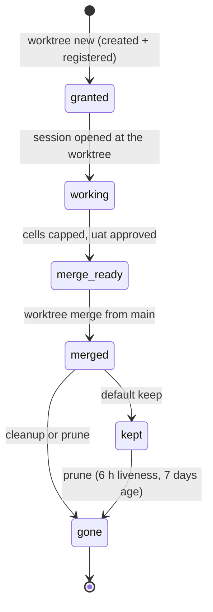

# Worktrees and staging

## Summary

bee's geography has three kinds of ground. The **main checkout** holds integration, release, docs-lane work, and a solo tiny fix; it is where merges land and where the shared control plane lives. A **feature worktree** — a sibling directory `<repo>--wt--<feature>` on branch `wt/<feature>` — holds one feature's code from the start of work to its merge; `bee worktree new` creates and *grants* it, `bee worktree merge` lands it. **Staging** is an opt-in, disposable mixing ground — worktree `<repo>--wt--staging`, branch `staging` — where the human tests several features together before the UAT gate; it is rebuilt from main at will and its history never lands anywhere. The granted worktree's defining property is the split store: its control plane (sessions, claims, workers, lanes, handoffs) stays in main's `.bee/`, while its data plane (its own decisions, its own cells for the granted feature) is local. This document owns that geography; the guards that police it are in [guards](guards.md).

## The simple case

A feature starts. From main:

```
bee worktree new --feature login-rate-limit
```

bee creates `../beehive--wt--login-rate-limit` on branch `wt/login-rate-limit`, registers the grant in main's store, bootstraps a local `.bee` (config copied, binary provisioned, foreign cells pruned away), and answers with the next step: **open a new session with the worktree as its working directory** — the current session stays on main. Work happens there: gates, cells, commits, all inside the worktree.

When the feature is done and the UAT gate is approved, from main:

```
bee worktree merge --id <id>
```

bee auto-commits main's own bookkeeping, checks the worktree's proof and cleanliness, merges `--no-ff`, and verifies main was left byte-untouched outside the merge. The worktree is kept by default; `--cleanup` removes it and deletes the branch once nothing live remains inside.

## The interaction, event by event

The worktree's whole life:



### Creating

`bee worktree new --feature <slug>` refuses anywhere but the main checkout, and refuses an existing target directory, an existing branch, an existing grant, or an unresolvable `--base-ref`. On success it registers, in order: the git-verified worktree id, the grant (store topology) in `runtime/worktree-grants.json`, the workspace record (write ownership) — two ledgers, deliberately distinct — then bootstraps the worktree's own store and optionally a companion session. A failure at any step rolls back the whole ladder. `bee worktree register` adopts a pre-existing worktree through the same bootstrap; `unregister` tears grant and worktree down.

### Ends at once

`bee worktree list` names each grant, marking `(granted)` or `(granted, merged — pending cleanup)`. Reads are free; nothing here takes a claim.

### Working inside

The granted worktree behaves like a checkout of its own with one big exception — the split store:

- **Control plane in main.** Sessions, claims, workers, lane bindings, recovery, handoffs resolve to main's `.bee/`. Commands that *are* control-plane reads refuse to run from a granted worktree at all, and the refusal names the fix: `bee <cmd>: refused inside a granted feature worktree — this command reads the shared control plane … FIX: run it from <main root>.`
- **Data plane local.** The worktree's own `.bee/decisions.jsonl` and its granted feature's cells live in the worktree.
- **Holds mirror through main.** Paths the worktree is working on appear in main's `runtime/cross-worktree-holds.json`, keyed by the git-verified worktree id, which is what lets the write guard in *another* checkout warn or block on them. An ungranted linked worktree skips all of this — its store root simply *is* main's, and it behaves like an ordinary checkout.

The dispatch rule follows the geography: an execution worker inherits its session's working directory, so workers for a feature are dispatched from a session *inside* the worktree, never from main.

### Merging

`bee worktree merge`, from main only, walks a fixed ladder — every rung a named refusal:

1. Auto-commit of main's bookkeeping (`.bee`, `docs/decisions`, the feature's knowledge and history) so a routinely dirty main does not block; warn-never-block, opt-out by config.
2. **Proof debt** refuses: any capped cell whose report lacks a valid proof line `<command> — <result> — <scope reason>`.
3. A dirty main (beyond bookkeeping), a dirty worktree (its gitignored `.bee` store alone does not count), a detached HEAD, or a branch mismatch each refuse.
4. **The UAT gate pending refuses** — the escape hatches are explicit (`--skip-uat`, or `uat_before_merge: false` in config), never the bypass ladder.
5. The merge itself: `git merge --no-ff --no-commit`, then a three-part verification that main was left byte-untouched outside the merge, with an abort ladder if not.

After a successful merge the worktree is kept unless `--cleanup` (or a later `prune`) removes it. Cleanup refuses on a dirty tree, a live session inside (15-minute heartbeat window), or a failed removal; an unproven proof at cleanup time rides as a warning, not a block.

### Pruning

`bee worktree prune`, main only: removes worktrees that are merged, clean, session-free, and old enough. Liveness uses a deliberate 6-hour window (a deletion has no retry), age defaults to 7 days (`--older-than-days` overrides; no config key). `git worktree lock <path>` is the permanent opt-out; `--dry-run` previews. Prune considers the union of grants and workspace records, so an adopted or half-registered worktree is not invisible to it.

## Staging

Opt-in via `staging_before_merge` in config; off by default, and when off, `bee staging add` answers that staging is disabled and points at testing the feature worktree itself. When on:

- `bee staging add --feature <slug>` lazily creates the staging worktree from *current* main, merges the feature branch in, records the staged entry, and runs the configured `staging_build` hook.
- `bee staging rebuild [--without <slug>…]` resets staging to current main and re-merges the staged set minus exclusions — staging is always reconstructible, never precious.
- `bee staging status` reports the staged entries, the base, and whether the base is stale.
- Staging's history is a dead end by construction: `worktree merge` refuses the staging id with no escape flag, and a hand-run `git commit` inside staging is denied by its guard. What the human approves at staging is *the features*, which then land individually from their own worktrees.

## Modifiers

| Modifier | Effect |
| --- | --- |
| `--json` | Standard contract on every worktree and staging verb. |
| Gate-bypass level | None here; the UAT rung of the merge ladder is deliberately outside the bypass machinery. |
| Store phase | The worktree-first guard binds when the *active feature's lane* is code-touching; merge and prune run from main regardless of phase. |
| Where it runs | The whole subject: `new`, `merge`, `prune`, and every staging verb refuse outside the main checkout; control-plane commands refuse inside a granted worktree. |
| Who runs it | Merge is integration work — the orchestrator's, from main. Under herding, merge is the owner's single-shot gesture, never the dispatch loop's. |

## Cancel and interrupt

Columns: before and after the merge commit lands (the arc's point of no return).

| Event | Before | After |
| --- | --- | --- |
| The process killed mid-command | `new`: the rollback ladder or, at worst, a half-registered worktree that `register`/`unregister` reconciles. `merge`: the `--no-commit` merge aborts or is left for `git merge --abort`; main's byte-untouched verification exists exactly for this. | The merge commit is main history; the worktree is inert and prunable. |
| The session turning elsewhere | The worktree persists indefinitely; grants have no TTL. A handoff or a fresh session at the same path resumes it. | Same. |
| A clean completion from outside | UAT approval is the completion that unlocks the merge rung. | — |
| The store unavailable | Corrupt grants registry: creation-side reads fail open, the guard side fails open toward allowing, and the holds ledger fails closed — the split postures of [guards](guards.md). | Same. |
| The session going away | Its holds expire with its heartbeat; the worktree itself never expires, only prune's age math moves. | Cleanup refuses while a live session sits inside. |
| A sibling changing the target | Two features' worktrees are disjoint by construction; overlap surfaces as cross-worktree holds (warn or block) and, at the end, as ordinary merge conflicts surfaced by the merge rung. | A second merge of the same branch is an empty merge. |
| The channel changing | No differences by runtime. | Same. |

## Interactions with other systems

**Gates and approval.** Gate 2 opens edits inside the worktree; Gate 3 (UAT) is a merge rung. Neither is a worktree mechanism itself.

**The store and history.** The grant and workspace ledgers, the holds mirror, and the staging record are all main-store files; the merge auto-commit is the bookkeeping trail.

**Worktrees and containment.** Owned here.

**Claims, holds, and reservations.** Claims live on the control plane (main); holds mirror per worktree; swarm reservations are per-checkout during swarming.

**Sibling sessions.** One write-capable session per checkout is the default (write-policy guard); worktrees are how parallel sessions get parallel ground honestly.

**What the human sees.** The worktree path to open, staging as "the place to try it", and the merge as the feature landing — never the ledger mechanics.

**Configuration.** `worktree_first`, `staging_before_merge`, `uat_before_merge`, the auto-commit opt-out, `commands.staging_build`.

**Output modes and exit codes.** Standard — [invocation](invocation.md).

## Edge cases

- A worktree created by hand (plain `git worktree add`) is linked but ungranted: it shares main's store wholesale and none of the granted machinery applies until `bee worktree register` adopts it.
- The bootstrap prunes foreign cells out of the new worktree's local store, and a re-register prunes again — a worktree only ever carries its own feature's cells.
- A grant whose directory has been deleted by hand still occupies the grant ledger until `unregister` or `prune` reconciles it.
- Merge refuses the staging branch by name — there is deliberately no flag to override that one.
- The 15-minute liveness window at cleanup versus the 6-hour window at prune is intentional asymmetry: cleanup is an explicit gesture with a retry, prune is unattended deletion.

## Open questions and verification

- The companion-session option on `worktree new` (`--with-companion`) was noted but its lifecycle not read; the companion record appears in the store inventory and deserves its own treatment in [sessions](../coordination/sessions.md).
- Whether `worktree merge` runs the feature's declared test command or relies wholly on recorded proof plus CI was read as: it checks recorded proof and runs nothing — stated here on the code's comment and the AGENTS contract, unverified by a live merge.
- The exact bookkeeping pathspec set of the auto-commit (whether `docs/knowledge` is always included or only when recorded) was read once and should be confirmed when a live merge is verified.
- None of the worktree arc has been exercised live for this description; the create/merge/prune behaviors are drawn from code and their extensive refusal tests.

Verified against beehive commit `6b0ae488`.
