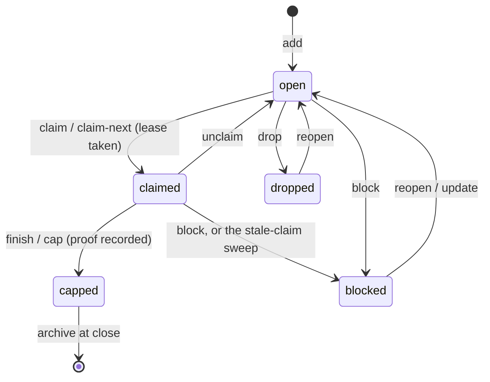

# The cell store

## Summary

A cell is one bounded unit of executable work: a JSON record under `.bee/cells/` with an id, a feature, a title, an action, a verify command, a lane, and a role. This document owns the record and its states — what every other lifecycle document moves through. The state vocabulary is five words: `open` (claimable), `claimed` (one owner, leased), `capped` (done with recorded proof), `blocked` (parked with a reason), `dropped` (abandoned with a reason). Claiming and capping are [execution](execution.md)'s arc; this document owns authoring (`add`, `update`), reading (`list`, `show`, `ready`, `schedule`), parking and reviving (`block`, `drop`, `reopen`, `unclaim`), the budget machinery (`escalate`, `reset-budget`), and retirement (`archive`, `unarchive`).

## The simple case

Gate 2 is approved. The agent creates the slice in one batched `bee cells add` — each cell naming what to do (`action`), how it will be proven (`verify`), which files it expects (`files`), and its dependencies within the slice. `bee cells ready` lists the cells whose dependencies are all capped; `bee cells schedule` orders them into waves. Workers claim, execute, and cap them one by one. A cell that hits a wall is parked: `bee cells block --id <id> --reason "<why>"`. When the feature closes, its terminal cells are archived out of the active scan automatically.

## The interaction, event by event

A cell's life:

### Authoring

`bee cells add` validates each record: `id`, `feature`, `title`, `action`, `verify` all non-blank; `lane` from the closed enum; `role` **required** but an open vocabulary — the guidance list (`code`, `read`, `test`, `docs`, `review`, `design`) is advice, never matched against. `standard` and `high-risk` cells must carry non-empty `must_haves.truths`. A `change_class` of `behavior` arms the trace flag that [close](close.md)'s scribing-debt door later reads. Defaults are normalized in: status `open`, empty deps/decisions/files/read_first, empty trace. The gate refusal ([planning](planning.md)) keeps all of this behind Gate 2.

The `verify` field is the feature-close proof command, and `bee cells show` annotates it honestly: `verify_owner: "main (feature close) — the worker never runs this"` — the worker's own proof at cap is a different thing ([execution](execution.md)). A no-test-repo sentinel in `verify` is refused unless the repo declared itself no-test.

`bee cells update` edits a cell — only while it is `open` or `blocked`. A claimed cell is its worker's; a capped one is history.

### Reading

- `bee cells list` / `show` — records with their claim's live verdict annotated `sweepable` or `held` (TTL and heartbeat, the same two gates the sweep uses).
- `bee cells ready` — open cells whose deps are all capped; the runtime readback of "the current slice".
- `bee cells schedule` — dependency and file-overlap waves (`Wave 1: a, b`), plus diagnostics: cycles, unsatisfiable deps, empty files lists, shared-regen-root serializations.

### Parking and reviving

- `block --id --reason` parks the cell, appends an attempt with a normalized failure signature, records the reason on the trace, and clears the claim. An empty reason refuses: `blockCell: a reason is required.`
- `drop --id --reason` abandons it; `reopen --id --reason` returns a blocked, dropped, or even capped cell to `open` (refusing one already open or claimed), clearing the parked reason and stamping the reopen.
- `unclaim` returns a claimed cell to `open` — the polite release, versus the sweep's forced one.
- Any session may reopen or update; cells have owners only while claimed.

### Budgets and escalation

Every cell carries budgets — `max_claims`, `max_failed_attempts`, `max_same_signature`, defaulting `3/4/2`, hard-capped `9/12/6`. Exhaustion closes the claim door (`CELL_BUDGET_EXHAUSTED`, `REPEATED_FAILURE`): a cell that keeps failing stops absorbing attempts until a human-auditable reset. `bee cells reset-budget --id --reason` demands an actor (`--operator` or `BEE_AGENT_NAME`) and refuses when the cell is not actually budget-blocked; the reset is appended to the trace, and attempt counting restarts from it.

`bee cells escalate --id` flags the cell for the session model with a 40% ration: strictly over 40% of the feature's cells escalated refuses, and `--reason` is the recorded override (`trace.escalation_reason`). `--off` disarms. The legacy spelling `tier: "ceiling"` is still read.

### Retirement

`archive` moves a feature's terminal cells under `.bee/cells/archive/<feature>/` (`--feature`, or `--all-but-active` — never a single cell id); `unarchive` moves them back. [Close](close.md) auto-archives every terminal cell of the feature it closes; `bee status` counts never-closed features' terminal cells as `cells.archivable` — the backlog of retirement that only exists for work that skipped close.

## Modifiers

| Modifier | Effect |
| --- | --- |
| `--json` | Standard on every verb. |
| Gate-bypass level | None directly; the gate that `add` and `claim` read may itself have been bypass-approved. |
| Store phase | `add` refuses in a gated phase ([planning](planning.md)); everything else is phase-blind — parking, reading, and budget verbs work whenever. |
| Where it runs | Cells are control-plane records — main's store, or the granted worktree's own store for its granted feature (the bootstrap prunes foreign cells out). |
| Who runs it | Authoring and budget resets are the orchestrator's; block/reopen are anyone's with a reason; a worker touches exactly its one cell. |

## Cancel and interrupt

Columns: before and after the cell record is written.

| Event | Before | After |
| --- | --- | --- |
| The process killed | A batched add is per-file atomic; a killed batch leaves the cells already written, each valid. | The record is whole (atomic rewrite); the claim/lease machinery has its own story ([execution](execution.md)). |
| The session turning elsewhere | Nothing pending. | Cells are the durable work list — that is their point; the successor reads `ready` and continues. |
| A clean completion from outside | Gate 2's approval is what unlocks `add`. | A reopened cell rejoins `ready` when its deps allow. |
| The store unavailable | Named refusals; per-cell locks bound the waits. | Corrupt cell JSON warns and falls back — a broken record reads as defaults rather than crashing the list. |
| The session going away | — | Its claimed cells are swept to `blocked` with the dead session named ([orient](orient.md)); open cells are untouched. |
| A sibling changing the target | Two adds of the same id race on the per-cell lock; the loser's write is refused, not interleaved. | Updates refuse on claimed cells, so a sibling cannot edit work out from under its worker. |
| The channel changing | Standard. | Same. |

## Interactions with other systems

**Gates and approval.** `add` and `claim` read the lane's own execution gate — only the lane's approvals authorize its cells, never the default pipeline's. **The store and history.** Cell files with per-cell locks; attempts, resets, and reopens accumulate on the trace — a cell is its own audit log. **Worktrees and containment.** A cell's `files` feed the schedule's overlap waves and the reservation conventions; the worktree bootstrap keeps each worktree's cell set to its own feature. **Claims, holds, and reservations.** The claim lease is [execution](execution.md); budgets close the claim door from the cell's side. **Sibling sessions.** `claim-next` is the cross-session pickup; browsing another feature's open cells is the anti-pattern the etiquette forbids. **What the human sees.** Cells surface as counts and ready ids in orient and status — the work, not the records. **Configuration.** None of its own. **Output modes and exit codes.** Standard.

## Edge cases

- `role` being open-vocabulary means a typo'd role is legal; the dispatch layer is where an unconfigured role refuses ([dispatch](../delegation/dispatch.md)).
- `escalate` and `reset-budget` move no status — a blocked cell stays blocked through both until reopened.
- The escalation denominator is the feature's *all* cells, terminal included, full stop.
- The stale-claim sweep parks to `blocked`, not `open` — a swept cell demands a look at why its session died before anyone re-claims it.
- An archived cell still counts for close's proof reading (close reads store *and* archive).
- `deps` may name only existing cells; the schedule diagnoses, and the add-time validation refuses, a dep on nothing.

## Open questions and verification

- Whether add-time validation refuses unknown dep ids or leaves them to `schedule`'s `unsatisfiable_deps` was read ambiguously; pin at verification.
- The full `change_class` vocabulary (8 values) was not enumerated beyond `behavior`.
- The attempt/failure-signature normalization (what counts as "the same failure") was not read in detail.
- Not yet exercised live; state moves and refusals are drawn from code and the workflow-verbs tests.

Verified against beehive commit `6b0ae488`.
