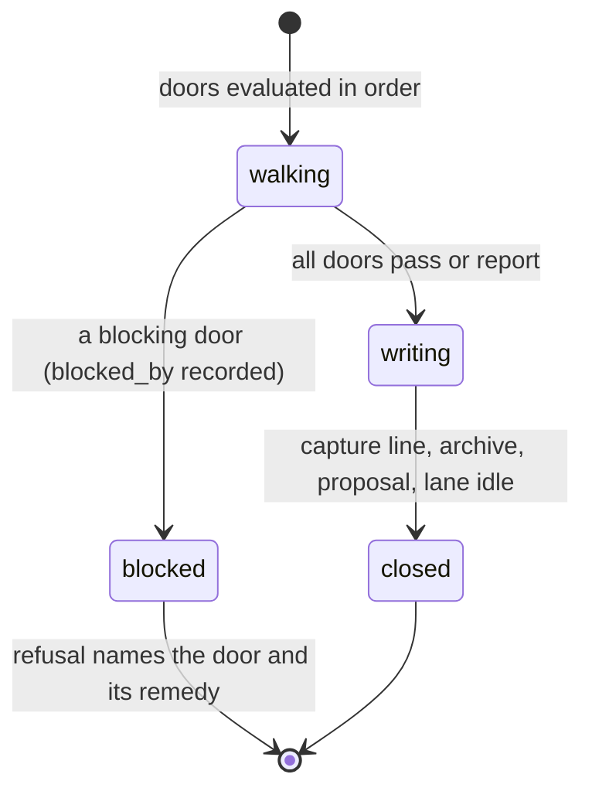

# Close

## Summary

`bee close --feature <f>` is the feature's terminal gesture: it walks a fixed ladder of doors, each door either reporting or blocking, and on a green walk it writes the ending — a capture line, the terminal cells archived, a knowledge-promote proposal computed, and the lane's phase set to `idle` ("close is the terminal write"). Close **runs nothing**: its tests door reads the proof lines recorded on every capped cell; CI runs the declared command on every push as the deterministic net. Every blocking door has a loud, recorded escape — a waiver flag or a named deferral decision — because the doors exist to make skipping visible, not impossible. Alongside close sit the two stamps it reads: `bee state scribing-run` (specs synced) and `bee state compounding-run` (learnings recorded), whose freshness ordering close checks and, when unmet, waives with a recorded notice.

## The simple case

The feature's cells are all capped, the captures are flushed, the specs synced. The agent runs `bee close --feature login-rate-limit`. Each door reports clean; the answer leads with `Tests GREEN for "login-rate-limit" — <proof detail>`, the feature's terminal cells are retired (`Retired "login-rate-limit": 6 cell(s) moved out of the active scan (bee cells unarchive --feature login-rate-limit to reverse).`), a soft knowledge-promote proposal is computed for later review, and the lane ends: `Lane phase set to "idle" for "login-rate-limit" — close is the terminal write.` The feature is closed — verified, unreviewed (review is its own user-invoked pass).

`--dry-run` walks the same doors and writes nothing but the merge-ready projection of what blocks.

## The interaction, event by event

### Invoke

`--feature` names the lane; a non-boolean `close_commit_bookkeeping` config value refuses the whole close up front.

### The doors, in order

1. **tests** — every capped cell of the feature (store *and* archive) must carry a valid proof line on its trace. No command runs. Refusal headline: `Proof debt for <feature>`, with the remedy naming the debtor cells.
2. **scribing-debt** — capped `behavior_change` cells with no capture recorded block, unless a `capture-deferral` decision names the feature. Headline: `Capture debt for <feature>`.
3. **capture-queue** — report-only: pending stubs are named, never blocking (a deliberate decision — the queue is a wrap-up chore, not a close hostage).
4. **judge-debt** — only for a `standard`/`high-risk` route: the goal-check verdicts owed. Headline: `Judge debt for <feature>`.
5. **uat** — only under `uat_stop: "close"` config: the UAT gate pending blocks here instead of at merge. Headline: `Uat gate pending for <feature>`.
6. **pattern-check** — a recorded `violated` verdict blocks. Headline: `Pattern violated for <feature>`.
7. **knowledge-freshness**, **impact**, **routing**, **doc-deferral** — each blocks with its own headline and each has a named `<door>-deferral` decision as its recorded escape.

Every blocking door's name lands in the feature's merge-ready `blocked_by` projection — on dry runs and early refusals too — so `status` and the merge can see *why* a feature is not landable without re-walking the doors.

### Writing the ending

On a green walk: the headline, a capture line (close itself closes with a capture or an explicit nothing-settled), the auto-archive of the feature's cells — all or nothing: one still-open cell keeps the whole set active — the promote proposal computed *before* retirement (soft — it never blocks), and the lane phase written to `idle` unless already terminal. A failed phase write is a warning, not a refusal — the close stands, the projection is caught up later.

### The stamps

- `bee state scribing-run --feature F --areas "<a,b>" --next-action "<n>"` — records that the feature's settled behavior was synced into its area specs; lands on the lane and the scribing-runs log.
- `bee state compounding-run --feature F --learnings <path>` — records the learnings pass.
- Freshness: a compounding-run older than the last scribing-run is stale; closing anyway records the waiver verbatim in the close's output (`… the compounding-run freshness check WAIVED …`). The freshest of ledger, lane, and state wins when they disagree.

## Modifiers

| Modifier | Effect |
| --- | --- |
| `--json` | The doors as a structured report. |
| Gate-bypass level | None. Close's doors are not gates; their escapes are waiver flags and named deferral decisions, all recorded. |
| Store phase | Close runs from wherever the lane stands and *ends* the phase; a lane already terminal skips the phase write. |
| Where it runs | Main-checkout work — close is integration-side; the worktree's landing (`bee worktree merge`) is a separate gesture with its own ladder ([worktrees](../foundations/worktrees.md)), and `uat_stop` config decides which of the two carries the UAT stop. |
| Who runs it | The orchestrator's; never a worker's. |

## Cancel and interrupt

Columns: before and after the ending writes begin.

| Event | Before | After |
| --- | --- | --- |
| The process killed | Doors are reads; nothing to undo. The `blocked_by` projection may be freshly written — it is idempotent. | Each ending write is per-record atomic; a re-run close is the recovery: already-archived cells skip, an already-idle lane skips, the capture line repeats harmlessly. |
| The session turning elsewhere | The close report is re-derivable; run it again. | Same. |
| A clean completion from outside | A deferral decision logged between runs flips a blocking door to reported — that is the design. | — |
| The store unavailable | Named refusals; the doors read fail-open stores but refuse on the config they cannot trust. | Same. |
| The session going away | Nothing held. | Nothing held. |
| A sibling changing the target | A sibling capping one more cell between walks changes the tests door's population — close reads live state each run. | Archive races are per-file moves; the loser's move finds the file gone. |
| The channel changing | Standard. | Same. |

## Interactions with other systems

**Gates and approval.** The UAT gate can bind here (`uat_stop: "close"`) or at merge; close never approves anything. **The store and history.** The doors read traces, decisions, and stamps; the ending writes archive moves, the proposal, and the lane's terminal phase. **Worktrees and containment.** Close marks the lane done; the code lands through the merge — two gestures, deliberately separate. **Claims, holds, and reservations.** Close holds nothing itself, and the tests door reads only *capped* cells — a live claim raises no proof debt by itself; incomplete work surfaces through the merge-ready projection and the later doors, not through tests. **Sibling sessions.** The `blocked_by` projection is how a sibling (or the herding cockpit) knows a feature is not landable without asking. **What the human sees.** One line: the feature closed, or the one door blocking and what would clear it. **Configuration.** `uat_stop`, `close_commit_bookkeeping`. **Output modes and exit codes.** Standard.

## Edge cases

- Close reads archived cells too, so a re-run after a partial close still accounts every proof.
- The capture-queue door reporting instead of blocking means a feature can close with stubs pending — the preamble keeps nagging until they flush.
- The promote proposal is computed before retirement because retirement moves the cells the proposal mines.
- A feature with zero capped cells has no proof debt — the tests door passes vacuously; the routing/impact doors are what catch an empty close.
- `bee finish` is not close — it caps one cell. The names are close enough to confuse; the router keeps them distinct.

## Open questions and verification

- The exact populations of the knowledge-freshness, impact, routing, and doc-deferral doors (what each reads to decide) were not read in detail — only their block-with-named-deferral shape.
- Whether close's bookkeeping commit (`close_commit_bookkeeping`) commits automatically on green or only validates config was not determined.
- The judge-debt door's tie to the goal-check tier table (which lanes owe which verdicts) is in the skill layer; the CLI side was read only as "exists for standard/high-risk routes".
- Not yet exercised live end-to-end; door order, headlines, and ending texts quoted from source.

Verified against beehive commit `6b0ae488`.
