# Execution: claim to cap

## Summary

Execution is the worker's arc: take exactly one cell, do exactly its work, prove it, and cap it. The claim (`bee cells claim` for a named cell, `bee cells claim-next` for the next eligible one) takes a leased, fenced ownership file; the cap (`bee cells finish`, or the narrower `bee cells cap`) closes the arc and **refuses without recorded proof** — a report whose `tests` key is a proof line `<command> — <result> — <scope reason>`, and a red result refuses outright: never build on a red base. Between the two sit the swarm conventions: reserve the files, prefix write-heavy shell work with the agent's name, commit once per cell with the `cell: <id>` trailer, and answer the orchestrator with one status token. The cap runs no tests itself — the proof was run by the worker, the cap records it, and CI re-runs the declared command as the deterministic net.

## The simple case

The orchestrator dispatches a worker with one claimed cell (or the worker claims next). The worker reserves the cell's files, reads what the cell names, writes the code, runs the proof it chose for the change type, commits once with the trailer, and caps:

```
bee cells finish --id lrl-2 --report '{"outcome":"lockout after 5 failures","commit":"a1b2c3d","files":["src/auth/limit.rs"],"tests":"cargo test -p auth — green — rate-limit tests cover the change","deviations":[]}'
```

bee answers `Capped lrl-2 at <ts> (tests: boundary).`, releases the worker's reservations, and prints the worker's exit line: `next: reply [DONE] with the one-line outcome, files touched, and the commit hash.` The worker reports `[DONE] …` and is finished — it executes exactly the one cell it was handed.

## The interaction, event by event

```mermaid
stateDiagram-v2
    [*] --> claiming
    claiming --> refused : gate unapproved, not open, already claimed, budget exhausted
    claiming --> working : claim file published (lease 3600 s)
    working --> proving : change done, proof command run by the worker
    proving --> capped : finish accepts the report (claim cleared)
    proving --> blocked : red proof or a wall — block with reason
    working --> swept : session dies; sweep parks the cell
    capped --> [*]
    refused --> [*]
    blocked --> [*]
    swept --> [*]
```



### Claiming

`claim` names the cell; `claim-next` takes the next eligible cell from the pipeline pool — the sanctioned cross-session pickup, never browsing. Both publish a claim file (`.bee/claims/<id>.json`) by exclusive create: `{cell, session, ttl_seconds (default 3600), claimed_at, fence_epoch}`; the cell flips to `claimed` with the worker and session on its trace. `claim-next` first runs the stale-claim sweep ([orient](orient.md) owns its gates). The refusals:

- Before the lane's own Gate 2: `claimCell: lane "<lane>" gate "execution" is not approved — cells of this feature cannot be claimed before ITS lane passes Gate 2 … Surface Gate 2 to the user for lane "<lane>" ….`
- Not open: `claimCell: cell "<id>" is "<status>", not "open" — only open cells can be claimed. Run bee cells ready to list claimable cells.`
- Already claimed (the file layer): `claim: CLAIMED — cell "<id>" is already claimed by session "<owner>" (<expiry>).`
- Budget exhausted or repeated failure: the claim door is closed until an audited reset ([cells](cells.md)).
- A sessionless claim while another session is live refuses — anonymous ownership defeats the sweep.

The lease renews with the session's heartbeat; a dead session's claim is sweepable after TTL and heartbeat both lapse.

### Working

The swarm conventions, enforced by the guards rather than the verbs: reserve files before write-heavy work ([reservations](../coordination/reservations.md)); `BEE_AGENT_NAME=<name>` prefixes write-heavy shell commands so the reservation guard knows whose write it is; a reservation or hold conflict means stop and report `[BLOCKED]`, never write through. One commit per cell — imperative subject describing the change, the cell id as the `cell: <id>` trailer on the body's last line.

### Proving

The worker owns proof scope: related tests for code, parity and pointer checks for docs, a judge verdict for behavior — run by the worker, fresh, and summarized into the proof line. The em-dash separator is literal (` — `); the line splits on the first two separators and all three segments must be non-empty.

### Capping

`finish` (the full, worktree-native door) and `cap` (the narrow one) share the checks, in order: the report must be a JSON object with exactly `outcome, commit, files, tests, deviations`; the proof line must parse; **a red refuses** — `cells finish: --report key "tests" result segment is "red" — a red is fix-first, never a cap. Fix the failure, re-run the proof, and cap with a passing result.`; already capped or dropped refuses; a recorded `NEEDS_REVISION` judge verdict blocks unless `--override-judge`. Lane discipline binds here: `small` and up require non-empty `--files` and a *registered execution worker* unless `--inline-reason` records why it ran inline (the never-zero-execution-workers rule, made checkable); `high-risk` also requires `--outcome`. `finish` with files demands the one-commit-per-cell trailer in recent history unless `--commit-pending <reason>`. A sync door asks whether skills/specs the cell predicted it would touch were handled (`--sync-ack` acknowledges).

What lands on the trace: the verbatim report, files changed, deviations (three sources, deduped), outcome, `capped_at`, warnings, and the proof recorded as boundary evidence — no test process runs at cap. The cap clears the claim, files a mailbox entry, sets the feature's merge-ready fact, and releases the worker's reservations.

### The worker's report

One status token closes the loop: `[DONE]` with the one-line outcome, files, and commit; `[BLOCKED]` with the conflict or wall (the cell parked with the reason); `[HANDOFF]` when context ran out mid-cell; `[NOOP]` when the cell's work turned out already true.

## Modifiers

| Modifier | Effect |
| --- | --- |
| `--json` | Standard on claim and finish. |
| Gate-bypass level | Only through the gate it reads; a bypass-approved Gate 2 claims identically. |
| Store phase | Execution is `swarming`; the reservation guard hard-blocks conflicting writes only in this phase. |
| Where it runs | The worker inherits its session's working directory — dispatching an execution worker from main for a worktree'd feature dies on the write guard; the session moves into the worktree first ([worktrees](../foundations/worktrees.md)). |
| Who runs it | `claim` is control-plane and fine from main; *executing* is the worker's, inside the right checkout, one cell each. A tiny cell may run inline with `--inline-reason` at cap. |

## Cancel and interrupt

Columns: before and after the cap.

| Event | Before the cap | After |
| --- | --- | --- |
| The process killed | The claim survives; the worktree holds whatever was written; the commit either exists or not. The lease and heartbeat decide what happens next. | The cap is atomic with the record write; the `[DONE]` may be lost but the trace is truth. |
| The session turning elsewhere | Context exhaustion mid-cell is `[HANDOFF]`: cap or release what can be, write the handoff; the 65% rule holds mid-wave too. | — |
| A clean completion from outside | Nothing external completes a cell; only the cap does. | — |
| The store unavailable | Claim and cap refuse with named errors, bounded waits; a corrupt claim store fails toward not granting. | Same. |
| The session going away | TTL (3600 s) plus heartbeat (900 s) both lapse → the sweep parks the cell `blocked` with the dead session named; the fence epoch keeps a zombie's late write from racing the successor. | Nothing held. |
| A sibling changing the target | The claim's exclusive create is the arbiter — the second claimer loses cleanly with the owner named. Reservation conflicts stop the write, and `[BLOCKED]` reports them. | An update to a capped cell refuses. |
| The channel changing | A worker on Codex runs the same verbs; its subagent audit rides different hook events. | Same. |

## Interactions with other systems

**Gates and approval.** The claim reads the lane's own execution gate; the judge verdict can block the cap; no gate is written here. **The store and history.** Claim files, the cell trace, the commit with its trailer — three records, one unit of work. **Worktrees and containment.** The worker writes only inside its feature's ground; the cap's merge-ready fact is what [close](close.md) and the merge read. **Claims, holds, and reservations.** The whole subject; reservations release at cap or `finish`. **Sibling sessions.** The lease, the fence, and the sweep are what let two sessions share a pipeline without sharing a cell. **What the human sees.** Progress ticks per cell (`▸`/`✓`/`✗`), never the claim mechanics; a `✗` or `[BLOCKED]` is never silenced. **Configuration.** TTL by flag; the models behind workers are [dispatch](../delegation/dispatch.md)'s. **Output modes and exit codes.** Standard; the worker's status token is conversation, not CLI.

## Edge cases

- `cap` versus `finish`: same checks, but only `finish` releases reservations, requires the commit trailer, and prints the worker's exit line — `cap` is the orchestrator's narrow bookkeeping door.
- A `fix-first` claim (fixing a red base) rides the claim's trace flag; the red it fixes was never capped.
- `--override-judge` and `--commit-pending` both leave loud trace records; they are recorded exceptions, not quiet flags.
- The proof line's result segment is free text apart from red: `green` is conventional, but the check is "not red and not a retired enum", so `passing`/`ok` cap fine — a looseness worth knowing when grepping proofs.
- An adopted claim (from a `planned-next` handoff) carries `adopted` on the claim file; the sweep's self-exclusion still protects it.

## Open questions and verification

- Whether the `tests` sentinel `"boundary"` versus `"undeclared"` distinction is surfaced anywhere the agent reads (status? close report?) was not chased.
- The registered-execution-worker check reads `state.json`'s workers list — how a worker registers (dispatch machinery? `bee state worker add`?) belongs to [dispatch](../delegation/dispatch.md) and was not read here.
- The fence epoch's exact race semantics (what a stale fence write does) were read as intent, not mechanics.
- Not yet exercised live; refusal and success texts quoted from source and its tests.

Verified against beehive commit `6b0ae488`.
