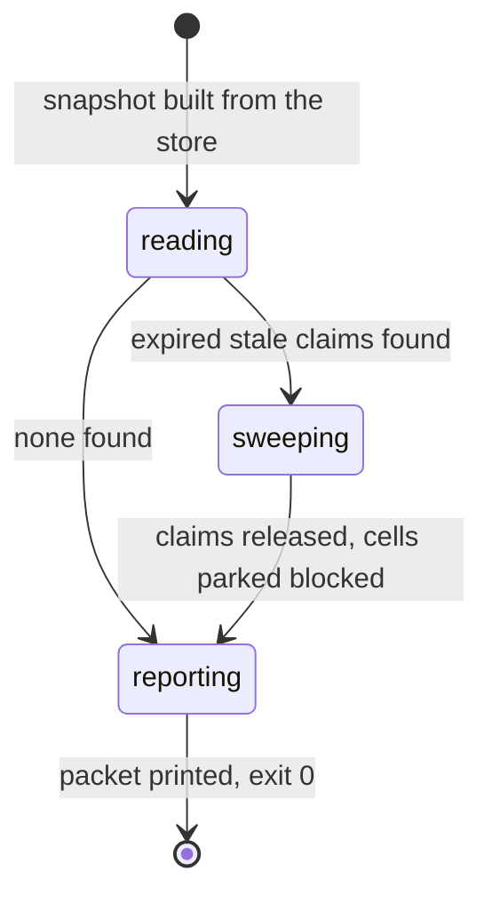

# Orient, status, and route

## Summary

Three verbs give a session its footing. `bee status` is the read-only snapshot: onboarding health, phase, gates, cells, workers, staleness warnings. `bee orient` reshapes the same snapshot into a session-start packet — where the work is, the decisions in force, the work state, and exactly *one* recommended next step — and performs exactly one write on the way: the stale-claim sweep, releasing claims whose owning session's lease is expired and heartbeat dead. `bee route` (the flow spelling of `bee state route`) reads or records how the current feature is classified: `{class, lane, flags, product_files}`. The discipline around them: orient is a ritual with one trigger — routing, starting, or resuming work — and a plain question needs none of the three.

## The simple case

A session starts on a repo with work in flight. The agent runs `bee orient` and gets at most six lines: `where:` (phase, feature, mode, gates, bypass level, any waiting-on mark), `decisions:` (active count, the CONTEXT.md path when one exists), `work:` (open/claimed/capped counts, up to five ready cell ids), any `blockers:`, an optional `worktree:` line, then `skill:` and `next:` — one action, one skill to load, one runnable command when the action names one. The agent loads the named skill and proceeds. There is no menu.

`bee status` serves the same facts, wider and colder, whenever detail is needed mid-flight; `bee route` is consulted or set when the work is being classified ([planning](planning.md) owns when).

## The interaction, event by event

One `bee orient`:

### Invoke

Standard resolution ([invocation](../foundations/invocation.md)). Orient resolves its own caller session first, because the sweep must never run anonymously.

### Ends at once

`bee status` always ends at once — it is the same builder with no sweep and no packet framing, read-only by contract. `bee route` with no `--set` reads the recorded route.

### First side effect

Orient's one write, the stale-claim sweep — the same sweep `bee cells claim-next` runs, reached from a second door. For every claim in the store, in order: skip the caller's own claims; require the TTL expired; require the owner's heartbeat independently stale; respect an in-flight adoption gate. A swept claim's file is removed, and if its cell is still marked claimed by that session, the cell is parked `blocked` with the dead session and its worktree named in the reason, plus a decision row for the audit trail. When orient cannot resolve its own caller session, it declines: it writes nothing and reports the count of expired claims it detected instead.

### While running / Finish

Instantaneous. The packet's `next.skill` comes from a phase-to-skill table (default `bee-hive`), with one deterministic override: a fully idle pipeline plus an open discovery map with frontier tickets recommends `bee-wayfinding` with `bee discovery list --json` as the command. Blockers surface a pending handoff (`pending handoff — surface it to the user and wait`), a live waiting-on mark other than turn-end (`awaiting human — <kind>: <subject>`), and a declined sweep. Exit 0; standard streams; `--json` returns the full packet.

## Modifiers

| Modifier | Effect |
| --- | --- |
| `--json` | The full packet / snapshot as JSON; `status` adds `--lanes-full` and `--brief`. |
| Gate-bypass level | Reported in `where`; changes nothing orient does. |
| Store phase | Selects the recommended skill; decides which gates are shown ([session](../foundations/session.md) owns visibility). |
| Where it runs | Orient and status read the control plane, so inside a granted worktree they answer from main's store; the `worktree:` line names the ground. |
| Who runs it | The sweep excludes the caller's own claims — running orient never releases your own work. Workers do not orient; they receive their cell. |

## Cancel and interrupt

| Event | Before the sweep writes | After |
| --- | --- | --- |
| The process killed | Pure read; nothing to clean. | A half-swept claim set is safe: each release is per-claim and atomic; the next orient or claim-next finishes the job. |
| The session turning elsewhere | The packet is advice, not state; a compacted session simply orients again. | Same. |
| A clean completion from outside | The human's answer changes the *next* orient's packet. | Same. |
| The store unavailable | Fail-open reads with warnings; the sweep declines on an unreadable claim rather than guessing. | Same. |
| The session going away | Nothing held. | Nothing held. |
| A sibling changing the target | Two orients racing the same stale claim: the claim file's removal is atomic; the loser finds it gone and moves on. | Same. |
| The channel changing | Standard. | Same. |

## Interactions with other systems

**Gates and approval.** Reported, never touched. **The store and history.** One write (the sweep), audited by a decision row. **Worktrees and containment.** The packet names the worktree ground; the sweep names a dead session's worktree in the parked cell's reason. **Claims, holds, and reservations.** The sweep is the claims machinery's janitor, run from two doors. **Sibling sessions.** Orient is how a session sees what siblings left: their marks, their handoffs, their stale claims. **What the human sees.** Orient's output is for the agent; the human hears its conclusion as one line of state and one next action. **Configuration.** None of its own. **Output modes and exit codes.** Standard.

## Edge cases

- Orient at idle with nothing anywhere still answers — phase idle, empty work, `skill: bee-hive` — because "nothing to do" is footing too.
- `status` exposes `cells.archivable` (features whose cells are all terminal but never went through close) — a retirement backlog that only ever counts work that skipped `bee close`.
- A `turn-end` waiting mark is deliberately excluded from orient's blockers — the previous turn ending normally is not a blocker.
- Route's record validates transitions, not classifications: promotion between lanes is always allowed, `high-risk` never demotes, a hard-gate flag blocks demotion, and each feature gets at most one demotion ever ([planning](planning.md)).

## Open questions and verification

- The phase-to-skill table's full contents were not enumerated beyond the default and the wayfinding override.
- The sweep's decision-row wording was not captured verbatim.
- Not yet exercised live against a fixture with stale claims; the sweep behavior is drawn from code and the shared-door tests.

Verified against beehive commit `6b0ae488`.
