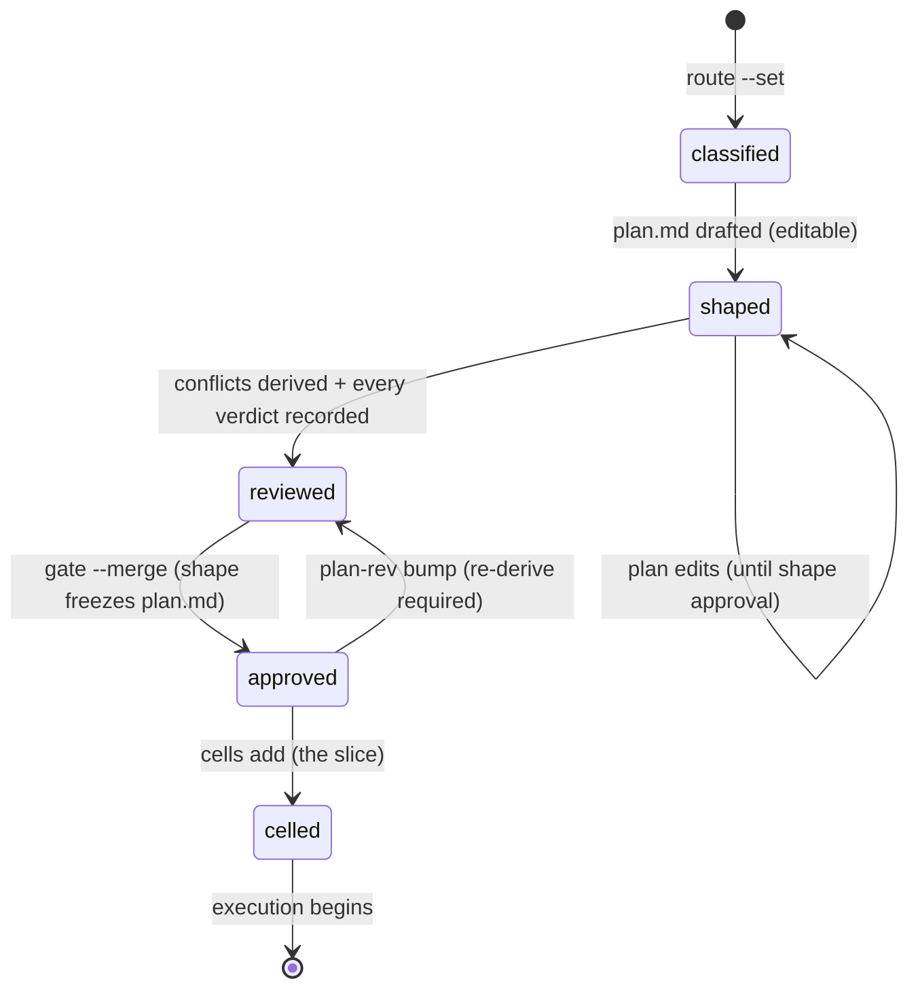

# Planning and the execution gate

## Summary

Planning turns approved scope into an executable shape: a lane classification, the smallest honest plan document, a conflict review, and — after Gate 2 — the first slice of cells. The CLI's contribution: the **route record** (`bee route --set`) classifying the work `{class, lane, flags, product_files}` with asymmetric transition rules; the **plan revision** machinery (`bee state plan-rev bump`) that versions an approved plan instead of letting it be edited in place; the **conflict review** (`bee state plan-conflicts derive` / `verdict`) that must be complete and current before execution can be approved; and the refusals that keep cells out of a gated feature. The plan document itself (`docs/history/<feature>/plan.md`) freezes the moment the shape gate is approved — the plan-freeze guard denies in-place edits from then on. Gate 2 — the merged shape+execution approval — is the door out of planning; [gates](../foundations/gates.md) owns its verb and preconditions.

## The simple case

Scope is locked. The agent classifies the work:

```
bee route --set --class feature --lane standard --flags multi-domain --files 7
```

drafts `docs/history/<feature>/plan.md` at the lane's ceremony level, derives the conflict candidates (`bee state plan-conflicts derive --lane <feature>`), records a verdict for each (`compatible`, `conflicts`, or `retires-prior`), and asks the human the Gate 2 question in one breath: right thing, right size, may the agent start editing real files. On approval — `bee gate --merge --approved true` — the write guard opens the source tree, and the agent creates the whole first slice in one batched `bee cells add`. Planning is done; [execution](execution.md) begins.

## The interaction, event by event

The planning arc, store-side:



### Invoke

The route record validates on write: `class` from `feature|bugfix|docs|refactor|research|release|spike`; `lane` from `docs|tiny|small|spike|standard|high-risk`; flags from a fixed ten-value list. The record carries a rationale and timestamps.

### Ends at once

The refusals that shape planning's discipline:

- **Lane transitions are asymmetric.** Promotion is always allowed. `high-risk` never demotes. A hard-gate flag blocks demotion. And each feature gets at most one demotion, ever — the second refuses. Classification honesty is enforced in one direction only.
- **No cells before the gate**: `addCells: feature "<id>" is gated (phase "<phase>") and its execution gate is not approved — D3: no cells before the gate. FIX: get the merged shape+execution gate approved (\`bee state gate --merge --approved true\`) for feature "<id>", then retry.`
- **Conflict verdicts refuse bad input** — an unknown candidate id or an unknown verdict word refuses by name; deriving against the default (non-lane) record refuses.

### First side effect

Each verb's own record: the route on the workflow record, the derived candidate list (every row reset to `verdict: null` against the current plan revision), each verdict written in place, the plan-rev stamp.

### While running

Planning's middle is drafting and review, in files and conversation. The store's part is bookkeeping-shaped and instantaneous. Two couplings matter:

- **The plan freezes at shape approval.** Until then, `plan.md` accepts direct edits; after, the plan-freeze guard denies them and names the remedy: stamp a revision.
- **A plan-rev bump invalidates the conflict review by itself.** The review is keyed to the plan revision, so the execution gate refuses until a fresh derive-and-verdict pass matches the new revision. Revision and review move together or the gate stays shut.

### Finish

Gate 2 approved (its preconditions — complete current conflict review; for high-risk, a fresh advisor reference — are checked fail-closed, twice). The slice lands as one batched `cells add`: dependencies acyclic, within the slice only, no cell depending on a future slice. There is no slice record in the store — **the current slice is exactly the set of cells that exist**, read back through `bee cells ready` and ordered by `bee cells schedule` into dependency-and-file-overlap waves.

## Lanes

The lane is planning's one word for size and risk, and everything scales off it: ceremony (a `tiny` fix is one cell and one merged question; `high-risk` takes the full chain and an advisor), knowledge budgets, worker requirements at cap ([execution](execution.md)), judge tier, and bypass coverage (`normal` covers only `tiny|small|standard`). The lane vocabulary here (`docs|tiny|small|spike|standard|high-risk`) is the route's; the glossary's five-lane list is the planning subset most documents mean.

## Modifiers

| Modifier | Effect |
| --- | --- |
| `--json` | Standard on every verb here; `plan-conflicts derive --json` returns the candidate list. |
| Gate-bypass level | Decides whether Gate 2 stops for the human (`normal` covers it for tiny/small/standard; high-risk always stops). The Stop-hook bypass net can even refuse to *stop* mid-planning while a coverable gate is pending. |
| Store phase | Planning is the `planning` phase; the gated allow-list keeps writes to `.bee/`, `docs/history/`, `plans/`, `AGENTS.md` — the planning surfaces exactly. |
| Where it runs | Route, conflicts, and revisions are lane-scoped control-plane records. The plan document is docs/history. A code-touching lane triggers the worktree-first guard for what comes after. |
| Who runs it | Decide-altitude: lane choice, plan, verdicts, and the gate conversation stay with the orchestrator; research gathers delegate. |

## Cancel and interrupt

Columns: before and after Gate 2.

| Event | Before Gate 2 | After |
| --- | --- | --- |
| The process killed | Records written so far stand; the plan file is ordinary git-tracked work. | The slice's cells stand; nothing here is half-committed. |
| The session turning elsewhere | The route, plan, and verdicts are all on disk; a successor session re-orients into `planning` and continues. The anchor ([shaping](shaping.md)) keeps the objective. | Same. |
| A clean completion from outside | Gate 2's answer is the completion. A `no` leaves everything editable — the plan is not yet frozen. | A revocation (`--approved false`) reopens nothing by itself; the plan stays frozen until a revision is stamped. |
| The store unavailable | Named refusals, bounded waits — [the store](../foundations/store.md). The conflict-review read on the gate is fail-closed: unreadable means not-approvable. | Same. |
| The session going away | Nothing leased; planning state has no TTL. | Same. |
| A sibling changing the target | Lane records serialize on their locks. A sibling's plan-rev bump under a pending gate forces the re-derive — the gate's staleness check catches it rather than approving against a moved plan. | Cells appearing from a sibling are the same slice; the batched add is the convention that keeps it coherent. |
| The channel changing | Standard. | Same. |

## Interactions with other systems

**Gates and approval.** Gate 2 is planning's exit; its preconditions bind here (conflict review current and complete; advisor for high-risk). **The store and history.** Route and review are store records; the plan and its revisions are docs/history with guard-enforced freeze. **Worktrees and containment.** A code-touching lane means the work belongs in a feature worktree from the start; planning is where that becomes true. **Claims, holds, and reservations.** None yet — the no-cells-before-the-gate refusal is the boundary. **Sibling sessions.** Lane-scoped records keep parallel features' planning independent. **What the human sees.** The Gate 2 question, whole and in their terms; the `⚡` mark when bypass covers it. **Configuration.** `gate_bypass`; the advisor configuration for high-risk. **Output modes and exit codes.** Standard.

## Edge cases

- `spike` is a lane *and* a class: a feasibility probe whose product is knowledge. Its artifacts belong in `.bee/spikes/` (the scratch-shape guard points there).
- A `docs` lane plans like anything else but its proof at cap is parity/pointer checks, not tests.
- Deriving conflicts with zero candidates still writes a review — an empty, complete review satisfies the gate; an absent one does not.
- The one-demotion-ever rule is per feature, not per session — a later attempt inherits the spent demotion.
- `bee cells schedule` diagnoses the slice: cycles, unsatisfiable deps, empty files lists, and shared-regen-root serializations (`<x> waits for <y> — shared regen root <r>`) — worth running before dispatch, not after.

## Open questions and verification

- The ten route flags were not enumerated; the hard-gate flag's exact name matters to the demotion rule and should be pinned at verification.
- Whether `plan-rev bump` requires the shape gate approved (revising an unfrozen plan is otherwise pointless but may not be refused) was not determined.
- The plan document's expected shape per lane (what "smallest honest shape" renders as) is the `bee-planning` skill's contract, out of CLI scope here.
- Not yet exercised live; refusal texts quoted from source.

Verified against beehive commit `6b0ae488`.
