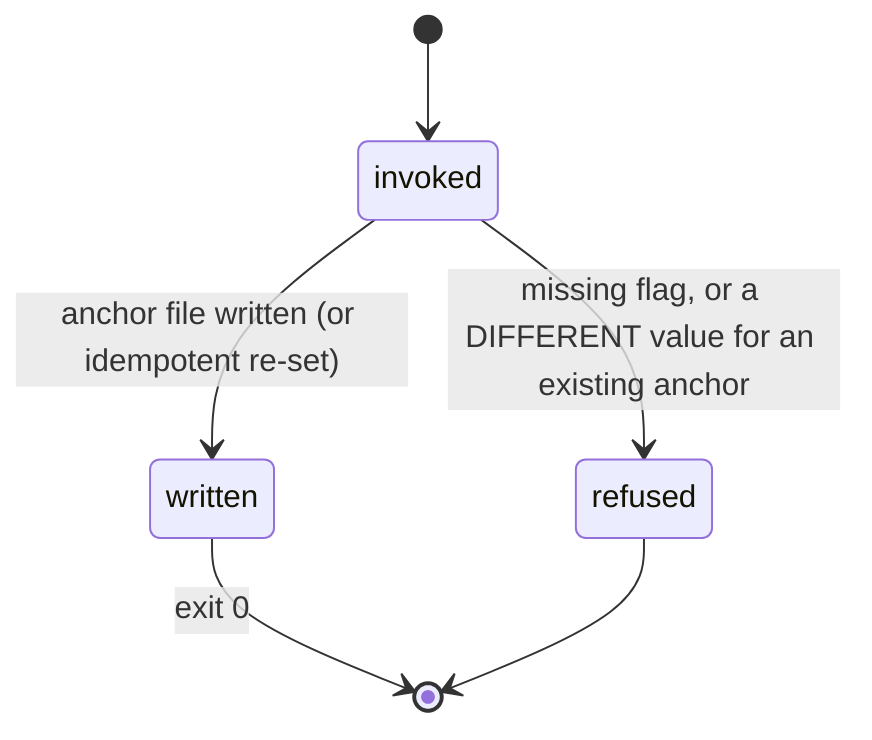

# Shaping and the intent anchor

## Summary

Shaping turns a fuzzy request into locked, buildable decisions. The conversation itself — the interview, the triage, the decision writing — is carried by the `bee-shaping` skill; what the CLI contributes is small and load-bearing: the **intent anchor** (`bee intent set`, with `bee shape` as its flow-spelling alias) that pins the user's verbatim request and the definition of done to disk before any compaction can compress them; the **decision log** (`bee decisions log`, owned by [decisions](../memory/decisions.md)) where each agreement lands with its required relation; and `docs/history/<feature>/CONTEXT.md`, where the locked decisions live to be cited, never reinterpreted. Shaping ends at Gate 1 — "are these the decisions I meant?" — asked in the human's terms and recorded through the gate verb ([gates](../foundations/gates.md)). This document owns the anchor and shaping's observable edges; the interview craft is the skill's.

## The simple case

The human asks for something with gray areas. The agent, following the shaping flow, first pins the ask:

```
bee intent set --request "add rate limiting to login" --acceptance "5 failed attempts locks the account for 15 minutes; a test proves it"
```

The `--request` is the human's words verbatim — not a paraphrase. From then on, every context injection that mentions the work renders the anchor first: the request, then `DONE MEANS: <acceptance>`, then the line that workflow state serves the request and never replaces it.

The interview happens in conversation; each settled agreement is logged as a decision with its relation; the locked set lands in `docs/history/<feature>/CONTEXT.md`. The agent asks Gate 1 as one plain-language question, the human answers, and shaping hands into [planning](planning.md).

## The interaction, event by event

One `bee intent set`:



### Invoke

`--request` and `--acceptance`, both required and non-empty. The anchor is keyed; the record carries `{request, acceptance, next_action, feature, lane, cell, do_not_reverse[], stop_conditions[], written_at}`.

### Ends at once

- A missing flag refuses — and when invoked as `bee shape`, the refusal is deliberately re-spelled against `bee shape`, so the alias never leaks its implementation.
- **Immutability**: an anchor already set refuses a *different* request or acceptance. The objective does not drift mid-flight; `--force` is the recorded override. Re-setting the identical values is idempotent and succeeds silently.

### First side effect

The anchor file is written. This is the moment the objective stops living only in the conversation — the thing a compaction compresses first — and starts living in the store, which survives at full strength.

### While running / Finish

Instantaneous. Afterward: `bee intent show` reads it; `bee intent advance --next-action` updates only the free-moving pointer (`next_action`, stamped `advanced_at`) — with no anchor it refuses: `intent advance: no intent anchor exists to advance — run \`bee intent set\` first.`; `bee intent clear` removes the file and reports whether anything was cleared.

## The nudge that drives it

The harness enforces the anchor's existence, not just its shape: when work is active (a claimed cell, or execution approved) and no anchor is stored, the per-prompt hook injects a loud reminder — the objective lives only in this conversation, write it down VERBATIM now with `bee intent set` ([session](../foundations/session.md)). Shaping done properly never sees that nudge.

## Shaping's other edges

- **`bee shape` is a pure alias.** One implementation, two names; the flow name exists so the lifecycle reads naturally.
- **Decisions** are logged as they settle, each with `--relation supersedes:<id>|touches:<id>|none` — the relation is required. Locked decisions are cited from CONTEXT.md, never re-derived. The mechanics are [decisions](../memory/decisions.md).
- **Discovery hand-in.** A fog-state ask goes through wayfinding first: `bee discovery stub --effort <slug> --from "<text>"` creates `docs/discovery/<slug>/MAP.md` and its tickets directory. There is deliberately no CLI verb that hands a finished map into shaping — the only mechanical link is orient's override recommending `bee-wayfinding` while frontier tickets stand ([orient](orient.md), [wayfinding](../discovery/wayfinding.md)).
- **Gate 1** is recorded through the gate verb; under a covering bypass level it is auto-approved with the `⚡` mark and the stamp naming actor `auto`, level, and reason.

## Modifiers

| Modifier | Effect |
| --- | --- |
| `--json` | Standard contract on the intent verbs. |
| Gate-bypass level | Decides whether Gate 1 stops for the human or self-approves with a stamp. |
| Store phase | Shaping is the `exploring` phase's work; the write guard holds source closed meanwhile, leaving `.bee/`, `docs/history/`, `plans/`, `AGENTS.md` open — exactly the shaping surfaces. |
| Where it runs | The anchor and decisions are store records; CONTEXT.md is a docs/history file — all writable in the gated phase, in main or the feature's worktree. |
| Who runs it | Shaping is decide-altitude: the interview and the anchor stay with the orchestrator; gathers may be delegated, the deciding never is. |

## Cancel and interrupt

Columns: before and after the anchor exists.

| Event | Before the anchor | After |
| --- | --- | --- |
| The process killed | Nothing pinned; the ask lives only in conversation. | The anchor survives everything; `intent show` re-reads it. |
| The session turning elsewhere (compaction) | The greatest risk shaping has — the verbatim ask can be lost. This is why the anchor is step one and why the nudge exists. | The capsule and every context injection re-render the anchor; the objective cannot compress away. |
| A clean completion from outside | The human's Gate 1 answer ends shaping; the agent records it. | Same. |
| The store unavailable | The intent verbs refuse with named errors; the conversation still holds the ask — retry. | Reads fail open like everything else. |
| The session going away | Un-pinned shaping dies with the session. | A `pause` handoff plus the anchor lets any successor resume with the ask intact. |
| A sibling changing the target | Anchors are keyed per feature; siblings do not collide. A sibling logging decisions on the same feature is serialized by the decisions lock. | Immutability protects the anchor from a sibling's different wording — the refusal surfaces the divergence instead of silently overwriting. |
| The channel changing | Standard. | Same. |

## Interactions with other systems

**Gates and approval.** Gate 1 ends shaping; its record is the gate verb's stamp. **The store and history.** The anchor is a store record; the decisions are the log; CONTEXT.md is history — three layers, one settlement. **Worktrees and containment.** Shaping needs no worktree; the worktree-first rule binds when the lane goes code-touching at planning. **Claims, holds, and reservations.** None — no cells exist yet; `bee cells add` before the merged gate refuses by design ([planning](planning.md)). **Sibling sessions.** Shaping is single-threaded by nature: one conversation, one anchor. **What the human sees.** The interview and Gate 1, in their own words — never the anchor mechanics. **Configuration.** Only the bypass level touches shaping's flow. **Output modes and exit codes.** Standard.

## Edge cases

- An anchor set with `--force` overwrites; the old values are gone from the anchor (the decision log is where history of changed minds belongs).
- `do_not_reverse` and `stop_conditions` ride the anchor for flows that use them; nothing in the CLI populates them automatically.
- Shaping a feature that already has an anchor from an earlier attempt: the idempotent re-set passes; a changed ask refuses and forces the divergence into the open.
- A discovery stub for an effort that already exists refuses at the file layer (the map is already there).

## Open questions and verification

- The exact refusal wording for a different-value re-set (the immutability refusal) was read from code structure, not captured verbatim.
- Whether `bee intent set` binds `feature`/`lane`/`cell` automatically from the live workflow or only when passed was not determined.
- The anchor's key scheme (one anchor per feature vs per workflow attempt) was read as keyed but the key's composition was not pinned.
- Not yet exercised live; the alias re-spelling and idempotency are drawn from code and router tests.

Verified against beehive commit `6b0ae488`.
