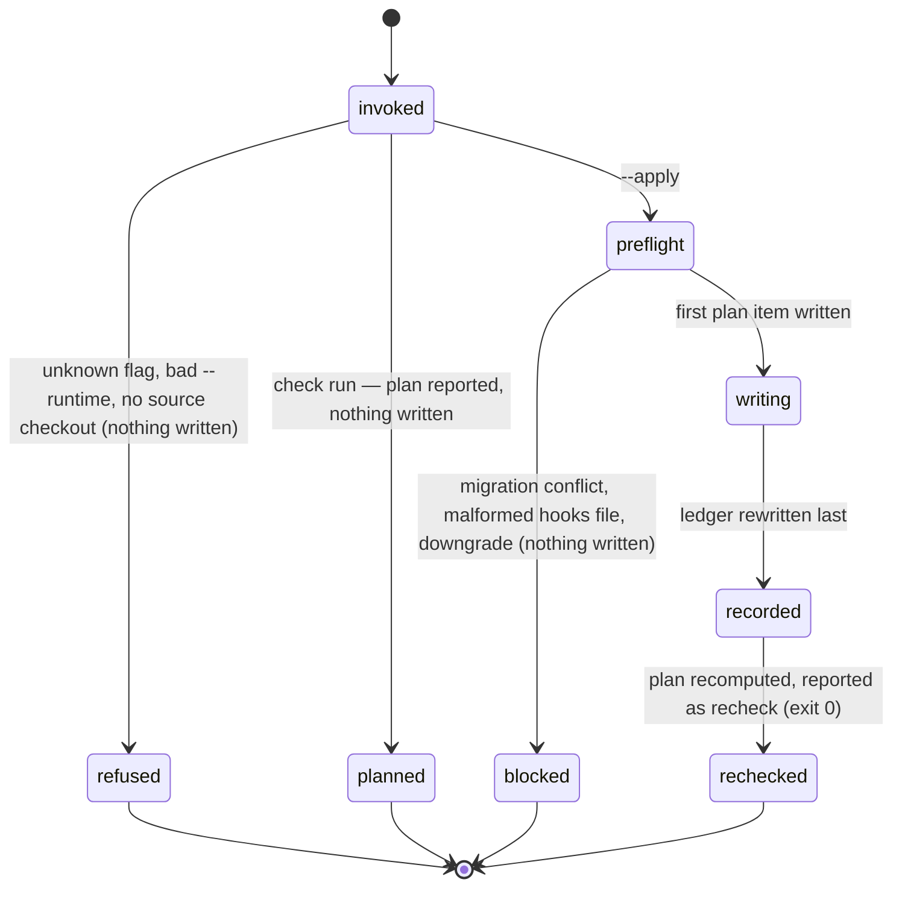

# Onboarding a host repo

## Summary

`bee onboard` is the one command that installs bee into a repository and keeps it current afterwards. It copies a fixed set of artifacts *out of* a bee source checkout and *into* a host repo — the AGENTS.md instruction block, the `.bee/` store skeleton, the vendored expertise guides and prompts, the per-runtime skill trees and worker agent files, the managed `.gitignore` block, and (opt-in) the hook wiring — then records a fingerprint of everything it wrote in `.bee/onboarding.json`. That record is the *ledger*: the file every later run, and every session preamble, compares against to decide whether the host has drifted from the bee it is running. The command has exactly two run modes. Without `--apply` it is a **check run**: it computes the same plan and writes nothing. With `--apply` it is an **apply run**: it refuses as a whole or performs the plan in order. Both modes belong to the agent; the human approves the apply when the check reports changes.

## The simple case

The agent asks what would change:

```
bee onboard --repo-root /path/to/host --json
```

bee walks up from the working directory for a bee source checkout, computes the plan, and answers `status: "up_to_date"` with an empty `plan` for a current host. Nothing on disk moved. When the host is behind, the same call answers `status: "changes_needed"` and lists one *plan item* — an action plus a repo-relative path — per artifact that would be written, removed, or merged:

```
bee onboarding - repo: /path/to/host
status: changes_needed
  update_agents_block  AGENTS.md
  copy_expertise  .bee/expertise/tests.md
  write_onboarding  .bee/onboarding.json
```

The agent shows that list to the human, and on their word runs the apply:

```
bee onboard --repo-root /path/to/host --apply
```

bee performs the items in order, rewrites the ledger last, then immediately recomputes the plan and reports the answer as `recheck` — so the run tells the truth about what it left behind instead of asserting success. Re-running an apply against a current host is a no-op that reports `applied` with an empty list and `recheck: "up_to_date"`.

## The interaction, event by event



### Invoke

`onboard` is a maintenance surface, not a flow verb, so the router probes it *before* the verb tree and nothing in the verb tree can claim the word. It parses its own argv: `--repo-root <path>`, `--apply`, `--json`, `--repo-hooks`, `--plugin-source`, `--runtime claude|codex|both` (default `both`), `--no-claude-md` (the import is written by default), `--claude-md` (a no-op alias of the default), `--global-skills`, `--force-downgrade`. `--help` and `-h` are handed back to the shared help surface.

Two things are settled before any work:

- **The target.** `--repo-root` resolved, else the working directory. Whether this is the host's *first* onboard is decided here, by the absence of `.bee/onboarding.json`.
- **The source checkout.** The engine is located by walking up from the invocation root for the marker `packages/bee/AGENTS.block.md`, stopping at the first directory holding `.git`; a `--repo-root` candidate is tried before that walk. This is not the store-root resolution [invocation](../foundations/invocation.md) describes — `onboard` never uses it, and never prints the no-root error.

> Technical note: the template root comes from the *invocation's* own checkout, never from where the running binary physically sits. A granted worktree whose `.bee/bin/bee` is a symlink into the main checkout therefore renders its own worktree's templates. The rule exists because the older behavior once spliced the main checkout's managed block over live worktree edits.

### Ends at once

The paths that answer without touching the host:

- **A parse error.** `Unknown argument: --bogus`, or `--runtime must be claude, codex, or both (got: X)`. Both are printed as `{"error": "<message>"}` on **stdout** and exit 1 — even without `--json`.
- **No source checkout visible.** The refusal names the invocation root it searched, the template path it did not find, the `--repo-root` candidate if one was passed, and two ways forward: run from inside a bee checkout, or re-run the installer one-liner. Under `--json` it carries `status: "blocked_no_engine"` and `kind: "engine_not_found"` so the installer can branch on it. This is the refusal a plain host repo meets: with no bee checkout on the machine, onboarding cannot be re-run from inside the host.
- **A check run.** Always exit 0 — including when the status is a `blocked_*` one. Reporting is not failing.

### First side effect

Only an apply run writes, and only after four preflights that all mutate nothing:

1. **Worktree migration conflicts** — a worktree-local coordination store that cannot be folded into the main one. Status `blocked_worktree_migration_conflict`, with the stranded records named.
2. **The codex-hybrid hook-write check** — fail-closed when the host's `.codex/` cannot be written.
3. **Hooks-merge validity** — a `.claude/settings.json` or `.codex/hooks.json` that exists but is malformed (bad JSON, a non-object `hooks` key, a non-array event value) refuses by name with `status: "blocked_hooks_merge"`, rather than being read as absent and clobbered with a bare `{"hooks": …}`.
4. **The downgrade check** — an older source over a newer installed bee, or an installed version that cannot be read, blocks the whole apply. A forceable block enumerates every vendored file `--force-downgrade` would overwrite, so the blast radius is visible before consent.

A blocked apply exits 1 with zero mutations anywhere. Past the preflights, the first side effect is the first plan item's own write — for a fresh host, the AGENTS.md block.

### While running

Items run in plan order. Each file write is atomic, so a killed run leaves whole files, never half ones. No store lock is taken and no `.bee/` state is read for coordination; `onboard` is a file engine, not a workflow verb. Skill copies that cannot be made safely are *skipped loudly*: a symlinked skill directory or a case-insensitive alias collision is collected into `skills.skipped` with its reason instead of being overwritten. Two writes happen after the item loop: the per-target version stamp and render sidecar (`.bee-skills-version.json`, `.bee-render.json`), then the ledger.

The ledger is always rewritten last, and always rewritten — even when every item was a no-op. It carries `schema_version`, `bee_version`, the `managed` sha256 map per group (`agents_block`, `gitignore_block`, `helpers`, `lib`, `expertise`, `prompts`, and the optional `repo_hooks`, `codex_hooks`, `statusline`), an `agents_sync` record, the original `created_at`, and a fresh `updated_at`.

### Finish

`status: "applied"`, the `applied` list, the ledger payload, the notices, and a `recheck` plus `recheck_plan` computed by running the whole planner again against the just-written host. A target still blocked can never make the recheck read `up_to_date`. Exit 0.

The human-readable form goes to **stdout** — `bee onboarding - repo: …`, the status line, two-space-indented `<action>  <path>` lines or `(nothing to do)`, a `reason`, a `versions` line, one `skipped skill:` line per skip, one `notice:` line per notice. There is **no timing line and no `timings.jsonl` entry**: `onboard` answers before the verb tree that emits them.

### What a fresh host looks like afterwards

```
AGENTS.md                     BEE block between <!-- BEE:START --> / <!-- BEE:END -->
CLAUDE.md                     the @AGENTS.md import section
.gitignore                    managed block between # BEE:START / # BEE:END
.bee/onboarding.json          the ledger
.bee/state.json               phase idle, gates false
.bee/config.json              six hooks on, gate_bypass false, models.claude / models.codex
.bee/config-sample.json       the annotated copy of bee's own sample
.bee/reservations.json        {"reservations": []}
.bee/decisions.jsonl          empty
.bee/backlog.jsonl            empty
.bee/cells/  .bee/logs/       empty directories
.bee/bin/prompts/*.md         the worker prompt files
.bee/expertise/**/*.md        the expertise guides, tree shape preserved
.claude/skills/bee-*/         the skills, rendered for Claude
.agents/skills/bee-*/         the same skills, rendered for Codex
.opencode/skills/             the same skills, rendered for OpenCode
.claude/agents/bee-*.md       the four worker agent files, model resolved from config
.opencode/agent/bee-*.md      the same four, OpenCode frontmatter
.opencode/plugins/bee-guard.ts
docs/history/learnings/critical-patterns.md
docs/specs/reading-map.md     create-only skeleton
docs/specs/system-overview.md create-only skeleton
```

One thing is **not** installed: the binary. `.bee/bin/bee` is machine-local, ignored by the managed block, and put there by the install script or by hand. No plan action writes it, and the removal action that cleans retired helpers out of `.bee/bin/` is explicitly guarded to reject `bee` and `bee.exe`, so a routine onboard can never delete the binary it is running from.

With `--repo-hooks` — which the install script passes by default — `.claude/settings.json` also gains bee's hook rows (SessionStart, UserPromptSubmit, PreToolUse, PostToolUse, PostToolUseFailure, PermissionRequest, SubagentStop, PreCompact, Stop, Notification, SessionEnd), with a `.bak` copy taken first, foreign entries preserved verbatim, and stale bee entries replaced rather than stacked. `.codex/hooks.json` gets the Codex projection of the same set unless the repo owns its own catalog. Each wired command probes `.bee/bin/bee`, then the main checkout's copy through git, and if neither exists prints `bee: hook binary missing (.bee/bin/bee)` and exits 0 — fail-open, as [guards](../foundations/guards.md) requires.

Two artifacts reach outside the repo: `~/.codex/config.toml` gets a status-line block added if it has none, and `--global-skills` refreshes `~/.claude/skills` — but only entries that already exist there as plain directories; it never creates the legacy global copy.

## Modifiers

| Modifier | Set at invocation | Can it differ mid-flow? |
| --- | --- | --- |
| `--json` | The whole payload (plan or applied, ledger, skills, notices, `{"error": …}`) pretty-printed on stdout instead of the text report. The text report is on stdout too, so this changes the shape, not the stream. | No — one invocation, one mode. |
| Gate-bypass level | No effect. Onboarding is never gated; the human's approval of an apply is a conversation, not a recorded gate. | No effect. |
| Store phase | No effect on the plan or on any item. bee writes these files itself, so the write guard's phase allow-lists never see them — an apply at `swarming` installs exactly what an apply at `idle` installs. | No effect. |
| Where it runs | Two independent roots: the *target* (`--repo-root`, else the working directory) and the *source checkout* (walked up from the invocation root, bounded at the first `.git`). A worktree renders its own checkout's templates. With no source checkout visible, the command refuses. | Per invocation. |
| Who runs it | The agent runs both modes; no hook ever invokes it. The human approves an apply that reports changes and owns the opt-in switches, but never runs the command. A hand edit of `.bee/onboarding.json` is denied by the direct-edit guard, which names `bee onboard` as the remedy. | — |

`--repo-hooks` deserves its own line: the opt-in is **sticky**. Once the ledger records repo hooks, later runs keep wiring them without the flag. Only a `--plugin-source` apply lets the record lapse, and it says so in a notice.

## Cancel and interrupt

Columns: before and after the first plan item is written (a check run never reaches the second column).

| Event | Before the first write | After the first write |
| --- | --- | --- |
| The process killed mid-command | Nothing anywhere. A check run has no second column. | A partial tree, whole files only (every write is atomic). The ledger is the last write, so a killed apply leaves it stale or absent — and the next check run therefore re-plans the remainder. Re-running the apply is the whole repair. |
| The session turning elsewhere (compaction, handoff, turn end) | No effect; the command is atomic from the session's view. | Same. The installed state is on disk and needs no session to survive. |
| A clean completion from outside (gate approved, question answered, new message) | No effect. Onboarding reads no gate. | No effect. |
| The store unavailable (lock contention, corrupt JSON, hook binary missing) | No store lock is taken, so contention cannot occur. A corrupt or unreadable `.bee/onboarding.json` reads as *absent*: the run re-plans everything, which is safe because every copy is content-compared. A malformed `.claude/settings.json` or `.codex/hooks.json` refuses by name instead of being rewritten. A missing hook binary is irrelevant — onboarding installs the wiring, not the binary. | Same rules on every later read. |
| The session going away (heartbeat, lease expiry, release) | No effect — onboarding holds no lease, claim, or session record. | No effect. |
| A sibling changing the target | Per-item plan-to-apply races are handled where they matter: the Codex status line and the legacy global refresh both re-check at apply time and skip rather than clobber. Nothing serializes two concurrent applies against one host — see "Open questions". | Same. |
| The channel changing (piped, `--json`, Codex, from a hook) | Both forms already print on stdout; `--json` changes the shape. `--runtime` decides which runtime's hook belt is wired; the Codex projection has no `SessionEnd` row and matches `spawn_agent` for the model guard. No hook invokes onboarding. | Same. |

## Interactions with other systems

**Gates and approval.** None recorded. Onboarding is outside the [gate](../foundations/gates.md) chain entirely: it needs no approval to run, approves nothing, and its own consent moment — "the check reports changes, may I apply?" — is a plain question to the human.

**The store and history.** Onboarding *creates* the store and then stays out of it: `state.json`, `config.json`, `reservations.json`, `decisions.jsonl`, `backlog.jsonl`, and the `cells/` and `logs/` directories are create-if-missing and never rewritten. The one store file it owns outright is the ledger, rewritten on every apply. See [the store](../foundations/store.md).

**Worktrees and containment.** The target root and the source checkout are resolved separately, and the source is bounded at the first `.git` so an ancestor outside the repository can never become the template source. A worktree-local coordination store from an older layout is migrated into the main one as a plan item — and a conflict there outranks every other refusal. See [worktrees](../foundations/worktrees.md).

**Claims, holds, and reservations.** None. Onboarding takes no lock and no lease, and reads none.

**Sibling sessions.** Invisible to onboarding. A sibling mid-cell sees its files change underneath it if an apply runs during execution; nothing warns either side.

**What the human sees.** The plan, in the agent's words, before an apply. Afterwards, the version drift line at the top of every session preamble, in one of three arms:

- `- Onboarding: MISSING — run bee-hive onboarding before anything else.`
- `- Onboarding: installed at bee 0.9.0 but plugin is <version> — re-run onboarding to refresh vendored helpers.`
- `- Onboarding: ok (bee <version>)`

`bee status` carries the same fact with detail: `onboarding.installed`, `bee_version`, `plugin_version`, a `drift` boolean, and a `drift_detail` list naming each managed file that changed, went `(missing)`, or appeared `(extra)`. The report only reports — bringing a drifted host back is an apply run. See [status](../observability/status.md).

**Configuration.** Onboarding seeds `.bee/config.json` once and never edits it again. It *reads* config to resolve each agent file's model from `models.<runtime>`, to decide the host shell for the PowerShell section, and to detect the statusline opt-in. It also *proposes*: a host with no `commands.setup/start/test` recorded gets a notice listing detected candidates with the instruction to confirm them with the human and write only confirmed values — never to invent them. Stale keys are warned about, never rewritten: a leftover top-level `advisor`, and a retired `commands.verify` (with a sharper warning when no `commands.test` exists at all). A host with git-tracked files that the managed ignore block cannot silence gets the exact `git rm -r --cached` line to fix it. See [configuration](../cross-cutting/configuration.md).

**Output modes and exit codes.** Check run: exit 0 always, including `blocked_*`. Apply run: exit 0 on success, exit 1 on any blocked preflight (zero mutations). Parse errors and the no-source refusal exit 1. No timing line on any path.

## Edge cases

- The seeded `.bee/state.json` lists four gates — `context`, `shape`, `execution`, `review`. `uat` is absent from the seeded map and comes from the binary's own defaults, where every gate is false regardless.
- `--runtime` with no value following it reports `got: undefined` — a literal inheritance from the retired Node implementation.
- `--claude-md` does nothing: the import is the default, and `--no-claude-md` is the real switch.
- Retirement is derived, not listed. A helper, lib module, prompt, expertise guide, or vendored hook that the ledger records and the current source no longer ships is removed on the next apply, so a host can reach zero drift on its own. Only the nine historical per-command helper scripts are removed from a hand-written list.
- Today's source ships no `.mjs` helpers, no lib modules, and no hook scripts — `packages/bee/hooks/` holds only the two plugin manifests. So `--repo-hooks` copies zero files and only merges the settings; `.bee/bin/` ends up holding the binary and `prompts/` and nothing else.
- The statusline pair is vendored only into a repo that *already* points `.claude/settings.json`'s `statusLine` at `.claude/statusline-command.sh`. Onboarding never creates that opt-in.
- `prompts` is deliberately left out of the drift comparison, so a prompt-only change never flips a host from `up_to_date` to `changes_needed` by itself.
- A skills root that was committed to a repo without ever being applied resolves its installed version as *unknown*, which the downgrade rule blocks and never makes forceable. One real apply writes the missing stamp and clears it permanently.
- On the first onboard of a repo with no detected build, a notice offers the greenfield init lane: one init cell whose acceptance is setup working from scratch, one passing test, recorded standard commands, and a clean first commit.
- Hooks self-arm on the ledger's existence. Before the first apply, every hook exits silently — which is why a repo that is not onboarded shows no preamble and no guard.
- A PowerShell host gets a shell-doctrine section rendered *inside* the same BEE markers. The repo's own `host_shell` config setting decides before the machine does, so a teammate on the other platform does not churn the block.

## Open questions and verification

- **Suspected stale wording:** the registry entry says onboarding "is how a host repo gets the binary the hooks are wired to". No plan action installs a binary; the install script does. Filed in [bug-triage.md](../bug-triage.md).
- **Suspected gap:** the preamble's drift line says "re-run onboarding", but inside a host repo with no bee source checkout visible the command refuses with `engine_not_found`. The refusal itself names the installer one-liner; the preamble line does not, so the agent meets a refusal before it meets the remedy.
- **Deviation from the invocation contract:** the human-readable report goes to stdout rather than stderr, a parse error prints JSON to stdout without `--json`, and no `[bee] onboard <N>ms` line is printed or logged. Whether that is deliberate (the installer parses onboarding's stdout) or an omission was not settled.
- Nothing serializes two concurrent `--apply` runs against one host. Individual items re-check at apply time, but the plan as a whole does not. Not probed; unclear whether it is reachable in practice.
- The knowledge area marks two rules as not yet implemented — one release version across every projection (R21) and the installer's full success contract (R22). What a partially-parity host reports today was not determined.
- Read from code and recorded intent but **not run**: this document was drafted from `src/onboard/*.rs`, the registry entry, `docs/knowledge/areas/onboarding/*.md`, and `INSTALL.md`. No check run, apply run, refusal, or drift line was observed against the binary. Everything here needs a verification pass — in particular `--global-skills`, `--plugin-source`, the codex-hybrid path, the downgrade refusal and its blast-radius list, the worktree migration, the statusline opt-in, and the PowerShell section.

Verified against beehive commit `6b0ae488`.
