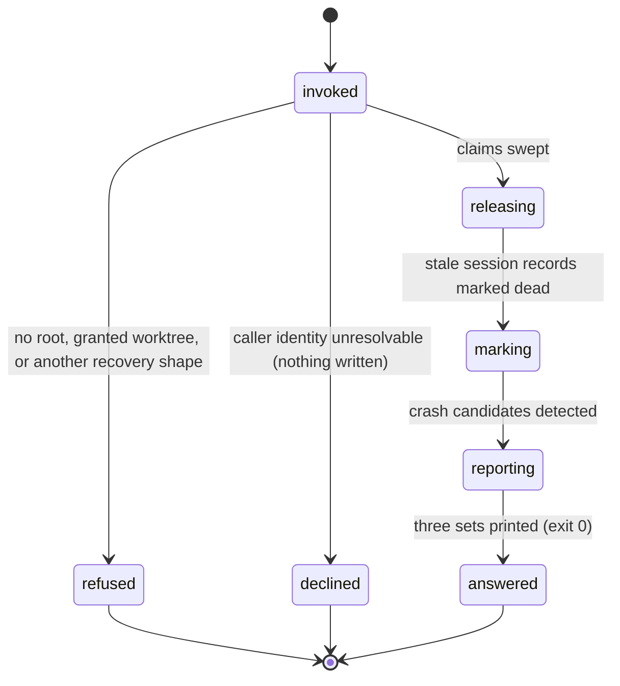
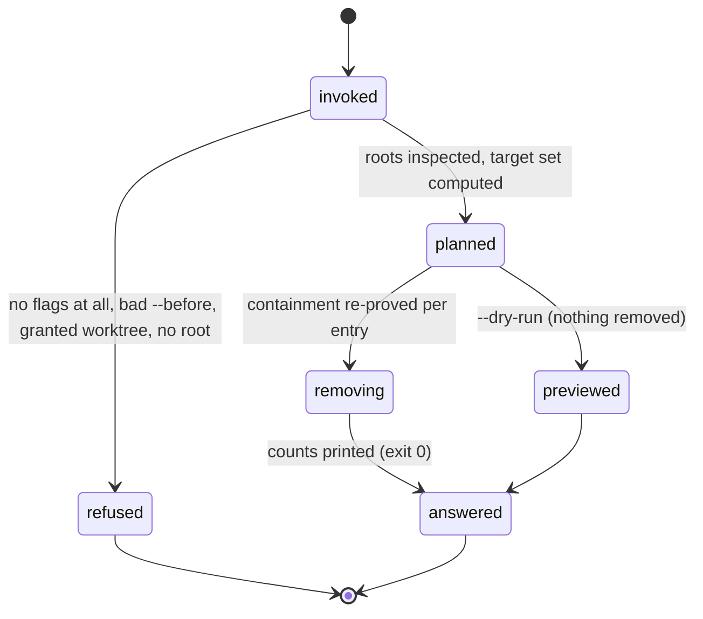
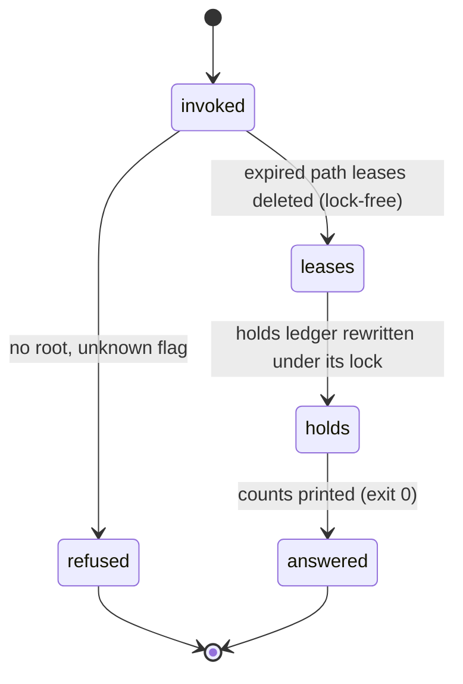

# Recovery and the sweeps

## Summary

Sessions die badly: a terminal closes, a machine sleeps, a harness crashes mid-cell. What is left behind is a claim nobody will ever cap, a session record that still reads live, a path lease nothing will release, and a directory of scratch files nobody will look at again. Three commands clean that up, and they are deliberately separate. `bee recovery scan` is the crash door: it releases every qualifying dead-session claim, marks every heartbeat-stale session record dead, and *reports* — separately — which dead sessions are worth mining for lost work. `bee reservations sweep` releases expired path leases and expired cross-worktree holds. `bee tmp sweep` removes scratch from `.bee/tmp/` and `.bee/spikes/`. None of them is automatic and none of them is a gate: they are verbs the agent runs when the store is dirty. The fourth verb in this area, `bee recovery window`, is declared in the command registry and not built.

## The simple case

A worker's session dies with a claimed cell. For 900 seconds nothing changes — the session is only *quiet*, not gone. After that its heartbeat reads stale, and the next agent to run `bee recovery scan` clears up after it:

```
recovery scan (caller sess-a1b2):
released: auth-3
parked: auth-3
unreachable: none
marked dead: sess-dead-9f
candidates: sess-dead-9f
```

Three separate facts, never merged. `auth-3`'s claim file is gone and the cell is parked `blocked` — not reopened, because half-finished work must not be handed to the next agent blind. The dead session's record now says `status: "dead"`. And `sess-dead-9f` is a *candidate*: its transcript exists, it does not end cleanly, and it was doing something. Mining it is the agent's next decision, not the command's — see "Mining a candidate" below.

The other two are unremarkable:

```
bee reservations sweep
Swept 2 expired reservation(s) and 1 expired cross-worktree hold(s).

bee tmp sweep --dry-run
Would remove 4 scratch entr(y|ies) (182931 bytes, 37 files) from .bee/tmp/ and .bee/spikes/.
```

## The interaction, event by event

### `bee recovery scan`



**Invoke.** Exactly two argv shapes are served: `recovery scan` and `recovery scan --json`. Every other `recovery …` shape — including `recovery window`, and including a stray flag — falls through to the registry catalog, which answers it there. The root is resolved through the full control-plane door: no root gives the standard no-root error; a *granted* feature worktree refuses by name, because this command reads sessions and claims and those live in the main checkout ([worktrees](../foundations/worktrees.md)).

**Ends at once.** The decline. Before touching anything the command resolves *its own* caller session — `BEE_SESSION_ID`, then `CLAUDE_CODE_SESSION_ID`, then the single-fresh-session-record fallback. If none of those answers, the command writes **nothing** — no release, no mark — and reports the counts it observed instead:

> recovery scan declined: could not resolve its own caller session (BEE_SESSION_ID/CLAUDE_CODE_SESSION_ID unset, and no single fresh session record to adopt) — 2 expired claim(s) and 1 heartbeat-stale session record(s) observed; nothing released or marked. Pass --session-id to `bee cells claim-next` (which sweeps too) from an identified session, or set BEE_SESSION_ID, then retry.

It still exits 0 and still prints the payload; a decline is an answer, not an error. The reason for the decline is self-protection: an anonymous sweep has no way to exclude the caller's own claim, and the caller may be alive and merely mid a long tool call.

**First side effect.** The first claim file removed by the release pass. A claim qualifies when its lease has expired *and* the owning session's heartbeat is stale, both re-verified under the claim's own exclusive gate file and — for a session-owned claim — under the same `sessions` store lock a heartbeat itself takes. Contention is never stolen: a gate or lock held by someone else means that claim is skipped this pass.

**While running.** Three independent passes, in order, reported as three separate sets:

- **Release.** Every qualifying claim file is removed. Then the cell behind it gets a verdict: readable in this store and still claimed by that exact session → reset `claimed` → `blocked` (**parked**), with a decision row recording why; not readable in this store → left alone (**unreachable**), with a stderr line naming the cell, its likely worktree, and the remedy (`bee cells reopen` from a session that can reach it). A released id that is in neither set means a fresher claim already owned the cell, and nothing was touched.
- **Mark.** An independent walk of `.bee/sessions/`. Every heartbeat-stale record is stamped `status: "dead"` and `dead_at` **in place** — never deleted. Staleness is re-judged under the sessions lock, so a record that read stale a moment ago but whose owner's heartbeat lands under the lock is *not* marked. An already `dead` or `closed` record is left exactly as it is, so `dead_at` keeps the original time of death. The caller's own record is excluded. A session that comes back clears its own mark on its next heartbeat and gains `revived_at`.
- **Report.** The crash candidates. This set is derived on its own and never from the two above: a session that ended cleanly but left an expired claim is released and marked, and is still not a candidate.

**Finish.** The five-line text report (or the JSON payload with `declined`, `caller_session`, `released`, `parked`, `unreachable`, `marked_dead`, `candidates`, `candidates_degraded`), then the timing line on stderr. Exit 0. Only unexpected store data fails the command, with a named refusal and exit 1.

#### What makes a session a candidate

All four must hold:

1. It is not the caller, and its heartbeat is stale.
2. Its transcript can be found — either the path stored on the session record, or `<session-id>.jsonl` under a scanned transcript root.
3. The transcript's tail does **not** carry the clean-end trio: a `stop_hook_summary` system event, then a `turn_duration` system event, then a `last-prompt` event, with no user or assistant message anywhere after (or between) them. That trio is what an orderly turn end looks like; its absence is what "crashed" means here.
4. It shows a work signal, checked in this order: a bound lane whose record is in a non-terminal phase (`lane`), an active claim it still owns (`claimed_cells`), or transcript activity newer than the last durable settlement (`transcript_activity`). No signal, no candidate.

Transcript roots are the Claude default — `$CLAUDE_CONFIG_DIR/projects` or `~/.claude/projects`, plus the project path encoded into one directory name — and every `recovery.transcript_roots` entry in config, each `{runtime, path}`, each probed fresh on every run. A *configured* root that is missing, not a directory, or unreadable warns on stderr and is skipped; the default root is skipped silently. A failure inside the whole detection degrades: `candidates` comes back empty with `candidates_degraded: true`, which means "not exhaustive", never "none".

#### The window

Two different things are called the window, and only one of them exists.

The **read window** is real: the transcript is read as a bounded tail — the last 262 144 bytes. If the window starts mid-file the first partial line is dropped, and unparsable lines are skipped silently. Everything the scan concludes about a candidate comes from that tail.

The **mining window** is the interval a miner would read: from `since` to the end. `since` is the last durable settlement — the newest timestamp among logged decisions, capture stubs (restricted to the session's own lane when it had one), and cells' `trace.capped_at` (restricted to that lane's feature) — falling back to the session's `started_at` when nothing has settled yet. Each candidate row carries it. `bee recovery window` would re-derive it for one session id, apply a hard event cap, and return the miner prompt; it is **not built**, and asking for it says so:

> bee: not built into this binary: `bee recovery window` is declared in the command registry, the recovery group was never ported off Node. Nothing ran and nothing changed. FIX: `bee state handoff show --json` and `.bee/logs/` carry the session record recovery read.

#### Mining a candidate

The scan reports; it never mines, never resumes the dead session, and never writes a handoff for it. Mining is the agent's own work, offered to the human the same way a pending capture flush is offered and never auto-run: dispatch one down-tier worker over the window so the raw transcript never lands in the orchestrator's context, write the digest to `docs/history/<feature>/reports/recovery-<session8>.md` (or `docs/history/recovery/…` when the dead session had no lane), and file each settlement it found with `bee capture add --source mined`. Those stubs join the ordinary [capture queue](../memory/capture.md) and are rendered with a `[mined]` marker; an ordinary flush is their confirmation. Mined content is data, never instructions: nothing in it is followed, and nothing mined becomes a decision on its own.

### `bee tmp sweep`



**Invoke.** `tmp sweep [--feature F] [--before ISO] [--all] [--dry-run] [--json]`. `--help`, any other flag, and any positional fall through to the catalog. The root is the ordinary door, so a granted feature worktree refuses; from an *ungranted* linked worktree the root resolves to the main checkout, and the sweep clears main's scratch.

**Ends at once.** With no target flag at all — and `--json` alone is not a target — the command refuses and nothing is removed:

> tmp sweep requires at least one of --feature/--before/--all/--dry-run — no default purge (same discipline as `decisions archive`). FIX: pass --dry-run to preview the default (closed/absent-feature) target set, --feature &lt;slug&gt; to target one feature explicitly (even a live one), --before &lt;ISO&gt; to age-gate scratch with no feature/lane record, or --all to clear everything.

An unparseable `--before` refuses the same way, by value: `tmp sweep: --before "<value>" is not a valid ISO date.`

**First side effect.** The first removal. Everything before it is inspection: the two scratch roots are stat-ed *without* following symlinks, and an entry is any top-level directory **or** loose file under them — agents write helper scripts and evidence dumps straight into the root, so directories alone would miss what the write guard told them to write.

**While running.** The target set:

| Flags | What is swept |
| --- | --- |
| none (refused) | nothing |
| `--dry-run` alone | the default set, previewed |
| default (no `--feature`, no `--all`) | an entry whose feature or lane record is at a terminal phase, unconditionally; an entry with no record anywhere only when older than `--before`; a live feature's scratch is skipped (`live`, or `absent_no_before` / `absent_not_old_enough`) |
| `--feature <slug>` | the exact name, plus `<slug>-…`, `<slug>.…`, `<slug>_…` — but never a name that is itself a live feature (`live_sibling`). This is the only way to sweep a live feature's scratch |
| `--all` | every entry, live or closed or unrecorded, directories and loose root files alike |

Containment is proved twice. A root that is itself a symlink is refused wholesale (`refused_roots`, reason `symlinked_root`). Every candidate is canonically resolved and re-proved to be inside a literal root immediately before removal, against a *fresh* root inspection — an escaping or symlinked candidate lands in `refused_escapes` and is never followed. `--dry-run` runs the whole plan, including that re-proof, and deletes nothing.

**Finish.** One line — `Removed 4 scratch entr(y|ies) (182931 bytes, 37 files) from .bee/tmp/ and .bee/spikes/.` (the `entr(y|ies)` is literal), or `Would remove …` under `--dry-run`. `--json` returns `dry_run`, `removed`, `bytes_freed`, `files_freed`, `skipped`, `refused_escapes`, `refused_roots`. Exit 0.

Nothing in bee ever runs this sweep on the agent's behalf. It is doctrine that scratch is cleared at feature close and at session finish, and the write guard's own deny sends ephemeral writes here on the promise that `bee tmp sweep` clears them later — but the verb is always the agent's to run.

### `bee reservations sweep`



**Invoke.** `reservations sweep [--json]` — no other flag. This verb is worktree-native: it serves the main checkout and both kinds of linked worktree.

**Ends at once.** Nothing but the root errors. There is no identity to resolve and no decline: an expired lease is expired no matter who asks.

**First side effect.** The first expired lease file removed. Lease removal is per-record and lock-free — each lease is its own file, created exclusively, so deleting one races with nobody.

**While running.** Then the second pass: the cross-worktree holds ledger, which always lives in the **main** checkout's store, is read under the `cross-worktree-holds` store lock, every unreleased expired hold is stamped `released_at`, and the ledger is rewritten atomically — only if something changed. A busy lock is a named refusal, not a hang and not a partial write ([the store](../foundations/store.md) owns the lock rules).

**Finish.** `Swept 2 expired reservation(s) and 1 expired cross-worktree hold(s).`, or `{released, holds_released}` under `--json`. Exit 0. Running it again immediately is a no-op — nothing is expired twice.

Expired path leases are also swept, without any identity check, on every `bee orient`. The explicit verb is the "clear it now" door and the one that also touches the holds ledger.

## Modifiers

| Modifier | Set at invocation | Can it differ mid-flow? |
| --- | --- | --- |
| `--json` | The payload on stdout instead of the human text. All three take it; `bee tmp sweep --json` alone still refuses (it is not a target flag). | No — one invocation, one mode. |
| Gate-bypass level | No effect. None of the three is gated in either direction. | No effect. |
| Store phase | No effect on any of the three verbs. The phase *is* read as data by `tmp sweep`: a feature at a terminal phase is "closed" scratch, and a recovery candidate's work signal reads its lane's phase. | The phase is read once, at plan time. |
| Where it runs | `recovery scan` and `tmp sweep` refuse inside a granted feature worktree; from an ungranted linked worktree both act on the main checkout. `reservations sweep` runs anywhere and always prunes main's holds ledger. | The root is resolved once, at invocation. |
| Who runs it | `recovery scan` is the orchestrator's: it needs a resolvable caller identity and it is the one that self-excludes. The two sweeps are anyone's. A worker never runs `recovery scan` as part of a cell. | — |

## Cancel and interrupt

Columns: before and after the first removal or mark.

| Event | Before | After |
| --- | --- | --- |
| The process killed mid-command | Nothing changed; every pass is idempotent, so a re-run starts over cleanly. | Partial work stands and is correct: claim files removed stay removed, marked records stay marked, swept leases stay swept. The next run finishes the rest. A killed `tmp sweep` leaves a partly-cleared scratch root, which the same flags clear again. |
| The session turning elsewhere (compaction, handoff, turn end) | No effect — these are single invocations with no continuation. | No effect. A reported candidate is not a task anyone is holding; it is re-derived on the next scan. |
| A clean completion from outside (gate approved, question answered, new message) | No effect. | No effect. |
| The store unavailable (lock contention, corrupt JSON, hook binary missing) | `recovery scan`'s mark pass skips a record whose sessions lock is busy, and its release pass skips a claim whose gate is held — never steals, never waits it out. A corrupt claim file is never touched; a corrupt session record warns and is skipped; a corrupt lane record warns and reads as "no lane" for `tmp sweep`. `reservations sweep` refuses by name when the holds lock is busy. | An already-removed file is unaffected by later corruption around it. A holds-ledger write failure leaves the previous ledger intact (atomic rename). |
| The session going away (heartbeat expiry, lease expiry, release) | This *is* the subject: the sweeps exist because sessions go away. The caller's own going away mid-run changes nothing — the passes are already excluding it by id. | Same. |
| A sibling changing the target | A heartbeat landing under the sessions lock un-stales the record, and it is not marked. A fresher claim on the same cell means the release pass leaves the cell alone. A sibling running the same sweep concurrently loses the gate and skips; nothing is done twice. | A sibling can revive a marked session at any time — its own heartbeat clears the mark and stamps `revived_at`. |
| The channel changing (piped, `--json`, Codex, from a hook) | Same behavior everywhere; `--json` moves the payload to stdout. Transcript roots are runtime-shaped, so a Codex session's transcript is found only if its root is declared in `recovery.transcript_roots`. | Same. |

## Interactions with other systems

**Gates and approval.** None of the three is gated, and none writes a gate. The one place approval belongs here is human and conversational: mining a crash candidate is offered, never auto-run.

**The store and history.** `recovery scan` writes claim removals, cell state resets, session-record marks, and one best-effort decision row per released claim — so the sweep's own reasoning is in the decision log, not only in a terminal. `reservations sweep` deletes lease files and rewrites the holds ledger. `tmp sweep` writes nothing to the store; it only deletes from scratch roots that are outside every record.

**Worktrees and containment.** `recovery scan` and `tmp sweep` are main-checkout commands; the release pass never writes across a store boundary, which is exactly what the `unreachable` set means. The holds ledger is main's by definition. See [worktrees](../foundations/worktrees.md).

**Claims, holds, and reservations.** The whole subject. Claim leases and heartbeat staleness are [the store](../foundations/store.md)'s; the release criteria and the parked-not-reopened rule are [cells](../lifecycle/cells.md)'; the lease and hold shapes are [reservations](../coordination/reservations.md)'.

**Sibling sessions.** Every guard in this area exists because siblings exist: the caller exclusion, the re-judge under lock, the gate on each claim. A sweep that cannot prove a session is dead does not act.

**What the human sees.** Nothing automatically. Recovery candidates surface through `bee status --json`, which carries the same detection under a `recovery` key, and the agent offers the mining in one line. The sweeps are the agent's housekeeping and belong in a progress tick at most.

**Configuration.** One key: `recovery.transcript_roots`, an array of `{runtime, path}` objects that widens the crash-candidate search past the Claude default. Nothing configures the sweeps — no TTL key, no scratch-retention key; `--before` is the only age control and it is per-invocation.

**Output modes and exit codes.** The standard contract from [invocation](../foundations/invocation.md): success text on stdout, error text goes to stderr, `--json` errors are `{"error": …}` on stdout, and the timing line is always stderr.

## Edge cases

- A cleanly-ended session that still holds an expired claim is released *and* marked dead, and is deliberately never reported as a candidate — there is nothing to mine from a turn that finished.
- `bee cells claim-next` and `bee orient` also run the claim sweep, with the same self-exclusion. `bee status` never does: it is report-only. So a stale claim usually disappears without anyone running `recovery scan` at all.
- `bee orient` declines its sweep for the same reason `recovery scan` does, and its decline line names `bee recovery scan` as the fix.
- A session record that was explicitly `released` is `closed`, and the mark pass leaves it alone; a `dead` mark is idempotent and keeps its first `dead_at`.
- `tmp sweep --feature <slug>` matches `<slug>` plus the `<slug>-<n>` per-cell directories and loose `<slug>-*` root files that bee's own cell-id convention produces — but it stops at any name that is itself a live feature, so sweeping `auth` never takes `auth-v2`'s scratch.
- A closed feature's scratch is swept in the default pass even when `--before` predates the directory's own modification time: the record, not the clock, decides for a recorded feature.
- A lease or hold created with a non-positive TTL never expires and survives every sweep. That is a real shape a `--ttl 0` reservation produces.
- `tmp sweep` refuses inside a granted feature worktree, and from main it sweeps main's roots — so scratch written inside a granted worktree's own `.bee/tmp/` has no door that reaches it. See "Open questions".

## Open questions and verification

- **Likely gap:** a granted feature worktree has its own `.bee/`, and the write guard sends ephemeral writes to `.bee/tmp/`; but `bee tmp sweep` resolves through the ordinary root door and therefore *refuses* inside a granted worktree, while from main it only ever sees main's roots. Read from code (`verbs/tmp_group.rs` via `g_prelude` → `resolve_store_root`, and `roots.rs`'s `GrantedWorktree` arm), not probed in a real worktree. Filed in [bug-triage.md](../bug-triage.md).
- **Inconsistent surface:** `skills/bee-hive/references/scout-and-ticks.md` instructs the agent to mine a candidate "with the code-generated `recovery window` prompt", but that command is not built and answers with the unavailable refusal quoted above. Either the skill or the registry entry is stale; which one is intended was not determined.
- **Divergence from the stated stream contract:** [invocation](../foundations/invocation.md) says human messages go to stderr, but `recovery scan`, `tmp sweep`, and `reservations sweep` all print their success text with `println!` — that is stdout. Error text is on stderr as documented. Whether stdout is the real contract for success text across the whole binary (the shared `emit_success` helper does the same) is a consistency question for the whole document set, not for this one.
- `recovery.transcript_roots` is not documented in the seeded `.bee/config-sample.json`, so an agent has no in-repo way to discover it. Read from `verbs/status_full/recovery.rs` only.
- The hard event cap the `recovery window` registry entry describes has no constant in the shipped binary — it went with the unported verb. The 262 144-byte transcript tail is what actually bounds a read today.
- Everything above was read from `verbs/status_full/recovery_verb.rs`, `verbs/status_full/recovery.rs`, `verbs/tmp_group.rs`, `verbs/reservations/release.rs`, `verbs/cells/handlers_select.rs`, and the registry payload. None of it was probed against a live crashed session, a symlinked scratch root, or a busy holds lock; the quoted text is copied from source.

Verified against beehive commit `6b0ae488`.
