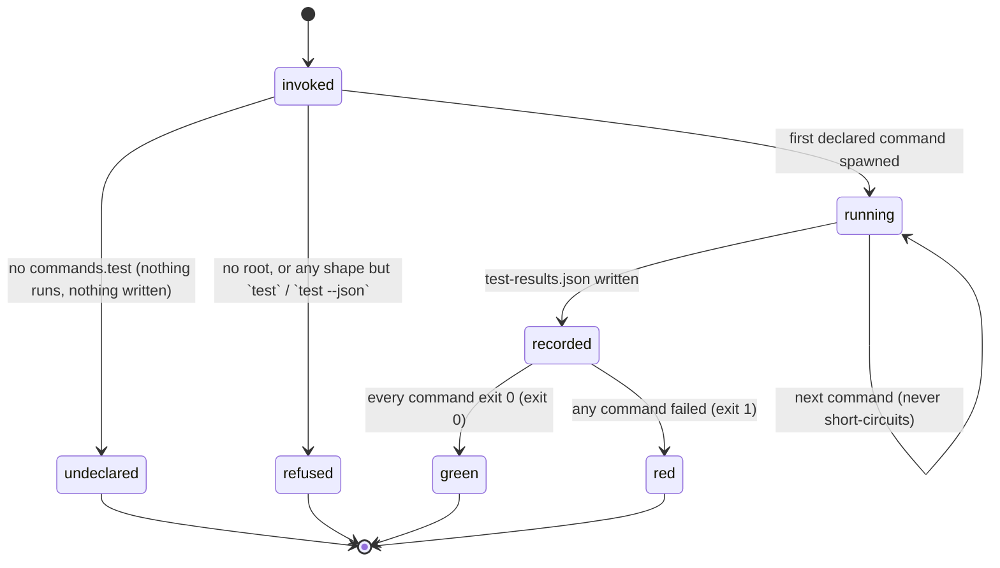

# `bee test` and the verify pipeline

## Summary

`bee test` runs the project's **one** declared test path — `commands.test` in `.bee/config.json`, a string or an array run in order — and writes the result as a normalized record at `.bee/logs/test-results.json`. That is all it does. It is a runner, not a gate: no bee door runs tests on the agent's behalf. A worker picks the proof its change actually needs and records it as a proof line on the cap; `bee close` and `bee worktree merge` read that recorded proof and run nothing; CI runs the declared command on every push and is the one deterministic net. The runner exists so that the record is written by a program instead of asserted by an agent — a red run is a normal result with a normal record, exits 1, and becomes the next work item, because the claim door reads that record and refuses to claim onto a red base.

## The simple case

The repo declares its test path:

```json
{ "commands": { "test": "cargo test --manifest-path packages/bee-rs/Cargo.toml" } }
```

The agent runs `bee test`:

```
✓ cargo test --manifest-path packages/bee-rs/Cargo.toml (74.2s)
next: green (record: .bee/logs/test-results.json) — back to what you were doing
```

Exit 0, and `.bee/logs/test-results.json` now holds `{ran_at, green: true, commands: […]}`. When it goes red instead:

```
✗ cargo test --manifest-path packages/bee-rs/Cargo.toml (61.8s, exit 101)
next: test claim_race::one_claimant_wins ... FAILED — fix before capping
```

Exit 1 — and the record is written just the same, carrying the failing command, its exit code, a bounded excerpt of its output, and the path of a log holding that output in full.

## The interaction, event by event



### Invoke

Exactly two argv shapes are served: `bee test` and `bee test --json` (repeated `--json` tokens are fine). Any other flag, any `--json=value` form, and any positional fall through to the catalog, which answers them there. The root is resolved through the wide door — this command reads nothing but the store root — so it serves the main checkout and a feature worktree alike, and the declared commands run with the working directory set to whatever root resolved. In a *granted* feature worktree that is the worktree; in an ungranted linked worktree it is the main checkout.

### Ends at once

**Undeclared.** With no `commands.test` — which is the state of a freshly onboarded repo, since the seeded config declares no commands at all — nothing runs and nothing is written:

```
No commands.test declared — nothing ran.
bee test runs the project's ONE declared test path: set commands.test in .bee/config.json (a string, or an array run in order). It is the only declared test command — no local door runs it: each cap records its own proof line, bee close and bee worktree merge check that record and run nothing themselves, and CI runs the declared command on every push.
Once declared, bee cells finish records a proof line, never a boundary run.
next: declare commands.test, then re-run bee test
```

The payload is `{green: null, undeclared: true}` and the **exit code is 0**. "No tests declared" is not a failure; it is a fact about the repo.

A repo reaches this state four ways: the key is absent; it is a blank string; `commands` is not an object; or the config is corrupt (a corrupt config warns and reads as no config, so it reports undeclared). And one way on purpose — see "The no-test repo".

### First side effect

The first declared command's process starts. That is the point after which anything can have happened: `bee test` hands the string to a shell, and the shell may write files, touch the network, or start containers. Before it, the only write is creating `.bee/logs/` if it is missing.

Each command runs as `<posix sh> -c "<the command>"` (on Windows, a real Win32 `bash`, probed once), with the working directory at the store root and standard input closed. The child inherits the ambient environment as it is — the runner scrubs nothing.

### While running

Commands run **sequentially and never short-circuit**: a red first command does not stop the second. Per command, the runner captures standard output followed by standard error as one text, and records:

- `exit` — the exit code, or `null` for a signal death or a spawn failure (the text line says `exit spawn-failed`).
- `duration_ms` — wall clock for that command.
- `failure_excerpt` — `null` on pass; otherwise the last 500 characters of the trimmed output, or `(no output; exit <n>)` when the trim leaves nothing.
- `failure_log` — `.bee/logs/test-failure-test-<index>.log`, holding that command's **complete, untrimmed** output; `null` on pass, and also `null` if the log write itself failed, because losing the evidence must never change the verdict. A command that passes has its stale log from a previous red removed.

The excerpt is an identity, not a message: it is what decides whether two runs saw the same failure, so nothing is ever appended to it — the path travels in its own field.

### Finish

The record is written atomically to `.bee/logs/test-results.json`:

```json
{ "ran_at": "…", "green": false,
  "commands": [ { "command": "…", "exit": 101, "duration_ms": 61814,
                  "failure_excerpt": "…", "failure_log": ".bee/logs/test-failure-test-0.log" } ] }
```

Then the output: one `✓`/`✗` line per command and exactly one `next:` line. Green exits 0; red exits 1 and its `next:` line is the first non-empty line of the first failing command's excerpt, followed by `— fix before capping`. Under `--json` the same run comes back as `{green, undeclared, ran_at, commands, results}` where `results` is the record's relative path. If the record write itself fails, that is the one hard error: the message goes to stderr (or `{"error": …}` on stdout) and the command exits 1. The timing line is always on stderr.

## The no-test repo

`commands.test: "none"` is the one way to declare that a repository is deliberately test-free. The sentinel is dropped during normalization, so `bee test` in such a repo reports undeclared exactly as an unconfigured one does — but the declaration is visible elsewhere: it is what allows a cell to carry `verify: "none"`, which is otherwise refused by name:

> `<verb>`: verify "none" is refused — this repo has not declared itself a no-test repo. FIX: use a real, runnable verify command, or declare the repo no-test first by setting commands.test to "none" in .bee/config.json (decision 55b951e1).

A list with a real command beside the sentinel is not a no-test repo; `["none"]` and `"none"` both are. The retired `commands.verify` key no longer declares anything: `bee onboard` warns when it finds one, and warns harder when it finds one with no `commands.test` beside it, because that repo just lost every test gate it had.

## `bee test` and the worker's proof

They are related but not the same thing, and confusing them is the mistake this design exists to prevent.

The worker owns proof scope. For a code change it runs the related tests, for a docs change a parity or pointer check, for a behavior change a judge verdict — and it records what it ran as the proof line `<command> — <result> — <scope reason>` on its cap ([execution](../lifecycle/execution.md) owns that arc). The whole declared command is a legitimate choice for that proof, and `bee test` is how it is run — but it is rarely the *right* choice, because the narrowest proof that covers the change is the contract, and running the whole suite by default is explicitly not.

Three consequences follow:

- **The cap runs nothing.** `bee cells finish` records the proof line and refuses a `red` result outright. Its own copy of the test runner was deleted; so were the copies in `bee close` and `bee worktree merge`, which now read the cap's recorded proof.
- **The claim reads the record.** `bee cells claim` classifies `.bee/logs/test-results.json` before it lets a claim through, and a red one refuses by name:

  > cell "&lt;id&gt;" refused — the last recorded test run is red ("&lt;command&gt;" failed; record: .bee/logs/test-results.json). D2: never claim onto a red base. FIX: fix the red, run `bee test` to refresh the record, then retry — or pass --fix-first "&lt;reason&gt;" to claim anyway (the reason is stored on the claim's own trace.fix_first).

  Green passes silently. A missing or unrecognizable record warns on stderr and lets the claim proceed: it can prove neither red nor green.
- **CI is the net.** bee installs no CI and runs none. The contract is that the host's CI runs the declared command on every push; a scoped-green cap whose CI later goes red is a fix-first cell plus a captured learning about why the scope missed.

## The rest of the verify pipeline

Two things the knowledge bundle describes under "verify pipeline" are **not** part of `bee test`, and reading them as current behavior would mislead:

- **No result cache.** There is no closure hash, no cache store, no environment switch that disables caching. Every call runs every declared command. The cache belonged to a runtime that has been retired.
- **No environment scrubbing by the runner.** The hermetic rule — that a child suite must not inherit `CLAUDE_CODE_SESSION_ID`, `BEE_SESSION_ID`, or `BEE_AGENT_NAME`, so a local green cannot be green only because it borrowed an ambient identity — is a rule beehive's *own* suites follow at their own bootstrap. `bee test` spawns with the environment it was given. In a host repo, hermeticity is the declared command's own responsibility.

What does still hold from that area is the doctrine: a red result refuses a cap and a merge unconditionally, and a proof line must name fresh output and an honest scope.

## Modifiers

| Modifier | Set at invocation | Can it differ mid-flow? |
| --- | --- | --- |
| `--json` | The run record on stdout instead of the `✓`/`✗` lines; errors as `{"error": …}`. The record on disk is identical either way. | No — one invocation, one mode. |
| Gate-bypass level | No effect. `bee test` is never gated, and running it approves nothing. | No effect. |
| Store phase | No effect. It runs at idle, mid-swarm, and at a terminal phase alike. The record it writes is read by the claim door, which is phase-sensitive on its own account. | No effect. |
| Where it runs | The declared commands run with the working directory at the resolved store root: a granted feature worktree tests itself; an ungranted linked worktree tests the main checkout instead, which is a real surprise. The record is written under that same root. | The root is resolved once, at invocation. |
| Who runs it | Anyone. Conventionally a worker proving its cell, or an orchestrator refreshing a red record before claiming. A hook never runs it. | — |

## Cancel and interrupt

Columns: before and after the first command is spawned.

| Event | Before the first spawn | After |
| --- | --- | --- |
| The process killed mid-command | Nothing ran, nothing was written; the previous record still stands, however old it is. | Whatever the child already did to the working tree stands. The record is written only after the last command finishes, so a killed run leaves the *previous* record in place — a stale green can survive a killed red. The failure logs of commands that already finished do land. |
| The session turning elsewhere (compaction, handoff, turn end) | No effect. | No effect on the run; a record written by a dead session is read by the next one exactly the same. |
| A clean completion from outside (gate approved, question answered, new message) | No effect. | No effect. |
| The store unavailable (corrupt config, lock contention, hook binary missing) | A corrupt `.bee/config.json` warns and reads as no config, so the run reports undeclared and exits 0. There is no lock to contend for. | A failed record write is the one hard error: exit 1 with the io message, whatever the tests said. |
| The session going away (heartbeat, lease expiry, release) | No effect — `bee test` holds no claim and no lease. | No effect. |
| A sibling changing the target | None: no claim, no reservation, no lock. Two sessions can run it at once. | Two concurrent runs overwrite each other's record (last atomic rename wins) and collide on `.bee/logs/test-failure-test-<index>.log`, since both are the runner named `test`. The record is never torn, only replaced. |
| The channel changing (piped, `--json`, Codex, from a hook) | Same behavior; the runtime is irrelevant, and a POSIX shell is the only host requirement. | Same. |

## Interactions with other systems

**Gates and approval.** None. `bee test` neither reads nor writes a gate. The proof discipline it feeds is checked at the cap and at close, not here.

**The store and history.** One record file, rewritten whole on each run, plus one log per failing command. The record is a *snapshot*, not a log: there is no history of runs, only the last one. `.bee/logs/` is not CLI-owned, so the record is not covered by the direct-edit guard ([the store](../foundations/store.md)).

**Worktrees and containment.** The wide root door serves every checkout shape; the tests run where the root resolved, and the record lands beside them.

**Claims, holds, and reservations.** Only through the record: the claim door's red-base check. `bee test` takes nothing and releases nothing.

**Sibling sessions.** They share one record and one set of failure logs, with no serialization at all. A sibling's red is the record everyone's next claim reads.

**What the human sees.** One progress tick at most — `✓` green, `✗` red — and a red is never silenced or delayed. The `next:` line is written for the agent, not for the human.

**Configuration.** `commands.test`, merged from `config.json` under `config.local.json` like everything else: a string, or an array run in order; trimmed; blanks dropped; `"none"` as the no-test sentinel. `commands.verify` is retired and ignored. There is no timeout key, no parallelism key, no retry key.

**Output modes and exit codes.** Standard, from [invocation](../foundations/invocation.md), with the same stdout deviation the whole binary has for success text: the `✓`/`✗` lines are printed on stdout, error text on stderr, `--json` payloads on stdout, and the timing line always on stderr. Exit 0 for green *and* for undeclared; exit 1 for red and for a record-write failure.

## Edge cases

- A red run and an undeclared run both leave the agent with exit codes that mean different things: `1` says "the tests ran and failed", `0` with `undeclared: true` says "there is nothing to run here". A script that only checks the exit code cannot tell an untested repo from a green one.
- An array with a mix of good and blank entries keeps order and drops the blanks; a non-string entry is dropped silently.
- A command that dies on a signal records `exit: null` and renders as `exit spawn-failed` in the text line — the same rendering a genuine spawn failure gets, which makes the two indistinguishable in the lines (though not in the excerpt, which carries the spawn error text).
- A failing command with no output at all gets `(no output; exit <n>)` as its excerpt, so the record never carries an empty failure.
- Failure logs are per runner and per position, and they are overwritten, not accumulated: `test-failure-test-0.log` is always the last failure of the first declared command. `bee cells finish` and `bee close` had their own runner names for exactly this reason; today only `test` writes them.
- The `next:` line on a red run is the first non-empty line of the *first* failing command's excerpt — which, for a test runner that prints a summary at the end, is often a line about something other than the failure.

## Open questions and verification

- **Likely gap:** `.bee/logs/` is exempt from both the scratch-shape guard and the direct-edit guard's deny table, so `.bee/logs/test-results.json` can be hand-written. The claim door's red-base check trusts it as written. An agent could therefore hand-author a green record and claim onto a red base without the `--fix-first` reason the design demands. Read from `hooks/write_guard/guards.rs` and `verbs/cells/handlers_write.rs`; not probed. Filed in [bug-triage.md](../bug-triage.md).
- Running `bee test` from an *ungranted* linked worktree resolves the root to the main checkout and therefore tests main, not the worktree the agent is standing in. Read from `roots.rs` (`resolve_store_root_any` collapses both linked states to the resolved store root); not probed in a real worktree pair.
- Two concurrent `bee test` runs share the `test` runner name for their failure logs and share the record file. Whether that is accepted (the runners were named to avoid collisions *between* runners, not within one) or an oversight was not determined.
- `docs/knowledge/areas/verify-pipeline/` still carries a large description of a suite-result cache and a parallel suite runner, both belonging to a retired runtime. The retirement is marked at the top of `suite-result-cache.md` but not on the area's `overview.md`, which still names "cell verify" and "merge verification" as entry points that run suites — neither of which runs anything today.
- The Windows shell probe, the signal-death path, and the record-write failure path were read from code only.
- Everything above was read from `verbs/test_runner.rs`, `verbs/cells/finish_support.rs`, `verbs/cells/handlers_write.rs`, `verbs/cells/obligation.rs`, `onboard/templates.rs`, `fsutil.rs`, the registry payload, and the verify-pipeline knowledge area. The quoted text is copied from source; no run was executed against a scratch host repo.

Verified against beehive commit `6b0ae488`.
