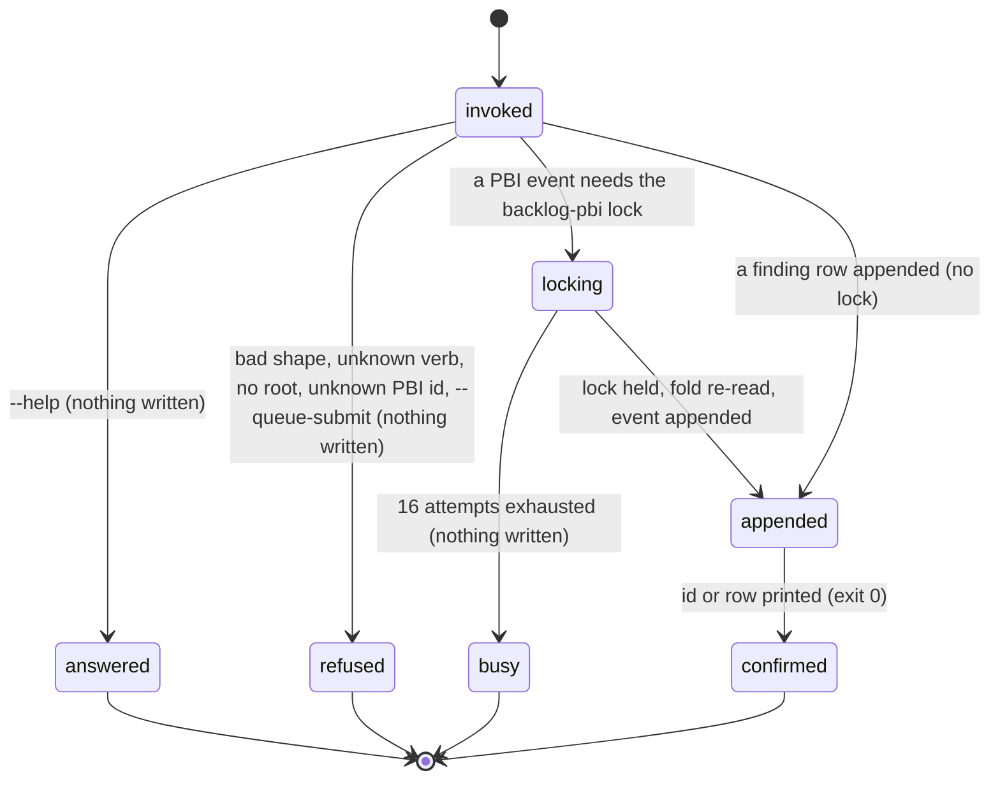

# The backlog

## Summary

The backlog is the repository's list of work that is not being done yet, plus the friction and findings that argue for doing it. It is one append-only event log, `.bee/backlog.jsonl`, carrying two unrelated row families: **PBI events** (`kind: "pbi"`, one of `add` / `status` / `amend`) that fold into the numbered product-backlog items, and **finding rows** (a `type` or `kind` of `friction`, `finding`, `debt`, and ten more) that the agent files as it works. `docs/backlog.md` is not a second store — it is a generated view of the PBI fold, rewritten by `bee backlog render --write`, and the direct-edit guard denies a hand edit to either file. Eleven verbs sit on top: `add` and `findings` for the finding rows; `propose`, `pbi add`, `pbi status`, `pbi amend`, and `pbi list` for the items; and `counts`, `rank`, `badges`, and `render` for the mechanical passes over them. No gate guards any of it, in any phase.

## The simple case

An agent hits friction mid-cell and files it:

```
bee backlog add --type friction --title "cells claim-next re-reads every lane file" --severity P2 --layer cells
```

bee answers `Appended P2 friction row to .bee/backlog.jsonl: "cells claim-next re-reads every lane file"`. One line is on the end of the log. Nothing else changed, and nothing was committed.

Later somebody wants that friction to become work. They propose an item:

```
bee backlog propose --story "claim-next reads each lane once" --cos "one read per lane; concurrency suite green" --feature claim-next-cost
```

bee answers `Proposed p-4f0a91c3: "claim-next reads each lane once" (feature: claim-next-cost)`. A `kind:"pbi"` add event is on the log with a fresh `p-<8hex>` id and status `proposed`. The human-readable table is now stale, so the agent refreshes it:

```
bee backlog render --write
```

`Rendered: docs/backlog.md`. When the item is picked up, its status flips — `bee backlog pbi status --id p-4f0a91c3 --to in-flight --feature claim-next-cost` — and the table is rendered again. Every one of those steps appends; none rewrites.

## The eleven verbs

| Verb | Reads | Writes |
| --- | --- | --- |
| `backlog add --type --title --severity --layer [--detail --feature]` | — | one finding row appended to `.bee/backlog.jsonl` |
| `backlog findings --feature <slug> [--text]` | the log's finding rows | nothing |
| `backlog propose --story --cos [--feature]` | the PBI fold | one `pbi`/`add` event |
| `backlog pbi add --title [--cos --status --feature --id]` | the PBI fold | one `pbi`/`add` event |
| `backlog pbi status --id --to [--feature]` | the PBI fold | one `pbi`/`status` event |
| `backlog pbi amend --id [--title --cos]` | the PBI fold | one `pbi`/`amend` event |
| `backlog pbi list [--status]` | the PBI fold | nothing |
| `backlog counts` | the fold, else the `docs/backlog.md` table | nothing |
| `backlog rank` | the `docs/backlog.md` table | nothing (`--write` is retired) |
| `backlog badges [--write]` | the fold or the table | `README.md`, with `--write` |
| `backlog render [--write] [--check]` | the fold | `docs/backlog.md`, with `--write` |

Everything takes `--json`. Everything answers `bee backlog <verb> --help`.

## The interaction, event by event

One writing invocation — `bee backlog propose`, `pbi add`, `pbi status`, `pbi amend`, or `backlog add`:



### Invoke

The argv is matched against the verb's exact accepted shape; any other flag, a bare group, or a stray positional refuses. The store root is resolved by walking up to the nearest `.bee/onboarding.json` or `.git`; with neither, the no-root error ends the run (exit 1) — see [invocation](../foundations/invocation.md). The root is resolved *before* any flag complaint, so an agent standing outside a bee repo hears about the missing root first.

For the four mechanical verbs (`counts`, `rank`, `badges`, `render`) a second path also resolves: `product_root` from config, which decides where `docs/backlog.md` and `README.md` are read and written. It defaults to the store root.

### Ends at once

The short paths, none of which write anything:

- `--help` prints the registry entry — description, every flag with its type, required flags starred.
- An unknown verb refuses by name and lists all eleven, exit 1:

  > bee: unknown command `bee backlog bogus` — `bee backlog` has no `bogus` verb. `bee backlog` takes: counts, rank, badges, add, propose, pbi add, pbi status, pbi amend, pbi list, render, findings. FIX: `bee backlog --help` for each verb's flags.

- `backlog add` with a missing required flag, an out-of-table `--type`, a `--severity` outside `P1|P2|P3`, a `--title` over 200 characters, or a `--layer` over 40 names the offending flag, promises `Nothing was written.`, and gives the fix. Exit 1.
- `backlog add --queue-submit` refuses the flag by name before the append: the scoped git auto-commit path was never ported, so the flag is not built into this binary. The remedy is to re-run without it and commit `.bee/backlog.jsonl` by hand.
- `backlog pbi status` and `backlog pbi amend` with an id no `add` event ever created name the mistake instead of the verb, exit 1:

  > bee backlog pbi status: no PBI with id nope. FIX: `bee backlog pbi list --json` lists every id and its status.

- `backlog rank --write` refuses: `backlog rank --write is retired — "bee backlog render --write" now owns the generated docs/backlog.md view.` Nothing is read and no lock is taken.
- `backlog render --check` with drift refuses: `docs/backlog.md is stale. FIX: run "bee backlog render --write" to refresh it.` Exit 1. Without drift it reports `Current: docs/backlog.md`, exit 0.
- Every *other* semantic refusal collapses into the generic `bee: unsupported argument shape` answer, whose fixed text claims "Its required arguments are all present" even when they are not. This catches a blank or over-long `--story`/`--cos`, a blank `--title` on `pbi add`, an out-of-enum `--status`/`--to`, a duplicate `--id`, `pbi amend` with neither `--title` nor `--cos`, a non-ASCII `--feature`/`--text` on `findings`, and an unusable `product_root`. See "Open questions".

### First side effect

The append — one JSON line at the end of `.bee/backlog.jsonl`. A finding row carries `ts, type, title, detail, severity, layer, feature` in that order (absent optionals become empty strings, not nulls). A PBI event carries `ts, kind, event, id` plus what the verb changes: `title, status[, cos][, feature]` for `add`, `status[, feature]` for `status`, `[title][, cos]` for `amend`.

`backlog add` appends with no lock at all. The three PBI writers take the named `backlog-pbi` store lock first, because id generation is a read-then-write: the fold is re-read under the lock, the id checked against it, and the event appended, all inside one critical section. The lock is tried once and then retried 15 times at 20 ms — about a third of a second — after which the run refuses with `backlog-pbi store lock busy: held by pid=… session=… since …` and nothing is written.

> Technical note: a duplicate `--id` is detected in a probe *before* the lock is taken, because acquiring the lock writes a contention-telemetry row, and a store write before a refusal would break the "nothing was written" promise. The same check re-runs under the lock for the racing case.

### While running

Nothing observable. A concurrent invocation either sees the event or does not; there is no half-state. `render --write` and `badges --write` are whole-file writes to `docs/backlog.md` and `README.md`, not appends — a reader sees the old file or the new one.

### Finish

Without `--json`: one human line on stderr, then the timing line `[bee] backlog <verb> <N>ms`. With `--json`: the payload on stdout — the appended row for `add` (always with `committed: false`), `{id, story, cos, feature}` for `propose`, the folded `{id, title, cos, status, feature}` for the three `pbi` writers, `{changed, order}` for `rank`, `{changed, badges}` for `badges`, `{changed, content}` for `render`. Exit 0.

## The event log and the rendered view

Two files, one direction of flow.

**`.bee/backlog.jsonl`** is the truth. It only grows. A PBI's current state is the **fold**: walk the file top to bottom, and for each `kind:"pbi"` row apply its event. `add` creates the item — a second `add` for an id that already exists is ignored, first add wins. `status` sets the status (and the feature, when the event carries one) on an item that exists; an event for an unknown id changes nothing. `amend` sets the title and/or the cos the same way. A status value outside the five is ignored rather than stored. Fold order is first-add order, and that is what `bee herding classify-lane` and the knowledge anchor read.

**`docs/backlog.md`** is the view. `bee backlog render` computes it from the fold and compares it with what is on disk: `--write` persists, `--check` refuses on any difference, neither reports `Would render (re-run with --write to apply)`. The content is deterministic — the header says so, and there is no generation timestamp anywhere in it, so two renders of the same log are byte-identical. Items sort by status weight (`in-flight` 0, `proposed` 1, `parked` 2, `done` 3, `declined` 4, anything else 5) then by id. The first three statuses render as full table rows (`| ID | Story | CoS | Status | Feature |`); `done` and `declined` collapse into a short `## Done / Declined` list, which is what keeps the file readable after a hundred items. A missing feature renders as `—`. Cell text has its newlines flattened to spaces and its pipes escaped.

Both files are CLI-owned. A hand edit is denied in every phase, and the deny names the verb: `bee backlog add` for the log, and for the view `bee backlog pbi add / bee backlog pbi status / bee backlog pbi amend to change data, or bee backlog render --write to regenerate the view`. See [guards](../foundations/guards.md).

## PBI ids, statuses, and ranking

**Ids.** `pbi add` and `propose` generate `p-` plus eight lowercase hex characters from process randomness, drawing up to sixteen times until the candidate is not already in the fold. There is no counter and no read-then-increment, which is why two sessions proposing at the same moment cannot collide on a number. `--id` exists only to preserve a legacy id during a migration; a given id that already names an item refuses.

**Statuses.** Five: `proposed`, `in-flight`, `parked`, `done`, `declined`. `pbi status --to` is the only way to move between them — `amend` deliberately cannot, so a title fix can never smuggle a status change. `--feature` on `pbi status` stamps the feature slug in the same event; a feature once set is never cleared by a later event that omits it.

**Ranking.** Two different things share the word.

- `bee backlog rank` is a dry-run report over the `docs/backlog.md` *table*, not the fold. It groups rows by status (`in-flight` first, `proposed` next, an unrecognized status in the middle, `done` last), keeps each group's original order, and prints either `Already ordered: …` or `Would reorder to: …`. It writes nothing, ever; `--write` is retired in favour of `render --write`.
- The **feature rank** is internal and has no verb. It ranks features by their best PBI — fold order sorted by status weight then id, first row per feature wins — and `bee cells claim-next` uses it to order the cross-lane candidate pool, so a worker asking for the next cell gets one from the highest-ranked feature whose lane has an approved execution gate. That is the one place the backlog steers execution rather than describing it.

Items feed dispatch the same way: `bee herding classify-lane <PBI-ID>` reads the PBI fold in-process and classifies the lane from the item's title plus its acceptance criteria, so an item's own words decide whether the unattended loop may pick it up at all — see [herding](../delegation/herding.md).

**Counts.** `bee backlog counts` is fold-first: five statuses plus a total, keyed `proposed, inFlight, parked, done, declined, total`. Only if the log holds no PBI event at all does it fall back to parsing the `docs/backlog.md` table's Status column for the three legacy statuses. The human line shows three of the five — `PBI: 123 done / 0 in-flight / 16 proposed (176 total)` — so `parked` and `declined` are inside the total but invisible in the text. `--json` shows all of them. The same counts feed the session preamble's project map line and `bee backlog badges`.

**Badges.** `bee backlog badges` renders one shields.io image per status, highest status first, and splices the block into `README.md` between `<!-- BEE:BACKLOG-BADGES:START -->` and `<!-- BEE:BACKLOG-BADGES:END -->`. With no markers present it inserts the block just after the first heading line. Without `--write` it only reports whether the README is stale.

## Modifiers

| Modifier | Set at invocation | Can it differ mid-flow? |
| --- | --- | --- |
| `--json` | Payload (the row, the fold record, the counts, the ranked order, or `{"error": …}`) on stdout instead of a human line on stderr. | No — one invocation, one mode. |
| Gate-bypass level | No effect. Nothing in the backlog is gated in either direction; an item can be proposed at idle and its status flipped mid-execution. | No effect. |
| Store phase | No effect on any verb. The phase does decide whether an *unrelated* source write is allowed, but the two backlog files are CLI-owned in every phase alike. | No effect. |
| Where it runs | Decides which `.bee/backlog.jsonl` answers — the backlog is per-store-root, not redirected to the main checkout the way claims and sessions are. A feature worktree therefore has its own backlog file until it merges. `product_root` moves where `docs/backlog.md` and `README.md` are read and written. | The log read is where the invocation runs. |
| Who runs it | No effect — orchestrator, dispatched worker, and grooming session use the same verbs. By convention `add` is everyone's, `propose` is the human's front door, and `render --write` is run by whoever moved a status. Nothing enforces that. | — |

## Cancel and interrupt

Columns: before and after the append (the first side effect).

| Event | Before the append | After the append |
| --- | --- | --- |
| The process killed mid-command | Nothing recorded. A killed PBI writer may leave the `backlog-pbi` lock behind; it goes stale on the normal store-lock schedule and no sibling is wedged. | The event is on disk and folds normally; the confirmation may never print. A torn partial line is skipped by every later read. |
| The session turning elsewhere (compaction, handoff, turn end) | The friction or the item is lost unless refiled — the backlog is the durable place precisely so this does not happen. | The row survives by design. It outlives the session, the feature, and the worktree it was filed from. |
| A clean completion from outside (gate approved, question answered, new message) | No effect on the backlog. | No effect on the backlog. |
| The store unavailable (lock contention, corrupt JSON, hook binary missing) | A busy `backlog-pbi` lock refuses by name after ~0.3 s and writes nothing. An unusable `product_root` turns `counts`, `rank`, `badges`, and `render` into the generic shape refusal. | An unparseable line anywhere in the log is skipped silently by every read — the fold, `findings`, `counts`, and the preamble all still answer. A failed append on `backlog add` says so and warns that a partial row may be on disk; the same failure on a PBI writer falls through to the generic shape refusal. |
| The session going away (heartbeat expiry, lease expiry, `session release`) | No effect — the backlog holds no leases and no claims. | No effect; rows outlive every session. |
| A sibling changing the target | Two `backlog add` appends interleave safely. Two PBI writers serialize on the `backlog-pbi` lock; the loser retries and then refuses, naming the holder. | A sibling can flip the same PBI's status right after; last event wins in the fold, and both events stay in the log. A sibling that runs `render --write` first makes the next `render` a no-op (`Already current`). |
| The channel changing (piped, `--json`, Codex, run from a hook) | Same behavior; `--json` moves the payload to stdout. In a hooked session the CLI-shape guard can deny a malformed invocation before the binary runs. | Same. |

After any interrupt the agent is exactly where the log says: an event either has its line or it does not. `docs/backlog.md` can fall behind, and `bee backlog render --check` is how that is noticed.

## Interactions with other systems

**Gates and approval.** None. No gate guards any backlog verb, and proposing an item explicitly does not start work on it — the item sits at `proposed` until a separate pass picks it up. The one place approval matters is downstream: `cells claim-next` only pools cells from lanes whose execution gate is approved, so a high-ranked feature with no approved gate contributes nothing.

**The store and history.** `.bee/backlog.jsonl` is an append-only event log in the store, like the capture queue and the decisions log; `docs/backlog.md` is a rendered projection, and losing it costs nothing because `render --write` rebuilds it. History is the file itself — a superseded story is still readable in the `add` event that preceded the `amend`.

**Worktrees and containment.** The backlog belongs to the store root the invocation resolves and is *not* part of the control plane a worktree redirects. A worktree's own `.bee/backlog.jsonl` merges into main as an ordinary file: appends from both sides usually merge cleanly, being distinct trailing lines. See [worktrees](../foundations/worktrees.md).

**Claims, holds, and reservations.** None of its own. The `backlog-pbi` store lock is a short critical section, not a lease, and it is released before the verb answers.

**Sibling sessions.** All siblings share one log. Anyone may append; the fold reconciles.

**What the human sees.** The session preamble's project map carries `- PBI: N done / N in-flight / N proposed`, so the standing backlog is in front of every session without anyone asking. `docs/backlog.md` and the README badges are the human's readable surface; `bee backlog propose` is their front door for putting something new on it.

**Configuration.** `product_root` relocates `docs/backlog.md` and `README.md`. No config key changes the event log's location or behavior.

**Output modes and exit codes.** The standard contract, owned by [invocation](../foundations/invocation.md): 0 on success, 1 on refusal or error; `--json` puts payloads and `{"error": …}` on stdout. `render --check` uses exit 1 to mean drift, which is its whole purpose in a check pipeline.

## Edge cases

- `--write=true` is not `--write`. The boolean parser accepts `--write=true` and `--write=false` as *present but not true*, so `bee backlog render --write=true` reports what it would do and writes nothing. Any other `=value` refuses outright. The bare flag is the only spelling that acts.
- `bee backlog add` never touches git. The result always carries `committed: false`, and the one flag that used to change that is refused.
- `backlog findings` matches `--feature` as a whole token, not a substring: `--feature auth` does not match a row filed against `authz`. `--text` is the opposite — any whitespace-split term hitting either `title` or `detail` is enough. An empty `--text` disables the filter rather than matching nothing.
- Two row schemas coexist for findings and both are read: older rows carry `kind: "friction"|"finding"`, rows from `backlog add` carry `type:`. A row is returned if either field matches. A `kind:"pbi"` row never surfaces as a finding.
- `backlog counts` and `backlog rank` read different things. `counts` prefers the fold; `rank` only ever reads the `docs/backlog.md` table, so a fold whose view was never rendered ranks nothing (`No parseable backlog table in docs/backlog.md.`).
- A legacy-table row whose Status cell carries extra text beside the word — a link to the item's history, for example — matches none of the three tokens and is silently excluded from the legacy counts and from `rank`'s grouping. Recorded as a known defect in the area's own notes; it cannot affect a repository whose log already holds PBI events, because those never reach the legacy path.
- `pbi list` sorts by id as bytes, so `p-` ids sort as they read. `--status ""` disables the filter; a non-empty out-of-enum value refuses.
- A `status` or `amend` event for an id no `add` ever created is not an error in the fold — it is simply ignored on replay. The *verbs* refuse to write such an event, so it can only arrive from a hand-written line.
- `badges` with `README.md` present but `docs/backlog.md` absent and no PBI events reports `README.md or docs/backlog.md missing — nothing to badge.` and exits 0.
- A `README.md` that has a START marker but no END after it is left untouched, and `badges` reports it as already current.

## Open questions and verification

- **Suspected bug, same family as the capture queue's:** most semantic refusals in this group collapse into the generic `bee: unsupported argument shape` answer, which then claims "Its required arguments are all present". Confirmed by hand for `bee backlog propose --story "  " --cos x`. It also covers a blank `pbi add --title`, an out-of-enum `--status`/`--to`, a duplicate `--id`, `pbi amend` with neither field, non-ASCII `findings` filters, and an unresolvable `product_root`. `backlog add`, `pbi status`, and `pbi amend` each got a proper native message for their own commonest mistake ("CUTOVER FIX"); the rest did not. Filed as the backlog entries in [bug-triage.md](../bug-triage.md).
- `bee backlog counts --help` still says the counts are "parsed from docs/backlog.md", which has been the fallback rather than the source since the fold landed. `bee backlog add --help` still describes what `--queue-submit` does in its long prose while its own parameter entry says the flag is not built. Both look like registry text that outlived its behavior.
- `--write=true` writing nothing is read from the parser's own comment (`present, but !== true`) and was not probed. If an agent ever spells the flag that way, it gets a silent no-op with a success exit code.
- What a linked worktree resolves for `.bee/backlog.jsonl` was read from the root resolver, not probed with a real worktree; the "linked-worktree roots" delegation trigger named in the module header may still make some verb refuse there.
- The `backlog-pbi` lock-busy path was read from code and its retry constants (1 + 15 attempts × 20 ms); it was not raced by hand.
- Whether a legacy-table repository still exists in practice — every path where `counts`, `badges`, and `feature rank` fall back to parsing `docs/backlog.md` — was not exercised; this repository's log has PBI events, so every probe here took the fold path.
- Confirmed by running the binary in this repository: `counts`, `pbi list --status`, `rank`, `rank --write`, `render --check`, `badges`, `findings` with no hits, the unknown-verb refusal, the `backlog add` missing-flag refusal, the unknown-PBI-id refusals for `pbi status` and `pbi amend`, and the exit code of each. No writing verb was run.

Verified against beehive commit `6b0ae488`.
