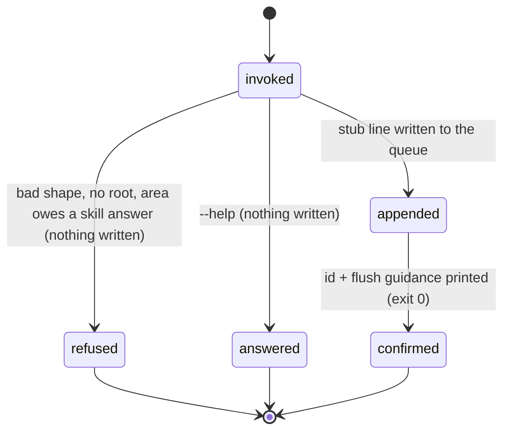

# The capture queue

## Summary

The capture queue is where a settlement is parked the moment it happens. When a rule, behavior, or value settles mid-turn, the agent files a one-line stub with `bee capture add`; the full write-up into the knowledge bundle happens later, when a capture session merges the stub and marks it flushed with `bee capture flush`. Between those two moments the stub is *pending*: `bee capture count` and `bee capture list` report it, and the session preamble shows the pending count to every future session, so a settlement cannot be silently forgotten. The queue lives at `.bee/capture-queue.jsonl` in the store and is available in every phase, from any session — filing a stub needs no gate, no claim, and no active feature.

## The simple case

Something settles — say, a decision about how a flag behaves. The agent runs:

```
bee capture add --outcome "the --force flag now skips the prompt" --area cli --files src/cli.rs
```

bee answers with one line: `Queued capture stub <id>. Flush via bee-capturing at wrap-up, before compact/clear, or next session (decision 0017).` The stub is now on disk with a fresh id and timestamp. The agent keeps working; nothing else changes.

Later — same session at wrap-up, or a future one — a capture session reads the queue with `bee capture list`, merges each stub's content into the right knowledge document, and records the merge:

```
bee capture flush --id <id> --into docs/knowledge/areas/cli/flags.md
```

bee answers `Flushed stub <id> into docs/knowledge/areas/cli/flags.md.` The stub stops being pending. The count drops. The queue file itself only ever grows; a flush is a second line that cancels the first, not an erasure.

## The interaction, event by event

One `bee capture add` invocation:



### Invoke

The argv is matched against the exact accepted shape: `--outcome` plus the optional `--did`, `--area`, `--files`, `--lane`, `--source`, `--skill-answer`, `--json`. Any other flag refuses. The store root is resolved by walking up from the working directory to the nearest `.bee/onboarding.json` or `.git`; with neither, the invocation ends with the no-root error (see [invocation](../foundations/invocation.md)) and exit 1. Comma-separated values in `--did` and `--files` are split, trimmed, and emptied of blanks at this point; a whitespace-only optional flag counts as absent.

### Ends at once

The short paths, none of which write anything:

- `--help` prints the command's registry entry — description, every flag with its type — and exits 0.
- An unknown verb (`bee capture bogus`) refuses by name and lists the four verbs: `add, list, flush, count`.
- An unknown flag refuses and names the flag: `… names unknown flag --bogus`.
- A missing or whitespace-only `--outcome`, `--lane high-risk`, or an outcome or area that matches a secret or prompt-injection pattern all refuse — but with the *generic* shape refusal, not a message that names the real reason. See "Open questions"; this looks like a defect, not a design.
- An `--area` that names a knowledge area owning one or more skills, with no `--skill-answer`, refuses with a message that names the area's owned skills and both accepted spellings: `--skill-answer "changed: <skill path>"` or `--skill-answer "not: <why>"`. This one is a proper, self-explaining refusal (exit 1, `{"error": …}` under `--json`).

> Technical note: the vague refusals are inherited from a retired delegation path. The Rust port declined these argv shapes so a Node binary could own the byte-exact error text; the Node binary no longer exists, so the decline now falls through to the router's generic `bee: unsupported argument shape` answer — which even claims "Its required arguments are all present" when `--outcome` is missing, because the registry marks no parameter required.

### First side effect

The append. One JSON line — `{"kind":"stub","id":…,"at":…,"outcome":…,"dids":[…],"area":…,"files":[…],"lane":…}`, plus `source` and `skill_answer` when given — is written to the end of `.bee/capture-queue.jsonl`. The id is a fresh UUID-format string; `at` is the current UTC time. This is the whole side effect: no lock is taken, no other store file changes, nothing is committed to git.

> Technical note: the append deliberately runs without the store lock; the queue is an append-only event log and concurrent appends interleave harmlessly.

### While running

Nothing. The append is a single write; there is no progress, no streaming, and no window in which a concurrent invocation sees a half-recorded stub — a torn last line is skipped by every later read of the queue.

### Finish

Without `--json`: the one-line confirmation naming the stub id and when to flush, on stdout, with the timing line `[bee] capture add <N>ms` on stderr. With `--json`: the full stub, pretty-printed, on stdout. Exit 0 either way. The stub is now pending and will appear in `capture count`, `capture list` (oldest first, by timestamp), and the next session preamble's "Capture queue: N stub(s) pending flush".

## Modifiers

| Modifier | Set at invocation | Can it differ mid-flow? |
| --- | --- | --- |
| `--json` | Payload (the stub, the count, the list, or `{"error": …}`) on stdout instead of a human line on stderr. | No — one invocation, one mode. |
| Gate-bypass level | No effect. Filing, listing, and flushing stubs is never gated. | No effect. |
| Store phase | No effect — the queue accepts stubs at idle, in gated phases, and in terminal states alike. The one lane rule: `--lane high-risk` refuses (a high-risk settlement is recorded in full at once, never parked). | No effect. |
| Where it runs | Main checkout: the queue is the checkout's own `.bee/capture-queue.jsonl`. A linked worktree was a delegation trigger for the retired Node path — what happens there today is unconfirmed (see "Open questions"). | The queue read is where the invocation runs. |
| Who runs it | No effect — orchestrator, worker, and capture session use the same four verbs. By convention `add` is everyone's and `flush` is the capture session's, but nothing enforces that. | — |

## Cancel and interrupt

Columns: before and after the append (the first side effect).

| Event | Before the append | After the append |
| --- | --- | --- |
| The process killed mid-command | Nothing recorded; the queue is untouched. | The stub is on disk and pending; the confirmation may never print. A torn partial line is skipped by every later read. |
| The session turning elsewhere (compaction, handoff, turn end) | No stub exists; the settlement is lost unless refiled. | The stub survives by design — that is the queue's purpose. The pending count follows the session into its preamble. |
| A clean completion from outside (gate approved, question answered, new message) | No effect on the queue. | No effect on the queue. |
| The store unavailable (corrupt lines, append failure, hook binary missing) | Corrupt queue lines are skipped fail-open on read; `count` stays correct. A failed append surfaces as the generic shape refusal — another inherited delegation path. | An already-appended stub is unaffected by later corruption around it; a stub whose id is a JSON object or whose timestamp is not ISO-shaped makes `list` (and for object ids, every queue read) fall through to the generic refusal. |
| The session going away (heartbeat, lease expiry, release) | No effect — the queue holds no leases. | No effect; pending stubs outlive every session. |
| A sibling changing the target | Appends from two sessions interleave safely. | A sibling can flush the stub first; the next `flush` of the same id answers `no pending capture stub with id <id>` (exit 1) with a FIX line pointing at `capture list --json`. |
| The channel changing (piped, `--json`, Codex, run from a hook) | Same behavior; `--json` moves the payload to stdout. In a hooked session the CLI-shape guard can deny a malformed invocation before the binary ever runs. | Same. |

After any interrupt the agent is exactly where the queue file says: a stub either has its line or it does not, and no cleanup is ever needed.

## Interactions with other systems

**Gates and approval.** None. No gate guards the queue in either direction; the one refusal shaped like policy is `--lane high-risk`, which exists so a high-risk settlement is written up in full immediately instead of parked.

**The store and history.** The queue is an append-only event log in the store: `kind: stub` lines and `kind: flush` lines, pending = stubs minus flushed ids. Nothing rewrites or deletes; history is the file itself. Flushing records *where* the content landed (`--into`), tying the queue to the [knowledge bundle](knowledge.md).

**Worktrees and containment.** The queue belongs to whichever store root the invocation resolves — see the linked-worktree open question below.

**Claims, holds, and reservations.** None. No lock, no lease, no reservation; the append-only design is the concurrency story.

**Sibling sessions.** All siblings share one queue. Anyone may add; a flush race loses cleanly with a named error.

**What the human sees.** Nothing at add time. The pending count surfaces in the session preamble and in `bee status`, which is how a settlement filed in one session becomes the next session's offered work ("offer the flush now before new work").

**Configuration.** None. No config key changes the queue's behavior; the per-hook toggles do not touch it.

**Output modes and exit codes.** The standard contract, owned by [invocation](../foundations/invocation.md): 0 on success, 1 on refusal or error; success text on stdout, error text on stderr; `--json` puts payloads and `{"error": …}` on stdout; the stderr timing line appears on successes, help, and verb-owned errors, but not on shape refusals.

## Edge cases

- Flushing an already-flushed id is the same as flushing an unknown one: `no pending capture stub with id <id>`, exit 1. Flush is not idempotent in its exit code, only in its effect.
- An empty queue: `capture list` prints `Capture queue is empty.`; `capture count` prints `0 pending capture stub(s).`; a missing queue file is the same as an empty one.
- `--source mined` marks a stub recovered from a transcript rather than filed live; `list` renders it with a `[mined]` marker, and the ordinary flush is its confirmation.
- `--did "a, b ,,c "` normalizes to `a, b, c`: split on commas, trimmed, empties dropped. The same for `--files`.
- `--skill-answer` is only demanded when `--area` names an area whose ownership map lists skills. An unknown area, an area owning no skill, or a stub with no area at all queues freely.
- A numeric id and its string spelling are distinct: a `flush` line with id `"5"` does not cancel a stub with id `5`. Unreachable for stubs bee itself creates (ids are UUID strings), but true of the file format.
- Stub order in `list` is by timestamp, oldest first, stable for equal timestamps.

## Open questions and verification

- **Suspected bug:** the semantic refusals of `capture add` — missing or blank `--outcome`, `--lane high-risk`, secret- or injection-shaped content — all collapse into the generic `bee: unsupported argument shape` refusal, whose fixed text claims "Its required arguments are all present" even when `--outcome` is missing (the registry marks nothing required). The comments in `verbs/capture.rs` show these paths were built to delegate their error text to the retired Node binary; `capture flush` got a proper native error for the same situation ("CUTOVER FIX") and these did not. May be worth treating as a bug rather than documenting. Filed as the capture entries in [bug-triage.md](../bug-triage.md).
- The same inherited delegation applies to a failed append and to running from a linked worktree ("linked-worktree roots" was a delegation trigger). What the agent actually sees in a linked worktree — the generic refusal, or normal service against some root — was not probed; needs a worktree to verify.
- Whether the hooked session's CLI-shape guard preempts the binary's own refusals for the capture verbs (it demonstrably does for other groups) was not probed.
- The secret/injection pattern list (`has_secret`, `has_injection`) was read as "exists and refuses" but its coverage was not enumerated.
- Confirmed by running the binary in a scratch host repo: the happy paths of all four verbs, `--json` on all four, the flush-unknown-id error, the no-root error, unknown-verb and unknown-flag refusals, the vague semantic refusals quoted above, queue file contents, and pending-count folding across a flush.

Verified against beehive commit `6b0ae488`.
