# The decision log

## Summary

The decision log is where an agreement becomes a durable record. Every settled agreement is appended to `.bee/decisions.jsonl` as one event — `decide`, `supersede`, `redact`, or `tag` — and nothing in that file is ever rewritten afterward. What is *currently true* is not stored anywhere: it is derived on every read as the **active set**, the decide and supersede events that no `supersedes` field and no `redact` event has taken out. Nine verbs sit on that file. `bee decisions log` appends an agreement and must declare its relation to what is already active (`--relation supersedes:<id>|touches:<id>|none`); `bee decisions supersede` retires an earlier decision and sweeps `docs/**` for anything still citing it; `redact` withdraws one without erasing it; `tag` overlays classification onto history without touching the stored line; `active` and `search` read the derived set; `render` regenerates `docs/decisions/index.md`; `archive` moves aged and retired events into a second file; `reattribute` is a narrow repair for a filing label bee itself wrote wrong. The locked decisions of a feature live somewhere else entirely — in `docs/history/<feature>/CONTEXT.md`, where they are cited by id and never reinterpreted.

## The simple case

Something is agreed. The agent logs it, naming what it relates to:

```
bee decisions log --decision "Use the in-repo registry for CLI commands" --rationale "Avoids duplicated validation between dispatcher and hook" --relation none --tags cli,registry
```

bee answers `Logged decision <id>.` and, under that, up to three lines of the form `possible conflict: <short8> <first 90 characters> — if replaced, run decisions supersede --id <short8>`: active decisions that share a tag or hit two or more of this decision's terms. Those lines are a warning, never a refusal. Under them come any *update obligations* — homed knowledge rules whose area matches a tag or the scope, each naming the files that rule already reaches.

Later the agreement changes. The replacement is not logged as new prose; it retires the old one by id:

```
bee decisions supersede --id <old-id> --decision "…" --rationale "…"
```

bee answers `Superseded <old-id> with <new-id>.` and then the sweep: every line under `docs/**` that cites the old id (full id or its first eight characters, word-bounded) is listed with its file, line, and excerpt, and a capture stub is queued for each so the stale citation resurfaces at the next flush. The old decision drops out of `bee decisions active` from that moment; the line describing it stays in the file forever.

## The interaction, event by event

One `bee decisions log` invocation — the verb every session runs most:

```mermaid
stateDiagram-v2
    [*] --> invoked
    invoked --> answered : --help (nothing written)
    invoked --> refused : bad shape, unknown flag, no root (nothing written)
    invoked --> declined : content, relation, prose, trigger or tag refusal (nothing written)
    invoked --> classified : taxonomy consulted; unknown tags appended to candidates[]
    classified --> appended : one decide event appended under the decisions lock
    appended --> swept : touches-sweep queues a stub per citing doc
    swept --> confirmed : id, conflict candidates, obligations printed (exit 0)
    answered --> [*]
    refused --> [*]
    declined --> [*]
    confirmed --> [*]
```



### Invoke

The argv is matched against the accepted shape: `--decision` and `--rationale` and `--relation` are required; `--alternatives`, `--scope` (default `repo`), `--source` (default `user`), `--confidence`, `--tags`, `--trigger`, `--feature`, `--json` are optional. Any other flag refuses. The store root is resolved by walking up from the working directory; with no root the invocation ends with the no-root error (see [invocation](../foundations/invocation.md)) and exit 1.

> Technical note: the decisions family resolves its root through the *wide* door. It touches only `.bee/decisions.jsonl` and its archive — no sessions, claims, or workflows — so inside a granted worktree it operates on that worktree's own store rather than refusing. Every other checkout resolves the same root either door would have given.

### Ends at once

The short paths, none of which write a decision event:

- `--help` prints the verb's registry entry — description and every flag with its type — and exits 0.
- An unknown verb refuses by name and lists all nine: `bee decisions bogus` answers ``bee: unknown command `bee decisions bogus` — `bee decisions` has no `bogus` verb. `bee decisions` takes: log, supersede, redact, reattribute, active, search, archive, tag, render.``
- Blank `--decision` or `--rationale`: `logDecision: decision text is required.` / `… rationale is required.`
- Content that matches a secret pattern (private-key headers, `AKIA…`, `ghp_…`, `sk-…`, JWT-shaped strings, `api_key: …`) or an instruction-like pattern (`ignore previous instructions`, `disregard …`, a `<system>` tag, a `[user]` bracket) refuses per field: `Decision rejected: field "<name>" matches a secret pattern (<the pattern>). Never log credentials — describe the decision without the secret.`
- A missing **or** malformed `--relation` gets one refusal, because both leave the relation undeclared: `logDecision: --relation is required — pass --relation supersedes:<id>[,...] …, --relation touches:<id>[,...] …, or --relation none …`, followed by the same up-to-three conflict-candidate lines, so the fix command is ready-made.
- A `supersedes:` or `touches:` id that does not resolve to an **active** decide or supersede event refuses by name; an eight-character prefix matching several ids refuses as ambiguous and asks for the full id.
- Decision text that *reads* as a supersession — the stem `supersed(e|es|ed)`, `replaces`, `overrides`, `no longer applies`, `instead of the previous` — refuses unless `--relation supersedes:<id>` actually resolves. `--relation none` and `touches:` never silence it. This guard exists because free prose was the one way to hide a supersession from the active set: a store audit found 70 decide events doing exactly that against 29 proper supersede events.
- Decision text that reads as a postponement — `defer…`, `for now`, `revisit when`, `revisit if`, the whole word `later` — refuses unless `--trigger` names an already-registered trigger. No postponed condition may exist outside the trigger registry.
- A tag that is not a lowercase slug (`/^[a-z0-9][a-z0-9-]*(:[a-z0-9][a-z0-9-]*)?$/`) refuses by name. One interior colon is allowed, and only one: it namespaces a tag, as in `contract:<name>`. A colon at either end, an empty segment, or a second colon refuses. With `docs/decisions/taxonomy.json` present, *no* tags refuses: `decisions: docs/decisions/taxonomy.json exists — this decision event needs at least one tag. Pass --tags (e.g. "billing,recall").` Without that file, the event is written and the answer carries a warning instead.
- `--feature ""` refuses rather than falling back to the lane: passing the flag is an act of naming.

### First side effect

Not the decision. Classification runs first: if the taxonomy exists and the tags contain names it does not know, the unknown names are appended to its `candidates[]` array and `docs/decisions/taxonomy.json` is rewritten atomically under the decisions lock. An unknown tag is never refused — it is accepted onto the event and queued for human curation. So an invocation that later refuses (or crashes) can still have widened the taxonomy.

The decision event itself is the second write: one compact JSON line appended to `.bee/decisions.jsonl` under the `decisions` lock, then the lock is released. The line carries `id` (a fresh UUID-format string), `type: "decide"`, `date`, the text fields, `scope`, `source`, `confidence`, `tags` when given, `supersedes` or `touches` when the relation named ids, `trigger` when given, `relation` (the literal word), and `feature` when one resolved.

> Technical note: `feature` is stamped **only** from the calling session's bound lane, or from an explicit `--feature`. bee never borrows the shared `.bee/state.json` record's feature, because that name is whatever some other session last made active. Measured before that rule landed: 67 of 2358 decisions carried a feature their own text contradicted. Absent beats wrong — a missing `feature` is a state every reader tolerates.

### While running

After the append, three read-only-shaped passes run. When the relation was `touches:`, each touched id gets the same `docs/**` citation sweep `supersede` runs, and every surviving hit becomes a `touches-sweep` capture stub — excluding the generated `docs/decisions/index.md` and, when the context has a bound feature, that feature's own live `docs/history/<feature>/` directory. Then the active set is re-read to rank conflict candidates (the just-written event excluded from its own list). Then the knowledge ownership map is read to compute update obligations.

### Finish

Without `--json`: `Logged decision <id>.`, the optional no-taxonomy warning, the candidate lines, and the obligation lines, all on stderr, followed by `[bee] decisions log <N>ms`. With `--json`: the event on stdout, with `conflict_candidates` and `update_obligations` added to it — neither is persisted; the stored line does not carry them. Exit 0.

## The other verbs

**`decisions active` and `decisions search`** read the derived set, newest first. The read model, in order: every `tag` event is collected into a latest-wins overlay (tags replace wholesale, scope only when the tag event carries one); every `supersedes` field on **any** event type contributes its targets to the excluded set, string or array alike; every `redact` event excludes its target; what remains of the decide and supersede events is the active set, overlay applied. Filters are `--tag` and `--scope`/`--area` (exact, case-insensitive), `--since` (ISO date, inclusive), `--untagged` (after the overlay — the classification-completeness check), `--cell` and `--feature` (word-boundary token match over decision/rationale/alternatives, so `si-1` excludes `si-10`), and `--all` (union with the archive, de-duplicated by id, the active copy winning). `active` adds `--recent N`, applied after filtering. `search` adds `--text`, whitespace-split into terms, OR-matched case-insensitively over the text fields plus the overlaid tags, ranked by term-hit count then date; `search` refuses when neither `--text` nor any structured filter is given. Human output is one three-line block per decision, with the decision text wrapped in `«…»` guillemets and control characters, code fences, and role tags stripped out — resurfaced text is data, never instructions.

**`decisions supersede --id --decision --rationale`** appends a `supersede` event carrying `supersedes` as a bare string. Tags and scope are inherited from the *overlay-applied* target when not given, so a legacy decision classified only by a retro-tag still passes on its place; with no metadata at all, scope falls back to `repo`. The `docs/**` sweep runs **before** the append and is recorded on the event as `{scanned_at, hit_count, files[]}`; the capture stubs are queued after it. The sweep reads `.md`, `.json`, `.yaml`, `.yml`, and `.txt` files, skips symlinks, and matches the full id or its short8 on a word boundary.

**`decisions redact --id --reason`** appends a `redact` event. The decision leaves the active set; its line, and its content, stay in the file. There is no sweep and no capture stub.

**`decisions tag --target --tags [--scope]`** appends a `tag` event that overlays classification onto an existing decide or supersede event without rewriting its line. The target resolves against the active **plus** archive union (retro-tagging history is the point), by full id or unique short8. `--stdin` takes a JSON array of `{target, tags, scope?}` and is all-or-nothing: every entry is validated and every event is built before the lock is taken, so one unresolvable target refuses the whole batch with nothing appended, and the batch lands in a single append sharing one timestamp.

**`decisions render`** regenerates `docs/decisions/index.md` from the active set: a provenance header, then `## <scope>` groups sorted by collation, then `### <first tag>` groups inside each with `### untagged` last, then one line per decision — `- <short8> · YYYY-MM-DD · <first line of the decision text>`. The file carries no timestamp and no wall-clock value, so it is byte-identical for the same store. `--all` includes archived events. `--check` computes the same content, compares it byte-for-byte against the file on disk, writes nothing, and refuses on drift (``decisions render --check: docs/decisions/index.md is out of date — run `bee decisions render` to regenerate (never hand-edit it).``, exit 1) — which is what catches a hand edit, since the direct-edit guard does not cover this file.

**`decisions archive --before <ISO>`** moves every superseded or redacted event (regardless of age) plus every plain decide event strictly older than the cutoff into `.bee/decisions-archive.jsonl`, then rewrites the pruned active file atomically. `--before` is required — there is never a default age purge — and the verb refuses when nothing qualifies. The archive append happens first, so a crash between the two writes duplicates rather than loses; the union read de-duplicates by id with the active copy winning, which self-heals that case.

**`decisions reattribute`** is the one narrow exception to append-only: it rewrites the `feature` field, and only that field, on records whose own text contradicts it. A record qualifies only when its decision text opens with `<slug> D<n>` and that slug differs from the stamp. A record with no stamp stays unstamped; a record whose text makes no claim is left alone. `--dry-run` reports the same counts and writes nothing, and is meant to be the first run. The pair `--id <decision> --to <feature>` corrects exactly one record by the operator's explicit word — for records the automatic predicate correctly declines — and refuses when the record's own text claims a different feature. The verb holds the decisions lock across the whole pass, read included, because siblings append to this store continuously; it is idempotent, so an interrupted run is finished by running it again.

## Modifiers

| Modifier | Set at invocation | Can it differ mid-flow? |
| --- | --- | --- |
| `--json` | Payload (the event, the decision list, the render result, or `{"error": …}`) on stdout instead of the human lines on stderr. `log --json` adds `conflict_candidates` and `update_obligations` to the returned event. | No — one invocation, one mode. |
| Gate-bypass level | No effect. No decisions verb is gated, in either direction. | No effect. |
| Store phase | No effect. Decisions are logged, read, and rendered at idle, in the gated phases, and in the terminal states alike. The phase-based [guards](../foundations/guards.md) never see these writes, because the binary performs them, not a tool call. | No effect. |
| Where it runs | Main checkout and an ungranted worktree read main's store. A **granted** worktree has its own `.bee/decisions.jsonl` — decisions are data plane, local by design ([worktrees](../foundations/worktrees.md)) — and merge back as text with the branch. The `docs/**` sweep and the rendered index are relative to the same root. | The root is the one the invocation resolves. |
| Who runs it | No effect on mechanics. By convention the orchestrator logs agreements and workers do not, but nothing enforces it. bee logs decisions to *itself* through the same door — a stale-claim reset, a judge override, a budget reset — and those internal callers must pass `--relation none` and tags exactly like a human-driven call. | — |

## Cancel and interrupt

Columns: before and after the event append (the decision's own first side effect; the taxonomy candidates write can precede both).

| Event | Before the append | After the append |
| --- | --- | --- |
| The process killed mid-command | No event recorded. A taxonomy `candidates[]` widening may already have landed. A killed lock holder goes stale on the store's normal timeout ([store](../foundations/store.md)); nothing wedges. | The line is on disk and the decision is active. The confirmation, the touches-sweep stubs, and the conflict candidates may never appear. A torn last line is skipped, with a warning, by every later read. |
| The session turning elsewhere (compaction, handoff, turn end) | The agreement is unrecorded and must be re-logged; nothing on disk hints that it happened. | The record survives by design. The three most recent active decisions ride into the next session's preamble. |
| A clean completion from outside (gate approved, question answered, new message) | No effect. | No effect. Gate approval and decision logging are separate records. |
| The store unavailable (lock busy, corrupt lines, hook binary missing) | Lock busy after 15 tries at 20 ms (~300 ms) refuses by name: `decisions store lock "decisions" busy: held by pid=… session=… since …`. A corrupt taxonomy warns once and reads as "no taxonomy", so classification becomes optional instead of blocking. A corrupt JSONL line is skipped with a warning naming the line number. | The event is unaffected by later damage around it. A literal `null` line, or a stored `date` outside the modeled ISO shapes, makes the *whole* read fall through to the generic shape refusal — see "Open questions". |
| The session going away (heartbeat, lease expiry, release) | No effect — the decisions store holds no leases and no claims. | No effect; decisions outlive every session. |
| A sibling changing the target | The `decisions` lock serializes appends; a sibling superseding the same target first makes a `supersedes:` relation refuse, because the target is no longer active. | A sibling can supersede or redact the just-logged decision immediately; the active set is derived, so the change is visible on the next read with no reconciliation. |
| The channel changing (piped, `--json`, Codex, run from a hook) | Same behavior; `--json` moves the payload to stdout. In a hooked session the CLI-shape guard can deny a malformed invocation before the binary runs. | Same. |

After any interrupt the store is exactly what its lines say. Nothing needs repair, with one exception: `decisions render` may be stale, which `--check` reports.

## Interactions with other systems

**Gates and approval.** No decisions verb is gated, but the decisions *are* the substance of Gate 1 — "are these the decisions I meant?" — asked in the human's terms at the end of [shaping](../lifecycle/shaping.md). The gate record and the decision records are separate; approving the gate never writes a decision, and logging a decision never approves anything.

**The store and history.** `.bee/decisions.jsonl` is an append-only event log under the `decisions` lock; `.bee/decisions-archive.jsonl` is its overflow. `docs/decisions/index.md` is a rendered projection, and `docs/decisions/taxonomy.json` is the human-curated vocabulary the CLI appends candidates to. History is the file itself: superseded and redacted decisions stay readable, which is what makes "why was this decided" answerable long after "is this still true" has changed. Locked decisions live in `docs/history/<feature>/CONTEXT.md` as a numbered table (`<feature> D<n>`); the log is where they were agreed, CONTEXT.md is where they are frozen for citation. At close, the **routing door** requires every locked D-ID in that table to be routed — cited in an area's knowledge bundle by its D-ID or by the decision's own short8, or explicitly recorded feature-local by a `feature-local`-tagged decision. The **impact door** re-derives a sweep over the closing feature's own `feature`-stamped decisions and blocks on documents that still cite them. Both doors, like the scribing-debt, judge-debt, UAT, knowledge-freshness, and doc-deferral doors, take a logged `<door>-deferral`-tagged decision naming the feature as their recorded escape ([close](../lifecycle/close.md)).

**Worktrees and containment.** One decisions store per checkout, with a granted worktree keeping its own. The file is git-tracked and merges as **text**, which is a real hazard: a branch that diverged before a `reattribute` pass can resurrect the stale stamps at merge time — observed, 18 records reverted, re-fixed by re-running the pass.

**Claims, holds, and reservations.** None of its own. The one shared lock is the store's `decisions` lock, held for the append only — every event is built before it is taken, except in `reattribute`, which deliberately holds it across its read as well.

**Sibling sessions.** All siblings share one store and one lock. Concurrent appends serialize; concurrent supersessions of the same target lose cleanly, because `supersedes:` resolves against the currently active set.

**What the human sees.** Nothing at log time. The rendered index is the human-readable surface; the session preamble carries the three most recent decisions, clamped; `bee orient` reports the active count and the CONTEXT.md path.

**Configuration.** None. No config key changes the decision store's behavior. The one file that changes it is `docs/decisions/taxonomy.json`, whose mere existence flips untagged writes from warned to refused.

**Output modes and exit codes.** The standard contract, owned by [invocation](../foundations/invocation.md): 0 on success, 1 on refusal or error; `--json` puts payloads and `{"error": …}` on stdout; the timing line appears on successes and verb-owned errors, but not on shape refusals. `render --check` exits 1 on drift — it is designed to be used as a check.

## Edge cases

- `decisions log` is porcelain, and so is `decisions active`; the other seven verbs are plumbing, listed by `bee --help --all`.
- The prose-supersession guard and the required-relation refusal both print conflict candidates, so the refusal itself teaches the fix.
- `touches:` and `supersedes:` resolve identically, but only `supersedes:` excludes. A touched decision stays active, and its citing docs still get stubs.
- `supersedes` on a `decide` event is an array; on a `supersede` event it is a bare string. Readers accept both, on any event type.
- Legacy lines simply lack `relation`, `feature`, `touches`, or `trigger`. Every reader tolerates the absence; nothing backfills them.
- `decisions tag` resolves against active plus archive; `--relation supersedes:` resolves against active only. Retro-tagging history is legitimate; retiring an already-retired decision is not.
- The overlay's tie-break is file order for equal dates, so two tag events with the same timestamp resolve by position in the file.
- `--recent 0`, a negative, or a non-numeric value answers `--recent must be a positive integer.` (exit 1). A `--recent` larger than the result set is not an error.
- `archive` never drops a parsed line that has no `id`; it is kept in the active file rather than moved.
- An empty result prints `No active decisions.` for `active` and `No active decisions matching the given filters.` for `search`. An empty store renders an index whose body is `No active decisions.`
- The index groups by the **first** tag only; a decision with five tags appears once, under `tags[0]`.
- `reattribute` writes back every untouched line byte-for-byte and never rewrites an unparseable line, so a corrupt neighbor survives the pass unchanged.

## Open questions and verification

- **Suspected bug (post-write refusal).** `decisions log` computes its conflict candidates by re-reading the active set *after* the event is appended. If that read leaves the modeled region — a literal `null` line in the store, or a stored `date` that is neither RFC 3339 nor `YYYY-MM-DD` — the verb answers the generic `bee: unsupported argument shape` refusal with exit 1, even though the decision is already on disk. The same class reaches `active`, `search`, and `render`, where it is only a confusing refusal; here it reports failure for work that succeeded. Worth filing.
- **Suspected bug (vague date refusals).** `--since` (and, by the same code path, `archive --before`) has a proper message — `--since must be a valid ISO date, got "2026-13-45".` — but it is only reachable for values that already look like a date. Confirmed by hand: `--since 20260826` and `--since notadate` fall through to the generic `bee: unsupported argument shape` refusal instead. Same shape as the `capture add` finding in [capture](capture.md).
- **The taxonomy widening precedes the decision.** An invocation that is later refused can still have appended unknown tags to `candidates[]`. Read from code; not probed by hand, and arguably intended (classification is bootstrap-safe), but it means "nothing was written" is not strictly true of a refused `log`.
- `decisions.jsonl` is not in the direct-edit guard's deny table, so a hand edit to the durable decision record is not blocked ([store](../foundations/store.md) files this). For the rendered index there is at least `render --check`; for the store itself there is nothing.
- The git-text-merge hazard on `.bee/decisions.jsonl` is recorded as a P2 in the knowledge bundle, not fixed. Whether any other verb (not only `reattribute`) can silently lose an appended decision at merge time was not determined.
- `decisions tag --stdin`, the batch refusals, `supersede`'s sweep against a live `docs/` tree, `archive`, `redact`, `reattribute`, and every `log` refusal were read from code and its tests, not run — this description was drafted against a live repository whose decision store must not be written.
- Confirmed by running the binary in this repo: `decisions active` with and without `--json`, `--recent`, `--tag`, `--since` in valid, invalid, and unmodeled forms; `decisions search --text` and its no-filter refusal; `decisions render --check` drift refusal and its exit code 1; the unknown-verb refusal; `decisions log --help`; the event field set (`relation`, `feature`, `tags`, `confidence`) on real records.

Verified against beehive commit `6b0ae488`.
