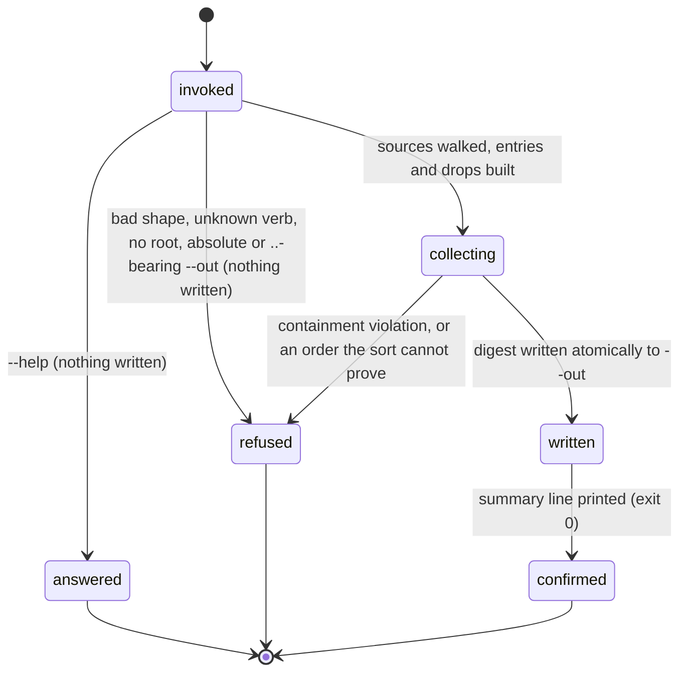

# The feedback digest

## Summary

The feedback digest is the repository's own record of how the work actually went, rolled up into one small, privacy-safe snapshot. Four verbs make it: `bee feedback count` reports what the snapshot would hold and writes nothing; `bee feedback digest` builds it and writes it to `.bee/feedback-digest.json`; `bee feedback collect` produces the merged view; `bee feedback rank` clusters that view and orders the clusters by pain. Everything is derived — the digest is regenerated whole every time, never appended to, so it measures standing friction rather than counting the same friction once per re-observation. Every entry carries exactly six fields and **no free-text field at all**, which is the rule the whole area is built around: the digest is the only artifact meant to cross a repository boundary, and a description field is a leak nobody can filter. The ranked output is the input to `bee-evolving`, the gated loop in which bee improves itself.

## The simple case

The agent wants to know what the repository has accumulated:

```
bee feedback count --json
```

bee walks four sources under the store root, builds one entry per record it recognizes, and answers with counts only — nothing is written:

```json
{ "entries": 931, "dropped": 17, "skipped": 29,
  "by_kind": { "blocked": 1, "closed": 13, "debt": 58, "finding": 272, "friction": 333, … },
  "sources_scanned": [".bee/backlog.jsonl", ".bee/cells", ".bee/decisions.jsonl", "docs/history/learnings"],
  "sources_absent": [] }
```

Without `--json` the same run says `931 entries, 17 dropped (unknown_type: 17).`

`bee feedback digest` does the same work and writes the result to disk. `bee feedback rank` reads it back through the merge step, groups entries whose titles mean the same thing, and answers `888 clusters — top rank 4 (pain 2 × frequency 2 × corroboration 1). 13 retired clusters excluded (closed).` That ranked list is an agenda, not a decision: a human picks from it.

## What is collected

Four sources, always read in the same order, and every read resolved through one containment gate.

| Source | What becomes an entry | `pain` |
| --- | --- | --- |
| `.bee/backlog.jsonl` | every row that is not a `kind:"pbi"` PBI event — the friction, findings, debt, and the rest that [`bee backlog add`](backlog.md) files. `type` → kind, `title`, `layer`, `ts` → `first_seen` | 3 / 2 / 1 for severity `P1` / `P2` / `P3`, else 1 |
| `.bee/decisions.jsonl` | nothing. It is read for presence only, so it appears in `sources_scanned` and contributes no entries | — |
| `.bee/cells/*.json` | one `blocked` entry per cell whose trace carries a `blocked_reason`, and one `deviation` entry per cell whose trace carries a non-empty `deviations` list. `first_seen` is the cell's `capped_at`, else its `claimed_at`; `source` is the cell id | 1 |
| `docs/history/learnings/*.md` | one `learning` entry per file with parseable frontmatter (`critical-patterns.md` excluded). Title and date come from the frontmatter | 3 / 2 / 1 for severity `high` / `medium` / `low`, else 1 |

**Containment.** Each path is followed to its true destination and must still sit under `<root>/.bee/` or `<root>/docs/history/`. A path that resolves outside those two areas stops the command. A path that simply does not exist is *absent, not forbidden*: it is listed in `sources_absent` and costs nothing.

**Nothing blocks generation.** A malformed JSONL line, an unreadable cell, a cell with no execution trace, a learning file with no frontmatter — each is skipped and counted in `skipped`. A repository with no friction, no findings, and no learnings produces a valid empty digest.

## The six fields

An entry carries `kind`, `layer`, `source`, `title`, `first_seen`, `pain`, in that order, and nothing else.

- **`kind`** comes from a closed vocabulary. Seventeen raw type names map onto thirteen canonical kinds — `friction`, `finding`, `debt`, `audit`, `deviation`, `blocked`, `learning`, `proposal`, `outcome`, `approval`, `correction`, `closed`, `harness-issue`. The mapping is idempotent: an already-canonical name maps to itself, so the reader accepts exactly the vocabulary the writer emits. A type outside the table is not discarded quietly — the record is **dropped** with reason `unknown_type` and counted.
- **`layer`** is the free label the filer supplied, or `null`. Frequently absent.
- **`source`** is a cell id or a bee-owned document path. Never project content.
- **`title`** is the short label the filer wrote, capped at 200 characters (the first 199 plus `…`).
- **`first_seen`** is accepted only if it matches a strict calendar shape, otherwise `null`. It is never handed to a lenient date parser, because lenient parsers ignore parenthesised text — which would make a date field a serviceable smuggling channel.
- **`pain`** is a positive whole number, computed once at generation time and never re-judged at read time. If a reader scored pain, two readings of the same digest could rank differently and the ranking would stop being reproducible.

**There is no description, detail, narrative, or reproduction-steps field.** That surface was removed rather than filtered. Measurement showed that a record's descriptive prose is ordinary sentences that happen to name functions, files, and configuration keys — nothing a code-stripping or secret-detection rule can catch — so a filter there would advertise a guarantee it could not keep.

**Dropping.** A candidate whose title matches a credential pattern is dropped with reason `secret`; one that matches an instruction-injection pattern is dropped with reason `injection`; secret takes precedence when both hit. A dropped record keeps only `kind`, `layer`, `source`, `first_seen`, and the reason **category** — never the text that matched. A bare count would not distinguish one careless author from a repository that probes the reader every time it closes a feature.

In this repository the honest picture is that `pain` is 1 for the large majority of entries — plain friction carries no severity anywhere — and every drop is `unknown_type`. The field exists so ranking is possible and deterministic, not because it discriminates well today.

## The interaction, event by event

One `bee feedback digest` invocation — the only one of the four that writes:



### Invoke

`count`, `collect`, and `rank` take only `--json`. `digest` also takes `--out`, a plain relative path; an absolute path, a drive-letter path, or one containing `..` refuses before anything is read. The store root is resolved by walking up to the nearest `.bee/onboarding.json` or `.git`; with neither, the no-root error ends the run — see [invocation](../foundations/invocation.md).

### Ends at once

- `--help` prints the registry entry and exits 0.
- An unknown verb refuses by name and lists the four, exit 1:

  > bee: unknown command `bee feedback add` — `bee feedback` has no `add` verb. `bee feedback` takes: digest, count, collect, rank. FIX: `bee feedback --help` for each verb's flags.

  There is no `bee feedback add`; filing goes through [`bee backlog add`](backlog.md).

- An unusable `--out` gives the generic `bee: unsupported argument shape` refusal. Nothing is read and nothing is written.
- A configured `dogfood_repos` list makes `collect` and `rank` refuse the same way — the cross-repository arm is not built into this binary. See "Open questions".

### First side effect

For `count`, `collect`, and `rank`: there is none. They read and answer.

For `digest`: the atomic write of the built object to `--out` (default `.bee/feedback-digest.json`), written to a temp sibling and renamed. Everything before it — the source walk, the entry build, the two sorts — is pure reading. A reader never sees a half-written digest, and the previous digest is replaced whole rather than merged into.

### While running

Nothing observable. A corrupt store file encountered during the walk emits its own stderr warning (fail-open) and the walk continues.

### Finish

Without `--json`, one line on stderr, then the timing line. `count` says `931 entries, 17 dropped (unknown_type: 17).`; `digest` prefixes it with `Digest written to <path> — `; `collect` prefixes `Merged digest — `; `rank` says `<N> clusters — top rank <r> (pain <p> × frequency <f> × corroboration <c>).` plus, when any exist, `<M> retired cluster(s) excluded (closed).` With `--json`, the payload goes to stdout: the counts object, `{path, digest}`, the merged digest, or `{ranked, retired}`. Exit 0.

The written digest carries `schema_version` (`1.0`), `generated_at`, `repo_label` (the store root's own directory name), `counts`, `dropped`, and `entries`. Two generations from unchanged records differ only in `generated_at`.

## Ranking

`bee feedback rank` groups the merged view by **what a title means**, not by its bytes.

- **The grouping key** is an internal cleaned form of the title: the `«…»` neutralization wrapper stripped to a fixed point, code fences and role-tag markup and control characters removed, then casefolded with whitespace collapsed. That makes a wrapped title and its bare twin — and a double-wrapped one — land in one group. The stored titles keep their wrapping; only the invisible comparison form is cleaned.
- **The score** is `pain × frequency × corroboration`: the group's highest pain, times how many entries it holds, times how many distinct repositories contributed (the local one counts as one). A group whose entries carry no severity scores at the floor of one, never at zero — a hole in the data must not bury a group.
- **The order** is rank descending, then earliest `first_seen` ascending, then the key. The same view always yields the same order on the same machine.
- **A closed group retires.** A cluster containing any `closed`-kind entry leaves the ranked list and is reported in a separate `retired` list carrying a representative stored title and an entry count, so nothing silently vanishes. The convention is append-only and needs no linkage field: appending a `closed` row bearing the same title as the group it retires lands in that group by the comparison above and tombstones it. It exists because the loop's own top-ranked item was once a P1 that had been fixed and closed days earlier, and kept topping the agenda.
- **A retired group recurs** when any non-closed entry's timestamp is strictly newer than the latest close. It re-enters the ranked list carrying `recurred: true`, `closed_at`, and `recurred_count`, with its arithmetic computed over its non-closed entries only. Equal timestamps never count as recurrence. A fix that merges is not proven; closure holds only while the friction stays away.

## The gated self-improvement loop

The ranked list is the input to `bee-evolving` (`skills/bee-evolving/SKILL.md`): a human-invoked loop that runs **only in the bee repository**, never in a host repo and never on its own schedule, and that carries two human gates — the human picks *what* to fix, and later approves *the exact diff* — with the push a deliberate, named, manual step that no standing rule or prior approval ever pre-authorizes.

## Modifiers

| Modifier | Set at invocation | Can it differ mid-flow? |
| --- | --- | --- |
| `--json` | Payload (the counts, `{path, digest}`, the merged digest, `{ranked, retired}`, or `{"error": …}`) on stdout instead of a human line on stderr. | No — one invocation, one mode. |
| Gate-bypass level | No effect. Nothing in this group is gated. The gates that matter are the two human gates inside `bee-evolving`, which no bypass level reaches because they are the skill's own stops, not recorded gates. | No effect. |
| Store phase | No effect on any verb. `feedback digest` writes inside `.bee/`, which the write guard allows in every phase. | No effect. |
| Where it runs | Decides which store root is walked, so a feature worktree digests its own `.bee/` and its own `docs/history/learnings/`. The four sources are resolved from the store root only; `product_root` does not apply. | The walk is where the invocation runs. |
| Who runs it | No effect. In practice the compound step of a feature close refreshes the digest as warn-never-block housekeeping, and `rank` is run by the evolving loop; nothing enforces either. | — |

## Cancel and interrupt

Columns: before and after the digest write (the first side effect). `count`, `collect`, and `rank` never reach the second column — they write nothing at all.

| Event | Before the write | After the write |
| --- | --- | --- |
| The process killed mid-command | Nothing recorded; the previous digest is untouched. A temp sibling may remain. No lock is held — the digest takes none. | The rename is atomic, so the new digest is simply there. |
| The session turning elsewhere (compaction, handoff, turn end) | Nothing owed. The digest is derived, so a lost run costs only the run: the next one rebuilds it from the same records. | Same. |
| A clean completion from outside (gate approved, question answered, new message) | No effect. | No effect. |
| The store unavailable (corrupt JSON, unreadable file, hook binary missing) | Corrupt records warn and are skipped-and-counted; generation cannot fail on bad input. A path that resolves *outside* the two permitted areas does stop the command, and surfaces as the generic shape refusal. | An already-written digest is unaffected by later damage to its sources; it is a photograph, and the next run takes a new one. |
| The session going away (heartbeat expiry, lease expiry, `session release`) | No effect — no leases, no claims, no locks. | No effect. |
| A sibling changing the target | Two digests written at once race on the same output path; the last rename wins and both are complete objects. A sibling appending to `.bee/backlog.jsonl` mid-walk means its row is in this digest or the next one — never half in. | A sibling can overwrite the digest immediately after; nothing is lost, because it is derived. |
| The channel changing (piped, `--json`, Codex, run from a hook) | Same behavior; `--json` moves the payload to stdout, and store warnings stay on stderr so the JSON stays parseable. | Same. |

Because the digest is regenerated whole, no interrupt ever leaves it half-correct: it is either the old snapshot or a new one.

## Interactions with other systems

**Gates and approval.** No recorded gate guards any of the four verbs. The two approvals in this area live in `bee-evolving` and belong to the human; a ranked list never authorizes a change.

**The store and history.** The digest is a derived record in the store, not an event log — it is the one `.bee/` artifact that is deliberately rewritten rather than appended to. Its sources are the append-only logs and the cell records. It is written by `bee feedback digest` and is not in the direct-edit guard's deny table.

**Worktrees and containment.** Containment is the point: the walk refuses to open anything outside `<root>/.bee/` and `<root>/docs/history/`, after following links to their true destination rather than comparing path names. See [worktrees](../foundations/worktrees.md) for which root a given checkout resolves.

**Claims, holds, and reservations.** None. No lock is taken by any of the four verbs.

**Sibling sessions.** Siblings share the sources and the output path. Nothing coordinates, and nothing needs to: every run is a fresh read.

**What the human sees.** Nothing at generation time — the digest is telemetry, produced as a side effect of closing a feature and never blocking it. The human's view is the evolving loop's Gate A rendering: each cluster's representative **stored** title copied byte for byte, its rank terms, and its contributing source ids. The internal comparison key is never rendered, because rendering it would undo the neutralization the reader applied.

**Configuration.** `dogfood_repos` is the one key this area owns: the list of repositories whose already-written digests the maintainers' repository would merge. Left empty, `collect` returns the local digest with `merged: []` and `merged_counts` all zero. Non-empty, it does not work in this binary — see "Open questions".

**Output modes and exit codes.** The standard contract, owned by [invocation](../foundations/invocation.md): 0 on success, 1 on refusal; `--json` puts payloads and `{"error": …}` on stdout. All four verbs exit 0 on an empty repository.

## Edge cases

- `.bee/decisions.jsonl` contributes no entries at all. It is scanned for presence, so it appears in `sources_scanned` while adding nothing — reading a decision as feedback would double-count agreements the workflow already honors.
- A cell with both a `blocked_reason` and a non-empty `deviations` list yields **two** entries with the same title and source, one `blocked` and one `deviation`. They then cluster together and count as frequency 2.
- A cell whose id is missing or empty falls back to its relative path as the entry's `source`.
- `oversize` is a documented drop reason that nothing can currently produce: an over-long title is shortened rather than dropped.
- Records filed through `bee backlog add` cannot reach `unknown_type` — that intake validates the type first. Every `unknown_type` drop therefore names a row written by some other hand, which is itself worth reading.
- `--out ""` is treated as absent and falls back to the default path.
- `feedback rank` on a repository with no entries answers `0 clusters — no clusters.` and exits 0.
- Two entries whose titles differ only by accent composition (composed versus decomposed) form two clusters, not one.
- A title that is nothing but wrapping marks can collapse toward the empty comparison form and cluster with other empties.

## Open questions and verification

- **The cross-repository arm is not built into this binary.** A non-empty `dogfood_repos` makes `bee feedback collect` and `bee feedback rank` return the generic `bee: unsupported argument shape` refusal, because the foreign-digest path — re-validation, the strict date check, and the `«…»` neutralization — was never ported. The knowledge area documents that boundary as live behavior. Every claim here about merging, re-validating, and neutralizing a foreign digest therefore describes a design that the current binary refuses to execute. Filed in [bug-triage.md](../bug-triage.md); not probed, because probing needs a second repository and a config change.
- **The default output path carries a Windows separator.** The default is the literal `.bee\feedback-digest.json`. The writer splits on both separators, so on Linux the file still lands at `.bee/feedback-digest.json` — but the printed line and the `path` field in `--json` show the backslash. Read from code, not run.
- **The sort is proven per run, and an unprovable order refuses.** Entry and drop lists are sorted by a key that embeds free-prose titles; the port sorts with a calibrated model and then requires every adjacent pair to be confidently ordered, refusing (again with the generic shape refusal) when it cannot prove the result. `feedback rank` answered normally over 931 entries here, so the guard passes on this corpus; what an unprovable title looks like was not established.
- **The area's own overview names `bee feedback add`**, which does not exist. Filing is `bee backlog add`, and the unknown-verb refusal says so.
- **The cluster `key` is still in the machine-readable output.** The ranked groups carry the neutralization-stripped comparison form alongside the stored title, so a consumer that dumps the payload into a prompt re-exposes what the reader stripped. Keeping it out rests on the evolving skill's written instructions, not on the tool. Recorded in the area's own open gaps; repeated here because it is visible in `--json`.
- **Nothing in the binary fires the close-time refresh.** The refresh is an instruction in the capture skill's compound step ("warn-never-block"), not a step `bee close` performs. Whether a close that skips it is noticed anywhere was not determined.
- The credential and injection pattern sets were read as "exist and drop" and are pinned by vectors in the module's own tests; their coverage was not enumerated, and the area itself records that detection is heuristic.
- Confirmed by running the binary in this repository: `feedback count` with and without `--json`, `feedback collect`, `feedback rank`, the unknown-verb refusal, the bad-`--out` refusal, and the exit code of each. `feedback digest` was not run, because it writes.

Verified against beehive commit `6b0ae488`.
