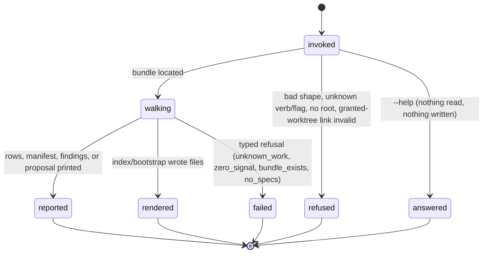

# The knowledge bundle

## Summary

The knowledge bundle is bee's recorded state layer: a tree of Markdown *concepts* under `docs/knowledge/`, each carrying OKF frontmatter, that an agent reads before it reads code. Eight verbs surround it. Three consume it — `search` pulls a symptom out of it mid-flow, `context` assembles a budget-capped reading manifest for a work item, `list` enumerates what is in it. Three grade or maintain it — `check` validates it against bee's OKF profile, `index` regenerates the generated index files, `report` measures how often the bundle's critical patterns keep recurring. One proposes additions without making them: `promote` mines a finished feature's capped cell traces and prints a delivery draft, area bullets, and pattern candidates, and writes nothing. One stands the bundle up where none exists: `bootstrap` imports `docs/specs/*.md` into one area concept each. Seven of the eight are read-only; `index` and `bootstrap` are the only writers, and neither takes a gate, a claim, or a lock. Once the bundle exists, `docs/specs/` becomes a read-only compatibility surface: new truth is written as a concept, never as a spec page.

## The simple case

An agent hits an error mid-flow. Before re-deriving anything, it pulls the bundle:

```
bee knowledge search --text "connection refused"
```

bee prints up to five rows, ranked, each naming what matched and where:

```
docs/knowledge/areas/human-mailbox/overview.md — Human Mailbox — the letter an unattended run leaves behind — "refused" (body)
docs/knowledge/patterns/20260825-a-guard-that-cannot-pass-teaches-agents-to-ack-it.md — A guard that cannot pass teaches agents to ack it — "refused" (body)
```

The agent reads the files it wants. Nothing was written and no state moved.

Starting a feature is the other common entry. The session preamble already named the command; the agent runs it:

```
bee knowledge context --work human-mailbox --lane standard
```

bee answers with an ordered manifest — path, bytes, estimated tokens, and one line saying why each entry is in the list — cut at the lane's token budget. It is a reading list, never file content; the agent decides what to open.

At the far end of the feature, `bee close` runs `promote` on the agent's behalf, writes the proposal to `docs/history/<feature>/promote-proposals.md`, and files a capture stub pointing at it. The proposal sits there until somebody applies what belongs in the bundle or records why not.

## The interaction, event by event

All eight verbs share one frame: resolve the store root, locate the bundle, walk it, answer.



### Invoke

The argv is matched against the verb's exact accepted shape. Every verb takes `--json`; beyond that, `check` takes `--strict`, `index` takes `--check`, `list` takes `--type`/`--lifecycle`/`--area`, `context` takes `--work` plus `--budget` or `--lane`, `search` takes `--text` plus `--limit`, `promote` takes `--work`, and `bootstrap` and `report` take nothing else. Any other flag refuses by name.

The store root is resolved by walking up from the working directory; with no root the invocation ends with the no-root error and exit 1 (see [invocation](../foundations/invocation.md)). The knowledge group uses the *wide* root door — the one audited to read nothing but the store root — so unlike the control-plane verbs it is **served inside a granted worktree**, against that worktree's own `docs/knowledge/`. The bundle directory is `docs/knowledge/` under the product root.

### Ends at once

- `--help` on any verb prints its registry entry and exits 0.
- An unknown verb refuses by name and lists all eight: `bee: unknown command 'bee knowledge bogus' — 'bee knowledge' has no 'bogus' verb. 'bee knowledge' takes: check, index, list, context, search, promote, bootstrap, report.`
- An unknown flag refuses and names it: `… names unknown flag --bogus`.
- A missing required flag refuses with the usage and an example: `bee: missing required argument(s) for 'bee knowledge search': --text. USAGE: bee knowledge search --text <string>.`
- A flag value outside the accepted grammar — `--budget 0x10`, `--strict=x`, `--limit 0` — collapses into the generic `bee: unsupported argument shape` refusal, whose fixed text says "Its required arguments are all present" (see "Open questions").
- `knowledge bootstrap` in a repo that already has a bundle refuses `bundle_exists` before reading anything for writing; with no `docs/specs/*.md` it refuses `no_specs`. Both are zero-write, exit 1.

### First side effect

Six verbs never have one. For them, "first side effect" is the timing line and nothing else.

- **`knowledge index`** (without `--check`) renders every expected index file in memory, then writes them one at a time, top-down in path order. The first write is the first side effect; a failure part-way through leaves the earlier files written and answers with the io error, exit 1.
- **`knowledge bootstrap`** writes one `docs/knowledge/areas/<slug>/overview.md` per classifiable spec, in filename order, and then renders the indexes over what landed. The first area file is the first side effect.
- **`bee close`**, not a knowledge verb, is the third writer on this path: it runs `promote` internally and writes `docs/history/<feature>/promote-proposals.md`.

No knowledge verb takes the store lock; no knowledge verb writes into `.bee/`.

### While running

The walk never leaves `docs/knowledge/`: symlinks are skipped rather than followed, and a `required_context` or `sources` target that resolves outside the bundle is simply not treated as a bundle path. `index.md` and `log.md` are reserved names and are never concepts. A file with missing or unparseable frontmatter still exists to the walk — `list` rows it with null fields, `check` grades it, `search` and `context` rank it on whatever text it has.

A concurrent invocation sees whatever is on disk at that instant. Two `knowledge index` runs racing produce the same bytes (the render is deterministic — path-sorted, LF endings, no timestamp), so the race has no visible loser.

### Finish

Without `--json`: the rows or the report text on stdout, then the timing line `[bee] knowledge <verb> <N>ms` on stderr. With `--json`: the payload on stdout instead. Exit 0 on success; exit 1 for `check` with findings at its level, `index --check` with drift, a typed refusal, or an all-gaps `bootstrap`.

## The eight verbs

| Verb | What it answers | Writes | Non-zero exit when |
| --- | --- | --- | --- |
| `search --text <terms> [--limit N]` | Which patterns and areas mention this symptom, and why each matched | no | never (a miss is exit 0) |
| `context --work <id> (--budget N \| --lane L)` | What to read before touching this feature's code, cut to a token budget | no | `unknown_work`, `bad_budget`, `zero_signal`, `conservation` |
| `list [--type T] [--lifecycle L] [--area A]` | One row per concept: path, id, type, lifecycle, title | no | never |
| `check [--strict]` | Is the bundle valid against bee's OKF profile | no | any OKF or profile error; with `--strict`, any finding |
| `index [--check]` | Regenerate the generated index files, or report drift | yes (without `--check`) | drift under `--check`; a write failure |
| `report` | How often each critical pattern recurred, and where patterns sit on the evidence ladder | no | never |
| `promote --work <id>` | What knowledge this finished work earned — as a proposal | **never** | `unknown_work` |
| `bootstrap` | Stand up a bundle from `docs/specs/*.md` | yes | `bundle_exists`, `no_specs`, or no spec classifiable |

### What the bundle holds

Three top-level sections, each with a generated `index.md`: `areas/` (durable subject truth, one directory per area), `patterns/` (lessons, one file each), and `work/<id>/` (a feature's work item, plan, and delivery). Nine concept types exist — `bee.area`, `bee.feature`, `bee.work-item`, `bee.plan`, `bee.delivery`, `bee.decision`, `bee.pattern`, `bee.runbook`, `bee.evidence`.

Two frontmatter fields carry most of the weight. `bee.critical: true` marks a pattern as a universal lesson: the root index lists it under "Critical patterns", `context` ranks it into every manifest's floor, and `report` measures it. `bee.areas` is membership, and an area's own `areas/<area>/overview.md` carries the ownership map — `owns.code`, `owns.skills`, `owns.tests`. That map is read outside the knowledge verbs: `bee capture add --area <a>` refuses without a `--skill-answer` when the named area owns skills, so a settlement in a skill-owning area cannot be filed without saying whether the skill changed (see [the capture queue](capture.md)).

### How `context` picks

`--work <id>` resolves to an **anchor** through a four-rung ladder, and the ladder is why the verb works for almost every feature, not only the few with a work-item concept:

1. a `bee.work-item` concept whose `bee.id` matches;
2. `docs/history/<id>/CONTEXT.md` and `plan.md`, whichever exist;
3. the *ledger* rung — the feature's most recent `.bee/logs/scribing-runs.jsonl` entry, a bare `.bee/lanes/<id>.json` record, or any other file under `docs/history/<id>/`;
4. a `.bee/backlog.jsonl` PBI row whose id or feature matches.

Nothing at all is the `unknown_work` refusal. The session preamble asks the *same* resolver, so the command it prints is one that will work, and it names the anchor kind it resolved: `` `.bee/bin/bee knowledge context --work f1 --budget 20000` (anchor: work-item) ``.

Ranking is then fixed: (1) the work item or the anchor's own text, (2) the plan sibling in the same `work/<id>/` directory, (3) `bee.required_context` walked transitively in breadth-first order (a cycle dedupes silently; a dangling link is tolerated — grading it is `check`'s job), (4) the critical patterns, ranked by relevance and cut, (5) every `bee.decision` concept whose areas overlap the work item's.

Relevance is the IDF-weighted fraction of a concept's own distinctive vocabulary that the work item's text covers, over title/description/tags and body, plus a small tag and area bonus. The top three criticals are a **floor**: their cost is reserved out of the budget left after rank 1, so a universal lesson is never evicted by a long `required_context` chain, and the work item is never displaced by its own floor. The keep is 20; ranks past it are `excluded` with their score and the reason. Sizes are estimated as bytes/4 and the output names that estimator — bee vendors no tokenizer.

Nothing is dropped silently. Every critical pattern is accounted for exactly once across `entries`, `truncated`, and `excluded`, and a run where that conservation fails refuses rather than prints. So does a run where most criticals tie at zero relevance against a work-item anchor (`zero_signal`) — a ranking that mostly ties at zero is a path sort wearing a relevance label. A history, ledger, or backlog anchor carries no tags or areas of its own, so it reports `zero_signal_count` and never refuses on it.

Budgets by lane: tiny 8000, small 12000, standard 20000, high-risk 30000. An explicit `--budget` always wins over `--lane`.

### How `promote` proposes, and how a proposal is applied

`promote` reads the work item (or its anchor) and the **capped** cell traces of that feature from `.bee/cells/*.json` — a read of the runtime store, never a write into it — and prints three sections:

- **(a) a delivery draft**: a complete `bee.delivery` concept in canonical emitter form, ready to save as `docs/knowledge/work/<id>/delivery.md`, carrying what shipped (each cell's recorded outcome), how it was verified (each cell's recorded verify command and evidence), and every recorded deviation;
- **(b) area updates**: candidate spec-sync bullets per area, each citing its cell and its trace file;
- **(c) pattern candidates**: for each capped cell whose trace carries a deviation or a failure signature, a candidate `bee.pattern` with `bee.polarity: pitfall` and `bee.lifecycle: draft`, quoting the trace verbatim.

Every proposed line traces to a cell trace or the work item; nothing is invented. `writes` in the JSON payload is always `[]`, and the human text says so at the top: `PROPOSAL ONLY — nothing was written.`

Proposals normally arrive without anyone running the verb. A green `bee close`, past the tests door and the scribing-debt door, runs `promote` for the feature *before* retiring its cells (retirement moves them into `.bee/cells/archive/`, where the mine would find nothing) and then does three things: writes the rendered proposal to `docs/history/<feature>/promote-proposals.md`, appends a capture stub to the capture queue naming that file, and enqueues a `promote` record in the deferred queue. Close reports one line — `Promote proposed for "<feature>": N capped cell(s) mined, M area bullet(s), K pattern candidate(s)` — and the door is **soft**: a failure to mine or write degrades to `Promote skipped for "<feature>": <reason>` and close proceeds.

Applying a proposal is a human or agent decision, and it is a plain file write: author the delivery concept, edit the area document, save the pattern. Declining is equally explicit — record why not. Either way the proposal is *cleared* through the queue records, not by deleting the file. Until one of them clears, `bee orient` and the session preamble carry the debt: `### Unapplied promote proposal(s): 2 — newest: docs/history/f2/promote-proposals.md — review the proposal, then apply what belongs to docs/knowledge/ or record why not.` The file itself is kept as the audit trail either way.

### The index, and what grades the bundle

`knowledge index` renders one `index.md` per directory level whose subtree holds at least one concept, plus the root. Every generated file opens with an HTML-comment header saying it is generated and how to regenerate it; the root additionally carries the sole `okf_version` frontmatter and a "## Critical patterns" section over every `bee.critical: true` concept. The render is byte-identical for identical contents — path-sorted entries, LF endings, never a timestamp. `--check` re-renders in memory and byte-compares against disk, naming each stale file and exiting non-zero: the same freshness idiom as `bee decisions render --check`, and part of the declared verify chain.

`knowledge check` grades at two levels. **OKF errors** are structural: an unreadable file, missing or unparseable frontmatter on a non-reserved `.md`, an empty or absent `type`, frontmatter on a non-root `index.md`, a root `index.md` carrying any key but `okf_version`, a `log.md` date heading that is not ISO 8601. **Profile errors** are bee's own additions: a duplicate or malformed `authoritative_for`, `duplicate_rule_home`, `unknown_rule_ref`, `applied_at_unlinked`, `owns_missing`, `dangling_applied_at`, `dangling_owns`. **Profile warnings** are softer: a type outside the nine, a missing profile-required field, a dangling `required_context`/`sources`/`supersedes` target, a duplicate `bee.id`, an unrecognized `bee.evidence` value, and `not_canonical` — a parse-then-re-emit byte mismatch, the round-trip guard against a silent misparse. Errors fail; `--strict` promotes every warning to a failure.

`check`'s findings are re-used, not re-derived, by [close](../lifecycle/close.md)'s knowledge-freshness door. That door filters the same warnings down to what the closing feature can fairly be asked to own — `areas/<touched-area>/` plus `work/<feature>/` — and blocks on `dangling_source` and `dangling_required_context` there. `not_canonical` and `invalid_evidence_state` stay report-only. The escape is a logged decision tagged `knowledge-freshness-deferral` naming the feature.

`knowledge report` measures instead of grading. An author may give a critical pattern a `bee.signature`: a deterministic, grep-able incident string. For each critical pattern that carries one, `report` counts the `.bee/decisions.jsonl` entries and `.bee/capture-queue.jsonl` stubs whose text contains that signature as a **literal** substring — never lowercased, never term-split — and whose own date is strictly after the pattern's timestamp, compared by calendar day. Same-day entries do not count, so the incident that produced the pattern is never counted as its own recurrence. A critical pattern with no signature is listed under `unmeasured` and never guessed at. The same run also prints an **evidence ladder** over every `bee.pattern` concept, critical or not: how many are `present` (doc-only), `wired` (to an enforcer), or `exercised` (by a test), plus the present-only list — the grooming signal for patterns that never got teeth.

### `bootstrap`, and the read-only fence around `docs/specs/`

In a host repo with no bundle, `bee knowledge bootstrap` imports `docs/specs/*.md` — top level only, no recursion, no code scanning — into one `bee.area` concept each. Title comes from the spec's first ATX heading, description from the paragraph after it, and the spec body is copied verbatim beneath fresh OKF frontmatter that cites the spec as its source. The generated indexes are rendered by the same machinery `knowledge index` uses; there is no second renderer. A spec that cannot be classified — no heading, a filename that slugs to nothing, a slug that collides with an earlier spec, an unreadable file — is skipped and named as a `GAP` rather than failing the run, and a run where *every* spec gapped writes nothing and exits 1. The moment the first area concept lands, the repo is in bundle mode, and every surface that asks "does this repo have a bundle?" — the session preamble's project map, `bee close`, the specs fence — flips with it.

That flip closes the spec tree. Once a bundle exists, `docs/specs/` is a **compatibility surface**: kept alive so existing citations keep resolving, read-only for new content. Every file in it is classified structurally, never by filename — a *pointer stub* (frontmatter carrying the migrated-to marker and its anchor map), the one named-exception navigation map, or a pinned placeholder that is provably still unwritten. Anything else fails by name. The fence is a test in the declared suite, so the declared test command *is* its wiring; a repo with no bundle never sees it at all.

## Modifiers

| Modifier | Set at invocation | Can it differ mid-flow? |
| --- | --- | --- |
| `--json` | Payload on stdout instead of the text report on stderr/stdout: `{concepts,count}`, `{text,results,count}`, the full manifest, `{okf,profile,counts}`, `{written,count}` or `{checked,stale,drift}`, `{measured,unmeasured,evidence_ladder,…}`, the whole proposal, `{created,gaps}`. Errors ride as `{"error": …}`. | No — one invocation, one mode. |
| Gate-bypass level | No effect. No knowledge verb is gated in either direction. | No effect. |
| Store phase | No effect on any verb. The phase does decide what the [guards](../foundations/guards.md) allow the agent itself to write into `docs/knowledge/`: in a gated phase the allow-list is `.bee/`, `docs/history/`, `plans/`, `AGENTS.md`, so authoring a concept before the execution gate is denied; at idle or a terminal phase the blanket `docs/` applies. | No effect. |
| Where it runs | The bundle read is whichever product root the invocation resolves. This group takes the wide root door, so it is served in an ungranted *and* a granted worktree — a granted worktree reads its own `docs/knowledge/`, which may differ from main's mid-feature. | The read is where the invocation runs. |
| Who runs it | No effect. `search` is everyone's mid-flow move; `context` is the orchestrator's and every worker's opening read; `check`/`index --check` are the verify chain's; `promote` is usually `bee close`'s, internally, rather than anyone's typed command. Nothing enforces that split. | — |

## Cancel and interrupt

Columns: before and after the first write. Only `index` (without `--check`) and `bootstrap` have one; for the other six verbs the "before" column is the whole story.

| Event | Before the first write | After it |
| --- | --- | --- |
| The process killed mid-command | Nothing written; the bundle is untouched. A killed read leaves no trace but a missing timing line. | Some index or area files landed and others did not. Both are self-healing: re-run `knowledge index` (deterministic, idempotent), or re-run `bootstrap` — which will now refuse `bundle_exists`, so the repair is `index` plus hand-authoring the missed areas. |
| The session turning elsewhere (compaction, handoff, turn end) | No effect — every verb is one invocation, and the manifest or rows already printed are the agent's to re-read. A compacted session re-runs `knowledge context` rather than remembering it. | Files written stay written; nothing needs unwinding. |
| A clean completion from outside (gate approved, question answered, new message) | No effect. A gate approval can change what the agent is *allowed to write* next, never what these verbs read. | No effect. |
| The store unavailable (corrupt files, missing bundle) | Reads are total: a missing bundle directory is an empty bundle, a corrupt concept is a null-field row and a `check` finding, a torn `.bee/*.jsonl` line reads as zero rows for `report`. A configured non-empty `product_root`, or a config file bee cannot parse, drops the verb into the generic shape refusal (see "Open questions"). | A write failure mid-`index` answers with the io error and exit 1, leaving the already-written files in place. |
| The session going away (heartbeat, lease expiry, release) | No effect — no knowledge verb holds a lease, a claim, or a lock. | No effect. |
| A sibling changing the target | A sibling editing the bundle mid-walk is read as whatever is on disk at that moment; there is no lock and no conflict answer. A sibling that merges a worktree underneath changes what the next run sees, not this one. | Two concurrent `index` runs write identical bytes, so the race has no loser. A sibling that authored a concept between the render and the write loses that concept's entry until the next `index`. |
| The channel changing (piped, `--json`, Codex, run from a hook) | Same behavior; `--json` moves the payload to stdout. The runtime is irrelevant — no knowledge verb has a hook event of its own. | Same. |

After any interrupt the bundle is exactly what the files say; there is no half-state to clean up.

## Interactions with other systems

**Gates and approval.** None of the eight is gated, and none approves anything. The bundle's own approval-shaped moment is elsewhere: applying a promote proposal is a decision, and declining it is a recorded one.

**The store and history.** The bundle is *not* in the store — it lives under `docs/knowledge/`, in git, edited like any other source. That is deliberate: it is reviewable, diffable, and merges through the same worktree flow. The verbs reach into `.bee/` only to read: `promote` reads capped cell traces, `report` reads the decisions log and the capture queue, `context`'s ledger and backlog rungs read the scribing ledger, lane records, and the backlog. Nothing in the group writes into `.bee/` — the writes that follow a promote proposal are `bee close`'s. See [the store](../foundations/store.md).

**Worktrees and containment.** One bundle per checkout, resolved off the product root. This group is served in a granted worktree, so a feature worktree grades and reads *its own* bundle — and a `knowledge index` run there lands in that worktree's tree, to be merged like any other change.

**Claims, holds, and reservations.** None. No lock, no lease, no reservation. A worker that intends to author a concept reserves the file like any other file it writes; the verbs themselves reserve nothing.

**Sibling sessions.** All siblings read the same tree and coordinate through git, not through bee. Two sessions authoring in the same area conflict as a merge conflict, not as a bee refusal.

**What the human sees.** Indirectly, and constantly. The session preamble names the bundle in the project map (`Knowledge bundle: docs/knowledge/ … Bundle holds: N area(s), M concept(s)`), offers the search move in one line, prints the knowledge-context command with its resolved anchor kind for the active feature, and carries the unapplied-promote-proposal count. `bee close` reports the promote line. Beyond that the human sees the bundle as files in a diff.

**Configuration.** One key matters: a configured non-empty `product_root` moves the bundle (and the compatibility surface) to the product tree — and, today, makes the native verbs refuse (see "Open questions"). No per-hook toggle touches this group.

**Output modes and exit codes.** The standard contract, owned by [invocation](../foundations/invocation.md): 0 on success, 1 on refusal, error, or a failing grade; `--json` puts payloads and `{"error": …}` on stdout; the timing line trails on successes, help, and verb-owned errors, not on shape refusals.

## Edge cases

- A zero-hit `search` is exit 0 with `No knowledge results matching "<text>".` — a miss is data mid-debug, not an error. An absent bundle directory reaches the same path.
- `search --limit` only widens. The default is 5; a value below 1, or a non-numeric one, refuses rather than narrowing.
- `search` deduplicates its query terms, so repeating a term cannot inflate its own hit count. The `why` clause names only terms that actually hit.
- `search`'s corpus is patterns and areas only. `bee.decision` concepts are `decisions search`'s corpus and are never double-reported; `index.md` and `log.md` are never concepts to begin with.
- `list` deliberately rows a concept with unparseable frontmatter, with null fields. Hiding files is not its job; grading them is `check`'s.
- `list` filters are exact string matches, including the empty string: `--area ""` matches only a concept whose `bee.areas` literally contains `""`.
- `context` treats a `required_context` cycle as a dedupe, not an error, and tolerates a dangling or out-of-bundle link.
- A `context` entry that is already in via `required_context` is never re-cut as a critical: it keeps its earlier rank and reason.
- `context` on a history anchor sizes and ranks the `docs/history/` files themselves as entry rank 1, and its `decisions` header stays empty — a history anchor has no `bee.decisions` list of its own.
- `promote` on a work item that declares no `bee.areas` proposes an empty area-updates section and says so. If a scribing-ledger stamp supplied the area list instead, attribution switches to feature grain — every capped `behavior_change` cell is attributed to every stamped area — and the render says which rule it used.
- `promote`'s `unknown_work` message names only the missing work-item concept, even though three further anchor rungs were also tried.
- `bootstrap` strips a host spec's own frontmatter before importing the body: a host dialect is not assumed to be OKF-shaped, and v1 does not carry it across.
- `bootstrap` folds `Doctrine Layer.md` and `doctrine_layer.md` to the same slug; the second is a gap, not an overwrite.
- `index` writes the same bytes it would have checked, so `index` immediately after `index --check` reporting `OK` is a no-op in content, though it does touch every file's mtime.
- `report` counts a signature hit in either the decisions log or the capture queue; a `flush` row in the queue is never a stub and is skipped.
- An empty or malformed pattern `timestamp` excludes every entry from being "after" it — the safe direction: a recurrence is never guessed.

## Open questions and verification

- **Suspected bug: `--check=true` writes.** `bee knowledge index --check=true` takes the *write* path and renders every index file, because a boolean flag given the string `"true"` passes validation but is not `=== true`. The same holds for `--strict=true` on `check`, and `--check=false`/`--strict=false` behave identically. Observed by hand: `bee knowledge index --check=true` printed `Rendered 35 generated index file(s) under docs/knowledge/.` A read-only spelling of a flag silently becoming a write is worth filing. Belongs in [bug-triage.md](../bug-triage.md).
- **Suspected bug: semantic refusals collapse into the generic shape refusal.** `--budget 0x10`, `--strict=x`, and `--limit 0` all answer `bee: unsupported argument shape … Its required arguments are all present`, which explains nothing about the value that was rejected. These are the same retired-delegation arms [the capture queue](capture.md) documents: the paths existed to hand the error text to a Node binary that no longer exists. The same arm covers a configured non-empty `product_root` and a config file bee cannot parse — meaning a repo that separates its workshop from its product may find the whole knowledge group answering with a shape refusal. Not probed; it needs a `product_root` config to confirm, and it is the highest-value item on this page's verification list.
- `knowledge context`'s `unknown_work` text says "no `bee.work-item` concept in `docs/knowledge/` carries `bee.id` …", but the resolver also tried `docs/history/<id>/`, the scribing ledger, the lane record, and the backlog. The message names one of four rungs, so an agent reading it is pointed at the wrong remedy. Confirmed by hand against `--work zzz-nope`.
- `knowledge report`'s registry entry documents `{measured,unmeasured,measured_count,unmeasured_count}` and says nothing about the evidence ladder, which the verb prints and includes in the payload as `evidence_ladder`. Documented surface and shipped surface disagree; which is stale was not determined.
- Whether `bee knowledge index`'s own writes are ever evaluated by the write guard (the guard intercepts the agent's tool calls, not the binary's file writes) was reasoned from the guard's allow-lists, not probed. Running `bee knowledge index` from a gated phase, where hand-authoring `docs/knowledge/` is denied, is the test.
- The conservation and `zero_signal` refusals in `context` were read in code and their thresholds noted (population ≥ 10, more than half at zero); neither was triggered by hand.
- `bootstrap`'s happy path was not run — this repo has a bundle, so every local run takes the `bundle_exists` refusal. Everything about the fresh-host path is read from code and its unit tests.
- The `docs/specs/` fence was read from `docs/knowledge/areas/okf-profile/specs-read-only-fence.md` and its pointers; the classifier itself (`packages/bee-rs/crates/bee/tests/specs_fence.rs`) was not run. That concept records the fence being **absent** for a period after a runtime cutover while this page went on describing it as running — worth knowing when trusting it.
- Confirmed by running the binary in this repo: `search` (hit, miss, `--limit`, missing `--text`), `list --json`, `check` and `check --strict` with their exit codes, `index --check`, `report` and its JSON counts, `context` against a work-item anchor and a history anchor with `--lane`, `context` with an unresolvable id, `promote` against a history anchor, `bootstrap`'s `bundle_exists` refusal, unknown-verb and unknown-flag refusals, and `--help`.

Verified against beehive commit `6b0ae488`.
