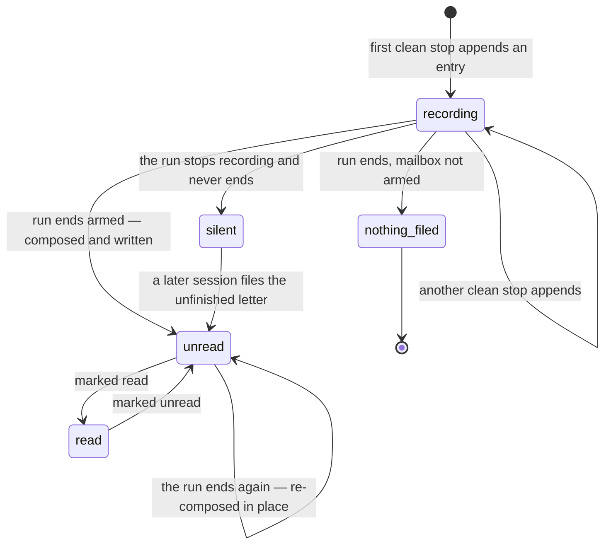
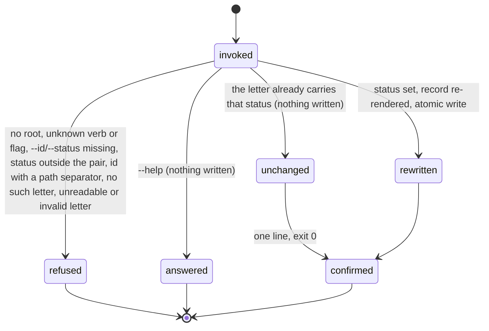

# The human mailbox

## Summary

The human mailbox is the one plain-language letter an unattended run leaves behind. While a run works, every clean stop appends a raw *entry* — one JSON line carrying the sentence somebody wrote at the moment of the stop, the files, the commit, the proof line, and any departure from the plan. When the run ends, those entries are composed into one markdown *letter* under `.bee/human-mailbox/`: typed frontmatter for a consuming inbox, prose sections for the human. One letter maps to one run, never to one night. The composing pass is a renderer under an authorship ban — it may reorder, group, and drop, and may never state a fact no stored entry carries — so the letter is trustworthy rather than comprehensive. bee ships no way to list, render, or open a letter: the human opens the file, and the whole surface bee exposes to a consumer is `bee mailbox mark`, which flips the read state bee owns inside the file.

## The simple case

The human arms the unattended loop by hand (`touch <main-root>/.bee/tmp/bee-herding.enable` — the enable marker) and goes to bed. The agent works. Each time a cell is capped, the cap appends one line to `.bee/human-mailbox/entries/<run-slug>.jsonl` — nothing is printed, nothing is gated, and a failure to append never turns a landed cap into a refusal.

At the end of the run — the moment the session's work record reaches `done` or `dropped` — bee reads that one file back, composes the entries into a letter, and writes it:

```
.bee/human-mailbox/20260826T031500Z-a3f1c9d2e7b4.md
```

The frontmatter carries `subject`, `run`, `project`, `filed_at`, `status: "unread"`, `items[]`, and `needs_you[]`. The body carries the sections that have something to report. The subject is not written by the composing pass; it is *chosen* — the first stored sentence that reads as a plain inbox row on its own, taken verbatim.

In the morning the human opens the file. Nothing is needed to read it. A consuming inbox in another project lists the directory (by design, the directory listing is the index), parses the frontmatter, and when the human has read the row it calls:

```
bee mailbox mark --id 20260826T031500Z-a3f1c9d2e7b4.md --status read
```

bee answers `Marked 20260826T031500Z-a3f1c9d2e7b4.md read.` and rewrites the same file with one field changed.

## The interaction, event by event

### A letter's life



**Appending at a clean stop.** Three stops are named: a cell capped, a feature closed, a blocker hit. Two are wired. `bee cells cap` and `bee cells finish` share one door and append a `cap` entry after the cell file is written and the claim released — the stop has already happened, and nothing about the mailbox may undo it. A non-dry-run `bee close` appends a `feature-close` entry on its tail, carrying three extra lists read out of the feature's own capped cells (the files the feature touched, each capped cell's acceptance, and the skills and specs those cells declared they affect). The blocker stop has a name and a constant and no call site: `bee cells block` appends nothing today. Deliberately not stops: `cells drop`, `cells unclaim`, `cells reopen`, and `bee close --dry-run` — a letter reports what a run did.

The append is unconditional. Every session appends, attended or not, so a session that starts attended and becomes an overnight run carries its whole span into the letter it eventually files. It is one `O_APPEND` write of one short line, no lock, parents created on the way.

**The run an entry belongs to.** A run is a *session's* span — not a night, and not a herding job. The run id is the session id, resolved through the ordinary chain (`--session`, then `BEE_SESSION_ID`, then `CLAUDE_CODE_SESSION_ID`, and at a cap the claim's own recorded session as a last resort). With none of those it is the literal `unattributed`. One unattended night dispatches many jobs; a letter per job would shatter the night the record exists to keep whole.

**Arming.** Two existing signals, both required: a non-empty `herding` block in the merged config (this checkout *can* run unattended — the seeded host config has one) and the owner's enable marker at `<main-root>/.bee/tmp/bee-herding.enable` (this run *is* unattended). Arming is asked only at the end of a run, never at a stop. In a freshly onboarded host repo with the loop never enabled, entries accumulate and no letter is ever filed.

**Composing and filing.** At the end of an armed run the entries are read back, folded in append order, and turned into one letter. Every entry that is not a blocker becomes a bullet in `Done` by its own sentence; every entry carrying a departure becomes a bullet in `Where I departed from the plan and why`; a blocker entry goes to `Broken or unfinished`; stored needs-your-call items go to `Needs your call` with their stable id and what they block. A section with nothing to report is dropped, never printed empty. The letter is validated before a byte reaches the disk and written atomically.

**A run that ends twice.** An agent that finishes an ask, works on, and finishes another re-composes the letter it already has, in place: the original `filed_at` keeps the filename stable and the human's read state survives the rewrite. Filing a second file would be a second letter for one run; dropping the later entries would lose facts the run recorded. Both are refused.

**A run that went silent.** A run that dies without reaching its own end gets its letter from the next session that starts — specifically from `bee work set`, the moment a session says what "done" means for its ask. There is no scheduler, because a scheduler shares the failure mode it exists to cover: the thing that kills a run at 3am kills a timer in the same process. Detection is three directory listings (entry files, letter names, session records) and opens no entry file to decide. It fails closed: a run is called silent only on positive evidence — its session record says `closed` or `dead`, or its heartbeat parsed and is older than 900 seconds. No record, no heartbeat, an unparseable stamp: not silent, try again next session. The `unattributed` run therefore never gets an unfinished letter — nothing ever wrote a session record by that name, so there is no witness. The letter that results carries `Unfinished run:` at the head of its subject and one extra body section stating the only two things bee knows: the run never reached its end, and the moment of its last stored entry. It does not say the run crashed, failed, or died.

**The authorship ban.** No pass in this feature writes prose about what a run did. The sentences are written at the moment of each event and taken verbatim. The composing pass adds only D7's section headings, one connective (`blocks:`) on a needs-your-call bullet, and whitespace normalization. The consequences are visible: there is no summary line, no count, and no judgement anywhere in a letter, and a section with no stored material is absent rather than filled.

**Who may never write a letter.** The composing pass may never author a fact. The consuming inbox may never write the file — bee is the only writer of its own store, which is exactly why `bee mailbox mark` exists. The agent has no verb that files, edits, or deletes a letter; the only mailbox verb is `mark`. And bee never writes into the consuming project's tree.

### The departure contract

A departure is a recorded difference between what the plan said and what was done, in three required parts on the ` — ` separator the proof line already uses: `<what was done differently> — <why> — <kind>`. The `what` ends at the first separator and the `kind` starts at the last, so a `why` may carry the separator itself. A `--report` entry may spell the same three parts structurally as `{what, why, kind}`.

The kind comes from a closed set of four, in the human's own words:

- `hit an unforeseen obstacle`
- `found a better route`
- `the plan was wrong about a fact`
- `something else had to be fixed first`

A fifth kind is a new locked decision, never a worker's choice of words at 3am. A cell that followed its plan says so — a line beginning `followed the plan` — rather than leaving the field empty, because silence and nothing-happened must not read alike. That statement is recorded separately on `trace.plan_followed` and kept out of `trace.deviations`, so the promote miner never learns a pattern out of silence.

The door that enforces this lives at the cap and it is **armed-only**. In a run that files no letter, the cap keeps its byte-identical flagless behavior and nothing here refuses anything. In an armed run the cap refuses, before any write, in three cases: `--deviation` was passed and is neither statement; a recorded deviation reaches for the three part names and misses one, or names a kind outside the four; or the cap states neither a departure nor its absence. A free-form note is never refused — the contract narrowed what a *departure* is, not what may be written down. The reading of a departure is not armed-only, so an attended session that becomes an overnight run keeps the departures it recorded before it was armed. See [execution](../lifecycle/execution.md) for the rest of the cap.

### One `bee mailbox mark` invocation



**Invoke.** The argv is matched against the exact accepted shape — `--id`, `--status`, `--json` — and any other flag refuses with the generic shape wording naming the flag. The store root is resolved by walking up from the working directory; with none, the no-root error and exit 1 ([invocation](../foundations/invocation.md)). The root is used as it is found: this store is worktree-native and never re-roots onto the control root, because a run happens in one checkout and nothing coordinates across worktrees through a letter.

**Ends at once.** `--help` prints the registry entry and exits 0. `bee mailbox` with no verb, or with any verb but `mark`, is refused by name and told the group takes `mark` — there is no `list`, and that absence is the decision, not an omission. A missing or whitespace-only `--id` or `--status` refuses with its own message naming what is required.

**First side effect.** There is at most one: the atomic rewrite of the letter's own file. Everything is checked first — the status must be `read` or `unread`, the id must be a bare file name with no `/`, `\`, or `..`, the file must exist, parse as frontmatter plus body, and validate as a record. Only then is the one field changed, the record re-rendered, and the file written through a temp file and rename.

**While running.** Nothing. There is no lock and no window in which a reader sees half a letter.

**Finish.** Without `--json`, one line on stderr — `Marked <letter> read.`, or `<letter> was already read. Nothing was written.` — then the timing line `[bee] mailbox mark <N>ms`. With `--json`, `{letter, path, status, previous_status, changed}` on stdout. Exit 0 either way; the answer always names the letter with its `.md` suffix even when the consumer passed the bare stem.

## Modifiers

| Modifier | Set at invocation | Can it differ mid-flow? |
| --- | --- | --- |
| `--json` | Payload (`{letter, path, status, previous_status, changed}`, or `{"error": …}`) on stdout instead of a human line on stderr. | No — one invocation, one mode. |
| Gate-bypass level | No effect. Nothing in the mailbox is gated in either direction. | No effect. |
| Store phase | No effect on `mark`. Indirect on the record: entries only exist where the stops that write them exist, and the letter is filed when the work record reaches a terminal status. | No effect. |
| Where it runs | Worktree-native for `mark`: the letter is looked for under the root the invocation resolves, never under the control root. The stops go the other way — a cap and a feature close append to the **control** root, because `cells finish` already re-rooted the cell ledger onto the main checkout, and the run end and the recovery pass read the control root to match. | The store read is where the invocation runs. |
| Who runs it | `mark` is written for a consuming inbox on the far side of a process boundary; the orchestrator and workers never need it. The appends are made by the cap and the close, never by hand — no verb files or edits a letter. | — |
| Armed / not armed | Not a flag: the config's `herding` block plus the owner's enable marker. Off, the run appends entries and files no letter, and the cap's departure door does not run. | Read at each stop for the door and again at the run's end for the filing — a session can become armed part-way through, and its already-stored entries all reach the letter. |

## Cancel and interrupt

Columns: before and after the write — the entry append, the letter write, or the mark's rewrite, whichever the interaction was in.

| Event | Before the write | After the write |
| --- | --- | --- |
| The process killed mid-command | Nothing recorded. The stop itself already landed, so the loss is one bullet in a letter, not the work. | An appended entry is on disk and reaches the letter. A torn last line is skipped on read with a warning and never costs the entries before it. A killed `mark` leaves the letter whole — the write is temp file plus rename. |
| The session turning elsewhere (compaction, handoff, turn end) | No effect. The mailbox holds no session state and is not read or written by any hook. | No effect. Entries and letters outlive every turn boundary. |
| A clean completion from outside (gate approved, question answered, new message) | No effect. | No effect. |
| The store unavailable (append fails, disk full, a directory in the way) | Fail-open, always, and said out loud: `bee: could not record the human-mailbox entry for run "<run>" (<err>) — the work itself is recorded; this step will be missing from that run's letter.` A landed stop is never turned into a refusal. The run-end and recovery passes warn the same way. | An unreadable existing letter stops the run end rather than routing around it, with a refusal naming the file — writing beside it is how one run gets two letters. A letter whose frontmatter will not parse is refused by `mark` with `unreadable letter <path> — remedy: fix or delete the file`. |
| The session going away (heartbeat expiry, lease expiry, release) | Its stored entries stay. A stale heartbeat or a `closed`/`dead` record is exactly the positive evidence the recovery pass needs to file the unfinished letter. | The filed letter is untouched by anything the session's death does. |
| A sibling changing the target | Two sessions are two runs and two entry files; appends never contend. A sibling cannot take, hold, or lease anything here. | A sibling — or the consuming inbox — may flip the same letter's status; the last write wins and both invocations succeed. A sibling that files the letter first makes the recovery pass answer `AlreadyFiled` and write nothing. |
| The channel changing (piped, `--json`, Codex, run from a hook) | Same behavior; `--json` moves the payload to stdout. No hook fires on any mailbox path, on either runtime. | Same. |

After any interrupt the state is exactly what the two directories say: an entry has its line or it does not, a run has its one letter or it does not, and no cleanup is ever needed.

## Interactions with other systems

**Gates and approval.** None. No gate guards a letter in either direction, and no bypass level changes anything here. The one policy-shaped refusal is the cap's departure door, and it is bounded by arming, not by a gate.

**The store and history.** Two layers under `.bee/human-mailbox/`: an append-only JSONL per run under `entries/`, and one markdown letter per run beside it. There is no JSON twin and no index stream — one artifact cannot drift against itself, and the name-sorted directory listing is the index (the timestamp-led filename makes name order time order). Onboarding puts `.bee/human-mailbox/` in the host repo's `.gitignore`: this is runtime state, never committed history. Nothing here is ever rewritten except a run's own letter, re-composed in place, and the one status field.

**Worktrees and containment.** The letter is a record of what a run did, and a run happens in one checkout, so this store never re-roots onto the control root the way coordination state does. The practical consequence is a seam: the stops write to the control root (because the cap already resolved its ledger there), while `bee mailbox mark` reads the root where it is run. From the main checkout the two are the same path; from inside a linked worktree they are not, and `mark` there would look in the worktree's own empty mailbox.

**Claims, holds, and reservations.** None. No lock, no lease, no reservation. Append-only files and per-run names are the whole concurrency story. The one place a claim is touched is at a cap, where the claim's recorded session names the run when the capping process has no session of its own.

**Sibling sessions.** Each session is its own run with its own entry file and its own letter; two runs in one night file two letters. The only shared read is the recovery pass, which walks every session's record to decide who went silent — and keeps every run it cannot judge.

**What the human sees.** Nothing while the run works: no progress line, no preamble section, no `bee status` field, no notification. The letter is the whole channel, and the human reads it by opening the markdown file. The subject is a validity rule, not a formatting preference — one sentence, in plain language, with no harness vocabulary — because it is the row the human reads first. A word list (`bee`, `cell`, `worktree`, `capped`, `swarm`, and eight more) is the mechanical floor of that rule, matched whole and case-insensitively; it is a floor, not the whole rule, and it fires on the read as well as on the write.

**Configuration.** Two keys, neither new: the `herding` block in the merged `config.json` / `config.local.json` (present in the seeded host config), and the enable marker `bee herding enable` writes. No per-hook toggle reaches the mailbox, because no hook runs it. See [configuration](../cross-cutting/configuration.md).

**Output modes and exit codes.** The standard contract, owned by [invocation](../foundations/invocation.md): 0 on success — including the no-op flip — and 1 on refusal; `--json` puts payloads and `{"error": …}` on stdout; the timing line appears on successes, on `--help`, and on the verb's own errors, but not on a shape refusal.

## Edge cases

- A run that recorded nothing gets no letter. There is no fact to compose one from, and the recovery pass never sees a hole, because a run with no entry file is never listed.
- A run whose every stored sentence is unusable as a subject — all multi-line, empty, or full of harness words — gets the one fixed fallback: `The run left something for you to read.` It states nothing about what the run did, which is the only thing the ban allows.
- The re-render is deterministic and byte-stable: after a flip, every other frontmatter field and the whole body come back unchanged.
- A letter renamed by hand is flipped where it lies. The path comes from the file that was read, not from a name recomputed out of the frontmatter, so a rename can never fork a letter into a twin beside itself.
- A repeated `mark` writes nothing at all — the file's mtime does not even move — and still exits 0. A consumer retrying after a dropped response is never punished.
- Passing `--id` with a path separator or `..` is refused as "not a letter id" before any file is touched. The id is a bare name inside one directory.
- The `.md` suffix is optional going in and canonical coming out.
- A long run id is truncated into the filename with a four-hex-digit digest of the *full* id, so two runs sharing a prefix can never collapse onto one letter.
- `.bee/mailbox/` and `.bee/human-mailbox/` are different stores. The first is the herding job mailbox — a worker-completion protocol between panes. The second is this. The name collision is real and nothing in the tree disambiguates it.
- A departure's kind is stored in its canonical spelling, not as typed, so the column a human scans reads the same way in every letter. Trailing `.` or `!`, casing, and inner whitespace are all normalized away on the way in.
- Reading a departure back off a filed letter is permissive on purpose: the closed kind set is enforced at the door where a departure is written, so a letter filed by an older build keeps its departure instead of losing it on read.
- Feature-close material is deduped in first-seen order across every close a run recorded — one run may close two features — and appears in the run's one letter, never in a second file beside it.

## Open questions and verification

- **Three of the five sections cannot print today.** `Next` has no source field on an entry, and composing one would breach the authorship ban — the knowledge area files this as its own open gap. But `Broken or unfinished` and `Needs your call` are in the same position and are not filed anywhere: `KIND_BLOCKER` has a constant and no call site (`bee cells block` appends nothing), and `needs_you` is set to an empty vector at both wired stops with a comment explaining why each has nothing to put there. So a locked decision names five body sections and the shipped code can only ever print two. Worth treating as a gap in the wiring rather than in the decision; belongs in [bug-triage.md](../bug-triage.md).
- **The refusals quote decision ids at a consumer.** `unknown status "bogus" — a letter is "unread" or "read" (D6)` is the error text a program in another project receives. `D6` is a row in a bee history document that consumer cannot read. Minor, and possibly deliberate; noted rather than assumed a defect.
- **The root seam was not probed.** `bee mailbox mark` resolves the worktree root while the stops append to the control root. From a linked worktree, `mark` should therefore find an empty mailbox. Read from the code and the module's own comments; not run inside a worktree.
- **The end-of-run trigger is `bee work set --status done|dropped`, not the session ending.** A run whose agent never sets a terminal work status is indistinguishable from a run that died, and gets its letter from the next session's recovery pass — as an *unfinished* letter, marked as one. Whether that is the intended common case or an accepted rough edge was not determined.
- Arming was read from code, not exercised: an armed run was never run end-to-end, so the composed body, the section drops, the unfinished-letter mark, and the cap's three departure refusals are described from the code and its tests, not from watched output.
- Confirmed by running the binary: `mailbox mark --help`; the group and unknown-verb refusals; the missing-`--id`, missing-`--status`, unknown-status, path-separator, and no-such-letter refusals with their exit codes; the no-root error; the unknown-flag shape refusal (and its missing timing line); a real flip in a scratch host repo — `read`, the idempotent repeat with `changed: false`, the flip back to `unread`, `--json` on all three — plus the byte-stable re-render, the bee-vocabulary subject refusal on read, and the unreadable-letter refusal.

Verified against beehive commit `6b0ae488`.
