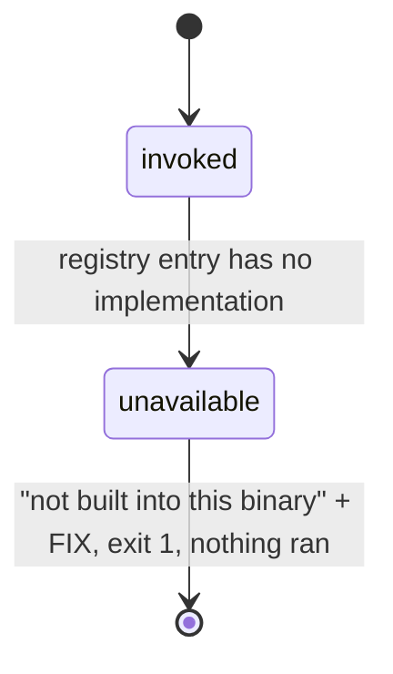

# Perf and timings

## Summary

bee measures itself in two unrelated places. The first is the **self-timing log**: every direct run of the binary records its own wall time as one line in the repo's `.bee/logs/timings.jsonl`, and `bee timings report` ranks those lines by slowest command. The second is the **performance log**: a machine-wide, append-only record of whole coding sessions — per-model token counts, active running time, subagent parallelism — kept outside any repo at `~/.config/beehive/performance.jsonl` and rendered into a cross-project HTML matrix at `~/.config/beehive/performance.html`. The seven `bee perf` verbs that were the agent's door onto that second log are **not built into this binary**; every one of them refuses by name. What still fills the performance log is the session-close hook, which rolls up the session that just ended and re-renders the matrix, without anyone asking. The timing line itself — its format and its fail-open contract — is owned by [invocation](../foundations/invocation.md).

## The simple case

The agent wants to know which bee commands are slow in this repo:

```
bee timings report --limit 5
```

bee prints one line per command, ranked slowest median first:

```
close — count=59 total=97639ms median=550.0ms p95=5046.0ms max=8829ms
orient — count=11 total=3809ms median=363.0ms p95=399.0ms max=399ms
worktree prune — count=11 total=12308ms median=305.0ms p95=6247.0ms max=6247ms
worktree new — count=34 total=7931ms median=276.0ms p95=330.0ms max=332ms
status — count=7 total=1625ms median=243.0ms p95=281.0ms max=281ms
```

Nothing was measured to produce that. Every line of it was already on disk, appended one at a time by the commands themselves.

The agent wants the cross-project session matrix:

```
bee perf report
```

```
bee: not built into this binary: `bee perf report` is declared in the command
registry, the perf group was never ported off Node. Nothing ran and nothing
changed. FIX: every command appends its own wall time to `.bee/logs/timings.jsonl`
```

The matrix still exists — it is at `~/.config/beehive/performance.html`, rewritten at the end of every session — there is just no command that builds or reads it on demand.

## The interaction, event by event

One `bee timings report`:

```mermaid
stateDiagram-v2
    [*] --> invoked
    invoked --> refused : an unknown flag, or --limit 0 / non-numeric
    invoked --> no_root : no .bee/onboarding.json or .git up the tree (exit 1)
    invoked --> reading : timings.jsonl read; malformed lines counted, not fatal
    reading --> reported : ranked rows printed, exit 0
    refused --> [*]
    no_root --> [*]
    reported --> [*]
```



One `bee perf <anything>`:



### Invoke

`bee timings report` accepts `--json` and `--limit <N>` (or `--limit=<N>`), in any order, and nothing else. `N` must parse as a positive integer: `0`, `-1`, and `abc` all fall through to the router's refusal rather than silently defaulting. The default limit is 15. The store root resolves through the wide door, so the verb answers from a granted worktree too; with no root, the standard no-root error and exit 1.

`bee perf start|stop|section|log|render|sync|report` parse their flags from the registry and then find no implementation behind the entry. The refusal is the same for all seven and it happens before anything is read.

### Ends at once

- `bee timings report --help` prints the registry entry and exits 0.
- Any `bee perf` verb ends at once with `bee: not built into this binary` — one of the five fixed refusal openings — carrying the reason (`the perf group was never ported off Node`), the guarantee (`Nothing ran and nothing changed.`), and the FIX line pointing at the self-timing log. Exit 1. Under `--json` the payload is `{"error", "kind": "command_unavailable", "command": "perf.log"}` on stdout. `bee --help --all` prints the same marker under each verb: `NOT BUILT INTO THIS BINARY`.
- A missing or empty `.bee/logs/timings.jsonl` is not an error: `timings report: no timing data.`, exit 0.

### First side effect

`bee timings report` has none of its own. It is read-only by construction — no `write` and no `create_dir_all` anywhere in the verb — and its only append is the one every verb makes: its own timing line. So the report is, very slightly, a measurement of itself; the next run will show `timings report` in its own ranking.

`bee perf *` has no side effect at any point. Nothing ran.

### While running

`timings report` reads the whole log into memory, groups by `cmd`, and sorts. A malformed line — not valid JSON, or valid JSON missing a non-empty string `cmd` or a finite non-negative `ms` — is skipped from every group's statistics and counted separately. Never fatal. A concurrent bee command appending to the log during the read either lands in the read or does not; the file is append-only and a torn last line is one more malformed line.

### Finish

The text report prints on stdout, one line per command plus a trailing `N malformed line(s) skipped.` when any were. Under `--json` the payload is `{commands: [{command, count, total_ms, median_ms, p95_ms, max_ms}], malformed_count}`, also on stdout. Then the timing line `[bee] timings report <N>ms` on stderr, and exit 0.

## The self-timing log

Every direct run of the binary appends one line to `.bee/logs/timings.jsonl`:

```json
{"ts":"2026-08-11T00:00:00.000Z","cmd":"status","ms":260,"ok":true}
```

`cmd` is the resolved `<group> <verb>` — `unknown` when resolution failed. `ok` reflects the exit code, so a slow command and a broken command are visible in the same place. The append is wrapped so a logging failure — an unwritable directory, no repo root — never changes the command's outcome or its output. It runs only on direct CLI runs; importing the dispatcher (which the test suite does constantly) records nothing.

Everything under `.bee/logs/` is fail-open, append-only runtime telemetry: never managed content, never state. That distinction is load-bearing. Two tree-hash guards — the compact-check's mutates-nothing control and the repeat-install byte-idempotence check — went red the day self-timing shipped, because every CLI invocation appends a line; both now exempt `.bee/logs/**` as a directory-scoped rule, and the compact-check exemption is paired with a negative control proving a genuine state mutation still turns the check red.

Nothing rotates or prunes the log. It grows for the life of the checkout.

### How the statistics are computed

`--limit N` narrows the **output** only, never the math: every row of a command is folded into its stats before the ranked list is truncated. Percentiles are nearest-rank — `rank = ceil(p × n)`, 1-indexed, clamped — with one exception: the median of an even-length group averages the two middle values, the conventional split. Every other percentile, p95 included, takes the plain nearest-rank value, so a single-sample group answers with that one sample for both median and p95 rather than leaving a gap. Ranking is slowest median first, command name ascending on a tie.

`ms` is rounded to the nearest whole millisecond on read. The log only ever writes whole-millisecond integers, so a fractional value there is itself a sign of a hand-edited or corrupt line, not real data.

## The performance log

A separate, older machine of a different shape. Its store is one file for the whole machine, outside every repo:

| Path | What it is |
| --- | --- |
| `~/.config/beehive/performance.jsonl` | The persistent log: one `bee-perf/v1` row per session, keyed by session id. |
| `~/.config/beehive/performance.html` | The rendered cross-project matrix. |

The location honors `XDG_CONFIG_HOME`, and `BEEHIVE_PERF_DIR` redirects the whole directory (the tests use it for isolation).

A session row carries: `session_id`, `project` (the full path) and `project_name` (its last folder), `branch`, `started_at` / `ended_at`, `running_time_ms`, `parallel`, `subagent_count`, `models` and `subagent_models` (per model: `input`, `output`, `cache_write`, `cache_read`, and the derived `new` / `cached` / `total`), `event_count`, and `logged_at`.

Three measurement rules make those numbers mean something:

- **Running time is active time, never "alive" time.** It sums the harness's own per-turn active durations inside the window, which already exclude idle waiting. When those are unavailable, the fallback sums the gaps between consecutive events and ignores any gap longer than five minutes, so a long wait for the human is never billed. Plain end-minus-start is never used.
- **Each request is counted once.** Several transcript entries for one underlying model call — streamed chunks — are de-duplicated. Placeholder and local non-model events are excluded from every token total.
- **Subagent cost is attributed, not hidden.** Tokens spent by dispatched workers are gathered from each worker's own sidecar transcript and reported in a separate `subagent_models` breakdown. `parallel` is true when two or more worker runs overlap in time, or when one turn dispatched two or more at once.

### What still fills it

The session-close hook. On `Stop` and `PreCompact` it resolves the session's transcript, rolls it up, and upserts one row into `performance.jsonl` — keyed by session id, so the same session written repeatedly replaces its row rather than duplicating it. It then rebuilds `performance.html` from the log alone; the matrix is a read of the log, never a re-scan of transcripts at view time. Rows are grouped by `project_name` — the last folder of the path — so two checkouts of the same-named folder collapse into one row, with every underlying full path retained.

The whole pipeline is best-effort. A failure is logged as a crash record under source `perf-refresh` and the session ends cleanly regardless. See [session](../foundations/session.md) for the close hook's other work.

### What is missing without the verbs

Six things the design provides and no command reaches today:

- **Named sections** — `perf start` / `perf stop` around a named piece of work, and `perf section --since 1h` for a trailing window. The open-section marker (`.bee/cache/perf-open.json`) is never written, because nothing writes it. Only one section could ever be open at a time per working copy.
- **Reading the log** — `perf log --limit N`, one line per section, most recent last.
- **Rendering it** — `perf render`, the same content as Markdown.
- **Backfill** — `perf sync`, which scans every project's transcripts and writes one rolled-up row per session, bringing history into the log in one pass. Without it the log only ever contains sessions that ended after the hook started running.
- **On-demand matrix** — `perf report`, the per-project summary, and `perf report --html --out <path>` to write the self-contained page somewhere other than the default.
- **A window filter** — `perf report --since 7d`.

The verbs are still in the registry, still documented, still refusing. That is the deliberate half of it: `bee --help --all` says what they would do and says they are gone, which is a better answer than pretending they never existed.

## Modifiers

| Modifier | Set at invocation | Can it differ mid-flow? |
| --- | --- | --- |
| `--json` | `timings report` puts `{commands, malformed_count}` on stdout instead of the text lines — which are also on stdout, so this swaps the format, not the stream. A `perf` refusal under `--json` becomes `{"error", "kind": "command_unavailable", "command"}` on stdout, exit unchanged. | No — one invocation, one mode. |
| Gate-bypass level | No effect. Neither surface is gated in either direction; reading timings needs no gate, no claim, and no active feature. | No effect. |
| Store phase | No effect. The log accepts appends and answers reads at idle, in gated phases, and in terminal states alike. | No effect. |
| Where it runs | `timings report` resolves through the wide door, so it answers from a granted worktree as well as from main — and it answers about *that* root's log. Each worktree has its own `.bee/logs/timings.jsonl`; the numbers do not merge. The performance log is machine-wide and identical from everywhere. | Per invocation. |
| Who runs it | No effect. Orchestrator, worker, and hook all append timing lines the same way; anyone may read the report. The performance log's one writer is the session-close hook. | — |

## Cancel and interrupt

Columns: before and after the append of a timing line — the only side effect in this document, and one that belongs to *every* command rather than to these.

| Event | Before the append | After the append |
| --- | --- | --- |
| The process killed mid-command | No line is written — not even for the command that was running. Its wall time is simply lost. | The line is on disk; a torn partial line is skipped by every later read and counted as malformed. |
| The session turning elsewhere (compaction, handoff, turn end) | Nothing owed. `timings report` is a pure read that a later session repeats freely. | Same. On `PreCompact` and `Stop` the session-close hook fires and the performance log gains or replaces the session's row. |
| A clean completion from outside (gate approved, question answered, new message) | No effect on either log. | No effect. |
| The store unavailable (unwritable log, corrupt lines, hook binary missing) | The append is wrapped: a logging failure never changes the command's outcome or output. A missing or empty log reads as a clean empty report. | Corrupt lines around a good one do not hurt it — they are skipped and counted in `malformed_count`. A missing hook binary means the performance log simply stops gaining rows; nothing else notices. |
| The session going away (heartbeat expiry, lease expiry, `session release`) | Neither log holds a lease and neither expires. A session that dies without a `Stop` event leaves no performance row for that session — the rollup is written at close, not continuously. | Same. |
| A sibling changing the target | Two sessions appending to the same `timings.jsonl` interleave safely — it is an append-only log with no lock. The performance log is rewritten whole on each upsert, so two sessions closing at the same moment can race and one row can be lost; the next close of that session re-writes it. | Same. |
| The channel changing (piped, `--json`, Codex, run from a hook) | Piping changes nothing; `--json` is the machine mode. On Codex there is no `SessionEnd` event, so the perf refresh fires on the Codex equivalents of `Stop`/`PreCompact` only. Timing lines are recorded on direct runs only, so a command invoked from inside a hook records nothing. | Same. |

## Interactions with other systems

**Gates and approval.** None. No gate guards either log in either direction, and neither surface can advance one.

**The store and history.** `.bee/logs/timings.jsonl` is in the store but is not *state*: it is fail-open, append-only telemetry, exempt from the state-integrity hashes by a directory-scoped rule, and never rebuilt from anything. The performance log is not in the store at all — it lives outside every repo, on purpose, so work across projects can be compared in one place. [The store](../foundations/store.md) owns the rest of the layout.

**Worktrees and containment.** Every checkout and worktree keeps its own timings log; `timings report` answers about the root it resolved. The performance log is machine-wide and its rows are tagged with the project path, so a worktree and its main checkout appear as two paths that collapse into one matrix row when their last folder name matches — and as two rows when it does not.

**Claims, holds, and reservations.** None. No lock, no lease, no reservation anywhere in this document; append-only is the whole concurrency story for the timings log, and last-writer-wins is the whole story for the performance log.

**Sibling sessions.** All siblings in a checkout append to one timings log, which is exactly what makes the ranking useful — it is the repo's history, not one session's. The performance log's rows are per session and keyed by session id, so siblings never overwrite each other's rows.

**What the human sees.** Nothing at append time. The one surface a human meets directly is `~/.config/beehive/performance.html`, which is rewritten at the end of every session with no one asking for it — a project-by-project table of sessions, active time, token totals, cache ratio, parallel sessions, and last activity.

**Configuration.** No bee config key touches either log. The performance store's location is environment-driven: `BEEHIVE_PERF_DIR`, then `XDG_CONFIG_HOME`, then `~/.config/beehive`.

**Output modes and exit codes.** The standard contract, owned by [invocation](../foundations/invocation.md), with one deviation: `timings report` prints its text on stdout rather than stderr, the same choice [status](status.md) makes for its report. Exit 0 on success including the empty report; exit 1 for a `perf` unavailability refusal and for the no-root error.

## Edge cases

- The self-timing log has no rotation and no pruner. On a long-lived repo it is the largest file under `.bee/logs/` and every `timings report` reads all of it.
- `--limit` cannot narrow the read, only the print. There is no way to ask "the last N runs" or "since yesterday" — the report is always over the whole history of the log.
- A command that never resolved records `cmd: "unknown"`, so `unknown` can appear as a ranked row. It aggregates every unresolvable argv shape into one bucket.
- Aliases are distinct rows. `bee finish` and `bee cells finish` are the same code with different names in the log, so their times do not combine.
- `timings report` counts its own run: the line it appends at the end shows up in the next report.
- A numeric-looking `ms` that is negative, infinite, or NaN is malformed and skipped, not clamped.
- The performance log's `branch` field is always `null` in the current implementation, although the design records it and the grouping rule assumes it exists. Cosmetic today; a gap if branch-level comparison is ever wanted.
- The matrix is rebuilt at session close whenever the log has any rows, which means a small HTML render at the end of every session. The original design gated that on a scan cache already existing so the first full scan was never paid at close; with the scan gone, there is nothing expensive left to gate.
- One logical piece of work spanning two sessions is never merged. The matrix aggregates all of a project's sessions; it does not reconstruct a task that crossed a session boundary.
- Only raw token counts are recorded. Converting them to money is left to the reader.

## Open questions and verification

- **The whole `perf` group is unavailable, by name, in the shipped binary.** Seven registry entries with descriptions, parameters, and examples, all refusing. This is recorded intent, not an accident — the knowledge bundle states it plainly and the FIX line names the surviving surface — but a reader who finds `bee perf report` in `bee --help --all` meets a command that cannot run. Whether the group should be ported, or retired from the registry, is an open product question rather than a defect to fix in place.
- The performance log's `branch` field is hard-coded to `null` in the ported session-record writer, while the recorded design (R6) says every entry is "tagged with its project and branch so entries from many projects coexist and stay attributable". Read from code; not confirmed against any consumer that would use it.
- The original design's R10 says the end-of-session refresh "runs only when a cache already exists, so the one-time full scan is never paid at session end". The ported refresh has no scan cache and no such gate — it re-renders whenever the log is non-empty. Believed harmless (the render reads only the log), but it is a stated rule the implementation no longer matches.
- The per-transcript scan cache (`~/.config/beehive/cache/scan-cache.json`) belongs to the unported verbs; whether anything writes or reads it today was not confirmed.
- Two sessions closing simultaneously both rewrite the whole performance log; the losing row would be lost until that session closes again. Read from the write path (read-filter-rewrite, no lock); not reproduced.
- `timings report`'s behavior from inside a granted worktree — that it answers about that worktree's own log — is stated in the verb's own header comment and was not exercised against a live worktree.
- Confirmed by running the binary in this repo: `bee timings report --limit 5` (the ranked text output quoted above, and its stderr timing line), `bee perf log --json` and `bee perf report --json` (the `command_unavailable` refusal and exit 1), `bee --help --all`'s `NOT BUILT INTO THIS BINARY` markers for all seven perf verbs, and the shape of `~/.config/beehive/performance.jsonl` (18 rows, `bee-perf/v1`, `branch: null`) alongside a `performance.html` written the same minute.

Verified against beehive commit `6b0ae488`.
