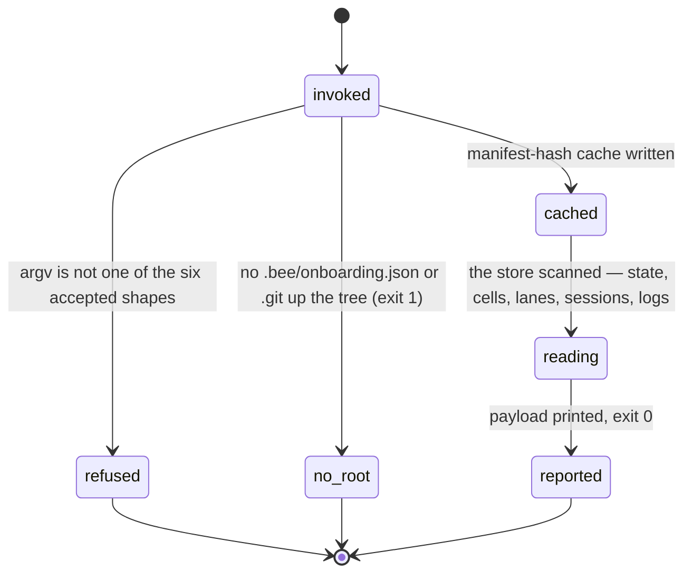

# Status and doctor

## Summary

Two read-only verbs answer two different questions. `bee status` answers "what is true in this repo right now": onboarding health, phase, gates, cells, lanes, live workers, pending queues, staleness warnings, and one recommended next step — the widest single view bee has of its own store. `bee doctor --runtime <claude|codex>` answers a narrower and colder question: "is the harness actually wired up" — is the hooks file there, does it point at the vendored binary, are the skills installed, and (on Codex only) is the trust state anything bee is allowed to believe. Doctor is the only bee command that grades itself in three states — `ready`, `degraded`, `blocked` — and the only one whose verdict decides its exit code. `bee orient` reshapes status's facts into a session-start packet and is owned by [orient](../lifecycle/orient.md); this document owns the payload and the health verdict.

## The simple case

Mid-flight, the agent wants detail that the preamble did not carry:

```
bee status
```

bee prints a report to stdout — one block of about twenty lines, most of them conditional. The fixed lines: the plugin version, onboarding state, `Phase | Mode | Feature`, the five gates, handoff presence, the cell counts, standard commands, active reservations, active workers, the critical-patterns file, the model lines, and `Recommended next:` last. The conditional lines only appear when they have something to say: a bypass banner, a waiting-on mark, a lane summary, a capture-queue nudge, a retirement nudge, recent decisions, staleness warnings, open discovery maps. Nothing is written but the timing line and the manifest-hash cache.

A worker starting up wants footing in one millisecond, not two hundred:

```
bee status --brief --json
```

That reads the state layer only and answers with seven keys. On this repo the full report takes about 250 ms and the brief one takes under 1 ms — the difference is the cell scan.

Health is a separate ask:

```
bee doctor --runtime claude
```

Doctor prints one line per checked row with an `ok` / `FAIL` / `?` mark, then a `next:` line, and exits 1 if the verdict is `blocked`.

## The interaction, event by event

One `bee status`:



One `bee doctor`:

```mermaid
stateDiagram-v2
    [*] --> invoked
    invoked --> refused : no --runtime, or an unproven flag shape
    invoked --> no_repo : no .bee/ directory up the tree (exit 1)
    invoked --> probing : mechanical rows read; Codex trust rows added
    probing --> ready : mechanical green, and on Codex a valid attestation (exit 0)
    probing --> degraded : mechanical green, Codex trust unproven (exit 0)
    probing --> blocked : any mechanical row not ok (exit 1)
```



### Invoke

`status` accepts exactly six argv shapes and no more: `status`, `status --json`, `status --lanes-full`, `status --lanes-full --json`, `orient`, `orient --json`. `--brief` is matched earlier, by a separate fast path that accepts `status` plus any mix of `--brief` and `--json` with `--brief` present. Anything else falls through to the router's refusal. `--brief` and `--lanes-full` are mutually exclusive fast and full paths — pass both and `--brief` wins, silently.

`doctor` requires `--runtime`, whose value must be exactly `claude` or `codex`; it also takes `--json` and, on the `attest` verb, `--session`. Any other token refuses. The subcommand `attest` must come first, immediately after `doctor`.

Root resolution differs between the two, and the difference is visible. `status` and `orient` are worktree-native: they resolve the worktree's own store and redirect control-plane reads to main when the worktree is granted ([worktrees](../foundations/worktrees.md)). `status --brief` resolves through the ordinary door. `doctor` does neither — it walks up looking only for a `.bee/` **directory**, and its no-repo message is its own: `bee doctor: no bee repo here (looked upward for a .bee/ directory). FIX: run it inside an onboarded project.`

### Ends at once

Both verbs are read-only reports; there is no long path to leave. The short answers:

- `bee status --help` / `bee doctor --help` print the registry entry and exit 0.
- A `status` argv outside the six shapes, or a `doctor` without `--runtime`, refuses: `bee: missing required argument(s) for \`bee doctor\`: --runtime. USAGE: bee doctor --runtime <string>. EXAMPLE: bee doctor --runtime codex --json`.
- `bee doctor attest --runtime claude` refuses with its own reason and exit 1: Claude has no trust-unknown rows, so mechanical green already reaches `ready` there — there is nothing to attest.

### First side effect

`status` has exactly one write of its own before it reads anything: the manifest-drift check, which records `{hash, checked_at}` into `.bee/cache/manifest-hash.json` (and deletes the legacy `.bee/manifest-hash.json` once the new one lands). The write is best-effort; a failure never changes the comparison it already made. If the hash moved, a line goes to stderr before the payload: `manifest_changed: true — <hint>`.

`doctor` writes nothing at all — not the manifest cache, not even the timings log. That is deliberate: a health verdict that mutates the thing it is grading is not a verdict. `doctor attest` is the one writing path in this document; its side effect is the atomic write of `.bee/doctor-attest.json`.

### While running

`status` walks a lot of store: `.bee/cells/*.json` (every file, every call), the lane records, session records and claims, the decisions log, the capture queue, the scribing ledger, `.bee/logs/contention.jsonl` (last 64 KB), `docs/discovery/`, `docs/history/`. On a repo with hundreds of finished features that is hundreds of milliseconds, which is why status carries its own retirement nudge (see below). Corrupt JSON anywhere on the path fails open: one `bee: could not parse JSON at …` line is buffered and the reader takes its `null` fallback; the payload, its shape, and the exit code are unchanged. A concurrent invocation sees whatever the store held at the moment each file was read — status takes no lock, so the report is a set of consistent files, not one consistent instant.

`doctor` stats four or five files and, in a bee source checkout only, spawns the installed binary once (`bee rs-info`) and stats every `.rs` and `Cargo.toml` under `packages/bee-rs/crates`. On Codex it also spawns `codex --version`.

### Finish

`status` prints its report — text or `--json` payload — on **stdout**, then the timing line `[bee] status <N>ms` on stderr. Exit 0. Buffered warnings and the drift line go to stderr first, in that order, before the payload; buffering exists so a run that gives up part-way has emitted nothing at all.

`doctor` prints its report on stdout too (its error messages go to stderr), and prints **no timing line and logs no timing entry** — a gap, not a design statement (see "Open questions"). Exit 1 when the verdict is `blocked`, 0 for `degraded` and `ready`.

## The status payload

The `--json` payload has 32 top-level keys. What matters to a reader:

**`onboarding`** — `{installed, bee_version, plugin_version, drift}`, plus `drift_detail` (a file list) when the installed tree has drifted from what this binary renders. `installed: false` is what the recommended-next step keys on first.

**`gates` and `gate_records`.** `gates` is the projected booleans, five names. `gate_records` is the persisted record per gate — `{state, actor, at, reason, bypass_level, approved_for_plan_rev}` — and it exists because the booleans cannot tell `pending` (nobody acted) from `rejected` (somebody refused). The text report prints one `Gate <name>: <state> …` line per non-approved gate, but only when a feature is live: an idle repo's all-pending default is not news. See [gates](../foundations/gates.md).

**`run_state` and `waiting_on`.** The run's own persisted lifecycle name, and what it is waiting on (`{kind, subject, asked_at, session}`) — read straight off the projected state fields, never re-derived. [Session](../foundations/session.md) owns the waiting mark.

**`cells`** — `{open, claimed, capped, blocked, archived: {capped, dropped, total}, archivable}`.

**`cells.archivable`** — the retirement backlog: `{features, cells, ids}` for every feature whose cells are *all* terminal (`capped` or `dropped`) and which is not the active feature. It exists because status and orient parse every file in `.bee/cells/` on every call, so the cost of asking "where am I" grows with the amount of work already finished. `bee close` retires the feature it closes, so this only ever counts work that was abandoned mid-lifecycle or finished before close existed. `ids` is capped at five names; `features` is the true count. The text report stays silent until five or more features qualify — one stale feature is a line readers learn to skip — and then prints the count, up to five ids with a trailing `…`, and the one command that clears it: `bee cells archive --all-but-active`.

**`lanes`** — summarized by default: `{active, counts, ids}`, where `active` is the full lane record for the lane *this session is bound to* (null when unbound), `counts` is a phase histogram of every other lane, and `ids` is their bare feature names. `--lanes-full` restores the full per-lane array including `bound_sessions`. This is a payload-size flag only: no other field changes either way. On a long-lived repo the difference is large — 169 lane records here — and the summary's `ids` list is still every id, so the default is not lossy about *which* lanes exist, only about their contents.

**`workers`** — a *derived* view, never `state.json`'s hand-mutated `workers` array. It is the set of session records whose heartbeat is not stale (900 s), left-joined with their currently active cell claim: `{session_id, lane, cell, last_heartbeat, activity, signal}`. A live session with no claim appears with `cell: null`. See [sessions](../coordination/sessions.md).

**`staleness_warnings`** — an array of sentences, printed under a `Staleness warnings:` heading when non-empty. The generators, in order: no standard commands recorded in `.bee/config.json`; onboarding installed a different bee version than the running plugin; `HANDOFF.json` older than 7 days; reservations expired but never released (with the sweep command named); a stale top-level `advisor` key removed in 0.1.23; every `config validate` problem in the models table and the rendered agent files; and an unknown `phase` value not in the enum.

**`recommended_next`** — one string, first match wins: onboarding missing → run onboarding; a handoff present → surface it and wait, never auto-resume; phase `swarming` without the execution gate → "NOT ready to swarm"; execution approved with ready cells → the count and the ids; a post-execution phase with unreviewed candidates → the review-candidate line (with the standing rule that full review is user-invoked only); otherwise `state.next_action`, or `Invoke bee-hive.`

The rest, in one line each: `source` (where this bee came from), `mode`, `feature`, `gate_bypass` / `gate_bypass_level` / `ship_visibility`, `route`, `models` and `role_mix` and `ceiling_scarcity`, `handoff`, `review` (candidate counts and open review sessions), `recovery` (recoverable sessions), `scribing_debt` (this feature's uncaptured behavior-change cells, plus `orphaned` for every other feature), `capture_queue` (`{count, ids}` of pending stubs — [the capture queue](../memory/capture.md)), `open_maps` (open discovery efforts and unreadable maps — [wayfinding](../discovery/wayfinding.md)), `pbi`, `commands`, `active_reservations`, `critical_patterns_present`, `recent_decisions` (the newest three), and the optional `worktree_notice` and `contention`.

## `--brief`

`status --brief` is the worker-startup path, and it is a different program: it reads `state.json` and the merged config, and nothing else. No cell scan, no review or handoff resolution, no models or role mix, no lanes. It emits exactly seven keys in a frozen order — `phase, feature, mode, gates, gate_bypass_level, ship_visibility, route` — with `route` null when absent. The text form is one line: `phase=<p> feature=<f> mode=<m> gates=<c/s/e/r/u> bypass=<level>`, and it silently drops `ship_visibility` and `route`, which the JSON form carries. A corrupt `state.json` yields the default brief plus a warning on stderr, never an error.

The rule of thumb: a dispatched worker that needs to know whether it may write uses `--brief`; anything that needs to know what other sessions are doing needs the full report.

## Doctor's rows and verdict

Doctor grades **mechanical rows** — things it can read — and, on Codex only, reports **trust rows** it structurally cannot.

| Row | Question | not_ok when |
| --- | --- | --- |
| `hooks_file` | Is the wiring file present? (`.claude/settings.json`, or `.codex/hooks.json`) | The file is missing — the runtime loads no bee hooks. |
| `hook_handler` | Does `.bee/bin/bee[.exe]` exist? | Missing — every wired hook command points at nothing. |
| `skills_installed` | Are there skill directories under `.claude/skills` / `.agents/skills`? | Zero — the agent has no bee craft to load. |
| `wiring_matches_binary` (Codex) | Is `.codex/hooks.json` byte-identical to what this binary renders? | It differs, or there is nothing to compare. |
| `wiring_points_at_the_binary` (Claude) | Does every wired hook command name `.bee/bin/bee`? | No hooks wired at all, or any command that does not name the vendored binary. |
| `binary_freshness` (source checkouts only) | Is the installed binary built from the source beside it? | The binary's own `rs-info` version disagrees with `.claude-plugin/plugin.json`, the binary is too old to report a version, or any source input is newer than the binary by mtime. |

The two runtimes get *different* byte-match rows on purpose, and treating them alike would be a false FAIL: `.codex/hooks.json` is bee's rendered artifact, so whole-file equality is the right question, while `.claude/settings.json` is the host's own settings file that onboarding merges a `hooks` key into — it also carries permissions and anything else the host put there, and comparing the whole file would fail every correctly installed repo.

`binary_freshness` only exists in a bee **source** checkout (detected by `packages/bee-rs/Cargo.toml` under the root); a host project carries no such tree and the row is absent entirely. It reports `unknown`, not `not_ok`, when the probe itself could not run or when the binary is simply missing — a missing binary is `hook_handler`'s verdict to give, and repeating it under a second name would be noise. It never builds or copies anything; it only stats, reads, and asks the installed binary its own version.

The **verdict ladder**, evaluated and never assumed:

- `blocked` — any mechanical row is not ok. Exit 1. `next: fix the FAIL row(s) above — nothing else can be trusted until they are ok`.
- `degraded` — mechanical rows all ok, but this is Codex and no valid attestation covers its trust rows. Exit 0. `next: the wiring is correct; what is unproven is whether Codex is letting it fire`.
- `ready` — mechanical rows all ok and, on Codex, a currently-valid attestation. Claude has no trust-unknown rows, so mechanical green alone reaches ready there. Exit 0.

Never `ready` from file presence alone.

## Doctor attest

Codex exposes no surface reporting whether it discovered `.codex/hooks.json`, whether the hooks were trusted in its `/hooks` TUI, whether the project is trusted, or whether a hook is still awaiting review. Nothing bee can run answers those four questions, so doctor reports them as four `unknown` rows and offers one way to answer them: a human checks the `/hooks` TUI, and then the agent records what they saw.

```
bee doctor attest --runtime codex
```

writes `.bee/doctor-attest.json` — gitignored, never tracked state — pinning three legs: the SHA-256 of `.codex/hooks.json` as it stands, the live `codex --version` string, and a repo identity (the SHA-256 of the canonical root path). It also records `recorded_at` and, with `--session`, a session id.

The next `bee doctor --runtime codex` treats the attestation as valid only while all three legs still match, and names the stale leg when one drifts: `hash_changed`, `version_changed`, `identity_changed`, `no_attestation`, or `unprobed_version` when `codex --version` does not answer at all. A drifted leg makes the attestation inert and the verdict falls back to `degraded`.

Attest refuses rather than recording a lie in two cases: `--runtime claude` (nothing to attest), and `codex --version` not answering (`the version leg cannot be pinned and the attestation would be inert on sight`). There is no liveness leg: this is a static record of a human's observation, not a health probe.

## Modifiers

| Modifier | Set at invocation | Can it differ mid-flow? |
| --- | --- | --- |
| `--json` | The payload — the full status object, the seven-key brief, or doctor's `{runtime, repo_root, overall_status, rows, attestation}` — pretty-printed on stdout instead of the text report. Both verbs put their text report on stdout too, so `--json` swaps the *format*, not the stream. Doctor's error messages do move from stderr to a stdout `{"error", "kind"}` object. | No — one invocation, one mode. |
| Gate-bypass level | No effect on either verb. Status *reports* it (`gate_bypass_level`, plus a bypass banner line whenever it is not `off`); doctor ignores it. Neither is gated in either direction. | No effect. |
| Store phase | No effect on what runs. It changes the content: the phase selects the recommended-next branch, decides whether the per-gate record lines print, and an unknown phase adds a staleness warning. Doctor does not read the phase at all. | No effect. |
| Where it runs | `status` (full) and `orient` are worktree-native: inside a granted worktree they answer from the main checkout's control plane, and a `worktree_notice` line names an ungranted one. `status --brief` resolves through the ordinary door. `doctor` walks up for a `.bee/` directory and grades whatever it finds there — in a worktree that is the worktree's own wiring. | Per invocation. |
| Who runs it | No restriction. By convention the orchestrator reads the full report and a dispatched worker reads `--brief`; nothing enforces that. Doctor is an installer- and troubleshooting-time verb, run by whoever is diagnosing. | — |

## Cancel and interrupt

Columns: before and after the first side effect — status's manifest-hash cache write, and `doctor attest`'s attestation write. Plain `doctor` has no first side effect at all, so both columns describe the same nothing.

| Event | Before the first side effect | After the first side effect |
| --- | --- | --- |
| The process killed mid-command | Nothing recorded. No report, no timing entry. | The cache file is atomic — a killed writer leaves either the old hash or the new one, never a torn one. An attestation half-written is the same: the atomic write either landed or did not. The report may never print. |
| The session turning elsewhere (compaction, handoff, turn end) | A report is a read, not state; a compacted session simply asks again. | Same. The one carry-over: an attestation outlives every session until one of its three legs drifts. |
| A clean completion from outside (gate approved, question answered, new message) | Changes what the *next* report says, never the one in flight. | Same. |
| The store unavailable (lock contention, corrupt JSON, hook binary missing) | Neither verb takes the store lock, so contention cannot reach them. Corrupt JSON on status's path warns and reads as the default — the report still prints, with the same shape and exit code. A corrupt manifest cache reads as "no prior hash". Doctor treats an unparseable `.claude/settings.json` as wiring no hooks at all, which is `not_ok` — fail-closed, and correct: unreadable wiring is not working wiring. | Same. |
| The session going away (heartbeat expiry, lease expiry, `session release`) | Neither verb holds a lease. A dead sibling's session record simply stops appearing in `workers` once its heartbeat passes 900 s. | Same. |
| A sibling changing the target | The report is a snapshot of files read one after another, not one instant — a sibling capping a cell between the cell scan and the lane read produces a report that is internally slightly out of date, never wrong about any single file. Doctor's artifacts are installer-owned and rarely race. | Same. |
| The channel changing (piped, `--json`, Codex, run from a hook) | No TTY detection: piping changes nothing. `--json` is the machine mode. On Codex the same binary answers, and `doctor --runtime codex` is the shape that grades that runtime — the runtime bee *runs under* and the runtime it *reports on* are independent. Inside a hooked session the CLI-shape guard can refuse a malformed invocation before the binary runs. | Same. |

## Interactions with other systems

**Gates and approval.** Reported, never touched. `status` carries both the projected booleans and the persisted per-gate record, and prints the bypass banner whenever the level is not `off`; neither verb can approve, refuse, or advance a gate.

**The store and history.** `status` is the widest reader bee has, and its only writes are the manifest-hash cache and its own timing line. `doctor` reads outside the store — the runtime wiring files, the skills directories, the plugin manifest — and writes nothing; `doctor attest` writes one gitignored record.

**Worktrees and containment.** `status` (full) and `orient` serve linked worktrees natively and redirect control-plane reads from a granted one; `--brief` and `doctor` resolve the local root. Status's optional `worktree_notice` names an ungranted worktree that is quietly sharing main's store, and its `recovery` block and reclaimable-worktree scan name worktrees nobody merged or pruned.

**Claims, holds, and reservations.** Read only. `active_reservations` lists unexpired path leases; `workers` joins live sessions to their active claims; a claim held by a session whose heartbeat has died simply stops being counted. Unlike [orient](../lifecycle/orient.md), `status` sweeps nothing — that is the whole difference in write behavior between the two.

**Sibling sessions.** `workers` is how a session sees who else is live and on what. The count is the derived join, so a session that crashed without releasing shows up until its heartbeat expires, then disappears on its own.

**What the human sees.** Neither report is for the human. The agent reads them and says one line of state and one next action. The two conclusions worth surfacing: `doctor` reporting `blocked` (the harness is not wired, so nothing else can be trusted), and status's retirement or capture nudges when they name a command the human might want run.

**Configuration.** `status` reads the merged config repeatedly — for `commands`, `models`, the bypass level, and `ship_visibility` — and turns malformed values into staleness warnings through `config validate`. `doctor` reads no bee config at all; its inputs are the runtime's files. [Configuration](../cross-cutting/configuration.md) owns the merge law.

**Output modes and exit codes.** The standard split from [invocation](../foundations/invocation.md) — text reports on stdout, so `bee status | head` works — with one deviation worth knowing: `doctor` prints no timing line and appends no timings entry. Exit codes: 0 for status always, 0 or 1 for doctor by verdict, 1 for a refusal or a missing root.

## Edge cases

- The full report is not cheap and knows it: `cells.archivable` exists precisely to name the cost it is paying, and the text nudge only fires at five or more un-retired features.
- `--brief` and `--lanes-full` together is not an error; `--brief` wins and `--lanes-full` is ignored.
- The `lanes` summary's `active` is null unless the calling session is bound to a lane, so the same repo reports a different `lanes.active` to two different sessions. `counts` and `ids` then cover every lane rather than every *other* lane.
- The models line is width-bounded at 120 characters of `name=model` text, then prints `+N more (--json)`. The bound is on width, not count, because a runtime with long model names blows five terminal lines at the same role count that fits on one elsewhere. The `codex` line prints only on a host that configured one; `claude` and `opencode` print unconditionally because both ship built-in defaults.
- `expired_unreleased` in the staleness check counts every reservation whose `released_at` is null — which, by construction, is all of them. The comparison it was ported from compared object references from two separate list calls and was always false in the original too; the behavior is faithfully replicated rather than fixed. In practice the warning fires whenever any reservation exists.
- Doctor's row alignment is a fixed 22-column field, and `wiring_points_at_the_binary` is 27 characters — the Claude report's fourth row is visibly misaligned. Cosmetic.
- `doctor` finds its root by looking for a `.bee/` **directory** only, where every other command also accepts a bare `.git`. A repo with `.git` but no `.bee/` gets the no-repo message from doctor and normal service from everything else — which is the right split, since there is nothing for doctor to grade.
- `bee status --json` renamed `tier_mix` to `role_mix` as a deliberate breaking change: after the role split no truthful content survived under the old key, and a consumer reading absent numbers as zero would have reported "no ceiling usage" forever. A key that is gone fails loudly; a key that lies does not.
- An attestation recorded in one checkout does not cover a copy of the same repo elsewhere — that is the `repo_identity` leg, and the reason is that a checkout's trust state in Codex is per-checkout.

## Open questions and verification

- **Suspected gap:** `bee doctor` prints no `[bee] doctor <N>ms` line and appends no `.bee/logs/timings.jsonl` entry, unlike every other served verb. The registry says doctor "performs zero writes anywhere", so the timings append may have been dropped along with the manifest-cache write — but the timings log is explicitly fail-open telemetry and is exempted from every state-integrity hash, so the two are not the same kind of write. Confirmed by running: stderr is empty on a full `doctor` run. Whether this is intended was not settled from code or comments.
- Both verbs print their human-readable report on **stdout**, where the invocation contract says human messages go to stderr. Confirmed by running. It is almost certainly right for a report — but it is a documented contract with two exceptions, and no comment names the exception.
- The `expired_unreleased` staleness warning is a faithfully ported no-op comparison that makes the warning fire on any live reservation. Read from code and its comment; the resulting warning text was not observed on a fixture that has reservations.
- Doctor's `binary_freshness` row was observed FAIL on this source checkout. Its `unknown` arms (probe failure, missing plugin manifest, missing binary) were read from code, not reproduced.
- The Codex attestation path — writing a record, then watching each of the three legs drift and produce `hash_changed` / `version_changed` / `identity_changed` — was not exercised; no Codex CLI was available to pin the version leg.
- `status --lanes-full` was not run on this repo (169 lane records); the summary form and its text line were confirmed.
- The `recovery`, `review`, and `contention` blocks are described only at the level of what they carry. Their own derivation rules belong to [recovery](../maintenance/recovery.md) and [reviewing](../reviews/reviewing.md).
- Confirmed by running the binary in this repo: `bee status` (text), `bee status --json` (all 32 keys, `cells.archivable`, the lane summary, the derived `workers` view), `bee status --brief` and `--brief --json`, `bee doctor --runtime claude` and `--runtime codex` (both `blocked`, exit 1), and `bee doctor` with no runtime (the missing-required-argument refusal).

Verified against beehive commit `6b0ae488`.
