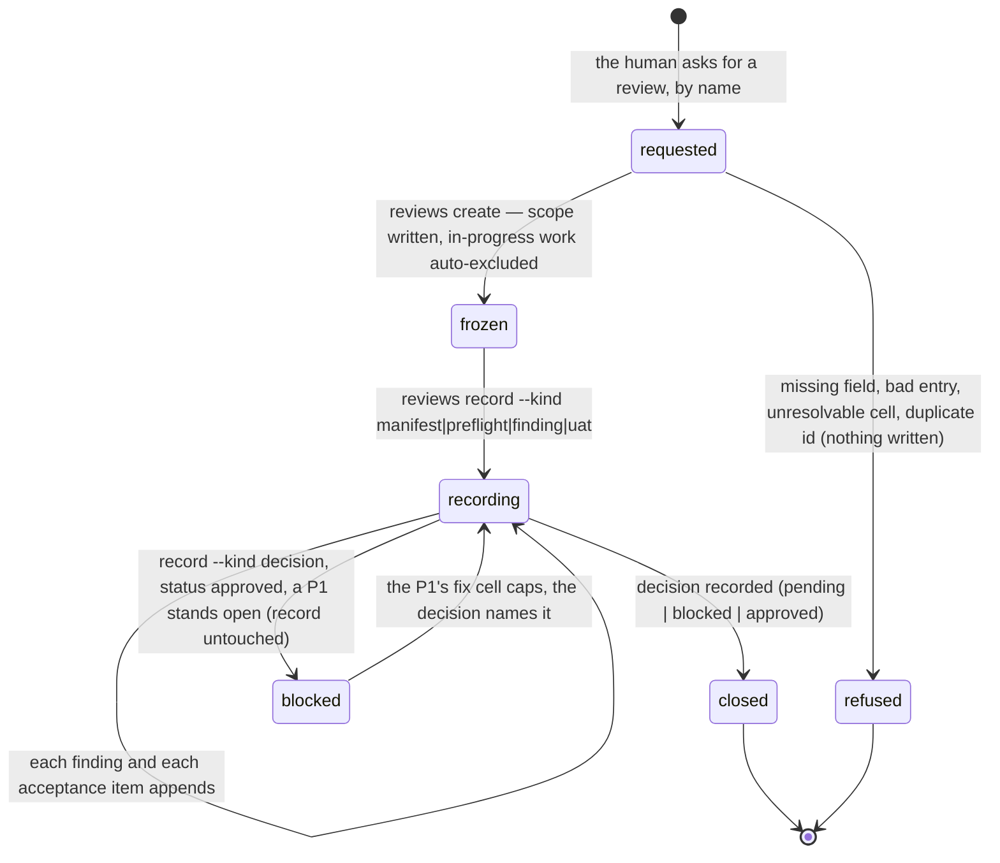

# Independent review

## Summary

Independent review is a separate pass that the human asks for by name. Nothing in the pipeline starts one: a capped cell, a closed feature, or the words "merge", "ship", "release" are triggers for *reporting coverage*, never for spending reviewer tokens (rule `agents-review-user-invoked`, cited in `AGENTS.md` and recorded as decision `565e68d0-327f-404e-b49e-d1c61ba81bfd`). The `bee reviews` verbs are the record layer under that pass. `bee reviews create` freezes a scope — baseline, head, included, excluded — into `.bee/reviews/<id>.json` and never lets those four fields move again. `bee reviews record` hangs the reviewer manifest, the findings, the user-acceptance items, and the final decision on that frozen scope; an `approved` decision is refused while any P1 finding stands unresolved. `bee reviews candidate add` appends one line per closing feature to `.bee/review-candidates.jsonl`, so a feature that closed unreviewed is visible rather than forgotten, and `bee reviews status` answers "is this reviewed?" by deriving it from the records plus real git history — never by reading a stored status field. Every one of the seven verbs is read-only or record-only. None of them dispatches a reviewer, approves a merge, or closes a feature.

## The simple case

The human says "review the two features that landed today". The agent resolves that to one boundary, writes a scope file, and freezes it:

```
bee reviews create --file scope.json
```

bee answers `Created review session review-2026-08-26.` The scope file named `included` entries of type `feature`; any included cell still `open` or `claimed` was moved into `excluded` with the reason `in progress`. From here the diff cannot move.

The agent shows the human the frozen scope, then dispatches the reviewer panel through the one dispatch door ([dispatch](../delegation/dispatch.md), `--kind reviewer`). As each finding settles it is recorded:

```
bee reviews record --id review-2026-08-26 --kind finding --file finding.json
```

`Recorded finding on review-2026-08-26 (updated_at 2026-08-26T09:14:02.118Z).` Findings append, one per call. The human walks the acceptance items; each answer is a `--kind uat` record. Then the review is closed with its decision:

```
bee reviews record --id review-2026-08-26 --kind decision --file decision.json
```

If a P1 finding is still open, that call is refused and the record is left byte-unchanged. The review's own closing is all this records: the features stay closed, the merge stays the human's answer to the merge question, and `bee reviews status` starts reporting those candidates as `reviewed`.

## The interaction, event by event

One review session's arc, and one `bee reviews record` invocation inside it:



### Invoke

Seven exact argv shapes, and only those: `reviews list [--json]`, `reviews show --id I`, `reviews create (--file F | --stdin)`, `reviews record --id I --kind K (--file F | --stdin)`, `reviews candidate add --feature F --head H --mode M [--baseline B] [--cells C]`, `reviews candidates`, `reviews status [--feature F]`. Any other flag ends the invocation with the generic shape refusal that names the flag — `bee: unsupported argument shape for \`bee reviews list\`: … names unknown flag --bogus. FIX: \`bee reviews list --help\` …`. An unknown verb, including an unknown nested action after `candidate`, is answered by name and given the full verb list: `bee: unknown command \`bee reviews bogus\` — \`bee reviews\` has no \`bogus\` verb. \`bee reviews\` takes: create, list, show, record, candidate add, candidates, status.` (exit 1). The root is resolved as everywhere else ([invocation](../foundations/invocation.md)).

Review ids must match `^[A-Za-z0-9][A-Za-z0-9._-]*$`. The id is also the file name, which is why the pattern is checked before any path is built.

### Ends at once

The short paths, none of which write:

- `--help` at the group prints every verb with its flags; `--help` on one verb prints that verb's flags with their descriptions, plus the timing line, exit 0.
- `Missing required flag --id.` / `--kind` / `--feature` / `--head` / `--mode` / `--file` — a flag present but empty, or a bare boolean flag where a value was wanted, counts as missing. `create` and `record` with neither `--file` nor `--stdin` say `Missing required flag --file.`, because `--stdin` is the ternary's other branch, not a separate requirement.
- `create` shape refusals, each naming exactly what is wrong: a non-object scope, a missing or blank `id`/`requested_by`/`scope_description`/`baseline`/`head`, an `included` that is absent or empty, an `excluded` that is not an array, an entry that is not an object, an entry whose `type` is outside `cell, feature, commit`, an entry with no non-empty `id`, an invalid id pattern, and `create: review session "<id>" already exists — review ids are never reused. FIX: pick a new id.`
- `create: preflight cannot resolve included cell "<id>" — no such cell.` — the scope names a cell the store does not have.
- `record` refusals: an invalid `--kind` (the five are listed), a null or non-object payload, and the frozen-scope refusal — `record: refused — payload attempts to touch immutable scope field(s): head. baseline/head/included/excluded are frozen at create (R5) and cannot change afterward.`
- `record --kind decision` with a `status` outside `pending, blocked, approved`, and the P1 door below.
- `candidate add` with a blank feature or head, or a `--mode` outside `docs, tiny, small, spike, standard, high-risk`.
- `show --id` for an id that is unknown, invalid, or whose file is corrupt: `Review session "<id>" not found.` (exit 1) — one answer for all three, because `show` reads fail-open.

### First side effect

For `create`, the whole session file, written atomically at `.bee/reviews/<id>.json`: the trimmed `id`, `requested_by`, `scope_description`, `baseline`, `head`; the normalized `included` and `excluded` arrays; an empty `reviewer_manifest`, `findings`, and `uat`; a `verification_preflight` block; `decision: {status: "pending", review: null}`; `created_at`, `updated_at`, `requested_at`. Every refusal above happens before this write, so a refused create leaves zero files.

For `record`, the same file rewritten atomically with one field changed and `updated_at` refreshed. For `candidate add`, one JSON line appended to `.bee/review-candidates.jsonl`. `list`, `show`, `candidates`, and `status` write nothing at all.

> Technical note: `create`'s preflight does two things. It moves every included cell whose status is `open` or `claimed` into `excluded` with the reason `in progress`, and it lists the ids of every included cell whose trace carries `behavior_change: true` in `verification_preflight.cells_checked`. It then records `passed: true` unconditionally. It does not read verification evidence and cannot fail on a gap — see "Open questions".

### While running

`status` is the only verb that does real work between its first and last line, and it does it before writing anything: for every candidate it may spawn `git merge-base --is-ancestor <candidate head> <session head>` and `git rev-list <session head>..HEAD --count`. Answers are memoized within the one invocation, so a hundred candidates sharing a head pair cost one pair of spawns. Nothing is locked; a sibling appending a candidate mid-scan is simply not in this scan's list.

### Finish

Without `--json`, one line on stderr (`Created review session <id>.`, `Recorded <kind> on <id> (updated_at <ts>).`, `Added candidate <uuid> for feature "<slug>" (mode standard, 6 cell(s)).`) followed by the timing line. `list` prints `<id> [<decision status>] <scope description>` per session, sorted by id with numeric-aware ordering (`rev-2` before `rev-10`), or `No review sessions.`. `candidates` prints `<date> <feature> @<head> (<mode>)` oldest first, or `No review candidates.`. `status` prints its headline and one line per candidate. `show` always prints the session as pretty JSON, with or without the flag. With `--json` the payload moves to stdout: the session object, the candidate entry, the session array, or `{counts, candidates}` for `status`.

## The five gates and the review gate

The `review` gate is one of the five recorded gates ([gates](../foundations/gates.md)) and the only one that is not part of the automatic chain. Gate 1 (decisions) and Gate 2 (the merged shape+execution approval) are walked by every feature; Gate 3 is UAT, the door to main. The `review` gate exists only inside a session the human invoked, and it is shown only while the phase is `reviewing`. Nothing in the `reviews` verbs reads or writes `approved_gates.review`; the session's own merge approval lives on `decision.review` inside the session file, and the workflow's `review` boolean is set, if ever, by `bee gate --name review`. Gate bypass never creates a review and never approves one.

> Technical note: `decision.review` was called `gate4` while bee had four gates. Merging shape and execution into Gate 2 renumbered the review gate to 3 and left `gate4` naming a gate that no longer exists. A payload carrying `gate4` is folded into `review` on write and the legacy key never survives; a payload carrying both keeps `review`.

## The P1 door

Recording a `decision` whose `status` is `approved` first walks that session's `findings` for entries with `severity: "P1"`. Every open P1 refuses the write, and the record stays byte-unchanged:

```
record: refused — 2 P1 finding(s) stand unresolved (F-3, #5). P1 always blocks merge.
FIX: land the fix cell for each, then record the decision with p1_resolutions naming
every P1 and the cell that fixed it, e.g. "p1_resolutions": [{"finding": 0, "cell": "auth-4"}].
```

A P1 counts as resolved only when `decision.p1_resolutions` names it *and* the cell that fixed it. A resolution whose `cell` is missing or blank does not count — that is an assertion that the work happened somewhere, which is what the finding already said. A finding is named by its `id` when it carries one, otherwise by its index in `findings` (rendered `#5` in the refusal, matched as `5`). `pending` and `blocked` decisions pass untouched: recording where a review stands never needed a door.

## Coverage, derived

`bee reviews status` never reads a stored status. For each candidate it finds the sessions that *cover* it — a session covers a candidate when its `included` holds a `feature` entry with the candidate's feature id, or when every one of the candidate's cells appears among the session's included `cell` entries. Then:

| Situation | Reported |
| --- | --- |
| A covering session whose decision is not `approved` | `in review (session <id>)` — the last such session wins over any approval |
| An approved covering session, candidate head is an ancestor of the session head, no commit since | `reviewed (covered by <id>)` |
| The same, but commits landed after the session head | `review stale (was covered by <id>)` |
| Git cannot answer (rewritten history, unfetched sha, no git) with a covering session | `review stale (was covered by <id>, range unresolvable)` |
| No covering session, or none whose range checks out | `unreviewed` |

The headline counts them: `verified: 148  unreviewed: 92  in review: 23  reviewed: 0  review stale: 33`. `verified` is the candidate total — every candidate came from a close whose proof was recorded — not a fifth coverage state; the other four sum to it. An approval never spreads: later commits surface as `review stale` while the session record itself stays exactly as approved, so the audit trail survives the staleness.

## Candidates

`bee reviews candidate add` is run once per feature close, by the compounding pass, not by `bee close` itself. `--mode` is required and must be the closing feature's lane, because the status surface uses it to warn loudly about high-risk work that never passed review. When `--cells` is omitted it auto-fills from that feature's capped cells, so a session that includes those cell ids covers the candidate. The ledger is append-only: one line, `{id, type: "candidate", date, feature, head, mode, baseline, cells}`, and nothing ever rewrites it.

## Modifiers

| Modifier | Set at invocation | Can it differ mid-flow? |
| --- | --- | --- |
| `--json` | Payload on stdout instead of the human line on stderr; errors as `{"error": …}`. `show` prints JSON either way. | No — one invocation, one mode. |
| Gate-bypass level | No effect on any verb. Bypass never creates a review, never approves one, and does not lift the P1 door at the verb — despite what the `full` and `total` banners promise (see "Open questions"). | No effect. |
| Store phase | No effect. Every verb works at idle, in the gated phases, and after close alike; the review record is independent of the workflow record. The `review` gate is only *displayed* during the `reviewing` phase. | No effect. |
| Where it runs | The reviews store belongs to the resolved root: a feature worktree with its own `.bee/` keeps its own sessions and ledger, and `status`'s git questions are asked against that checkout's HEAD. Review is main-checkout work ([worktrees](../foundations/worktrees.md)). | The root is fixed at invocation. |
| Who runs it | No effect at the CLI. By discipline the orchestrator creates and records; a dispatched reviewer reads and reports and never writes the scope it read. | — |

## Cancel and interrupt

Columns: before and after the record is written (the first side effect).

| Event | Before the write | After the write |
| --- | --- | --- |
| The process killed mid-command | Nothing on disk: `create` validates the whole scope and resolves every included cell first, and `record` validates kind, payload, and the P1 door first. | The write is atomic — the session file is whole and the append is one line. The confirmation may never print. |
| The session turning elsewhere (compaction, handoff, turn end) | The review exists only as a request in the conversation; a compacted session that never ran `create` has nothing to resume. | The session file is the durable record: `reviews list` shows it, `status` counts its coverage, and any later session can keep recording onto it. |
| A clean completion from outside (gate approved, question answered, new message) | The human's answer to an acceptance item or the merge question is what the next `record` call carries. | No effect; a recorded decision is not reopened by a later message, only by another `record --kind decision`. |
| The store unavailable (corrupt JSON, unreadable file) | Split by direction. Read paths fail open: a corrupt session file warns and is skipped by `list` with `reviews: skipping corrupt session file <name> (list stays fail-open)`, `show` reports "not found", corrupt ledger lines are skipped silently. Write paths fail closed and loud: `record` refuses a present-but-corrupt session rather than clobbering findings or a decision, and names the `git checkout --` remedy. | The written record is unaffected by later corruption around it. |
| The session going away (heartbeat, lease, release) | No effect — review records hold no lease and no claim. | No effect; sessions and candidates outlive every agent session. |
| A sibling changing the target | Two `create` calls with the same id: the second gets the never-reused refusal. Nothing else collides at create time. | Two `record` calls on one session are last-write-wins on the whole file — a finding appended by a sibling between another call's read and write is lost. See "Open questions". Candidate appends interleave safely. |
| The channel changing (piped, `--json`, Codex, from a hook) | `--stdin` reads the pipe; a bare `--stdin` wins over `--file` outright, while `--stdin=x` is a string and falls back to the `--file` branch. A pipe that is not valid JSON refuses with the labelled `scope: input is not valid JSON.` / `payload: input is not valid JSON.` | Same on every runtime; the verbs have no hook and no runtime-specific behavior. |

## Interactions with other systems

**Gates and approval.** The `review` gate is the fourth of the five and the only additive one; the session's own merge approval is `decision.review`. Gate bypass touches neither ([gates](../foundations/gates.md)). The merge question is asked verbatim and answered by the human — `P1 findings block merge. Fix before proceeding?` or `Review complete. Approve merge?`.

**The store and history.** Sessions are one file each under `.bee/reviews/`; the candidate ledger is append-only JSONL; `.bee/logs/review-git-cache.json` caches the coverage git answers for `bee status` and `bee orient`, keyed on HEAD and discarded whenever HEAD moves. Findings and acceptance items append; scope fields never change ([the store](../foundations/store.md)).

**Worktrees and containment.** `bee worktree merge` reads the UAT gate and the recorded proof; it does not read a review session. A P1 blocks merge by discipline and by the approval door, not by a merge-side check ([close](../lifecycle/close.md)).

**Claims, holds, and reservations.** None. No verb takes the store lock, a claim, or a reservation. A fix cell for a P1 is an ordinary cell in the feature's worktree, claimed after the report lands.

**Sibling sessions.** All sessions share one reviews directory and one ledger. Open sessions are listed in `bee status`'s review block so a sibling sees a review in flight.

**What the human sees.** The frozen scope preview before any reviewer runs; the synthesis report, grouped by axis, ending in its one required counts line; each acceptance item as a Pass/Fail/Skip question; the merge question. In `bee status` and the session preamble: `Completed and verified; independent review not requested; N candidate(s) awaiting review.` — informational, because closing unreviewed is the truthful normal state — and, for an unreviewed or stale high-risk candidate, a prominent warning that bee will not auto-dispatch reviewers and that review must be requested.

**Configuration.** `models.<runtime>.review` is the reviewer model slot (seeded `opus` on Claude); `bee dispatch prepare --kind reviewer` resolves it and returns the read-only `bee-review` agent. No config key changes any `reviews` verb.

**Output modes and exit codes.** Standard — 0 on success, 1 on refusal, `--json` moving payloads and `{"error": …}` to stdout ([invocation](../foundations/invocation.md)). Verb-owned refusals carry the timing line; shape refusals do not.

## Edge cases

- The severity ladder is the skill's, not the CLI's: P1 blocks approval, P2 is a real gap, P3 is cleanup. Only `P1` is read by the binary; any other severity string is stored and ignored. P2 and P3 go to the [backlog](../memory/backlog.md), never held as blockers.
- Every finding also carries an axis — `standards` (is the code well made) or `spec` (does it do what the locked decisions promised). The binary stores the label without reading it; a P1 blocks regardless of axis.
- `record --kind preflight` and `--kind manifest` replace the whole field with the payload, whatever its shape — including an array or a `passed: false` that nothing later reads.
- Recording a decision after a decision simply overwrites it; a session can move `pending → blocked → approved` and back.
- An excluded entry with no `reason` gets `excluded at request`; an auto-excluded one gets `in progress`. The reason is trimmed, and a blank reason is dropped rather than stored empty.
- A `commit`-type scope entry is accepted and normalized, but coverage matching only ever looks at `feature` and `cell` entries — a commit-only session covers no candidate.
- A candidate with an empty `cells` array is covered only by a feature-level session entry.
- `bee reviews status --feature <slug>` filters the candidates but still derives against every session, so a cross-feature session still shows as the coverer.
- Exotic data delegates rather than answers: a session id outside the ASCII slug charset, a candidate line that is a string or array, a non-string head, or an integer beyond the JSON round-trip guard makes the verb decline the shape, and the router's generic refusal is what the agent sees. The Node binary these paths once deferred to no longer exists.
- Re-review after a P1 fix is the skill's rule, not the store's: sweep the whole scope for that defect class, and propose an expanded re-review when the fix crossed a contract boundary. A new range means a new session id; ids are never reused.

## Open questions and verification

- **Suspected bug — the evidence preflight does not check evidence.** `bee reviews create`'s registry description promises it "fails closed with zero files written on missing evidence", and the recorded intent (`docs/knowledge/areas/workflow-state/review-sessions.md`, R9) says a gap fails the creation. In `verbs/reviews.rs` the preflight only auto-excludes `open`/`claimed` cells and refuses an unresolvable cell id; it lists behavior-change cell ids in `cells_checked` and then writes `passed: true` unconditionally. Nothing reads `passed` afterward. The evidence check the skill relies on is performed by the reviewer ("Verify the artifacts, not the story"), not by the command. Worth filing in [bug-triage.md](../bug-triage.md).
- **Wording divergence.** The `full` and `total` bypass banners both say a review P1 finding auto-proceeds (`total`: "review P1 findings auto-proceed; NO human checkpoint remains"). The verb reads no bypass level at all, so `record --kind decision --status approved` refuses on an open P1 at every level. The recorded intent calls `total` "the sole sanctioned door past this check". Verb and banner disagree; this document follows the verb. Same shape as the UAT divergence already filed in [gates](../foundations/gates.md).
- **Lost-update window.** `record` reads the session, mutates, and rewrites the whole file without the store lock. Two concurrent `--kind finding` calls on one session can drop one finding. Not probed; likely rare because one orchestrator drives a review, but it is the only write path in bee that appends without a lock and without an append-only file.
- Whether `approved_gates.review` is ever set by anything other than a hand-run `bee gate --name review` was not determined; no reviews verb touches it, and no observed path connects it to `decision.review`.
- The `reviews` group has no black-box test file under `packages/bee-rs/crates/bee/tests/`; its coverage is the in-module tests in `verbs/reviews.rs` plus the registry-dispatch example run. Edge cases there were read, not exercised end to end.
- The reviewer panel itself (roles, dispatch payload, synthesis) is the skill's, described here only where it touches a record. Its dispatch mechanics belong to [dispatch](../delegation/dispatch.md) and [the skills layer](../cross-cutting/skills-layer.md).
- Confirmed by running the binary in this repo: `reviews list`, `candidates`, `status`, `status --feature <slug> --json`, `show --id <unknown>` (exit 1), `record` with no `--id`, `create` with no input, unknown verb, unknown nested action, unknown flag, group and per-verb `--help`, and the presence or absence of the timing line on each.

Verified against beehive commit `6b0ae488`.
